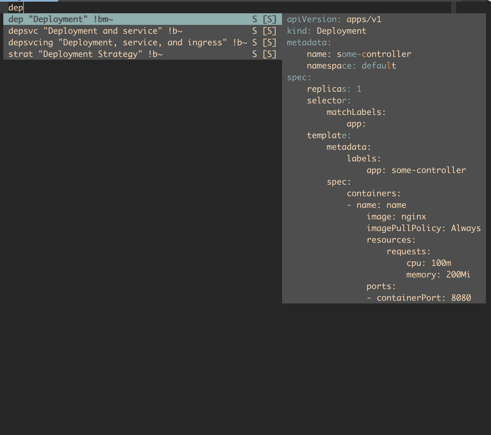
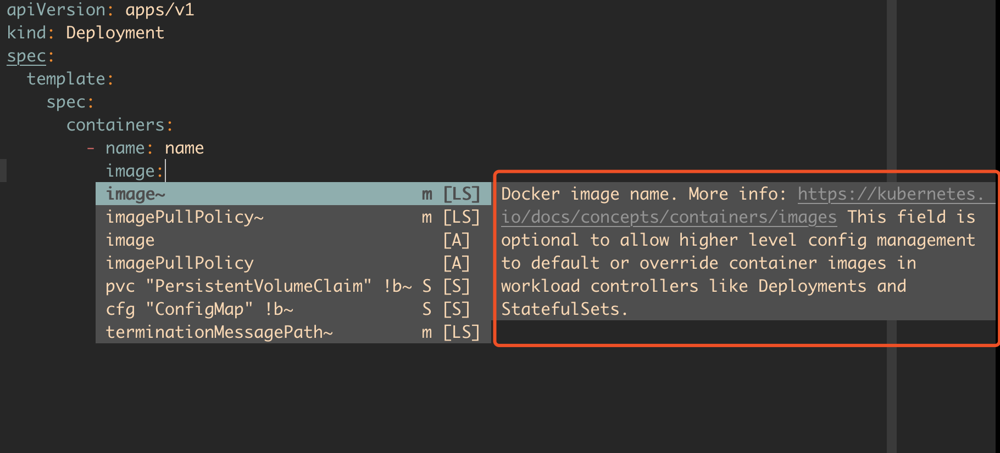

<!-- vim-markdown-toc Redcarpet -->

* [前言](#前言)
* [语法](#语法)
    * [对象(字典)](#对象-字典)
    * [列表](#列表)
    * [变量](#变量)
    * [多行展示](#多行展示)
* [K8S 配置使用](#k8s-配置使用)
    * [使用展示](#使用展示)
* [总结](#总结)

<!-- vim-markdown-toc -->

# 前言

最近在学习使用 k8s 时，都是用 yaml 格式的配置文件，今天整理下 yaml 的语法

# 语法

下面的语法展示摘自 k8s 配置

## 对象(字典)

同一级的 kv，表示一个字典，缩进表示嵌套字典，

```yaml
apiVersion: apps/v1
kind: Deployment
metadata:
  name: web
  namespace: default
```

转换成 json，结果如下

```JSON
{
  "apiVersion": "apps/v1",
  "kind": "Deployment",
  "metadata": {
    "name": "web",
    "namespace": "default"
  }
}
```

## 列表

```yaml
spec:
  containers:
    - name: name
      image: nginx
      imagePullPolicy: Always
      resources:
        requests:
          cpu: 100m
          memory: 200Mi
```

转换成 json，结果如下

```json
{
  "spec": {
    "containers": [
      {
        "name": "name",
        "image": "nginx"
      }
    ]
  }
}
```

## 变量

这里的用法和 go 语言的有点神似，&name 用来表示是个变量，然后通过\*name，获取到变量的内容

```yaml
metadata:
  name: &name web
  namespace: default
spec:
  selector:
    matchLabels:
      app: *name
  template:
    metadata:
      labels:
        app: *name
```

转换成 json，结果如下

```json
{
  "metadata": {
    "name": "web",
    "namespace": "default"
  },
  "spec": {
    "selector": {
      "matchLabels": {
        "app": "web"
      }
    },
    "template": {
      "metadata": {
        "labels": {
          "app": "web"
        }
      }
    }
  }
}
```

## 多行展示

```yaml
include_newlines: |
  exactly as you see
  will appear these three
  lines of poetry

fold_newlines: >
  this is really a
  single line of text
  despite appearances
```

```json
{
  "include_newlines": "exactly as you see\nwill appear these three\nlines of poetry\n",
  "fold_newlines": "this is really a single line of text despite appearances\n"
}
```

# K8S 配置使用

我一般使用，neovim 编写配置，这里介绍下使用[coc.nvim]()和[vim-kubernetes](https://github.com/andrewstuart/vim-kubernetes)两个插件完成。

**注意**的是 coc.nvim 需要搭配 neovim 4.0 以上的版本才会有二级提示窗

安装过程就不赘述了，使用 vim-plug 安装很方便的，

## 使用展示


右边能看到 depolyment 的模版，再根据自己的配置去修改即可


当你忘记了 key 的作用，可以这么看到它的定义，非常方便

# 总结

yaml 格式的文件，非常多见，了解它的结构组成是有必要的，
