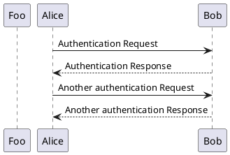
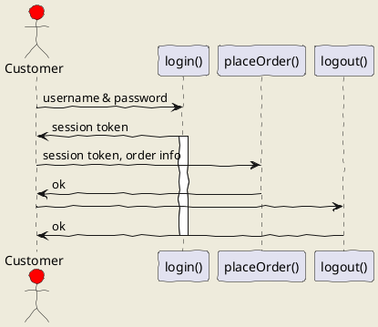

<!-- vim-markdown-toc GitLab -->

* [前言](#前言)
* [Mermaid](#mermaid)
    * [Flowchart](#flowchart)
        * [demo](#demo)
    * [Sequence diagram](#sequence-diagram)
        * [demo](#demo-1)
    * [Gantt diagram](#gantt-diagram)
        * [demo](#demo-2)
* [PlantUML](#plantuml)
    * [时序图](#时序图)
    * [demo](#demo-3)
* [小结](#小结)
* [Reference](#reference)

<!-- vim-markdown-toc -->

# 前言

所谓一图胜千言，特别在开发过程中，一张架构图，流程图，可以清晰的展示项目的架构和流程。

所以怎么画好一张图也是必修的软技能。

本文主要介绍下 Mermaid 和 PlantUML

# Mermaid

## Flowchart

流程图

A-->B A 指向 B

A-->C A 指向 C

B-->D C-->D B、C 同时指向 D

### demo

graph TD;

A-->B;

A-->C;

B-->D;

C-->D;

```
graph TD;

A-->B;

A-->C;

B-->D;

C-->D;
```

{} 表示判断框

|| 表示条件

graph TB

Start(开始) --> Open[打开冰箱门]

Open --> Put[把大象放进去]

Put[把大象放进去] --> IsFit{"冰箱小不小？"}

IsFit -->|不小| Close[把冰箱门关上]

Close --> End(结束)

IsFit -->|小| Change[换个大冰箱]

Change --> Open

```
graph TB
    Start(开始) --> Open[打开冰箱门]
    Open --> Put[把大象放进去]
    Put[把大象放进去] --> IsFit{"冰箱小不小？"}

    IsFit -->|不小| Close[把冰箱门关上]
    Close --> End(结束)

    IsFit -->|小| Change[换个大冰箱]
    Change --> Open
```

## Sequence diagram

序列图

participant 参与者

->> 实线连接

-->> 虚线连接

loop end 循环

Note over(left/right of) participant 挂在参与者上的提示

### demo

sequenceDiagram

participant Alice

participant Bob

participant John(可以省略)

Alice->>John: Hello John, how are you?

loop Healthcheck

John->>John: Fight against hypochondria

end

Note left of Bob: Rational thoughts <br/>prevail!

John-->>Alice: Great!

John->>Bob: How about you?

Bob-->>John: Jolly good!

```
sequenceDiagram
    participant Alice
    participant Bob
    Alice->>John: Hello John, how are you?
    loop Healthcheck
        John->>John: Fight against hypochondria
    end
    Note left of John: Rational thoughts <br/>prevail!
    John-->>Alice: Great!
    John->>Bob: How about you?
    Bob-->>John: Jolly good!
```

## Gantt diagram

甘特图

dateFormat YYYY-MM-DD 时间格式

title 标题

excludes 排除某个日期

### demo

gantt

dateFormat YYYY-MM-DD

title Adding GANTT diagram to mermaid

excludes weekdays 2014-01-10

section A section

Completed task :done, des1, 2014-01-06,2014-01-08

Active task :active, des2, 2014-01-09, 3d

Future task : des3, after des2, 5d

Future task2 : des4, after des3, 5d

```
gantt
dateFormat  YYYY-MM-DD
title Adding GANTT diagram to mermaid
excludes weekdays 2014-01-10

section A section
Completed task            :done,    des1, 2014-01-06,2014-01-08
Active task               :active,  des2, 2014-01-09, 3d
Future task               :         des3, after des2, 5d
Future task2               :         des4, after des3, 5d
```

# PlantUML

\@startuml \@enduml 成对出现，一前一后

## 时序图

与 Mermaid 的使用类似，-> 实现，--> 虚线，participant 来声明参与者

如果参与者之间本身有连接的话，不需要显示申明

```
@startuml
participant Foo
Alice -> Bob: Authentication Request
Bob --> Alice: Authentication Response

Alice -> Bob: Another authentication Request
Alice <-- Bob: Another authentication Response
@enduml
```



##

actor 角色

activate/deactivate

\#red 指定颜色

## demo

\@startuml

skinparam backgroundColor #EEEBDC

skinparam handwritten true

actor Customer #red

Customer -> "login()" : username & password

"login()" -> Customer : session token

activate "login()"

Customer -> "placeOrder()" : session token, order info

"placeOrder()" -> Customer : ok

Customer -> "logout()"

"logout()" -> Customer : ok

deactivate "login()"

@enduml



# 小结

画图前建议先把下面两个 URL 先看一下

本文只是简单整理下 Mermaid 和 PlantUML 提供的画图的能力，根据实际的项目，可以选择合适的图玩一玩

PlantUML 相比 Mermaid，多了些内置的 actor 和颜色，更丰富。

# Reference

- https://mermaid-js.github.io/mermaid/#/
- https://plantuml.com/zh/
