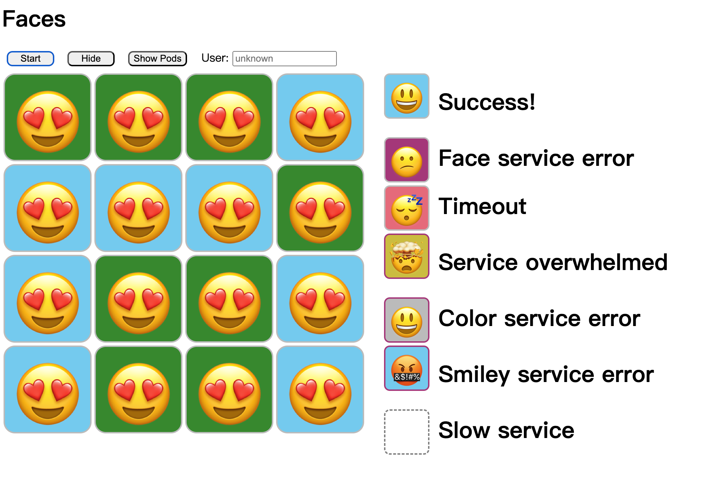
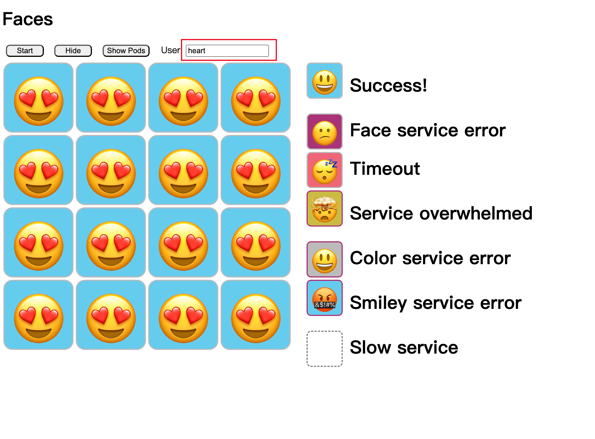

# Live with Gateway API

本文是对[分享的记录](https://github.com/BuoyantIO/gateway-api-workshop)，全文使用了[demosh演示工具](https://github.com/BuoyantIO/demosh)。为了方便记录，我会转换成常用的命令和Yaml。实验介绍了`linkerd` 和 `istio` ，由于时间关系，我只尝试istio的方式。我会使用最新版本的gateway api和istio，进行实验。

# 准备

## k8s集群

没有的话，使用仓库提供的[create-cluster.sh](https://raw.githubusercontent.com/BuoyantIO/gateway-api-workshop/refs/heads/main/create-cluster.sh)

## 安装gateway api

```bash
kubectl apply -f https://github.com/kubernetes-sigs/gateway-api/releases/download/v1.2.1/experimental-install.yaml

customresourcedefinition.apiextensions.k8s.io/backendlbpolicies.gateway.networking.k8s.io created
customresourcedefinition.apiextensions.k8s.io/backendtlspolicies.gateway.networking.k8s.io created
customresourcedefinition.apiextensions.k8s.io/gatewayclasses.gateway.networking.k8s.io created
customresourcedefinition.apiextensions.k8s.io/gateways.gateway.networking.k8s.io created
customresourcedefinition.apiextensions.k8s.io/grpcroutes.gateway.networking.k8s.io created
customresourcedefinition.apiextensions.k8s.io/httproutes.gateway.networking.k8s.io created
customresourcedefinition.apiextensions.k8s.io/referencegrants.gateway.networking.k8s.io created
customresourcedefinition.apiextensions.k8s.io/tcproutes.gateway.networking.k8s.io created
customresourcedefinition.apiextensions.k8s.io/tlsroutes.gateway.networking.k8s.io created
customresourcedefinition.apiextensions.k8s.io/udproutes.gateway.networking.k8s.io created
```

## 安装isito

```bash
curl -L https://istio.io/downloadIstio | ISTIO_VERSION=1.24.2 sh - 
export PATH=$PWD/istio-1.24.2/bin:$PATH
which istioctl
istioctl version
istioctl x precheck

istioctl install --set profile=minimal -y

```

## 创建gateway

```yaml
apiVersion: gateway.networking.k8s.io/v1
kind: Gateway
metadata:
  name: ingress
spec:
  gatewayClassName: istio
  listeners:
    - name: http
      protocol: HTTP
      port: 80
      allowedRoutes:
        namespaces:
          from: All

❯ k get gateway ingress
NAME      CLASS   ADDRESS      PROGRAMMED   AGE
ingress   istio   172.28.0.2   True         59s          

# 查看ip
# kubectl get gateway ingress -ojsonpath='{ .status.addresses[0].value }'
```

## 安装测试应用

原文提供的helm命令，但是拉取不下来。

```bash
helm install faces \
     -n faces \
     oci://ghcr.io/buoyantio/faces-chart \
     --version 2.0.0-rc.1 \
     --values faces/values.yaml
```

我找到https://github.com/BuoyantIO/faces-demo.git ，研究了一下，生成了一个output.yaml，apply了这个yaml

```bash
kubectl create namespace faces
     
kubectl label namespace faces istio-injection=enabled

kubectl apply -f yaml
```

- yaml
    
    ```yaml
    # Source: faces-chart/templates/color.yaml
    apiVersion: v1
    kind: Service
    metadata:
      name: "color"
      namespace: faces
      labels:
        service: "color"
    spec:
      type: ClusterIP
      selector:
        service: "color"
      ports:
        - port: 80
          targetPort: http
    ---
    # Source: faces-chart/templates/color.yaml
    apiVersion: v1
    kind: Service
    metadata:
      name: "color2"
      namespace: faces
      labels:
        service: "color2"
    spec:
      type: ClusterIP
      selector:
        service: "color2"
      ports:
        - port: 80
          targetPort: http
    ---
    # Source: faces-chart/templates/color.yaml
    apiVersion: v1
    kind: Service
    metadata:
      name: "color3"
      namespace: faces
      labels:
        service: "color3"
    spec:
      type: ClusterIP
      selector:
        service: "color3"
      ports:
        - port: 80
          targetPort: http
    ---
    # Source: faces-chart/templates/face.yaml
    apiVersion: v1
    kind: Service
    metadata:
      name: face
      namespace: faces
      labels:
        service: face
    spec:
      type: ClusterIP
      selector:
        service: face
      ports:
        - port: 80
          targetPort: http
    ---
    # Source: faces-chart/templates/faces-gui.yaml
    apiVersion: v1
    kind: Service
    metadata:
      name: faces-gui
      namespace: faces
      labels:
        service: faces-gui
    spec:
      type: ClusterIP
      selector:
        service: faces-gui
      ports:
        - port: 80
          targetPort: http
    ---
    # Source: faces-chart/templates/smiley.yaml
    apiVersion: v1
    kind: Service
    metadata:
      name: "smiley"
      namespace: faces
      labels:
        service: "smiley"
    spec:
      type: ClusterIP
      selector:
        service: "smiley"
      ports:
        - port: 80
          targetPort: http
    ---
    # Source: faces-chart/templates/smiley.yaml
    apiVersion: v1
    kind: Service
    metadata:
      name: "smiley2"
      namespace: faces
      labels:
        service: "smiley2"
    spec:
      type: ClusterIP
      selector:
        service: "smiley2"
      ports:
        - port: 80
          targetPort: http
    ---
    # Source: faces-chart/templates/smiley.yaml
    apiVersion: v1
    kind: Service
    metadata:
      name: "smiley3"
      namespace: faces
      labels:
        service: "smiley3"
    spec:
      type: ClusterIP
      selector:
        service: "smiley3"
      ports:
        - port: 80
          targetPort: http
    ---
    # Source: faces-chart/templates/color.yaml
    apiVersion: apps/v1
    kind: Deployment
    metadata:
      name: "color"
      namespace: faces
      labels:
        service: "color"
    spec:
      replicas: 1
      selector:
        matchLabels:
          service: "color"
      template:
        metadata:
          labels:
            service: "color"
        spec:
          containers:
            - name: "color"
              image: 192.168.1.94:443/demo/faces-color:2.0.0
              imagePullPolicy: IfNotPresent
              ports:
                - name: http
                  containerPort: 8000
              env:
                - name: FACES_SERVICE
                  value: "color"
                - name: USER_HEADER_NAME
                  value: "X-Faces-User"
                - name: DELAY_BUCKETS
                  value: "0,5,10,15,20,50,200,500,1500"
                - name: ERROR_FRACTION
                  value: ""
              resources:
                requests:
                  cpu: 100m
                  memory: 64Mi
                limits:
                  cpu: 250m
                  memory: 128Mi
    ---
    # Source: faces-chart/templates/color.yaml
    apiVersion: apps/v1
    kind: Deployment
    metadata:
      name: "color2"
      namespace: faces
      labels:
        service: "color2"
    spec:
      replicas: 1
      selector:
        matchLabels:
          service: "color2"
      template:
        metadata:
          labels:
            service: "color2"
        spec:
          containers:
            - name: "color2"
              image: 192.168.1.94:443/demo/faces-color:2.0.0
              imagePullPolicy: IfNotPresent
              ports:
                - name: http
                  containerPort: 8000
              env:
                - name: FACES_SERVICE
                  value: "color"
                - name: USER_HEADER_NAME
                  value: "X-Faces-User"
                - name: "COLOR"
                  value: green
                - name: DELAY_BUCKETS
                  value: "0,5,10,15,20,50,200,500,1500"
                - name: ERROR_FRACTION
                  value: ""
              resources:
                requests:
                  cpu: 100m
                  memory: 64Mi
                limits:
                  cpu: 250m
                  memory: 128Mi
    ---
    # Source: faces-chart/templates/color.yaml
    apiVersion: apps/v1
    kind: Deployment
    metadata:
      name: "color3"
      namespace: faces
      labels:
        service: "color3"
    spec:
      replicas: 1
      selector:
        matchLabels:
          service: "color3"
      template:
        metadata:
          labels:
            service: "color3"
        spec:
          containers:
            - name: "color3"
              image: 192.168.1.94:443/demo/faces-color:2.0.0
              imagePullPolicy: IfNotPresent
              ports:
                - name: http
                  containerPort: 8000
              env:
                - name: FACES_SERVICE
                  value: "color"
                - name: USER_HEADER_NAME
                  value: "X-Faces-User"
                - name: "COLOR"
                  value: darkblue
                - name: DELAY_BUCKETS
                  value: "0,5,10,15,20,50,200,500,1500"
                - name: ERROR_FRACTION
                  value: ""
              resources:
                requests:
                  cpu: 100m
                  memory: 64Mi
                limits:
                  cpu: 250m
                  memory: 128Mi
    ---
    # Source: faces-chart/templates/face.yaml
    apiVersion: apps/v1
    kind: Deployment
    metadata:
      name: face
      namespace: faces
      labels:
        service: face
    spec:
      replicas: 1
      selector:
        matchLabels:
          service: face
      template:
        metadata:
          labels:
            service: face
        spec:
          containers:
            - name: face
              image: 192.168.1.94:443/demo/faces-workload:2.0.0
              imagePullPolicy: IfNotPresent
              ports:
                - name: http
                  containerPort: 8000
              env:
                - name: FACES_SERVICE
                  value: "face"
                - name: USER_HEADER_NAME
                  value: "X-Faces-User"
                - name: ERROR_FRACTION
                  value: ""
                - name: DELAY_BUCKETS
                  value: ""
              resources:
                requests:
                  cpu: 300m # The face service doesn't need much memory, but it does need more
                  memory: 64Mi # CPU than the other backend services since it has to call the
                limits: # face and smiley services, then composite the results.
                  cpu: 500m
                  memory: 128Mi
    ---
    # Source: faces-chart/templates/faces-gui.yaml
    apiVersion: apps/v1
    kind: Deployment
    metadata:
      name: faces-gui
      namespace: faces
      labels:
        service: faces-gui
    spec:
      replicas: 1
      selector:
        matchLabels:
          service: faces-gui
      template:
        metadata:
          labels:
            service: faces-gui
        spec:
          containers:
            - name: faces-gui
              image: 192.168.1.94:443/demo/faces-gui:2.0.0
              imagePullPolicy: IfNotPresent
              env:
                - name: USER_HEADER_NAME
                  value: "X-Faces-User"
              ports:
                - name: http
                  containerPort: 8000
              resources:
                requests:
                  cpu: 50m
                  memory: 64Mi
                limits:
                  cpu: 100m
                  memory: 128Mi
    ---
    # Source: faces-chart/templates/smiley.yaml
    apiVersion: apps/v1
    kind: Deployment
    metadata:
      name: "smiley"
      namespace: faces
      labels:
        service: "smiley"
    spec:
      replicas: 1
      selector:
        matchLabels:
          service: "smiley"
      template:
        metadata:
          labels:
            service: "smiley"
        spec:
          containers:
            - name: "smiley"
              image: 192.168.1.94:443/demo/faces-workload:2.0.0
              imagePullPolicy: IfNotPresent
              ports:
                - name: http
                  containerPort: 8000
              env:
                - name: FACES_SERVICE
                  value: "smiley"
                - name: USER_HEADER_NAME
                  value: "X-Faces-User"
                - name: DELAY_BUCKETS
                  value: "0,5,10,15,20,50,200,500,1500"
                - name: ERROR_FRACTION
                  value: ""
              resources:
                requests:
                  cpu: 100m
                  memory: 64Mi
                limits:
                  cpu: 250m
                  memory: 128Mi
    ---
    # Source: faces-chart/templates/smiley.yaml
    apiVersion: apps/v1
    kind: Deployment
    metadata:
      name: "smiley2"
      namespace: faces
      labels:
        service: "smiley2"
    spec:
      replicas: 1
      selector:
        matchLabels:
          service: "smiley2"
      template:
        metadata:
          labels:
            service: "smiley2"
        spec:
          containers:
            - name: "smiley2"
              image: 192.168.1.94:443/demo/faces-workload:2.0.0
              imagePullPolicy: IfNotPresent
              ports:
                - name: http
                  containerPort: 8000
              env:
                - name: FACES_SERVICE
                  value: "smiley"
                - name: USER_HEADER_NAME
                  value: "X-Faces-User"
                - name: "SMILEY"
                  value: HeartEyes
                - name: DELAY_BUCKETS
                  value: "0,5,10,15,20,50,200,500,1500"
                - name: ERROR_FRACTION
                  value: ""
              resources:
                requests:
                  cpu: 100m
                  memory: 64Mi
                limits:
                  cpu: 250m
                  memory: 128Mi
    ---
    # Source: faces-chart/templates/smiley.yaml
    apiVersion: apps/v1
    kind: Deployment
    metadata:
      name: "smiley3"
      namespace: faces
      labels:
        service: "smiley3"
    spec:
      replicas: 1
      selector:
        matchLabels:
          service: "smiley3"
      template:
        metadata:
          labels:
            service: "smiley3"
        spec:
          containers:
            - name: "smiley3"
              image: 192.168.1.94:443/demo/faces-workload:2.0.0
              imagePullPolicy: IfNotPresent
              ports:
                - name: http
                  containerPort: 8000
              env:
                - name: FACES_SERVICE
                  value: "smiley"
                - name: USER_HEADER_NAME
                  value: "X-Faces-User"
                - name: "SMILEY"
                  value: RollingEyes
                - name: DELAY_BUCKETS
                  value: "0,5,10,15,20,50,200,500,1500"
                - name: ERROR_FRACTION
                  value: "50"
              resources:
                requests:
                  cpu: 100m
                  memory: 64Mi
                limits:
                  cpu: 250m
                  memory: 128Mi
    ```
    

# 场景

## base

gui-route.yaml

```yaml
---
apiVersion: gateway.networking.k8s.io/v1
kind: HTTPRoute
metadata:
  name: faces-gui-route
  namespace: faces
spec:
  parentRefs:
    - name: ingress
      namespace: default
  rules:
  - matches:
    - path:
        type: PathPrefix
        value: /gui/
    backendRefs:
    - name: faces-gui
      port: 80
    filters:
    - type: URLRewrite
      urlRewrite:
        path:
          type: ReplaceFullPath
          replaceFullPath: /
```

face-route.yaml

```yaml
---
apiVersion: gateway.networking.k8s.io/v1
kind: HTTPRoute
metadata:
  name: face-route
  namespace: faces
spec:
  parentRefs:
    - name: ingress
      namespace: default
      kind: Gateway
  rules:
  - matches:
    - path:
        type: PathPrefix
        value: /face
    filters:
      - type: URLRewrite
        urlRewrite:
          path:
            type: ReplacePrefixMatch
            replacePrefixMatch: /
    backendRefs:
    - name: face
      port: 80
```

[http://localhost/gui](http://localhost/gui) 打开浏览器可以看到页面


## unconditional

smiley-route.yaml

```yaml
apiVersion: gateway.networking.k8s.io/v1beta1
kind: HTTPRoute
metadata:
  name: smiley-route
  namespace: faces
spec:
  parentRefs:
    - kind: Service
      group: ""
      name: smiley
      port: 80
  rules:
    - backendRefs:
        - name: smiley2
          group: ""
          port: 80
```

smiley2服务是微笑的表情


color-route.yaml

```yaml
apiVersion: gateway.networking.k8s.io/v1alpha2
kind: GRPCRoute
metadata:
  name: color-route
  namespace: faces
spec:
  parentRefs:
    - name: color
      kind: Service
      group: ""
      port: 80
  rules:
    - backendRefs:
        - name: color2
          port: 80
```

`color` returns blue, but `color2` returns green


## canary

先删除两条路由

```bash
kubectl delete -n faces httproute smiley-route
kubectl delete -n faces grpcroute color-route
```

smiley-canary-10.yaml 灰度10%

```yaml
apiVersion: gateway.networking.k8s.io/v1beta1
kind: HTTPRoute
metadata:
  name: smiley-canary
  namespace: faces
spec:
  parentRefs:
    - name: smiley
      kind: Service
      group: ""
      port: 80
  rules:
    - backendRefs:
        - name: smiley
          port: 80
          weight: 90
        - name: smiley2
          port: 80
          weight: 10
```

可以看到笑脸比较少。


### 模拟灰度发布

smiley-canary-10.yaml → smiley-canary-50.yaml → smiley-canary-90.yaml → smiley-canary-100.yaml 

流量比例从90-10，50-50，10-90，0-100，最后缩容到0，`kubectl scale -n faces deploy/smiley --replicas=0`

```yaml
apiVersion: gateway.networking.k8s.io/v1beta1
kind: HTTPRoute
metadata:
  name: smiley-canary
  namespace: faces
spec:
  parentRefs:
    - name: smiley
      kind: Service
      group: ""
      port: 80
  rules:
    - backendRefs:
        - name: smiley
          port: 80
          weight: 9~~0 50 10~~ 0
        - name: smiley2
          port: 80
          weight: 1~~0 50 90~~ 100
```

灰度完成之后的效果，但是这样流量转发，出了问题不好排查。


回滚

```bash
kubectl scale -n faces deploy/smiley --replicas=1
kubectl rollout status -n faces deploy
kubectl delete -n faces httproute smiley-canary
```

灰度gRPC也是一样的操作

```yaml
apiVersion: gateway.networking.k8s.io/v1alpha2
kind: GRPCRoute
metadata:
  name: color-canary
  namespace: faces
spec:
  parentRefs:
    - name: color
      kind: Service
      group: ""
      port: 80
  rules:
    - backendRefs:
        - name: color
          port: 80
          weight: 50
        - name: color2
          port: 80
          weight: 50
```


### **Dynamic Routing**

可以基于path, headers, or query parameters灰度，这里是用edge cell or a center cell的方式。

`smiley-edge.yaml`

```yaml
apiVersion: gateway.networking.k8s.io/v1alpha2
kind: GRPCRoute
metadata:
  name: color-edge
  namespace: faces
spec:
  parentRefs:
    - name: color
      kind: Service
      group: ""
      port: 80
  rules:
    - matches:
      - method:
          service: ColorService
          method: Edge
      backendRefs:
        - name: color2
          port: 80
    - backendRefs:
        - name: color
          port: 80
```



**Dynamic Canarying**

`smiley-edge-canary-50.yaml` 根据path灰度，全部流量的20%，在分成50%和50%

```yaml
apiVersion: gateway.networking.k8s.io/v1beta1
kind: HTTPRoute
metadata:
  name: smiley-edge
  namespace: faces
spec:
  parentRefs:
    - name: smiley
      kind: Service
      group: ""
      port: 80
  rules:
    - matches:
      - path:
          value: "/edge"
      backendRefs:
        - name: smiley3
          port: 80
          weight: 50
        - name: smiley2
          port: 80
          weight: 50
    - backendRefs:
        - name: smiley
          port: 80
```


### Rollback

smiley3 有时候有问题。

```yaml
apiVersion: gateway.networking.k8s.io/v1beta1
kind: HTTPRoute
metadata:
  name: smiley-edge
  namespace: faces
spec:
  parentRefs:
    - name: smiley
      kind: Service
      group: ""
      port: 80
  rules:
    - matches:
      - path:
          value: "/edge"
      backendRefs:
        - name: smiley2
          port: 80
    - backendRefs:
        - name: smiley
          port: 80
```


## abtest

smiley-ab.yaml，header里带有x-faces-user: heart，会返回爱心

```yaml
apiVersion: gateway.networking.k8s.io/v1beta1
kind: HTTPRoute
metadata:
  name: smiley-a-b
  namespace: faces
spec:
  parentRefs:
    - name: smiley
      kind: Service
      group: ""
      port: 80
  rules:
    - matches:
        - headers:
            - name: "x-faces-user"
              value: "heart"
      backendRefs:
        - name: smiley2
          port: 80
    - backendRefs:
        - name: smiley
          port: 80
```



清除

```yaml
kubectl delete -n faces httproute smiley-a-b
kubectl delete -n faces grpcroute color-a-b
```

timeout

`face-route.yaml` 增加了200ms的超时。

```yaml
---
apiVersion: gateway.networking.k8s.io/v1
kind: HTTPRoute
metadata:
  name: face-route
  namespace: faces
spec:
  parentRefs:
    - name: ingress
      namespace: default
      kind: Gateway
  rules:
  - matches:
    - path:
        type: PathPrefix
        value: /face
    filters:
      - type: URLRewrite
        urlRewrite:
          path:
            type: ReplacePrefixMatch
            replacePrefixMatch: /
    backendRefs:
    - name: face
      port: 80
    timeouts:
      request: 200ms
```

可以看到有超时的结果了

