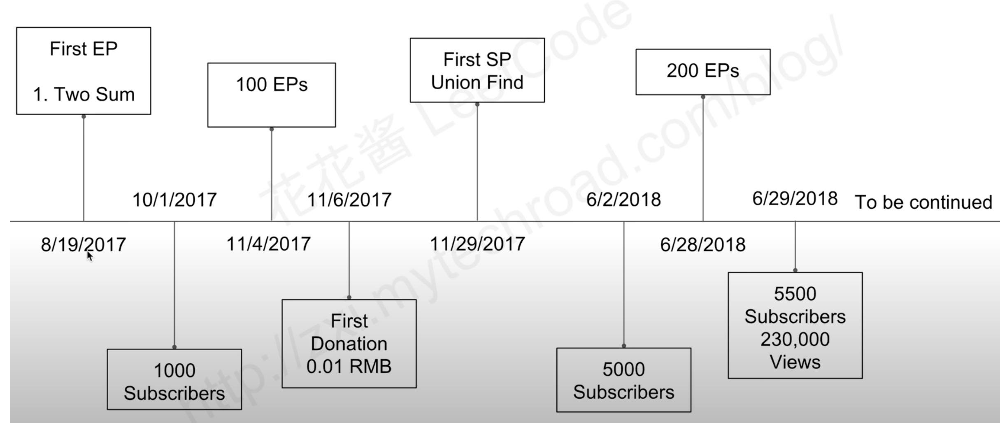
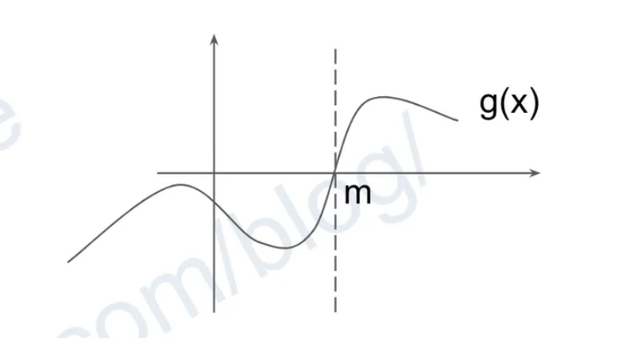
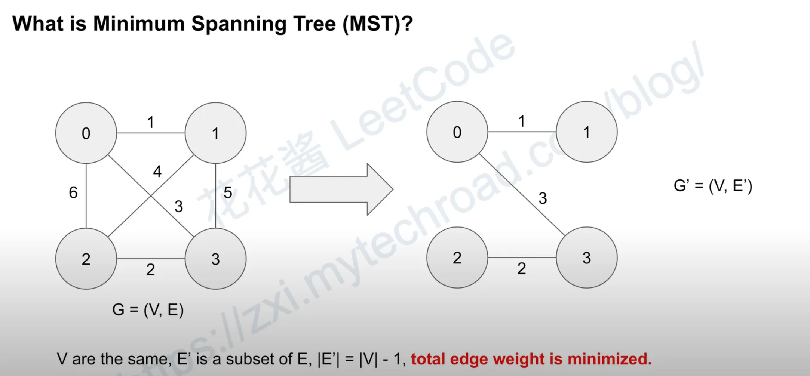
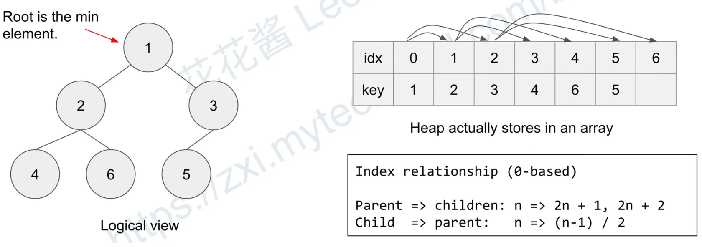

# 数据结构特辑

# SP1 Disjoint-set/Union-find Forest

Check whether two elements are in the same set or not in O(1)


## method

```bash
Finc(x): find the root/cluster-id of x
Union(x, y): merge two clusters

Find: O(1)
Union: O(1)

without optimization: Find O(n)
Two key optimizations:
1) Path compression: make tree flat
2) Union by rank: merge low rank tree to high rank one
```

### path compression

path compression happend during Find


### union by rank

merge low rank tree into high rank one in union


### Pseudo code

```python
class UnionFindSet:
  func UnionFindSet(n):
    parents = [1..n] // 数组
    ranks = [0..0] (n zeros) // 数组

  func Find(x):
    if x != parents[x]:
      parents[x] = Find(parents[x])
    return parents[x]

  func Union(x, y):
    px, py = Find(x), Finx(y)
    if rank[px] > rank[py]: parents[py]=px
    if rank[px] < rank[py]: parents[px]=py
    if rank[px] == rank[py]:
       parents[py]=px
       rank[px]++


  class UnionFind:
    def __init__(self, n):
        self.parent = list(range(n))  # 初始时每个节点的父节点是自己
        self.rank = [0] * n           # 初始时每个节点的秩都是0

    def find(self, x):
        if x != self.parent[x]:
            self.parent[x] = self.find(self.parent[x])  # 路径压缩
        return self.parent[x]

    def union(self, x, y):
        px, py = self.find(x), self.find(y)
        if px == py:  # 已经在同一集合中
            return

        if self.rank[px] > self.rank[py]:
            self.parent[py] = px
        elif self.rank[px] < self.rank[py]:
            self.parent[px] = py
        else:
            self.parent[py] = px
            self.rank[px] += 1

    def connected(self, x, y):
        return self.find(x) == self.find(y)

# 创建包含5个节点的并查集
uf = UnionFind(5)

# 合并节点
uf.union(0, 1)  # 合并0和1
uf.union(2, 3)  # 合并2和3
uf.union(1, 2)  # 合并1和2（同时会连接0,1,2,3）

# 检查连通性
print(uf.connected(0, 3))  # True
print(uf.connected(0, 4))  # False
```

### go impl

```go
type UnionFindSet struct {
	parents []int
	ranks   []int
}

func NewUnionFindSet(n int) *UnionFindSet {
	ufs := &UnionFindSet{
		parents: make([]int, n+1),
		ranks:   make([]int, n+1),
	}

	for i := 0; i < len(ufs.parents); i++ {
		ufs.parents[i] = i
	}
	return ufs
}

func (ufs *UnionFindSet) Union(u, v int) bool {
	pu := ufs.Find(u)
	pv := ufs.Find(v)

	if pu == pv {
		return false
	}

	if ufs.ranks[pv] < ufs.ranks[pu] {
		ufs.parents[pv] = pu
	} else if ufs.ranks[pu] < ufs.ranks[pv] {
		ufs.parents[pu] = pv
	} else {
		ufs.parents[pv] = pu
		ufs.ranks[pu] += 1
	}

	return true
}

func (ufs *UnionFindSet) Find(u int) int {
	if u != ufs.parents[u] {
		ufs.parents[u] = ufs.Find(ufs.parents[u])
	}
	return ufs.parents[u]
}
```

## Leetcode

```bash
737 Sentence Similarity II
684 Redundant Connection
547 Friend Circles

Union-Find Problems:
* LeetCode 399. Evaluate Division https://youtu.be/UwpvInpgFmo
* LeetCode 547. Friend Circles https://youtu.be/HHiHno66j40
* LeetCode 737. Sentence Similarity II https://www.youtube.com/watch?v=0rZUi3kZGLI
* LeetCode 684. Redundant Connection https://www.youtube.com/watch?v=4hJ721ce010
* LeetCode 685. Redundant Connection II https://youtu.be/lnmJT5b4NlM
* LeetCode 839. Similar String Groups  https://zxi.mytechroad.com/blog/string/leetcode-839-similar-string-groups/
* LeetCode 959. Regions Cut By Slashes
LeetCode 399. Evaluate Division https://youtu.be/UwpvInpgFmo
LeetCode 547. Friend Circles https://youtu.be/HHiHno66j40
LeetCode 737.  Sentence Similarity II https://www.youtube.com/watch?v=0rZUi3kZGLI&t=0s
LeetCode 684. Redundant Connection https://www.youtube.com/watch?v=4hJ721ce010&t=0s
LeetCode 685. Redundant Connection  II https://youtu.be/lnmJT5b4NlM

```

## Reference

https://en.wikipedia.org/wiki/Disjoint-set_data_structure
https://www.cs.princeton.edu/courses/archive/spring13/cos423/lectures/UnionFind.pdf

[https://www.cs.princeton.edu/courses/archive/spring13/cos423/lectures.php](https://www.cs.princeton.edu/courses/archive/spring13/cos423/lectures.php)

https://zxi.mytechroad.com/blog/data-structure/sp1-union-find-set/

[https://zxi.mytechroad.com/blog/hashtable/leetcode-737-sentence-similarity-ii/](https://zxi.mytechroad.com/blog/hashtable/leetcode-737-sentence-similarity-ii/) **使用 string 作为 union/find 的 key**

# SP2: **Input Size V.S. Time Complexity**


n=100 O(n^3)

n=1000 O(n^2)

# SP3: Fenwick Tree/Binary Indexed Tree

## Motivation:

Given a 1D array of n elements: [2, 5, -1, 3, 6]

range sum query: what’s the sum from 2nd element to 4th element query(2,4)？ 5+-1+3 = 7

Naive implementation: O(n) per query.

Use DP to pre-compute the prefix sums: O(n) [2, 5, -1, 3, 6] → [2, 7, 6, 9, 15]

reduce query to O(1). query(2, 4) = sums(n1…n4) - sums(n1..n1) = sums[4-1] - sums[1-1] = 9 - 2 =7

What if the values of elements can change? O(n)

Fenwick tree was proposed to solve the prefix sum problem.

The idea is to store partial sum in each node and get total sum by traversing the tree from leaf to root.The tree has a height of log(n)

Query: O(log(n))

Update: O(log(n))


```cpp
class FenwickTree {
public:
		FenwickTree(int n): sums_(n + 1, 0) {}

		void update(int i, int delta){
				while (i < sums_.size()){
						sums_[i] += delta;
						i += lowbit(i);
				}
		}

		int query(int i) const {
				int sum = 0;
				while (i > 0){
						sum += sums_[i]
						i -= lowbit(i);
				}
				return sum;
		}
private:
		static inline int lowbit(int x) { return x & (-x); }
		vector<int> sums_;
}
```

Time complexity:

update: O(n)

query: O(n)

Space complexity: O(n)

## Applications:

307: Range Sum Query - Mutable

315: Count of Smaller Numbers After Self


# SP4: **Time/Space Complexity of Recursive Algorithms**

## master theorem

```python
quick_sort(a, l, r):
	p = partition(a, l, r) # O(r-l)
	quick_sort(a, l, p)
	quick_sort(a, p+1, r)

Bast case:
T(n) = 2*T(n/2) + O(n) = O(nlogn)
Worst case:
T(n) = T(n-1) + T(1) +O(n) = O(n2)
Non-worst cases:
T(n) = T(n/10） + T(9n/10) + O(n) = O(nlogn)

Space Best/Average: O(logn)
			Worst: O(n)
```

```python
merge_sort(a, l, r):
	m = l + (r - l)/2
	merge_sort(a, l, m)
	merge_sort(a, m+1, r)
	merge_sort(a, l, m, r) # O(r - l)

Time:
T(n) = 2*T(n/2) + O(n) = O(nlogn)

Space:
O(logn + n)
```

```python
binary_search(a, l, r):
	m = l + (r - l) / 2
	if f(m):
		binary_search(a, l, m)
	else:
		binary_search(a, m+1, r)

Time complexity:
T(n) = T(n/2) + O(1) = O(nlogn)

Space complexity:
O(logn)
```

```python
inorder(root):
	inorder(root.left)
	func(rool.val)
	inorder(root.right)
Time complexity:
T(n) = 2*T(n/2) + O(1) = O(n) perfect
T(n) = T(n-1) + T(1) + O(1) = O(n) worst case

Space complexity:
O(logn) perfect
O(n) worst case
```

```python
combination(d, s):
	if d == n:
		return func()
	for i in range(s, n):
		combination(d+1, i+1)
Time complexity:
T(n) = T(n-1) + T(n-2) + ... + T(1)
		 = O(2^n)

Space complexity:
O(n)
```

```python
permutation(d, used):
	if d == n:
		return func()
	for i in range(0, n):
		if i in used: continue
		used.add(i)
		permutation(d+1, used)
		used.remove(i)
Time complexity:
T(n) = n * T(n-1)
		 = O(n!)
Space complexity:
O(n)
```


| Equation                        | Time     | Space       | Examples               |
| ------------------------------- | -------- | ----------- | ---------------------- |
| T(n) = 2\*T(n/2) + O(n)         | O(nlogn) | O(logn)     | quick_sort             |
| T(n) = 2\*T(n/2) + O(n)         | O(nlong) | O(n + logn) | merge_sort             |
| T(n) = T(n/2) + O(1)            | O(logn)  | O(logn)     | Binary search          |
| T(n) = T(n-1) + O(1)            | O(n^2)   | O(n)        | quick_sort(worst case) |
| T(n) = n \* T(n-1)              | O(n!)    | O(n)        | permutation            |
| T(n) = T(n-1) + T(n-2) + … T(1) | O(2^n)   | O(n)        | combination            |

## DP with memorization

Time: number of subproblems \* exclusive time to solve each subproblem

Space: max depth of call stack \* space used by each subproblem

```python
fib(n):
	if n < 1: return 0
	return fib(n-1) + fib(n-2)

T(n) = T(n-1) + T(n-2) + O(1)
	   = O(2^n)
	   = O(1.618^n)
```

```python
fib(n):
	if n < 1: return 0
	if m[n] > 0: return m[n]
	m[n] = fib(n-1) + fib(n-2)
	return m[n]

n subproblems
each problem takes O(1) to solve
fib(n) takes O(n) time to solve
```

```python
LC 741. Cherry pickup
dp(x1, y1, x2):
	if m[x1][y1][x2] != None:
		return m[x1][y1][x2]
	ans = max(max(dp(...), dp(...)),
						max(dp(...), dp(...)))
	m[x1][y1][x2] = ans
	return m[x1][y1][x2]

	n^3 subproblems
	Each subproblem takes O(1)

dp(n, n, n) takes O(n^3) to solve

```

```python
LC 312. Burst Balloons

dp(i, j):
	if m[i][j] != None:
		return m[i][j]
	for k in range(i, j+1):
		ans = max(ans, dp(...) + C + dp(...))
	m[i][j] = ans
	return m[i][j]

	n^2 subproblems
	Each subproblem takes O(n)

	dp(n, n) takes O(n^2) to solve
```

# SP5: **Binary Search**

- What is Binary Search?
  - reduce the search space by haft at each step
  - input usually needs to be sorted
    A = [1, 2, 5, 7, 8, 12]
    exist(A, 7) = True
    [1, 2, 5, 7, 8, 12] → [7, 8, 12] → [7]
    exist(A, 9) = False
    [1, 2, 5, 7, 8, 12] → [7, 8, 12] → [12]
- Why Binary Search?
  - Fast
  - T(n) = T(n/2) + O(eval)
  - O(log(range)) _ O(eval) vs O(range) _ O(eval) linear scan
    | Range | Binary | Linear | Speed Up (x) |
    | ---------- | ------ | ------- | ------------ |
    | 100 | 7 | 10 | 14.29 |
    | 10000 | 14 | 10000 | 714.29 |
    | 1000000 | 20 | 1000000 | 50000 |
    | 1000000000 | 30 | TLE | N/A |

左闭右开，0 到 n

**找到一个最小的 l，使得 g(m)等于 ture**

```python
Template:
[l, r)

def binary_search(l, r):
	while l < r:
		m = l + (r-l)/2
		if f(m): return m # optional
		if g(m):
			r = m # new range [l, m)
		else:
			l = m+1 # new range [m+1, r)
	return l # or not found

Time complexity: O(log(r-l)*(f(m)+g(m)))
Space complexity: O(1)
```

## Example 1

return the index of an element in a sorted array. Elements are unique.
if not found return -1.

```python
A = [1, 2, 5, 7, 8, 12]
search(8) = 4, search(6) = -1

def binary_search(A, val, l, r):
	while l < r:
		m = l + (r - l) // 2
		if A[m] == val: return m
		if A[m] > val:
			r = m
		else:
			l = m + 1
	return -1 # not found
binary_search(A, 8, 0, len(A))
```

## Example 2

return the lower_bound/upper_bound of a val in sorted array..

lower_bound 大于等于

upper_bound 严格大于

upper_bound - lower_bound 知道重复的元素个数

lower_bound(x): first index of i, such that A[i] ≥ x

upper_bound(x): first index of i, such that A[i] > x

Find the smallest index to satisfy g(index)

```python
def lower_bound(A, val, l, r):
	while l < r:
		m = l + (r - l)/2
		if A[m] >= val: # g(m)
			r = m
		else:
			l = m + 1
	return l
```

```python
def upper_bound(A, val, l, r):
	while l < r:
		m = l + (r - l) // 2
		if A[m] > val: # g(m)
			r = m
		else:
			l = m + 1
	return l
```

## Example 3: LC 69. |sqrt(x)|

sqrt(4) = 2

sqrt(8) = 2

```python
def sqrt(x):
	l = 0
	r = x + 1
	while l < r:
		m = l + (r-l) // 2
		if m * m > x:
			r = m
		else:
			l = m + 1
	return l - 1 # l*l > x
```

## Example 4: LC 278

First Bad Version Interactive problem

bool isBadVersion(int version);

```python
def firstBadVersion(n):
	l = 0
	r = n
	while l < r:
		m = l + (r - l) // 2
		if isBadVersion(m):
			r = m
		else
			l = m + 1
	return l
```

## Example 5: LC 875 koko Eating Bananas

Find minimum K such that she can eat all the bananas within H hours.

```python
def eat(piles, H):
	l = 1
	r = max(piles) + 1
	while l<r:
		m = l+(r-l)//2
		h = 0
		for p in piles: # O(n)
			h += (p + m - 1) / m
		if h <= H # g(m): can finish
			r = m
		else:
			l = m + 1
	return l
```

## Example 6: LC 378 Kth Smallest Element in a Sorted Matric

Each row and column are sorted.

```python
def KthSmallest(A, k):
	l = A[0][0]
	r = A[-1][-1]
	while l<r:
		m = l + (r - l) // 2
		total = 0
		for row in A:
			total += upper_bound(row, m)
		if total >= K:
			r = m
		else:
			l = m + 1
	return l
```

# SP6: 200 期总结和展望



- Keep track of the latest problems
  - Focus on medium / hard problem
  - Easy ones can be found on blog
- Publich question only
- new categories
- Comments on Youtube
- Contact me: huahualeetcode@gmail.com

# SP7: **Amortized Analysis 均摊分析**

## Time complexity

- A given algorightm on different inputs of the same size
  - Best
  - Average
  - Worst
- of ops is always the same for the same input

## Amortized Analysis

- a sequence of operations on a data structure
  - some can be fast
  - some can be slow
- What’s the “average” cost over n operations

## Array Sorting Algorithms

source: [https://www.bigocheatsheet.com/](https://www.bigocheatsheet.com/)

| Algorithms     | Time Complexity |                |                | Space Complexity |
| -------------- | --------------- | -------------- | -------------- | ---------------- |
|                | Best            | Average        | Worst          | Worst            |
| Quicksort      | Ω(n log(n))     | Θ(n log(n))    | O(n^2)         | O(log(n))        |
| Mergesort      | Ω(n log(n))     | Θ(n log(n))    | O(n log(n))    | O(n)             |
| Timsort        | Ω(n)            | Θ(n log(n))    | O(n log(n))    | O(n)             |
| Heapsort       | Ω(n log(n))     | Θ(n log(n))    | O(n log(n))    | O(1)             |
| Bubble Sort    | Ω(n)            | Θ(n^2)         | O(n^2)         | O(1)             |
| Insertion Sort | Ω(n)            | Θ(n^2)         | O(n^2)         | O(1)             |
| Selection Sort | Ω(n^2)          | Θ(n^2)         | O(n^2)         | O(1)             |
| Tree Sort      | Ω(n log(n))     | Θ(n log(n))    | O(n^2)         | O(n)             |
| Shell Sort     | Ω(n log(n))     | Θ(n(log(n))^2) | O(n(log(n))^2) | O(1)             |
| Bucket Sort    | Ω(n+k)          | Θ(n+k)         | O(n^2)         | O(n)             |
| Radix Sort     | Ω(nk)           | Θ(nk)          | O(nk)          | O(n+k)           |
| Counting Sort  | Ω(n+k)          | Θ(n+k)         | O(n+k)         | O(k)             |
| Cubesort       | Ω(n)            | Θ(n log(n))    | O(n log(n))    | O(n)             |


## Ex1: Dynamic array(vector/ArrayList):

double the space when the array is full.

Total cost after n push calls

1 + 1 + … + 1, fill n times

1+ 2 + 4 + … + n, copy log2^n times

```python
push(x):
	data[++size] = x
	if size == capacity:
		capacity *= 2
		new_data = data int[capacity]
		copy(new_data, data, size)
		data = new_data
Worst case push(x) takes O(n) time
```


## Ex2: Monotonic stack(LC. 901)

When a new element is greater than the top, the top will be poped

Best case: O(1)

[5,4,3,2] push(1), [5,4,3,2,1]

Worst case: O(n)

[5,4,3,2], push(6), ~~[5,4,3,2,6]~~ → [6]

### Accounting Method

Credit:

Push: 2 (one for push, one for future pop)

Pop: 0

Charge:

Push: 1, Pop: 1

Your balance is always ≥ 0

Thus the amortized cost is 2.

### Aggregate Method

Total cost after n push calls

n elements are pushed on the stack

at most n-1 element can be popped.

Amortized cost ≤ (n+n-1)/n =2O(1)

| op      | stack     | balance |
| ------- | --------- | ------- |
| -       | {}        | 0       |
| push(5) | {5}       | 1       |
| push(4) | {5,4}     | 2       |
| push(3) | {5,4,3}   | 3       |
| push(2) | {5,4,3,2} | 4       |
| push(6) | {5,4,3,2} |

{5,4,3}
{5,4}
{5}
{}
{6} | 6
5
4
3
2
1 |

# SP8 DP1:

- What is DP?
- When to use DP?
  - When recursion alone O(2^n) won’t work
  - Counting
  - Optimization
- Difference between DP and recursion with memorization

## What is Dynamic Programming(DP)?

According Wikipedia: DP is a programming method.

Requirements:

- optimal substructure
  - “can be solved optimally by breadking it into sub-problems and then recursively finding the optimal solutions to the sub-problems”
- overlapping sub-problems
  - sub-problems are overlapped such that we can compute only once and store the solution for future use
  - reduce time complexity(Exponential to polynomail)
  - if sub-problems do not overlap → divide and conquer
- No-after effect
  - the optimal solution of a subproblem will not change when it was used to solve a bigger problem optimally

Top-down:

- recursion with memoization

Bottom-up

- DP

Algorithms that use DP:

- Fibonacci sequence
- LCS
- Knapsack
- Floyd-Warshall
- Bellman-Ford

## LC70. Climbing Stairs

Recursion formula:

f(n) = f(n-1) + f(n-2)

f(1) = 1, f(0) = 1

```python

# O(2^n) O(n)
def f(n):
	if n<=1: return 1
	return f(n-1) + f(n-2)

# O(n), O(n)
def f(n):
	if n<=1: return 1
	if n not in mem:
		mem[n] = f(n-1) + f(n-2)
	return mem[n]

f(4) -> f(3) -> f(2) -> f(1)
                     -> f(0)
						 -> f(1)

				f(2) -> f(1)
					   -> f(0)
Recursion has redundant computations

O(n), O(n)
def f(n):
	dp = [1] * (n + 1)
	for i in range(2, n+1):
		dp[i] = dp[i-1] + dp[i+2]
	return dp[n]

	# O(n), O(1)
	# One param, no loop
	def f(n):
		dp1, dp2 = 1, 1
		for i in range(2, n+1):
			dp2, dp1 = dp1+dp2, dp2
		return dp2
```

## LC62. Unique Paths

Recursion formula: 2D, Counting

f(x, y) = f(x-1, y) + f(x, y-1)

f(0, 0) = 1, out of board =0

DP: paddings required to handle out of board cases. Actual indies start from 1 instead of 0

```python
#O(mn), O(mn)
def f(x, y):
	if x<=0 or y<=0: return 0
	if x==1 or y==1: return 1
	return f(x-1, y) + f(x, y-1)

#O(mn), O(mn)
def f(x, y):
	if x<=0 or y<=0: return 0
	if x==1 and y==1: return 1
	if (x,y) not in mem:
		mem[(x,y)] = f(x-1,y) + f(x,y-1)
	return mem[(x,y)]

def f(x,y):
	dp = [[0] * (m+1) for _ in range(n+1)]
	dp[1][1] = 1
	for i in range(1, y+1):
		for j in range(1, x+1):
			dp[i][j] = dp[i-1][j] + dp[j][i-1]
	return dp[y][x]

```

## Galleries: 1D, 2 sets of sub-problems

```cpp
# LC 926 Flip String to Monotone Increasing

for (int i = 1;i < n; ++i):
	l[i] = l[i-1] + S[i] - '0';
for (int i = n -2; i>=0; --i)
	r[i] = r[i+1] + '1' - S['i'];
int ans = r[0];
for (int i = 1; i<=n;++i)
	ans = min(ans, l[i-1] + r[i]);

```

```cpp
LC 845. Longest Mountain in Array

for (int i = 1; i < A.size(); ++i)
	if (A[i] > A[i-1]) inc[i] = inc[i-1] + 1;
for (int i = A.size() -2; i>0; --i)
	if (A[i] > A[i+1) dec[i] = dec[i+1] + 1;
for ( int i =0; i< A.size(); ++i)
	if (inc[i] && dec[i])
		ans = max(ans, inc[i] + dec[i] + 1);
```

## Galleries: 1D w/ multiple states / dp[i][0], dp[i][i], dp[i][2]…, i is the problem size

```python
# LC 801. Minimun Swaps To Make Sequences Increasing
for i in range(1, n):
	if A[i] > A[i-1] and B[i] > B[i-1]:
		dp[i][0] = dp[i-1][0]
		dp[i][1] = dp[i-1][1] + 1
	if B[i] > A[i-1] and A[i] > B[i-1]:
		dp[i][0] = min(dp[i][0], dp[i-1][1])
		dp[i][1] = min(dp[i][1], dp[i-1][0] + 1)
```

```python
LC 926. Flip String to Monotone Increasing

for i in range(1, n+1):
	if S[i-1] == '0':
		dp[i][0] = dp[i-1][0]
		dp[i][1] = min(dp[i-1][0], dp[i-1][1] + 1
	else:
		dp[i][0] = dp[i-1][0] + 1
		dp[i][1] = min(dp[i-1][0] + dp[i-1][1])
```

```python
LC 790. Domino and Tromino Tilling

for i in range(2, n+1):
	dp[i][0] = (dp[i-1][0] + dp[i-2][0]
							+ 2 * dp[i-1][1] % kMod)
  dp[i][1] = (dp[i-2][0] + dp[i-1][1]) % kMod
```

```python
LC 818. Race car
for i in range(1, t+1):
	c = min(dp[i][0] + 2, dp[i][1] + 1)
	dp[t][0] = min(dp[t][0], dp[t-1][0] + c)
	dp[t][1] = min(dp[t][1], dp[t-1][0] + c)
```

## Templates

DP

```python
dp = … # create dp array
			 # add padding if needed
dp[0][0] = … # init dp array
             # base cases
for i ...
	for j ...
		...
		dp[i][j] = ... # transition
return dp[n][m]
```

Recursion with memorization

```python
mem = ... # create mem dict

def dp(i, j, ...):
	if base_case(i, j): return ... # base cases
	if (i, j) not in mem:
		mem[(i, j)] = ...            # transition
	return mem[(i, j)]

return dp(n, m)
```

# SP9 DP2:

| Case | Input     | Subproblems | Depends on | Time    | Space          | Problems IDs                |
| ---- | --------- | ----------- | ---------- | ------- | -------------- | --------------------------- |
| 1.1  | O(n)      | O(n)        | O(1)       | O(n)    | O(n) → O(1)    | 70 198 746 790 801          |
| 1.2  | O(n)      | O(n)        | O(n)       | O(n^2)  | O(n)           | 139 818                     |
| 1.3  | O(n)+O(m) | O(mn)       | O(1)       | O(mn)   | O(mn)          | 72(7127)                    |
| 1.4  | O(n)      | O(n^2)      | O(n)       | O(n^3)  | O(n^2)         | 312 664 673                 |
| 1.5  | O(n)      | O(n^3)      | O(n^3)     | O(n^4)  | O(n^3)         | 546                         |
| 1.6  | O(n), k   | O(k)        | O(n)       | O(kn)   | O(k)           | 322 494                     |
| 1.7  | O(n), k   | O(kn)       | O(n)       | O(kn^2) | O(kn)          | 813                         |
| 2.1  | O(nm)     | O(nm)       | O(1)       | O(nm)   | O(nm) →O(m)    | 64(62 63)                   |
| 2.2  | O(nm)     | O(knm)      | O(1)       | O(knm)  | O(kmn) → O(mn) | 688, Floyd-Warshall 576 741 |

## Category1.1

dp[i] 只依赖比它小的常数项的问题


```
Input: O(n)
Sub-problems: O(n)
Each sub-problem depends on O(1) smaller problems
Time complexity: O(n)
Space complexity: O(n) -> O(1)
dp[i] := solution of A[1->i] // prefix
```

### Template

```python
dp = new int[n + 1]
for i = 1 to n:
  dp[i] = f(A[i], dp[i-1], dp[i-2], ...)
return dp[n]
```

### Problem IDS

70 198 746 790 801

## Category1.2

dp[i] 依赖 所有比它小的子问题


### Template

```
dp = new int[n]
for i = 1 to n:
  for j = 1 to l-1:
    dp[i] = max/min(dp[i], f(dp[j]))
return d[n]
```

### Problem ID

139 818

## Category1.3

输入是两个 array 或者是两个 string，

dp[i][j] 一般依赖三个(dp[i-1][j] dp[i][j-1] dp[i-1][j-1])


### Template

```
dp = new int[n]
for i = 1 to n:
  for j = 1 to l-1:
    dp[i] = max/min(dp[i], f(dp[j]))
return d[n]
```

### Problem ID

139 818

## Category1.4

dp[i][j] 依赖 A[i→j]的子数组的解，A[i→j]又依赖 O(n)个子问题。


### Template

```
dp = new int[n]
for i = 1 to n:
  for j = 1 to l-1:
    dp[i] = max/min(dp[i], f(dp[j]))
return d[n]
```

### Problem ID

139 818

## Category2.1

dp[i][j] 是子矩阵的解


### Template

```
dp = new int[n]
for i = 1 to n:
  for j = 1 to l-1:
    dp[i] = max/min(dp[i], f(dp[j]))
return d[n]
```

### Problem ID

139 818

## Category2.2

dp[k][i][j] = 子矩阵的解在 K 步之后的结果，可降维

k 一般是步数，


### Template

```
dp = new int[K][n][m]
for k = 1 to K:
  for i = 1 to n:
    for j = 1 to m:
      dp[k][i][j] = f(dp[k-1][i+di][j+dj])
return dp[K][n][m] / g(dp[K])
```

### Problem ID

139 818


子问题在常数项，可以降维

# SP10 0-1 Knapscsk(NP-Complete):

0-1 Knapsack (NP-Complete)

Problem definition: Given N Items, w[i] is the weight of the i-th item and v[i] is value of the i-th item. Given a knapsack with capacity W. Maximize the total value. Each item can be use 0 or 1 time.

Mathematical defintion:

max ZXiVi, s.t.XiWi： <= W, X E ｛0,1｝

## Solution 1: Search

Use a binary string length of n to represent X0X1…Xn.

Try all possible combinations.

Time complexity: O(2^n)

Space complexity: O(n)

When to use?

n is small (≤ 20), v, W >> 10^6

```python
def dfs(s, cur_w, cur_v):
	ans = max(ans, cur_v)
	if s > N: return
	for i in range(s, N+1):
		if cur_w + w[i] <= W:
			dfs(i+1, cur_w + w[i], cur_v + v[i])

def knapscake01(w, v):
	ans = 0
	dfs(1, 0, 0)
	return ans
```


[https://www.youtube.com/redirect?event=comments&redir_token=QUFFLUhqbXpmSHl3SGljRi1rbnJSOVpnd2ZnRWpXeWxBQXxBQ3Jtc0trR0hNaEh0WHdfQXliWlVVZXNIOUp1dEJ2Tk9HeXY3T0l1V2lKTXVNWG1UUlJiS0trRnU5Z1hET2xRaFgyRjVlMkNhMWpCLXEwOEZKRnlYYW9ZaFRsdUZKUEFYMFEtajNnRFVPbTZ1R0d3RTZUMVJBZw&q=https%3A%2F%2Fzxi.mytechroad.com%2Fblog%2Fsp%2Fknapsack-problem%2F](https://www.youtube.com/redirect?event=comments&redir_token=QUFFLUhqbXpmSHl3SGljRi1rbnJSOVpnd2ZnRWpXeWxBQXxBQ3Jtc0trR0hNaEh0WHdfQXliWlVVZXNIOUp1dEJ2Tk9HeXY3T0l1V2lKTXVNWG1UUlJiS0trRnU5Z1hET2xRaFgyRjVlMkNhMWpCLXEwOEZKRnlYYW9ZaFRsdUZKUEFYMFEtajNnRFVPbTZ1R0d3RTZUMVJBZw&q=https%3A%2F%2Fzxi.mytechroad.com%2Fblog%2Fsp%2Fknapsack-problem%2F)


## Solution2 : search DFS

```python
def knapsack01DFS(w, v, W):
  def dfs(s, cur_w, cur_v, ans):
    ans[0] = max(ans[0], cur_v)
    if s == N: return
    for i in range(s, N):
      if cur_w + w[i] <= W:
        dfs(i + 1, cur_w + w[i], cur_v + v[i], ans)
  ans = [0]
  dfs(0, 0, 0, ans)
  return ans[0]
```

## Solution 3 : DP

```python
def knapsack01(w, v, W):
  dp = [[0] * (W + 1) for _ in range(N+1)]
  for i in range(1, N + 1):
    # dp[i] = dp[i-1].clone()
    for j in range(1, W + 1):
      dp[i][j] = max(dp[i - 1][j], dp[i - 1][j - w[i - 1]] + v[i - 1])
  return max(dp[N])
```

### Reduce space complexity

Approach 1: dp with tmp array

```python
# dp pull
def knapsack01R(w, v, W):
  dp = [0] * (W + 1)
  for i in range(0, N):
    tmp = list(dp)
    for j in range(w[i], W + 1):
      tmp[j] = max(tmp[j], dp[j - w[i]] + v[i])
    dp = tmp
  return max(dp)
```

Approach 2 : iterator j in reverse order

```python
# dp push
def knapsack01R(w, v, W):
  dp = [0] * (W + 1)
  for i in range(0, N):
    tmp = list(dp)
    for j in range(w[i], W + 1):
      tmp[j] = max(tmp[j], dp[j - w[i]] + v[i])
    dp = tmp
  return max(dp)
```

```python
# dp pull
def knapsack01R1(w, v, W):
  dp = [0] * (W + 1)
  for i in range(0, N):
    for j in range(W - w[i], -1, -1):
      dp[j + w[i]] = max(dp[j + w[i]], dp[j] + v[i])
  return max(dp)
```

# SP11: Knapsack 2

0-1 Knapsack Problem

Problem definition: Given N items, w[i] is the weight of the i-th item and v[i] is value of the i-th item. Given a knapsack with capacity W. Maximize the total value. Each item can be used 0 or 1 time.

```python
dp[i][j] := max value of using first i items and total weight is exact j.

dp[i][j] = max(dp[i-1][j],             # i-th item not used
               dp[i-1][j-w[i]]+v[i])   # i-th item used
```

Ans = max(dp[N][*])

Time complexity: O(NW)

Space complexity: O(NW) → O(W)

```python
for i = 1 to N:
	for j = 0 to W:
		dp[i][j] = max(dp[i-1][j],
								   dp[i-1][j-w[i] + v[i])
return max(dp[N])
```

Space complexity reduction: Iterate j in reverse order to prevent using i-th item multiple times.

```python
def knapsack01(w, v):
	for j = W to w:
		dp[j] = max(dp[j], dp[j-w] + v)
for i = 1 to N:
	knapsack01(w[i], v[i])
return max(dp[N]
```

## Unbounded Knapsack Problem

Problem definition: Given N items, w[i] is the weight of the i-th item and v[i] is value of the i-th item.

Given a knapsack with capacity W. Maximize the total value. Each item can be used 0,1,2,….,times.

### Solutio 1: Reduct to 0-1 Knapsack problem (Naive)

Expand the item list, each item appears W/w[i] times.

Time complexity: O(E(W/w[i])\*W) = O(W^2)

Space complexity: O(E(W/w[i])\*W) = O(W)

```python
def main():
	for i = 1 to N:
		for j = 1 to W/w[i]:
			knapsack01(w[i], v[i])
```

### Solutio 2: Reduce to 0-1 Knapsack problem (Smarter?)

Assuming in the optimal sol, item i was used m items, m is a combination of (0, 1, 2, 4, …, 2^k).

Expand the item list:

(w[i], v[i]) → {(w[i], v[i]), (2*w[i], 2*v[i]),(4*w[i], 4*v[i]), … , (2^k*w[i], 2^k*v[i])}, 2^k\*w[i] < W

Time complexity: O(Elog(W/w[i])\*W) = O(WlogW)

Space complexity: O(Elog(W/w[i])\*W) = O(W)

```python
def main():
	for i = 1 to N:
		for k = 1 to log(W/w[i]):
			knapsack01(w[i] << k, v[i] << k)
```

### Solutio 3: Use each item more than once more efficiently.

Iterate j in normal order, that’s it.

Time complexity: O(NW)

Space complexity: O(NW) → O(W)

```python
def knapsackUnbounded(w, w):
	for j = w to W:
		dp[j] = max(dp[j], dp[j-w] + v)
for i = 1 to N:
	knapsackUnbounded(w[i], v[i])
return max(dp)
```


## Bounded Knapsack Problem

Problem definition: Given N items, w[i]


# SP12: Binary Tree

- Definition of a Binary Tree node
- Binary search Tree
- Balanced binary tree
- Binary tree traversal
  - Pre-order / In-order / Post-order
- How to create a BST
- Key to tree probelms: recursion
- Templates! Templates! Templates!
  - Single root / Two roots
  - Time complexity: O(n)
  - Space complexity: O(h)

## Definition of a Binary Tree node

```java
public class TreeNode{
	int val;
	TreeNode left;
	TreeNode right;
	TreeNode(int x) {val = x;}
}
```

```python

class TreeNode:
	def __init__(self, x):
		self.val = x
		self.left = None
		self.right = None
```

```python
struct TreeNode{
	int val;
	TreeNode* left = nullptr;
	TreeNode* right = nullptr;
	TreeNode(int x): val(x) {}
	~TreeNode(){
		delete left;
		delete right;
		left = nullptr;
		right = nullptr;
	}
};

TreeNode* root = new TreeNode(1);
root->left = new TreeNode(2);
root->right = new TreeNode(3);
delete root;

```

```java

To create a tree

root = TreeNode(1)
root.left = TreeNode(2)
root.right = TreeNode(3)
root.left.left = TreeNode(4)
root.left.left.right = TreeNode(5)
root.right.left = TreeNode(6)
    1
   / \
  2   3
 /   /
4    6
 \
  5

```


## Binary search Tree

Binary search tree: vals of left-subtree ≤ root.val < vals of right-subtree

Binary search is not required to be balanced. (correct but might not be efficient)

```python
GOOD
        5
       /
      4
     /
    3
   /
  2
 /
1
```

```python
  GOOD
        5
       / \
      3   7
     /   /
    1   6
```

```python
BAD
        5
       / \
      3   7
     /   /
    1   4
```

```python
func search(root, x):
	if not root: return False
	if x == root.val: return True
	if x < root.val:
		return search(root.left, x)
	else:
		return search(root.right, x)

Time complexity: O(h)

Worst case: O(h) = O(n)
Best case: O(h) = O(logn)
```

## Balanced Tree:

The height of left/right subtrees are at most 1.

```bash
def balanced(root):
	if not root: return True
	return abs(height(root.left) - height(root.right)) <= 1
	and balanced(root.left) and balanced(root.right)

def height(root):
	if not root: return 0
	left = height(root.left)
	right = height(root.right)
	return max(left, right) + 1
```

```bash
        5
       /
      4
     /
    3
   /
  2
 /
1
A BST but not balanced inefficient
```

```bash
       5
     /   \
    4     7
   / \   /
  2   3 4
 /
1
A balanced tree but not a BST
Not useful at all
```

```bash
     5
   /   \
  3    7
 / \  /
1   4 6
A perfect BST
O(h) = O(logn)

```

## Tree Traversal

```python
def perorder(root):
	if not root: return
	print(root.val)
	perorder(root.left)
	perorder(root.right)
# [5, 3, 1, 4, 7, 6]
```

```python
def inorder(root):
	if not root: return
	inorder(root.left)
	print(root.val)
	inorder(root.right)
# [1, 3, 4, 5, 6, 7]
# For a BST the vals are sorted!
```

```python
def postorder(root):
	if not root: return
	postorder(root.left)
	postorder(root.right)
	print(root.val)
# [1, 4, 3, 6, 7, 5]
```

## How to create a (unbalanced) BST

insert returns the new root of the subtree

```python
class TreeNode:
    def __init__(self, x):
        self.val = x
        self.left = None
        self.right = None

def createBST(nums):
    root = None
    for num in nums:
        root = insert(root, num)
    return root

def insert(root, val):
    if not root:
        return TreeNode(val)
    if val <= root.val:
        root.left = insert(root.left, val)
    else:
        root.right = insert(root.right, val)
    return root

def inorder(root, v):
    if not root:
        return
    inorder(root.left, v)
    v.append(root.val)
    inorder(root.right, v)

if __name__ == '__main__':
    root = createBST([5, 3, 1, 4, 7, 6])
    v = []
    inorder(root, v)
    print(v)

// insert returns the new root of the sub
```

## key to solve tree problems: Thinking in a recursive way.

Example: find the max val of tree

```python
# Traditional way:
ans = -inf
def maxVal(root):
	ans = -inf
	traverse(root)
	return ans

def traverse(root):
	if not root: return
	ans = max(ans, root.val)
	traverse(root.left)
	traverse(root.right)
```

```python
# Recursive way:
def maxVal(root):
	if not root: return -inf
	max_left = maxVal(root.left)
	max_right = maxVal(root.right)
	return max(max_left, max_right)
```


## Template 1: one root

```python
def solve(root):
	if not root: return ...
	if f(root): return ...
	l = solve(root.left)
	r = solve(root.rigth)
	return g(root, l, r)
```

```python
# LC 104. Maximum Depth of Binary Tree.
def maxDepth(root):
	if not root: return 0
	l = maxDepth(root.left)
	r = maxDepth(root.right)
	return max(l, r) + 1
```

```python
# LC 111. Minium Depth of Binary Tree
def minDepth(root):
	if not root: return 0
	if not root.left and not root.right: return 1
	l = minDepth(root.left)
	r = minDepth(root.right)
	if not root.left: return 1 + r
	if not root.right: return 1 + l
	return min(l, r) + 1
```

```python
# LC 112. Path Sum.
def pathSum(root, sum):
	if not root: return false
	if not roo.left and not root.right: return root.val == sum
	l = pathSum(root.left, sum - root.val)
	r = pathSum(root.right, sum - root.right)
	return l or r
```

## Template 2: two root

```python
def solve(p, q):
	if not p and not q: return ...
	if f(p, q): return ...
	c1 = solve(p.child, q.child)
	c2 = solve(p.child, q.child)
	return g(p, q, c1, c2)
```

```python
# LC 100. Same Tree
def sameTree(p, q):
	if not p and not q: return True
	if not p or not q: return False
	l = sameTree(p.left, q.left)
	r = sameTree(p.right, q.right)
	return p.val == q.val and l and r
```

```python
# LC 101. Symmetric Tree
def sameTree(p, q):
	if not p and not q: return True
	if not p or not q: return False
	l = sameTree(p.left, q.right)
	r = sameTree(p.right, q.left)
	return p.val == q.val and l and r
```

```python
# LC 951. Flip Equivalent Binary Trees
def flipEquiv(p, q):
	if not p and not q: return True
	if not p or not q: return False
	l1 = flipEquiv(p.left, q.left)
	l2 = flipEquiv(p.left, q.right)
	r1 = flipEquiv(p.right, q.right)
	r2 = flipEquiv(p.left, q.right)
	return p.val == q.val and ((l1 and r1) or (l2 and r2))
```

# SP13: Combination

## Combination:

```python
nums = […]
ans = []
m = len(nums)
# C(m, n)
def dfs(n, s, cur):
	if len(cur) == n:
		ans.append(cur[:])
		return
	for i in range(s, m):
		cur.append(nums[i])
		dfs(n, i+1, cur)
		cur.pop()

	for i in range(0, m+1):
		dfs(i, 0, [])

```

```python
n=0
ans.append(cur)
```

```python
n=1
for i in range(0, m):
	cur.append(nums[i]
	ans.append(cur)
	cur.pop()
```

```python
n=2
for i in range(0, m):
	cur.append(nums[i])
	for j in range(i, m):
		cur.append(nums[j])
		ans.append(cur)
		cur.pop()
	cur.pop()
```

```python
n=3
for i in range(0, m):
	cur.append(nums[i])
	for j in range(i+1, m):
		cur.append(nums[j])
		for k in range(j+1, m):
			cur.append(nums[k])
			ans.append(cur)
			cur.pop()
		cur.pop()
	cur.pop()
```

```python
n=4
for i in range(0, m):
	cur.append(nums[i])
	for j in range(i+1, m):
		cur.append(nums[j])
		for k in range(j+1, m):
			cur.append(nums[k])
			for l in range(k+1, m):
				cur.append(nums[l])
				ans.append(cur)
				cur.pop()
			cur.pop()
		cur.pop()
	cur.pop()

```

## Combination: with dfs depth

```python
nums = [...]
ans = []
m = len(nums)

# C(m, n)
def dfs(n, d, s, cur):
	if d == n:
		ans.append(cur[0:d])
		return
	for i in range(s, m):
		cur[d] = nums[i]
		dfs(n, d+1, i+1, cur)
		~~cur[d] = None~~

for i in range(0, m+1):
	dfs(i, 0 [None]*i)
```

```python
n = 0
ans.append(cur)

n = 1
for i range(0, m):
	cur[0] = nums[i]
	ans.append(cur)

```

```python
n = 2
for i range(0, m):
	cur[0] = nums[i]
	for j in range(i+1, m):
		cur[1] = nums[j]
		ans.append(cur)
```

```python
n = 3
for i range(0, m):
	cur[0] = nums[i]
	for j in range(i+1, m):
		cur[1] = nums[j]
		for k in range(j+1, m):
			cur[2] = nums[k]
			ans.append(cur)

```

```python
n = 4
for i range(0, m):
	cur[0] = nums[i]
	for j in range(i+1, m):
		cur[1] = nums[j]
		for k in range(j+1, m):
			cur[2] = nums[k]
			for l in range(k+1, m):
				cur[3] = nums[l]
				ans.append(cur)
```

## Permutation

```python
nums = [...]
ans = []
m = len(nums)
used = [False] * m

# P(m, n)
def dfs(n, cur):
	if len(cur) == n:
		ans.append(cur[:])
		return
	for i range(0, m):
		if used[i]: continue
		used[i] = True
		cur.append(nums[i])
		dfs(n, cur)
		cur.pop()
		used[i] = False

for i in range(0, len(nums)+1):
	dfs(i, [])


```

```python
n = 0
ans.append(cur)

n = 1
for i in range(0, m):
	if used[i]: continue
	used[i] = True
	cur.append(nums[i])
	ans.append(cur)
	cur.pop()
	used[i] = False

```

```python
n = 2
for i in range(0, m):
	if used[i]: continue
	cur.append(nums[i])
	for j in range(0, m):
		if used[j]: continue
		used[j] = True
		cur.append(nums[j])
		ans.append(cur)
		cur.pop()
		used[j] = False
	cur.pop()
	used[i] = False
```

```python
n = 3
for i in range(0, m):
	if used[i]: continue
	used[i] = True
	cur.append(nums[i])
	for j in range(0, m):
	  if used[j]: continue
		used[j] = True
		cur.append(nums[j])
		for k in range(0, m):
			if used[k]: continue
			used[k] = True
			cur.append(nums[k])
			ans.append(cur)
			cur.pop()
			usded[k] = False
		cur.pop()
		used[j] = False
	cur.pop()
	used[i] = False
```

## Performance measurement

### Benchmarking

- Same set of inputs
- Absolute runing time
- Different version of programs running on the same hardware
- Same version of program running on different hardwares

### Profiling

- Relative running time
- Identify the hostpots(usually a few functions)
  - One of my program spent ~ 50% on sqrt
- Optimize those hotspots and do benchmarking again


# SP14: Segment Tree

## Discrete version of a Segment Tree:

A balanced binary tree. O(logn) height given n elements.

Each leaf node(segment) represents an element in the array. Each non leaf node covers the union of its children’s range.

### Operations:

- build(start, end, vals) → O(n)
- update(index, value) → O(logn)
- rangeQuery(start, end) → O(logn + k)
- where k is the number of reported segments

```python
	       15
	      [0-4]
	     /.   \
	    8      7
	  [0-2]  [3-4]
	   / \    / \
	  3   5  3   4
	[0-1][2][3] [4]
	 / \
	2   1
 [0] [1]

nums = [2, 1, 5, 3, 4]
```


## code

```python
class SegmentTreeNode:
    def __init__(self, start, end, sum, left=None, right=None):
        self.start = start
        self.end = end
        self.sum = sum
        self.left = left
        self.right = right

def buildTree(start, end, vals):
    if start == end:
        return SegmentTreeNode(start, end, vals[start])
    mid = (start + end) // 2  # 使用整除
    left = buildTree(start, mid, vals)
    right = buildTree(mid+1, end, vals)
    return SegmentTreeNode(start, end, left.sum + right.sum, left, right)

def updateTree(root, index, val):
	if root.start == root.end == index:
		root.sum = val
		return
	mid = (root.start + root.end) // 2
	if index <= mid:
		updateTree(root.left, index, val)
	else:
		updateTree(root.right, index, val)
	root.sum = root.left.sum + root.right.sum

# updateTree: Similar to binary search
# T(n) = T(n/2) + O(1) = log(n)
# Don't forget to update root's sum

def querySum(root, i, j):
    if root.start == i and root.end == j:
        return root.sum
    mid = (root.start + root.end) // 2
    if j <= mid:
        return querySum(root.left, i, j)
    elif i > mid:
        return querySum(root.right, i, j)
    else:
        return querySum(root.left, i, mid) + querySum(root.right, mid+1, j)
# QueryTree: O(log(n) + k)
# Ex 1: querySum(n15, 3, 4)[7]
#				querySum(n7, 3, 4) <- 7

# Ex 2: querySum(n15, 2, 2)[5]
# 				querySum(n8, 2, 2][5]
# 					querySum(n5, 2, 2] <- 5

# Ex 3: querySum(n15, 1, 3)[9]
#				querySum(n8, 1, 2)[6]                             + querySum(n7, 3, 3)[3]
# 					querySum(n3, 1, 1[1] + querySum(n5, 2, 2) <- 5      querySum(n3, 3, 3) <- 3
#						querySum(n1, 1, 1) <- 1

# 测试用例
nums = [2, 1, 5, 3, 4]
root = buildTree(0, len(nums) - 1, nums)

# 验证线段树
def printTree(node):
    if node is not None:
        print(f"[{node.start}, {node.end}] : {node.sum}")
        printTree(node.left)
        printTree(node.right)

print("更新前的线段树")
printTree(root)

updateTree(root, 2, 10) # 将索引 2 的值更新为 10

print("更新后的线段树")
printTree(root)

print("查询区间 [1,3] 的和：", querySum(root, 1, 3))
print("查询区间 [0,4] 的和：", querySum(root, 0, 4))
print("查询区间 [2,2] 的和：", querySum(root, 2, 2))
```


## 307. Range Sum Query - Mutable

```cpp
class SegmentTreeNode {
public:
  SegmentTreeNode(int start, int end, int sum,
                  SegmentTreeNode* left = nullptr,
                  SegmentTreeNode* right = nullptr):
    start(start),
    end(end),
    sum(sum),
    left(left),
    right(right){}
  SegmentTreeNode(const SegmentTreeNode&) = delete;
  SegmentTreeNode& operator=(const SegmentTreeNode&) = delete;
  ~SegmentTreeNode() {
    delete left;
    delete right;
    left = right = nullptr;
  }

  int start;
  int end;
  int sum;
  SegmentTreeNode* left;
  SegmentTreeNode* right;
};

class NumArray {
public:
  NumArray(vector<int> nums) {
    nums_.swap(nums);
    if (!nums_.empty())
      root_.reset(buildTree(0, nums_.size() - 1));
  }

  void update(int i, int val) {
    updateTree(root_.get(), i, val);
  }

  int sumRange(int i, int j) {
    return sumRange(root_.get(), i, j);
  }
private:
  vector<int> nums_;
  std::unique_ptr<SegmentTreeNode> root_;

  SegmentTreeNode* buildTree(int start, int end) {
    if (start == end) {
      return new SegmentTreeNode(start, end, nums_[start]);
    }
    int mid = start + (end - start) / 2;
    auto left = buildTree(start, mid);
    auto right = buildTree(mid + 1, end);
    auto node = new SegmentTreeNode(start, end, left->sum + right->sum, left, right);
    return node;
  }

  void updateTree(SegmentTreeNode* root, int i, int val) {
    if (root->start == i && root->end == i) {
      root->sum = val;
      return;
    }
    int mid = root->start + (root->end - root->start) / 2;
    if (i <= mid) {
      updateTree(root->left, i, val);
    } else {
      updateTree(root->right, i, val);
    }
    root->sum = root->left->sum + root->right->sum;
  }

  int sumRange(SegmentTreeNode* root, int i, int j) {
    if (i == root->start && j == root->end) {
      return root->sum;
    }
    int mid = root->start + (root->end - root->start) / 2;
    if (j <= mid) {
      return sumRange(root->left, i, j);
    } else if (i > mid) {
      return sumRange(root->right, i, j);
    } else {
      return sumRange(root->left, i, mid) + sumRange(root->right, mid + 1, j);
    }
  }
};
```

# SP15: 刷题

每天 2-3 小时，一个月 100 个小时

- LeetCode 在 2 月底就将进入千题时代（ZOJ 笑而不语）
- 要刷多少题？
  - 每个类型 10-20 题(动态规划：多多益善)
  - 总共 200 - 300 题
- 如何刷题？
  - 同类型的题目一起刷。e.g. 周一：树/链表，周二：搜索，周三：动态规划。。。
  - 第一遍：5 分钟想不出来就看答案
  - 第二遍：尝试不看答案完整实现(一道题不要超过 60 分钟)
  - 第三遍：尝试快速实现，如果 15-20 分钟内实现不了就看答案
- 看代码很重要！看代码很重要！看代码很重要！
  - 看至少 3-5 种不同的实现，分析别人的代码，优缺点，为什么速度快/慢？
  - 学习新的语言/算法/数据结构/API/模版/最佳实践
- 刷题过程中培养的能力
  - 扩宽的思路，至少能看出该使用什么样的算法
  - 数据规模 → 时间复杂度推算
  - 代码风格：1. 一致性：命名/锁进/括号/换行 2. 有意义的变量名

# SP16:


[[https://docs.google.com/spreadsheets/d/1SbpY-04Cz8EWw3A_LBUmDEXKUMO31DBjfeMoA0dlfIA/edit?gid=1486450114#gid=1486450114](https://docs.google.com/spreadsheets/d/1SbpY-04Cz8EWw3A_LBUmDEXKUMO31DBjfeMoA0dlfIA/edit?gid=1486450114#gid=1486450114)](https://docs.google.com/spreadsheets/d/1SbpY-04Cz8EWw3A_LBUmDEXKUMO31DBjfeMoA0dlfIA/preview?gid=1486450114#gid=1486450114)

https://zxi.mytechroad.com/blog/leetcode-problem-categories/

# SP17: Binary Search II

Is there any difference between

- [l, r+1)
- [l, r)
- (l-1, r+1)

No difference in terms of output as long as all of them implement:

Given a function g, returns the smalleset m in the given range such that g(m) is True.

The internal representation can be off by 1 or 2, but the output should be exactly the same.

g(x) is a function that

exist m s.t. g(x) > 0 (True) if x≥ m else ≤ 0 (False)



The key to binary search is Don’t trying to find the exact answer, but find a split point m such that for all n, n ≥ m, conditions are satisfied, then m will naturally become the answer for free.

左闭右开 [l, r)

```python
"""
Returns the smallest number m in range [l, r) such
that g(m) is true. Returns r if not found.
"""
def binary_search(l, r):
    while l < r:
        m = l + (r - l) // 2
        if g(m):
            r = m
        else:
            l = m + 1
    return l
```

闭区间 [l, r]

```python
"""
Returns the smallest number m in range [l, r] such that g(m) is true.
Returns r if not found.
"""
def binary_search(l, r):
    while l <= r:
        m = l + (r - l) // 2
        if g(m):
            r = m - 1
        else:
            l = m + 1
    return l

```

Search range[10, 101], g(m) = True if m > 25 else False


# SP18: Minimum Spanning Tree

- What is spanning tree?
- What is minium spanning tree (MST) ?
- Graph representation
  - Adjacency matrix (邻接矩阵)
  - Adjacency list (临接表)
  - Edge list (边表)
- Algorithms to compute MST
  - Prim
  - Kruskal

## what is Spanning Tree？


## what is Mininum Spanning Tree(MST)?



## Why we need MSTs?


## Graph representation: Adjacency matrix


## Graph representation: Adjacency list (dynamic array)


## Graph representation: Edge list


### Algorithms to compute MST

Prim’s Algorithm

- Vojtech Jarnik, 1930
- Robert C. Prim, 1957
- Edsger W.Dijkstra in 1959

A greedy algorithm, building the tree by adding one vertex each step.

| Data structure                  | Time complexity |
| ------------------------------- | --------------- | --- | --- | --- | --- | --- | --- | --- |
| Adjacency matrix                | O(              | V   | ^2) |
| Binary heap + adjacency list    | O(              | E   | log | V   | )   |
| Fibonacci heap + adjacency list | O(              | E   | +   | V   |     | log | V   | )   |

Kruskal’s Algorithm

- Joseph Kruskal, 1956

Also a greedy algorithm, building the tree by mergin minimun spaning forest. (Union-find)

Time complexity: O(|E|log|V|)

### Prim’s Algorithm


```cpp
#include <iostream>
#include <queue>
#include <vector>
using namespace std;

int main(int argc, char** argv) {
  const int n = 4;
  vector<vector<int>> edges{{0,1,1},{0,3,3},{0,2,6},{2,3,2},{1,2,4},{1,3,5}};
  vector<vector<pair<int, int>>> g(n);
  for (const auto& e : edges) {
    g[e[0]].emplace_back(e[1], e[2]);
    g[e[1]].emplace_back(e[0], e[2]);
  }

  priority_queue<pair<int, int>> q; // (-w, v)
  vector<int> seen(n);
  q.emplace(0, 0); // (-w, v)

  int cost = 0;
  for (int i = 0; i < n; ++i) {
    while (true) {
      const int w = -q.top().first;
      const int v = q.top().second;
      q.pop();
      if (seen[v]++) continue;
      cost += w;
      for (const auto& p : g[v]) {
        if (seen[p.first]) continue;
        q.emplace(-p.second, p.first);
      }
      break;
    }
  }
  cout << cost << endl;
  return 0;
}
```

```python
from collections import defaultdict
from heapq import *

n = 4
edges = [[0,1,1],[0,3,3],[0,2,6],[2,3,2],[1,2,4],[1,3,5]]
g = defaultdict(list)
for e in edges:
  g[e[0]].append((e[1], e[2]))
  g[e[1]].append((e[0], e[2]))

q = []
cost = 0
seen = set()
heappush(q, (0, 0))
for _ in range(n):
  while True:
    w, u = heappop(q)
    if u in seen: continue
    cost += w
    seen.add(u)
    for v, w in g[u]:
      if v in seen: continue
      heappush(q, (w, v))
    break

print(cost)
```


```cpp
#include <iostream>
#include <queue>
#include <vector>
#include <functional>
#include <numeric>
using namespace std;

int main(int argc, char** argv) {
  const int n = 4;
  vector<vector<int>> edges{{0,1,1},{0,3,3},{0,2,6},{2,3,2},{1,2,4},{1,3,5}};
  vector<vector<int>> q; // (w, u, v)
  for (const auto& e : edges)
    q.push_back({e[2], e[0], e[1]});
  sort(begin(q), end(q));

  vector<int> p(n);
  iota(begin(p), end(p), 0);

  function<int(int)> find = [&](int x) {
    return x == p[x] ? x : p[x] = find(p[p[x]]);
  };

  int cost = 0;
  for (const auto& t : q) {
    int w = t[0], u = t[1], v = t[2];
    int ru = find(u), rv = find(v);
    if (ru == rv) continue;
    p[ru] = rv; // merge (u, v)
    cost += w;
  }
  cout << cost << endl;

  return 0;
}
```

```python
from collections import defaultdict
from heapq import *
n = 4
edges = [[0,1,1],[0,3,3],[0,2,6],[2,3,2],[1,2,4],[1,3,5]]
p = list(range(n)

def find(x):
	if x != p[x]:
		p[x] = find(p[p[x]]
	return p[x]

cost = 0
for u, v, w in sorted(edges, key=lambds x: x[2]):
	ru, rv = find(u), find(v)
	if ru == rv: continue
	p[ru] = rv
	cost += w

print(cost)

```

[https://zxi.mytechroad.com/blog/sp/minimum-spanning-tree-sp18/](https://zxi.mytechroad.com/blog/sp/minimum-spanning-tree-sp18/)

有向图中的 topological sort 拓扑排序和 critical path 关键路径

LC1135 和 1168 用了 MST

# SP19: KMP string-searching-algorithm

- String searching problem:
  - Given a string s and a pattern p, find the all occurrences of p in s.
  - e.g.
    - match(s=’abcdefgcde’, p=’cde’) → [2, 7]
    - match(s=’abcdefgcde’, p=’cba’) → [], not found
- Navie algorithm (brute force):

  - n = len(s), m = len(p)
  - Try all possible substrings of s with ealry return
  - Worst case: O(n\*m)

    - The longest prefix of p occurs O(n) times in s
    - s = ‘aaaaaaaa….aaab’, p = ‘aaab’
      aaaa…aaaaab
      aaab

                       …

                       aaab

  - Average case: O(n+m): For random inputs: P(s[i] == p[j]) == 1/k, the expected matching length is O(1).

- KMP (Knuth-Morris-Pratt)
  - Fast Pattern Matching in Strings (SIAM ‘77)
  - Guaranteed worst case performace: O(m+n)
    - Two stages:
      - Pre-processing: table building O(m)
      - Matching: O(n)
  - Space complexity: O(m)

```python
def match(s, p):
    """
    Args:
    s: input string
    p: pattern to search
    """
    ans = []        # matched indices
    nxt = build(p)  # build next table
    n = len(s)
    m = len(p) # added len of pattern to avoid calling len many times
    j = 0
    for i in range(n):  # i, j: pointer of s and p respectively
        while j > 0 and s[i] != p[j]:
            j = nxt[j]  # Accessing the correct nxt index

        if s[i] == p[j]: # match then check next pair (i++, j++)
            j += 1

        if j == m:   # found a full match
            ans.append(i - m + 1)
            j = nxt[j]    # jump as it failed
    return ans

def build(p):
    """
    build the next array for KMP algorithm
    """
    m = len(p)
    nxt = [0] * m
    j = 0
    for i in range(1, m):
        while j > 0 and p[i] != p[j]:
            j = nxt[j-1]
        if p[i] == p[j]:
            j += 1
        nxt[i] = j
    return nxt
  # nxt[i] 表示 p 的前 i+1 个字符（p[0...i]）中，最长公共前缀后缀的长度
```


## KMP::Match

- Case 1: s[i] == s[j], match
  - Action: ++i, ++j: try next pair
    ABCABCD ⇒ ABCABCD ⇒ ABCABCD
    ABC… ABC… ABC…
- Case 2: s[i] ≠ p[j], a miamatch happened
  - key idea: use partial matching information
  - Let q = p[0~j-1] be the partial matched string
  - Action: i remains the same, if j == 0: ++i else: j = next[j],
- Case 2.1: q is empty (e.g. j = 0)
  - ++i, try next one
    ABCABCD ABCABCD
    ABCD ⇒ ABCD
- Case 2.2:
- Case 2.3:
- Case 2.4:


## Proof of linear time complexity for Match:

1. every ++j comes with a ++i, i never decreases ⇒ j will be increased at most O(n) times.
2. nxt[j] < j, j = nxt[j], j becomes smaller, j can be decreased at most O(n) times.

At most O(2n) operations on j ⇒ Time complexity: O(n)

## Build: Next table / Partial match table / failure function

next[i] := len of the longest prefix of p[0:i] that is also the suffix len(next) = len(p) + 1

Time complexity: O(m)

```python
def build(p):
    """
    build the next array for KMP algorithm
    Args:
	    p: pattern to build
    """
    m = len(p)
    nxt = [0， 0]
    j = 0
    for i in range(1, m):
        while j > 0 and p[i] != p[j]:
            j = nxt[j]
        if p[i] == p[j]:
            j += 1
        nxt.append(j)
    return nxt
```


```python
from typing import List

def build(p: str) -> List[int]:
    m = len(p)
    nxt = [0, 0]
    j = 0
    for i in range(1, m):
        while j > 0 and p[i] != p[j]:
            j = nxt[j]
        if p[i] == p[j]:
            j += 1
        nxt.append(j)
    return nxt

def match(s: str, p: str) -> List[int]:
    n, m = len(s), len(p)
    nxt = build(p)
    j = 0
    ans = []
    for i in range(n):
        while j > 0 and s[i] != p[j]:
            j = nxt[j]
        if s[i] == p[j]:
            j += 1
        if j == m:
            ans.append(i - m + 1)
            j = nxt[j]
    return ans

def checkeq(actual, expected):
    if actual != expected:
        print("actual: %s, expected: %s" % (actual, expected))
    else:
        print("Pass")

if __name__ == "__main__":
    checkeq(build("abcdabd"), [0, 0, 0, 0, 0, 1, 2, 0])
    checkeq(build("ab"), [0, 0, 0])
    checkeq(build("a"), [0, 0])
    checkeq(build("aa"), [0, 0, 1])
    checkeq(build("aaaa"), [0, 0, 1, 2, 3])
    checkeq(build("aaba"), [0, 0, 1, 0, 1])
    checkeq(match("ABC ABCDAB ABCDABCDABDE", "ABCDABD"), [15])
    checkeq(match("ABC ABCDAB ABCDABCDABDE", "AB"), [0, 4, 8, 11, 15, 19])
    checkeq(match("ABC ABCDAB ABCDABCDABDE", "B"), [1, 5, 9, 12, 16, 20])
    checkeq(match("AAAAA", "A"), [0, 1, 2, 3, 4])
    checkeq(match("AAAAA", "AA"), [0, 1, 2, 3])
    checkeq(match("AAAAA", "AAAA"), [0, 1])
    checkeq(match("AAAAA", "AAAAA"), [0])
    checkeq(match("AABAABA", "AAB"), [0, 3])
```

## Example:

### LeetCode: 28. Implement strStr()

```cpp
class Solution{
public:
	int strStr(string haystack, string needle){
		if (needle.empty()) return 0;
		auto matches = KMP::Match(haystack, needle);
		return matches.empty() ? -1 : matches[0];
	}
}
```

### LeetCode: 459. Repeated Substring Pattern

```cpp
class Solution{
public:
	bool repeatedSubstringPattern(string str){
		const int n = str.length();
		auto nxt = KMP::Build(str);
		return nxt[n] && n % (n - nxt[n]) == 0;
	}
}
```

### LeetCode 1392. Longest Happy Prefix

```cpp
#include <iostream>
#include <string>
#include <vector>

using namespace std;

class KMP {
public:
    static vector<int> Build(const string& s) {
        int n = s.size();
        std::vector<int> pi(n, 0);
        for (int i = 1; i < n; ++i) {
            int j = pi[i - 1];
            while (j > 0 && s[i] != s[j]) {
                j = pi[j - 1];
            }
            if (s[i] == s[j]) {
                ++j;
            }
            pi[i] = j;
        }
        return pi;
    }
};

class Solution {
public:
	string longestPrefix(const string& s){
		return s.substr(0, KMP::Build(s).back());
	}
};

int main() {
    Solution solution;
    string s1 = "abab";
    string s2 = "leetcodeleet";
    string s3 = "a";
    string s4 = "aaaaa";
    string s5 = "ababab";

    cout << solution.longestPrefix(s1) << endl; // Output: aba
    cout << solution.longestPrefix(s2) << endl; // Output: leet
    cout << solution.longestPrefix(s3) << endl; // Output: a
    cout << solution.longestPrefix(s4) << endl; // Output: aaaaa
    cout << solution.longestPrefix(s5) << endl; // Output: ababa

    return 0;
}
```

# SP20: Fast Power of DP

DP 优化求极值/组合计数求某种特定方法的数量 → 快速幂

## LeetCode 1411. Number of Ways to Paint N \* 3 Grid

dp[i][0] = 3 * dp[i-1][0] + 2*dp[i-1][1]

dp[i][1] = 2 * dp[i-1][0] + 2*dp[i-1][1]

dp[1][0] = 6, dp[1][1] = 6, Find dp[n][0] + dp[n][1]

Naive for loop takes O(n) Time? Can we do better ? Yes!

We can rewrite in matrix multiplication form:

|dp[n][0] dp[n][1]| = | dp[n-1][0] dp[n-1][1] \* | 3 2 |

                                                                              | 2 2 |

                                = | dp[0][0]=6, dp[0][1]=6 | * | 3 2 | ^ ( n - 1 )

                                                                                   | 2 2 |

Q: How to compute the power of a matrix (or a number) fast ?

## Fast Power by Squaring

x = a \* b^n, n is integers and n ≥ 1, a, b canbe integers or matrices

Binary representation of n:

x = 2 _ 3^43 = 2 _ 3^(1+2+8+32) = 2 _ 3 _ 3^2 _ 3^8 _ 3 ^32

```python
def power(a, b, n):  # Time complexity: O(logn)
    x = a
    while n > 0:
        if n & 1 == 1:  # current bit is 1
            x *= b  # x = mul(x, b) for matrices
        b *= b  # b = mul(b, b) for matrices
        n >>= 1
    return x
```

| x       | b    | n   |
| ------- | ---- | --- |
| 2       | 3    | 43  |
| 2\*3    | 3^2  | 21  |
| 2\*3^3  | 3^4  | 10  |
| 2\*3^3  | 3^8  | 5   |
| 2\*3^11 | 3^16 | 2   |
| 2\*3^11 | 3^32 | 1   |
| 2\*3^43 | 3^64 | 0   |

### LeetCode 1411. Number of Ways to Paint N x 3 Grid

| dp[n][0] dp[n][1] | = |dp[0][0]=6 dp[0][1]=6 | \* | 3 2 | ^ ( n - 1)

                                                                                    | 2 2|

```json
class Solution{
public:
	int numOfWays(int n){
	  constexpr long kMod = 1e9 + 7;
	  auto mul = [kMod](const vector<vector<long>>& A,
	                    const vector<vector<long>>& B){
	  const int m = A.size();
	  const int n = N.size();
	  const int p = B[0].size();
	  vector<vector<logn>> C(m, vector<long>(p));
	  for (int i=0; i< m; ++i)
		  for (int j =0; j<p; ++j)
			  for(int k = 0; k < n; ++k)
				  C[i][j] = (C[i][j] + A[i][k] * B[k][j]) % kMod;
		return C;
	};
	vector<vector<long>> ans{{6,6}}; // 1x2
	vector<vector<long>> M{{3, 2}, {2, 2}};  // 2*2
	--n;
	while(n){
		if (n&1) ans = mul(ans, M); // ans = ans * M;
		M = mul(M, M); // M = M^2
		n >>= 1;
	}
	// ans = ans0 * M^(n-1)
	return (ans[0][0] + ans[0][1]) % kMod;
 }
};

```

### 935. Knight Dialer

```python
class Solution {
public:
	int knightDialer(int N){
		constexpr long kMod = 1e9 + 7;
		auto mul = [kMod](const vector<vector<long>>& A,
										  const vector<vector<long>>& B) {
			const int m = A.size();
			const int n = B.size();
			const int p = B[0].size();
			vector<vector<long>> C(m, vector<long>(p));
			for ( int i = 0; i < m; ++i)
				for ( int j = 0; j < p; ++j)
					for ( int k = 0; k < n; ++k)
						C[i][j] = (C[i][j] + A[i][k] * B[k][j]) % kMod;
			return C;
		};
	  vector<vector<long>> ans(1, vector<long>(10, 1));
	  vector<vector<long>> M{
			{0,0,0,0,1,0,1,0,0,0}, // 0 -> 4, 6
			{0,0,0,0,0,0,1,0,1,0}, // 1 -> 6, 8
			{0,0,0,0,0,0,0,1,0,1}, // 2 -> 7, 9
			{0,0,0,0,1,0,0,0,1,0}, // 3 -> 4, 8
			{1,0,0,1,0,0,0,0,0,1}, // 4 -> 0, 3, 9
			{0,0,0,0,0,0,0,0,0,0}, // 5 -> None
			{1,1,0,0,0,0,0,1,0,0}, // 6 -> 0, 1, 7
			{0,0,1,0,0,0,1,0,0,0}, // 7 -> 2, 6
			{0,1,0,1,0,0,0,0,0,0}, // 8 -> 1, 3
			{0,0,1,0,1,0,0,0,0,0}}; // 9 -> 2, 4
		 --N;
		 while (N) {
			 if (N & 1) ans = mul(ans, M);
			 M = mul(M, M);
			 N >>= 1;
		 }

		 int sum = 0;
		 for (int i=0; i < 10; ++i)
			 sum = (sum + ans([0][i]) % kMod;
		 return sum;
	 }
	};
```

### 70. Climbing Stairs(Fibonacci sequence)

dp[i] = 1 * dp[i-1] + 1*dp[i-2]

dp[0] = dp[1] = 1, find dp[n]

| dp[i] dp[i-1] | = | dp[i-1] dp[i-2] | \* | 1 1 |

| dp[i-1] dp[i-2] | | dp[i-1] dp[i-3] | | 1 0 |

| dp[n] dp[n-1] | = | dp[1] dp[0] | \* | 1 1 | ^ (n-1) = | 1 1 | ^ n

| dp[n-1] dp[n-2] | | dp[0] dp[-1] | | 1 0 | | 1 0 |

```python
class Solution{
public:
	int climbStairs(int n){
		auto mul = [](const vector<vector<long>>& A,
									const vector<vector<long>>& B) {
			const int m = A.size();
			const int n = B.size();
			const int p = B[0].size();
			vector<vector<long>> C(m, vector<long>(p));
			for (int i = 0; i < m; ++i)
				for (int j = 0; j < p; ++j)
					for (int k = 0; k < n; ++k)
						C[i][j] += A[i][k] * B[k][j];
			return C;
		};
	vector<vector<long>> dp{{1, 1}, {1, 0}};
	vector<vector<long>> M{{1, 1}, {1, 0}};
	n -= 1;
	while ( n ){
		if (n & 1) dp = mul(dp, M);
		M = mul(M, M);
		n >>= 1;
	}
	return dp[0][0];
	}
};
```

### 790. Domino and Tromino Tiling

f[i] = f[i-1] + f[i-2] + 2\*g[i-1],

g[i] = f[i-2] + g[i-1]

f[0] = f[1] = 1, g[0] = g[1] = 0, ans = f[n]

|f[i] | T | | f[i-1] | T | 1 1 0 | | f[n] | T | f[1] =1 | T | 1 1 0 | ^ ( n - 1)

|f[i-1]| = | f[i-2]| _ | 1 0 1 | ⇒ | f[n-1] | = | f[0]=1| _ |1 0 1 |

|g[i] | = | g[i-1] | |2 0 1 | | g[n] | | g[1] = 0 | 2 0 1|

```cpp
class Solution {
public:
	int numTilings(int N) {
		constexpr long kMod = 1e9 + 7;
		auto mul = [kMod](const vector<vector<long>>& A,
		                  const vector<vector<long>>& B) {
			const int m = A.size();
			const int n = B.size();
			const int p = B[0].size();
			vector<vector<long>> C(m, vector<long>(p));
			for(int i=0; i<m; ++i)
				for(int j=0; j<p; ++j)
					for(int k=0; k<n; ++k)
						C[i][j] = (C[i][j], A[i][k]*B[k][j]) % kMod;
			return C;
		};
		vector<vector<long>> dp{{1, 1, 0}};
		vector<vector<long>> M{
			{1, 1, 0},
			{1, 0, 1},
			{2, 0, 1}};
		--N;
		while(N){
			if (N & 1) dp = mul(dp, M);
			M = mul(M, M);
			N >>= 1;
		}
		return dp[0][0];
	}
};
```

# SP21: Min Heap

“A heap is a specialized tree-base data structure which is essentially an almost complete tree that satisfies the heap

property” — wikipedia

Heap property (min heap): parent’s key is less than children’s key




```cpp
#include <assert.h>

#include <iostream>
#include <vector>

using namespace std;

class MinHeap {
public:
  // Return the min element.
  int peek() const { return data_[0]; }

  // Extract the min element.
  int pop() {
    // Swap the min element with the last one. O(1)
    swap(data_.back(), data_[0]);
    // Get the min element. O(1)
    int min_el = data_.back();
    // Evict the min element. O(1)
    data_.pop_back();
    // Maintain heap property. θ(logn)
    heapifyDown(0);
    return min_el;
  }

  // Add a new element to the heap.
  void push(int key) {
    // Add the element to the end of the array. O(1)
    data_.push_back(key);
    // Maintain heap property. θ(logn)
    heapifyUp(data_.size() - 1);
  }

  // Return the size of the heap.
  int size() const { return data_.size(); }
private:
  void heapifyUp(int index) {
    // Stop at root.
    if (index == 0) return;
    int parent = (index - 1) / 2;
    // Stop if greater or euqal to parent.
    if (data_[index] >= data_[parent]) return;
    // Swap with parent.
    swap(data_[index], data_[parent]);
    // Continue heapifyUp on parent.
    heapifyUp(parent);
  }

  void heapifyDown(int index) {
    int left = index * 2 + 1;
    int right = index * 2 + 2;
    // Stop if has no left child.
    if (left >= data_.size()) return;
    // Get the min child.
    int min_child =
      right < data_.size() && data_[right] < data_[left] ? right : left;
    // Stop if less or euqal to min child.
    if (data_[index] <= data_[min_child])
      return;
    // Swap with min child.
    swap(data_[index], data_[min_child]);
    // Continue heapifyDown on min_child.
    heapifyDown(min_child);
  }

  vector<int> data_;
};

int main() {
  vector<int> data{5,1,3,5,3,4,3,7};
  MinHeap heap;
  for (int x : data)
    heap.push(x);
  vector<int> output;
  while (heap.size())
    output.push_back(heap.pop());
  assert(output == vector<int>({1,3,3,3,4,5,5,7}));
}
```


### heapifyUp


### heapifyDown


### Proof on O(n) time complexity

For a perfect tree of n nodes:

there are n/2 nodes of height 0

there are n/4 nodes of height 1

…

there are n/2^(h+1) nodes of height h

…

there is 1 node of height logn

For each subtree, it takes O(h) to heapify

1/2 + 2/4 + 3/8 + 4/16 + …

= 1/2 + 1/4 + 1/8 + 1/16 + … (1)

             1/4 + 1/8 + 1/16 + … (1/2)

                       1/8 + 1/16 + … (1/4)

                             + 1/16 + … (1/8)

                                            …

= 1 + 1/2 + 1/4 + 1/8 + … = 2

T = sum(n/2^(h+1) \* O(h)) 0≤ h ≤ logn

= n _ sum(h/2^h) = n _ 2 = O(n)

```python
class MinHeap:
  def __init__(self, data = None):
    self.data = list(data) if data else []
    for i in range((len(self.data)) // 2, -1, -1):
      self.heapifyDown(i)

  def push(self, key):
    self.data.append(key)
    self.heapifyUp(len(self.data) - 1)

  def pop(self):
    self.swap(0, -1)
    min_el = self.data.pop()
    self.heapifyDown(0)
    return min_el

  def size(self):
    return len(self.data)

  def swap(self, i, j):
    self.data[i], self.data[j] = self.data[j], self.data[i]

  def heapifyDown(self, i):
    smallest = i
    for c in [2 * i + 1, 2 * i + 2]:
      if c < self.size() and self.data[c] < self.data[smallest]: smallest = c
    if smallest != i:
      self.swap(i, smallest)
      self.heapifyDown(smallest)

  def heapifyUp(self, i):
    if i == 0: return
    parent = (i - 1) // 2
    if self.data[i] >= self.data[parent]: return
    self.swap(i, parent)
    self.heapifyUp(parent)

def test():
  data = [5,1,3,5,3,4,3,7]
  heap = MinHeap()
  for x in data: heap.push(x)
  output = []
  while heap.size():
    output.append(heap.pop())
  assert output == sorted(data)

def testBuildHeap():
  data = [5,1,3,5,3,4,3,7]
  heap = MinHeap(data)
  output = []
  while heap.size():
    output.append(heap.pop())
  assert output == sorted(data)

def main():
  test()
  testBuildHeap()

if __name__ == '__main__':
  main()
```

## Applications:

- Heapsort O(nlogn)
- Dijkstra’s algorithm O(|E| log |V|)
- Priority Queue
- Selection algorithm
  - Select top k elements among n
  - Sorting: O(nlogn)
  - Binary heap: O(n + klogn)

# SP22: 动态规划/二分/分治

DP: Solving a larger problem by solving smaller overlapping subproblems


| Algorithmic paradigm                       | Branch(es)   | Time complexity                                  | Comments |
| ------------------------------------------ | ------------ | ------------------------------------------------ | -------- |
| Binary search                              | 1            | T(n) = T(n/2) + O(1) = O(logn), e.g. lower_bound |
| logk\*O(n) = O(klogn), e.g. guess and scan | Half in size |
| Divide and conquer                         | 2            |

2
Linear | T(n) = 2 * T(n/2) + O(n) = O(nlogn) e.g. mergesort
T(n) = T(k) + T(n - k - 1) + O(1) = O(n) e.g. Tree
??? | Subproblems cover
input range, no
overlapping |
| DP | Constant
Linear
Quartic | T(n) = T(n-1) + T(n-2)+ … +T(n-c) = n*O(1)=O(n),
T(n) = T(n-1) + T(n-2)+ … +T(n-k)=n*O(k) = O(nk)
T(n) = sum(T(1, i) + T(i+1, n)) = O(n^2)*O(n) = O(n^3) | Subproblem overlaps
Memoization required
for polynomial time complexity |

### LeetCode 509 Fibonacci Number

Time compliexity:

Subproblems: n

Time in each subproblem: O(1)

T = n\*O(1) = O(n)

Space complexity:

Subproblems: n

Space used by each subproblem: O(1)

S = n\*O(1) = O(n)

```python
class Solution:
	@cache
	def fib(self, n: int) -> int:
		return n if n <= 1 else self.fib(n - 1) + self.fib(n - 2)
```

### LeetCode 55. Jump Game

Time complexity:

Subproblems: n

Time in each subproblem: O(k)

T = n \*O(k) = O(nk)

Space complexity:

Subproblems: n

Space used by each subproblem: O(1)

S = n\*O(1) = O(n)

```python
class Solution:
	def canJump(self, nums: List[int]) -> bool:
		n = len(nums)
		@cache
		def dp(i: int) -> bool:
			if i >= n - 1: return True
			if i + nums[i] >= n - 1: return True
			return any(dp(i + 1) for s in range(1, nums[i] + 1))
		return dp(0)
```

### LeetCode 312. Burst Balloons

Time complexity:

Subproblems: O(n^2)

Time in each subproblem: O(n)

T = O(n^2)\*O(n) = O(n^3)

Space comlexity:

Subproblems: O(n^2)

Space used by each subproblem: O(1)

S = O(n^2)\*O(1) = O(n^2)

```python
class Solution:
	def maxCoins(self, nums: List[int]) -> int:
		n = len(nums)
		nums = [1] + nums + [1]

		@cache
		def dp(i: int, j: int) -> int:
			if i > j: return 0
			return max(dp(i, k-1)
								 + nums[i-1] * nums[k] * nums[j+1]
								 + dp(k+1, j) for k in range(i, j+1))
		return dp(1, n)
```
