# mcp-for-beginners

# **01-MCP 介绍**

### **MCP 标准化的优势**

| **优势** | **描述** |
| --- | --- |
| 互操作性 | LLMs 可无缝与不同供应商的工具协同工作 |
| 一致性 | 跨平台和工具的行为统一 |
| 可重用性 | 一次构建的工具可在项目与系统中复用 |
| 加速开发 | 通过标准化即插即用接口减少开发时间 |

## **MCP 高层架构概述**

MCP 采用**客户端-服务器模型**：

- **MCP Hosts** 运行 AI 模型
- **MCP Clients** 发起请求
- **MCP Servers** 提供上下文、工具和能力

### **关键组件：**

- **资源（Resources）** – 静态或动态模型数据
- **提示（Prompts）** – 预定义的工作流，用于引导生成
- **工具（Tools）** – 可执行函数（如搜索、计算）
- **采样（Sampling）** – 通过递归交互实现代理行为

## **MCP 服务器如何工作**

MCP 服务器按以下方式运作：

- **请求流程**：
    1. MCP 客户端向运行在 MCP Host 中的 AI 模型发送请求。
    2. AI 模型识别何时需要外部工具或数据。
    3. 模型使用标准化协议与 MCP 服务器通信。
- **MCP 服务器功能**：
    - 工具注册：维护可用工具及其功能的目录。
    - 身份验证：验证工具访问权限。
    - 请求处理程序：处理来自模型的工具请求。
    - 响应格式化器：将工具输出格式化为模型可理解的结构。
- **工具执行**：
    - 服务器将请求路由到相应的外部工具
    - 工具执行其专业功能（搜索、计算、数据库查询等）
    - 结果以一致的格式返回给模型
- **响应完成**：
    - AI 模型将工具输出整合到其响应中。
    - 最终响应返回给客户端应用。


## **如何构建 MCP 服务器（附示例）**

MCP 服务器允许通过提供数据和功能来扩展 LLM 能力。

准备尝试了吗？以下是不同语言创建简单 MCP 服务器的示例：

- **Python 示例**：[https://github.com/modelcontextprotocol/python-sdk](https://github.com/modelcontextprotocol/python-sdk)
- **TypeScript 示例**：[https://github.com/modelcontextprotocol/typescript-sdk](https://github.com/modelcontextprotocol/typescript-sdk)
- **Java 示例**：[https://github.com/modelcontextprotocol/java-sdk](https://github.com/modelcontextprotocol/java-sdk)
- **C#/.NET 示例**：[https://github.com/modelcontextprotocol/csharp-sdk](https://github.com/modelcontextprotocol/csharp-sdk)

## **🌍 MCP 实际应用场景**

MCP 通过扩展 AI 能力实现广泛应用：

| **应用场景** | **描述** |
| --- | --- |
| 企业数据集成 | 将 LLMs 连接到数据库、CRM 或内部工具 |
| 代理式 AI 系统 | 通过工具访问和决策工作流实现自主代理 |
| 多模态应用 | 在单一 AI 应用中结合文本、图像和音频工具 |
| 实时数据集成 | 将实时数据引入 AI 交互，获得更准确、更新的输出 |

### **🧠 MCP = AI 交互的通用标准**

Model Context Protocol (MCP) 是 AI 交互的通用标准，就像 USB-C 标准化了设备的物理连接一样。在 AI 领域，MCP 提供了一致的接口，允许模型（客户端）与外部工具和数据提供者（服务器）无缝集成。这消除了为每个 API 或数据源设计不同定制协议的需求。

在 MCP 下，兼容 MCP 的工具（称为 MCP 服务器）遵循统一标准。这些服务器可以列出它们提供的工具或操作，并在 AI 代理请求时执行这些操作。支持 MCP 的 AI 代理平台能够发现服务器上的可用工具，并通过此标准协议调用它们。

### **💡 促进知识访问**

除了提供工具，MCP 还促进知识访问。它使应用程序能够通过将 LLMs 连接到各种数据源来提供上下文。例如，MCP 服务器可能代表公司的文档库，允许代理按需检索相关信息。另一个服务器可能处理发送电子邮件或更新记录等特定操作。从代理的角度来看，这些只是它可使用的工具——一些工具返回数据（知识上下文），而其他工具执行操作。MCP 高效地管理两者。

连接到 MCP 服务器的代理通过标准格式自动了解服务器的可用能力和可访问数据。这种标准化实现了动态工具可用性。例如，向代理系统添加新的 MCP 服务器会立即使其功能可用，而无需进一步定制代理指令。

这种流线型集成符合 Mermaid 图表中描述的流程，其中服务器提供工具和知识，确保跨系统的无缝协作。

### **👉 示例：可扩展的代理解决方案**


### **🔄 客户端-服务器 LLM 集成的高级 MCP 场景**

在基础 MCP 架构之外，还有高级场景，其中客户端和服务器都包含 LLMs，实现更复杂的交互：

```mermaid
---
title: 客户端-服务器 LLM 集成的高级 MCP 场景
description: 展示用户、客户端应用、客户端 LLM、多个 MCP 服务器和服务器 LLM 之间详细交互流程的序列图，描述了工具发现、用户交互、直接工具调用和特性协商阶段
---
sequenceDiagram
    autonumber
    actor User as 👤 User
    participant ClientApp as 🖥️ Client App
    participant ClientLLM as 🧠 Client LLM
    participant Server1 as 🔧 MCP Server 1
    participant Server2 as 📚 MCP Server 2
    participant ServerLLM as 🤖 Server LLM

    %% 发现阶段
    rect rgb(220, 240, 255)
        Note over ClientApp, Server2: 工具发现阶段
        ClientApp->>+Server1: 请求可用工具/资源
        Server1-->>-ClientApp: 返回工具列表 (JSON)
        ClientApp->>+Server2: 请求可用工具/资源
        Server2-->>-ClientApp: 返回工具列表 (JSON)
        Note right of ClientApp: 本地存储组合后的工具目录
    end

    %% 用户交互
    rect rgb(255, 240, 220)
        Note over User, ClientLLM: 用户交互阶段
        User->>+ClientApp: 输入自然语言提示
        ClientApp->>+ClientLLM: 转发提示 + 工具目录
        ClientLLM->>-ClientLLM: 分析提示并选择工具
    end

    %% 场景 A: 直接工具调用
    alt 直接工具调用
        rect rgb(220, 255, 220)
            Note over ClientApp, Server1: 场景 A: 直接工具调用
            ClientLLM->>+ClientApp: 请求执行工具
            ClientApp->>+Server1: 执行特定工具
            Server1-->>-ClientApp: 返回结果
            ClientApp->>+ClientLLM: 处理结果
            ClientLLM-->>-ClientApp: 生成响应
            ClientApp-->>-User: 显示最终答案
        end

    %% 场景 B: 特性协商（VS Code 风格）
    else 特性协商（VS Code 风格）
        rect rgb(255, 220, 220)
            Note over ClientApp, ServerLLM: 场景 B: 特性协商
            ClientLLM->>+ClientApp: 识别所需能力
            ClientApp->>+Server2: 协商特性/能力
            Server2->>+ServerLLM: 请求额外上下文
            ServerLLM-->>-Server2: 提供上下文
            Server2-->>-ClientApp: 返回可用特性
            ClientApp->>+Server2: 调用协商后的工具
            Server2-->>-ClientApp: 返回结果
            ClientApp->>+ClientLLM: 处理结果
            ClientLLM-->>-ClientApp: 生成响应
            ClientApp-->>-User: 显示最终答案
        end
    end
```



## **🔐 MCP 的实际优势**

使用 MCP 的实际优势包括：

- **新鲜度**：模型可访问超出其训练数据的最新信息
- **能力扩展**：模型可利用未训练过的专业工具
- **减少幻觉**：外部数据源提供事实依据
- **隐私**：敏感数据可保留在安全环境中，而非嵌入提示中

## **📌 关键要点**

使用 MCP 的关键要点：

- **MCP** 标准化了 AI 模型与工具和数据的交互方式
- 促进**可扩展性、一致性和互操作性**
- MCP 有助于**减少开发时间、提高可靠性并扩展模型能力**
- 客户端-服务器架构**支持灵活、可扩展的 AI 应用**

# **02-核心概念详解**

## **🔎 MCP 架构：深入解析**

MCP 生态系统基于客户端-服务器模型构建。这种模块化结构使 AI 应用能够高效地与工具、数据库、API 和上下文资源交互。让我们将这个架构分解为其核心组件。

### **1. 主机**

在模型上下文协议（MCP）中，主机作为用户与协议交互的主要接口，扮演着关键角色。主机是启动与 MCP 服务器连接以访问数据、工具和提示的应用程序或环境。主机的示例包括集成开发环境（IDE）如 Visual Studio Code、AI 工具如 Claude Desktop，或为特定任务设计的自定义代理。

**主机**是执行或与 AI 模型交互的 LLM 应用程序，它们：

- 执行或与 AI 模型交互以生成响应
- 启动与 MCP 服务器的连接
- 管理对话流程和用户界面
- 控制权限和安全约束
- 处理数据共享和工具执行的用户同意

### **2. 客户端**

客户端是促进主机与 MCP 服务器之间交互的关键组件。客户端充当中介，使主机能够访问和利用 MCP 服务器提供的功能。它们在确保 MCP 架构内通信流畅和数据高效交换方面起着至关重要的作用。

**客户端**是主机应用程序内的连接器，它们：

- 向服务器发送带有提示/指令的请求
- 与服务器协商能力
- 管理来自模型的工具执行请求
- 处理并向用户显示响应

### **3. 服务器**

服务器负责处理来自 MCP 客户端的请求并提供适当的响应。它们管理各种操作，如数据检索、工具执行和提示生成。服务器确保客户端与主机之间的通信高效可靠，保持交互过程的完整性。

**服务器**是提供上下文和能力的服务，它们：

- 注册可用功能（资源、提示、工具）
- 接收并执行来自客户端的工具调用
- 提供上下文信息以增强模型响应
- 将输出返回给客户端
- 在需要时维护跨交互的状态

任何人都可以开发服务器，通过专业功能扩展模型能力。

### **4. 服务器功能**

模型上下文协议（MCP）中的服务器提供基本的构建模块，使客户端、主机和语言模型之间能够进行丰富的交互。这些功能旨在通过提供结构化上下文、工具和提示来增强 MCP 的能力。

MCP 服务器可以提供以下任何功能：

### **📑 资源**

模型上下文协议（MCP）中的资源包括用户或 AI 模型可以利用的各种上下文和数据类型：

- **上下文数据**：用户或 AI 模型可用于决策和任务执行的信息和上下文
- **知识库和文档仓库**：结构化和非结构化数据的集合，如文章、手册和研究论文，提供有价值的见解和信息
- **本地文件和数据库**：存储在设备本地或数据库中的数据，可供处理和分析
- **API 和 Web 服务**：提供额外数据功能的外部接口和服务，支持与各种在线资源和工具的集成

### **🤖 提示**

模型上下文协议（MCP）中的提示包括各种预定义的模板和交互模式，旨在简化用户工作流程并增强通信：

- **模板化消息和工作流程**：预结构化的消息和流程，引导用户完成特定任务和交互
- **预定义交互模式**：标准化的操作和响应序列，促进一致高效的通信
- **专业对话模板**：为特定类型对话定制的可定制模板，确保相关和上下文适当的交互

提示模板示例如下：

```markdown
根据以下 {{product}} 和 {{keywords}} 生成产品标语
```

### **⛏️ 工具**

模型上下文协议（MCP）中的工具是 AI 模型可以执行以完成特定任务的函数。这些工具旨在通过提供结构化和可靠的操作来增强 AI 模型的能力。关键方面包括：

- **AI 模型执行的函数**：工具是 AI 模型可以调用的可执行函数，用于执行各种任务
- **唯一名称和描述**：每个工具都有一个独特的名称和详细描述，解释其目的和功能
- **参数和输出**：工具接受特定参数并返回结构化输出，确保一致和可预测的结果
- **离散函数**：工具执行离散函数，如网络搜索、计算和数据库查询

工具示例如下：

```tsx
server.tool(
  "GetProducts",
  {
    pageSize: z.string().optional(),
    pageCount: z.string().optional(),
  },
  () => {
// 从 API 返回结果
  }
);

```

## **客户端功能**

在模型上下文协议（MCP）中，客户端向服务器提供几个关键功能，增强协议的整体功能和交互。其中一个显著功能是采样。

### **👉 采样**

- **服务器启动的代理行为**：客户端使服务器能够自主启动特定操作或行为，增强系统的动态能力
- **递归 LLM 交互**：此功能允许与大型语言模型（LLMs）进行递归交互，支持更复杂和迭代的任务处理
- **请求额外的模型补全**：服务器可以请求模型的额外补全，确保响应全面且上下文相关

## **MCP 中的信息流**

模型上下文协议（MCP）定义了主机、客户端、服务器和模型之间的结构化信息流。理解这种流程有助于阐明用户请求如何处理以及外部工具和数据如何集成到模型响应中。

- **主机启动连接**
    
    主机应用程序（如 IDE 或聊天界面）建立到 MCP 服务器的连接，通常通过 STDIO、WebSocket 或其他支持的传输方式
    
- **能力协商**
    
    客户端（嵌入在主机中）和服务器交换有关其支持的功能、工具、资源和协议版本的信息。这确保双方了解会话中可用的能力
    
- **用户请求**
    
    用户与主机交互（例如输入提示或命令）。主机收集此输入并将其传递给客户端进行处理
    
- **资源或工具使用**
    - 客户端可能从服务器请求额外的上下文或资源（如文件、数据库条目或知识库文章）以丰富模型的理解
    - 如果模型确定需要工具（例如获取数据、执行计算或调用 API），客户端将工具调用请求发送到服务器，指定工具名称和参数
- **服务器执行**
    
    服务器接收资源或工具请求，执行必要的操作（如运行函数、查询数据库或检索文件），并将结果以结构化格式返回给客户端
    
- **响应生成**
    
    客户端将服务器的响应（资源数据、工具输出等）整合到正在进行的模型交互中。模型使用此信息生成全面且上下文相关的响应
    
- **结果呈现**
    
    主机从客户端接收最终输出，并将其呈现给用户，通常包括模型生成的文本和任何工具执行或资源查找的结果
    

这种流程使 MCP 能够支持高级、交互式和上下文感知的 AI 应用程序，通过无缝连接模型与外部工具和数据源。

## **协议详情**

MCP（模型上下文协议）建立在 [JSON-RPC 2.0](https://www.jsonrpc.org/) 之上，为主机、客户端和服务器之间的通信提供了标准化、语言无关的消息格式。这个基础支持跨不同平台和编程语言的可靠、结构化和可扩展的交互。

### **关键协议特性**

MCP 使用工具调用、资源访问和提示管理的附加约定扩展了 JSON-RPC 2.0。它支持多种传输层（STDIO、WebSocket、SSE），并确保组件之间的安全、可扩展和语言无关的通信。

### **🧢 基础协议**

- **JSON-RPC 消息格式**：所有请求和响应使用 JSON-RPC 2.0 规范，确保方法调用、参数、结果和错误处理的结构一致性
- **有状态连接**：MCP 会话在多个请求之间保持状态，支持持续对话、上下文积累和资源管理
- **能力协商**：在连接建立期间，客户端和服务器交换有关支持的功能、协议版本、可用工具和资源的信息。这确保双方了解彼此的能力并可以相应调整

### **➕ 附加实用工具**

以下是 MCP 提供的一些附加实用工具和协议扩展，以增强开发人员体验并支持高级场景：

- **配置选项**：MCP 允许动态配置会话参数，如工具权限、资源访问和模型设置，针对每次交互进行定制
- **进度跟踪**：长时间运行的操作可以报告进度更新，在复杂任务期间实现响应式用户界面和更好的用户体验
- **请求取消**：客户端可以取消进行中的请求，允许用户中断不再需要或耗时过长的操作
- **错误报告**：标准化的错误消息和代码有助于诊断问题、优雅地处理故障并向用户和开发人员提供可操作的反馈
- **日志记录**：客户端和服务器都可以发出结构化日志用于审计、调试和监控协议交互

通过利用这些协议特性，MCP 确保了语言模型与外部工具或数据源之间的稳健、安全和灵活的通信。

### **🔐 安全考虑**

MCP 实现应遵循几个关键安全原则，以确保安全和可信的交互：

- **用户同意和控制**：在执行任何数据访问或操作之前，用户必须提供明确同意。他们应该清楚地控制共享哪些数据以及授权哪些操作，并通过直观的用户界面支持审查和批准活动
- **数据隐私**：用户数据只能在明确同意的情况下公开，并且必须通过适当的访问控制进行保护。MCP 实现必须防范未经授权的数据传输，并确保所有交互过程中维护隐私
- **工具安全**：在调用任何工具之前，需要明确的用户同意。用户应清楚了解每个工具的功能，并且必须强制执行强大的安全边界以防止意外或不安全的工具执行

通过遵循这些原则，MCP 确保在所有协议交互中维护用户信任、隐私和安全。

## **代码示例：关键组件**

以下是几种流行编程语言的代码示例，说明如何实现关键的 MCP 服务器组件和工具。

```python
#!/usr/bin/env python3
import asyncio
from mcp.server.fastmcp import FastMCP
from mcp.server.transports.stdio import serve_stdio

# 创建 FastMCP 服务器
mcp = FastMCP(
    name="天气 MCP 服务器",
    version="1.0.0"
)

@mcp.tool()
def get_weather(location: str) -> dict:
    """获取当前位置的天气"""
    # 这里通常会调用天气 API
    # 为演示简化
    return {
        "temperature": 72.5,
        "conditions": "晴天",
        "location": location
    }

# 使用类的替代方法
class WeatherTools:
    @mcp.tool()
    def forecast(self, location: str, days: int = 1) -> dict:
        """获取指定位置未来天数的天气预报"""
        # 这里通常会调用天气 API 的预报端点
        # 为演示简化
        return {
            "location": location,
            "forecast": [
                {"day": i+1, "temperature": 70 + i, "conditions": "局部多云"}
                for i in range(days)
            ]
        }

# 实例化类以注册其工具
weather_tools = WeatherTools()

# 使用 stdio 传输启动服务器
if __name__ == "__main__":
    asyncio.run(serve_stdio(mcp))
```

## **安全与授权**

MCP 包含几个内置概念和机制，用于在整个协议中管理安全性和授权：

1. **工具权限控制**：
    
    客户端可以指定模型在会话期间允许使用的工具。这确保只有明确授权的工具可访问，降低了意外或不安全操作的风险。权限可以根据用户偏好、组织策略或交互上下文动态配置
    
2. **身份验证**：
    
    服务器可以在授予工具、资源或敏感操作访问权限之前要求身份验证。这可能涉及 API 密钥、OAuth 令牌或其他身份验证方案。适当的身份验证确保只有受信任的客户端和用户可以调用服务器端功能
    
3. **验证**：
    
    对所有工具调用强制执行参数验证。每个工具定义其参数的预期类型、格式和约束，服务器相应地验证传入请求。这防止格式错误或恶意输入到达工具实现，并有助于维护操作的完整性
    
4. **速率限制**：
    
    为防止滥用并确保服务器资源的公平使用，MCP 服务器可以实现工具调用和资源访问的速率限制。速率限制可以按用户、按会话或全局应用，有助于防范拒绝服务攻击或过度资源消耗
    

通过结合这些机制，MCP 为将语言模型与外部工具和数据源集成提供了安全基础，同时为用户和开发人员提供了对访问和使用的细粒度控制。

## **协议消息**

MCP 通信使用结构化 JSON 消息，以促进客户端、服务器和模型之间的清晰可靠交互。主要消息类型包括：

- **客户端请求**
    
    从客户端发送到服务器，通常包括：
    
    - 用户的提示或命令
    - 用于上下文的对话历史
    - 工具配置和权限
    - 任何额外的元数据或会话信息
- **模型响应**
    
    由模型（通过客户端）返回，包含：
    
    - 基于提示和上下文生成的文本或补全
    - 如果模型确定应调用工具，则包含可选的工具调用指令
    - 根据需要引用资源或其他上下文
- **工具请求**
    
    当需要执行工具时，从客户端发送到服务器。此消息包括：
    
    - 要调用的工具名称
    - 工具所需的参数（根据工具的模式进行验证）
    - 用于跟踪请求的上下文信息或标识符
- **工具响应**
    
    服务器执行工具后返回。此消息提供：
    
    - 工具执行的结果（结构化数据或内容）
    - 如果工具调用失败，则包含任何错误或状态信息
    - 可选地包含与执行相关的其他元数据或日志

这些结构化消息确保 MCP 工作流程中的每个步骤都是明确、可追踪和可扩展的，支持高级场景，如多轮对话、工具链和稳健的错误处理。

## **关键要点**

- MCP 使用客户端-服务器架构连接模型与外部功能
- 生态系统包括客户端、主机、服务器、工具和数据源
- 通信可以通过 STDIO、SSE 或 WebSockets 进行
- 工具是暴露给模型的基本功能单元
- 结构化通信协议确保一致的交互

# **03-MCP 安全性**

## **入门指南**

本节包含多个课程：

- **1- 的第一个服务器**，在第一课中，将学习如何创建第一个服务器并使用检查器工具进行检查，这是测试和调试服务器的宝贵方式
- **2- 客户端**，在本课中，将学习如何编写能连接到服务器的客户端
- **3- 带 LLM 的客户端**，编写客户端的更好方式是添加 LLM，使其能够与服务器"协商"操作
- **4- 在 Visual Studio Code 中使用 GitHub Copilot 代理模式消费服务器**。这里，我们将探讨如何在 Visual Studio Code 中运行 MCP 服务器
- **5- 通过 SSE（服务器发送事件）消费**。SSE 是服务器到客户端流的标准，允许服务器通过 HTTP 向客户端推送实时更新
- **6- 使用 VSCode 的 AI 工具包**来消费和测试的 MCP 客户端和服务器
- **7 测试**。这里我们将特别关注如何以不同方式测试服务器和客户端
- **8- 部署**。本章将探讨部署 MCP 解决方案的不同方式

## 01-first-server

mcp 

```python
# server.py
from mcp.server.fastmcp import FastMCP

# Create an MCP server
mcp = FastMCP("Demo")
print("123123")

# Add an addition tool
@mcp.tool()
def add(a: int, b: int) -> int:
    """Add two numbers"""
    return a + b

# Add a dynamic greeting resource
@mcp.resource("greeting://{name}")
def get_greeting(name: str) -> str:
    """Get a personalized greeting"""
    return f"Hello, {name}!"
```


## 02-client

client.py

```python
from mcp import ClientSession, StdioServerParameters, types
from mcp.client.stdio import stdio_client

# Create server parameters for stdio connection
server_params = StdioServerParameters(
    command="mcp",  # Executable
    args=["run", "server.py"],  # Optional command line arguments
    env=None,  # Optional environment variables
)

async def run():
    async with stdio_client(server_params) as (read, write):
        async with ClientSession(
            read, write
        ) as session:
            # Initialize the connection
            await session.initialize()

            # List available resources
            resources = await session.list_resources()
            print("LISTING RESOURCES")
            for resource in resources:
                print("Resource: ", resource)

            # List available tools
            tools = await session.list_tools()
            print("LISTING TOOLS")
            for tool in tools.tools:
                print("Tool: ", tool.name)

            # Read a resource
            print("READING RESOURCE")
            content, mime_type = await session.read_resource("greeting://hello")

            # Call a tool
            print("CALL TOOL")
            result = await session.call_tool("add", arguments={"a": 1, "b": 7})
            print(result.content)

if __name__ == "__main__":
    import asyncio

    asyncio.run(run())
```

python3 client.py

output:

```python
 python3 client.py
[06/14/25 22:47:27] INFO     Processing request of type                  server.py:523
                             ListResourcesRequest
LISTING RESOURCES
Resource:  ('meta', None)
Resource:  ('nextCursor', None)
Resource:  ('resources', [])
                    INFO     Processing request of type ListToolsRequest server.py:523
LISTING TOOLS
Tool:  add
READING RESOURCE
                    INFO     Processing request of type                  server.py:523
                             ReadResourceRequest
CALL TOOL
                    INFO     Processing request of type CallToolRequest  server.py:523
[TextContent(type='text', text='8', annotations=None)]
```

## 03-llm-client

client.py

```python
from mcp import ClientSession, StdioServerParameters, types
from mcp.client.stdio import stdio_client

# llm
import os
from azure.ai.inference import ChatCompletionsClient
from azure.ai.inference.models import SystemMessage, UserMessage
from azure.core.credentials import AzureKeyCredential
from dotenv import load_dotenv
import json

load_dotenv() 

# Create server parameters for stdio connection
server_params = StdioServerParameters(
    command="mcp",  # Executable
    args=["run", "server.py"],  # Optional command line arguments
    env=None,  # Optional environment variables
)

def call_llm(prompt, functions):
    token = os.environ["GITHUB_TOKEN"]
    endpoint = "https://models.inference.ai.azure.com"

    model_name = "gpt-4o"

    client = ChatCompletionsClient(
        endpoint=endpoint,
        credential=AzureKeyCredential(token),
    )

    print("CALLING LLM")
    response = client.complete(
        messages=[
            {
            "role": "system",
            "content": "You are a helpful assistant.",
            },
            {
            "role": "user",
            "content": prompt,
            },
        ],
        model=model_name,
        tools = functions,
        # Optional parameters
        temperature=1.,
        max_tokens=1000,
        top_p=1.    
    )

    response_message = response.choices[0].message
    
    functions_to_call = []

    if response_message.tool_calls:
        for tool_call in response_message.tool_calls:
            print("TOOL: ", tool_call)
            name = tool_call.function.name
            args = json.loads(tool_call.function.arguments)
            functions_to_call.append({ "name": name, "args": args })

    return functions_to_call

def convert_to_llm_tool(tool):
    tool_schema = {
        "type": "function",
        "function": {
            "name": tool.name,
            "description": tool.description,
            "type": "function",
            "parameters": {
                "type": "object",
                "properties": tool.inputSchema["properties"]
            }
        }
    }

    return tool_schema

async def run():
    async with stdio_client(server_params) as (read, write):
        async with ClientSession(
            read, write
        ) as session:
            # Initialize the connection
            await session.initialize()

            # List available resources
            resources = await session.list_resources()
            print("LISTING RESOURCES")
            for resource in resources:
                print("Resource: ", resource)

            # List available tools
            tools = await session.list_tools()
            print("LISTING TOOLS")

            functions = []

            for tool in tools.tools:
                print("Tool: ", tool.name)
                print("Tool", tool.inputSchema["properties"])
                functions.append(convert_to_llm_tool(tool))
            
            prompt = "Add 2 to 20"

            # ask LLM what tools to all, if any
            functions_to_call = call_llm(prompt, functions)

            # call suggested functions
            for f in functions_to_call:
                result = await session.call_tool(f["name"], arguments=f["args"])
                print("TOOLS result: ", result.content)

if __name__ == "__main__":
    import asyncio

    asyncio.run(run())
```

python client.py

```python
[06/14/25 22:53:22] INFO     Processing request of type                  server.py:523
                             ListResourcesRequest
LISTING RESOURCES
Resource:  ('meta', None)
Resource:  ('nextCursor', None)
Resource:  ('resources', [])
                    INFO     Processing request of type ListToolsRequest server.py:523
LISTING TOOLS
Tool:  add
Tool {'a': {'title': 'A', 'type': 'integer'}, 'b': {'title': 'B', 'type': 'integer'}}
CALLING LLM
TOOL:  {'function': {'arguments': '{"a":2,"b":20}', 'name': 'add'}, 'id': 'call_iNpA7aQA96xfqCKNmGWLnZFR', 'type': 'function'}
[06/14/25 22:53:25] INFO     Processing request of type CallToolRequest  server.py:523
TOOLS result:  [TextContent(type='text', text='22', annotations=None)]
```

## 04-vscode


## 05-sse-server

uvicorn server:app

server.py

```python
from starlette.applications import Starlette
from starlette.routing import Mount, Host
from mcp.server.fastmcp import FastMCP

mcp = FastMCP("My App")

@mcp.tool()
def add(a: int, b: int) -> int:
    """Add two numbers"""
    return a + b

# Mount the SSE server to the existing ASGI server
app = Starlette(
    routes=[
        Mount('/', app=mcp.sse_app()),
    ]
)
```

npx @modelcontextprotocol/inspector --cli [http://localhost:8000/sse](http://localhost:8000/sse) --method tools/list

```bash
{
  "tools": [
    {
      "name": "add",
      "description": "Add two numbers",
      "inputSchema": {
        "type": "object",
        "properties": {
          "a": {
            "title": "A",
            "type": "integer"
          },
          "b": {
            "title": "B",
            "type": "integer"
          }
        },
        "required": [
          "a",
          "b"
        ],
        "title": "addArguments"
      }
    }
  ]
}
```

npx @modelcontextprotocol/inspector --cli [http://localhost:8000/sse](http://localhost:8000/sse) --method tools/call --tool-name add --tool-arg a=1 --tool-arg b=2

```bash
{
  "content": [
    {
      "type": "text",
      "text": "3"
    }
  ],
  "isError": false
}
```

## 06-http-streaming

| 传输机制 | 实时更新 | 流式传输 | 可扩展性 | 用例 |
| --- | --- | --- | --- | --- |
| stdio | 否 | 否 | 低 | 本地 CLI 工具 |
| SSE | 是 | 是 | 中 | Web，实时更新 |
| 可流式 HTTP | 是 | 是 | 高 | 云，多客户端 |

**流式传输**是网络编程中的一种技术，允许数据以小而可管理的块或事件序列的形式发送和接收，而不是等待整个响应准备就绪。这在以下情况下特别有用：

- 处理大文件或数据集
- 实时更新（如聊天、进度条）
- 长时间运行的计算任务（需要让用户了解进度）

以下是关于流式传输的高级要点：

- 数据是渐进式传输，而非一次性发送
- 客户端可以在数据到达时立即处理
- 减少感知延迟并改善用户体验

**为什么使用流式传输？**

使用流式传输的原因包括：

- 用户可以立即获得反馈，而不仅仅是在结束时
- 支持实时应用和响应式 UI
- 更有效地利用网络和计算资源

**对比：经典流式传输 vs MCP 流式传输**

"经典"流式传输与 MCP 流式传输的区别可描述如下：

| 特性 | 经典 HTTP 流式传输 | MCP 流式传输 (通知机制) |
| --- | --- | --- |
| 主响应 | 分块传输 | 结束时返回单个响应 |
| 进度更新 | 作为数据块发送 | 作为通知发送 |
| 客户端要求 | 必须处理流 | 必须实现消息处理器 |
| 用例 | 大文件、AI 令牌流 | 进度、日志、实时反馈 |

**关键差异观察**

此外，以下是一些关键差异：

- **通信模式：**
    - 经典 HTTP 流式传输：使用简单的分块传输编码发送数据
    - MCP 流式传输：使用带有 JSON-RPC 协议的结构化通知系统
- **消息格式：**
    - 经典 HTTP：带有换行符的纯文本块
    - MCP：带有元数据的结构化 LoggingMessageNotification 对象
- **客户端实现：**
    - 经典 HTTP：处理流式响应的简单客户端
    - MCP：更复杂的客户端，带有处理不同类型消息的消息处理器
- **进度更新：**
    - 经典 HTTP：进度是主响应流的一部分
    - MCP：进度通过单独的通知消息发送，主响应在结束时返回

server.py

```python
# server.py
from fastapi import FastAPI
from fastapi.responses import StreamingResponse, HTMLResponse
from mcp.server.fastmcp import FastMCP, Context
from mcp.types import (
    TextContent
)
import asyncio
import uvicorn
import os

# Create an MCP server
mcp = FastMCP("Streamable DEMO")

app = FastAPI()

@app.get("/", response_class=HTMLResponse)
async def root():
    html_path = os.path.join(os.path.dirname(__file__), "welcome.html")
    with open(html_path, "r", encoding="utf-8") as f:
        html_content = f.read()
    return HTMLResponse(content=html_content)

async def event_stream(message: str):
    for i in range(1, 4):
        yield f"Processing file {i}/3...\n"
        await asyncio.sleep(1)
    yield f"Here's the file content: {message}\n"

@app.get("/stream")
async def stream(message: str = "hello"):
    return StreamingResponse(event_stream(message), media_type="text/plain")

@mcp.tool(description="A tool that simulates file processing and sends progress notifications")
async def process_files(message: str, ctx: Context) -> TextContent:
    files = [f"file_{i}.txt" for i in range(1, 4)]
    for idx, file in enumerate(files, 1):
        await ctx.info(f"Processing {file} ({idx}/{len(files)})...")
        await asyncio.sleep(1)  
    await ctx.info("All files processed!")
    return TextContent(type="text", text=f"Processed files: {', '.join(files)} | Message: {message}")

if __name__ == "__main__":
    import sys
    if "mcp" in sys.argv:
        # Configure MCP server with streamable-http transport
        print("Starting MCP server with streamable-http transport...")
        # MCP server will create its own FastAPI app with the /mcp endpoint
        mcp.run(transport="streamable-http")
    else:
        # Start FastAPI app for classic HTTP streaming
        print("Starting FastAPI server for classic HTTP streaming...")
        uvicorn.run("server:app", host="127.0.0.1", port=8000, reload=True)
```

client.py

```python
# client.py
from mcp.client.streamable_http import streamablehttp_client
from mcp import ClientSession
import asyncio
import mcp.types as types
from mcp.shared.session import RequestResponder
import requests
import logging

# Configure logging
logging.basicConfig(
    level=logging.INFO,
    format='%(asctime)s - %(name)s - %(levelname)s - %(message)s',
    datefmt='%Y-%m-%d %H:%M:%S'
)
logger = logging.getLogger('mcp_client')

class LoggingCollector:
    def __init__(self):
        self.log_messages: list[types.LoggingMessageNotificationParams] = []
    async def __call__(self, params: types.LoggingMessageNotificationParams) -> None:
        self.log_messages.append(params)
        logger.info("MCP Log: %s - %s", params.level, params.data)

logging_collector = LoggingCollector()
port = 8000

async def message_handler(
    message: RequestResponder[types.ServerRequest, types.ClientResult]
    | types.ServerNotification
    | Exception,
) -> None:
    logger.info("Received message: %s", message)
    if isinstance(message, Exception):
        logger.error("Exception received!")
        raise message
    elif isinstance(message, types.ServerNotification):
        logger.info("NOTIFICATION: %s", message)
    elif isinstance(message, RequestResponder):
        logger.info("REQUEST_RESPONDER: %s", message)
    else:
        logger.info("SERVER_MESSAGE: %s", message)

async def main():
    logger.info("Starting client...")
    async with streamablehttp_client(f"http://localhost:{port}/mcp") as (
        read_stream,
        write_stream,
        session_callback,
    ):
        async with ClientSession(
            read_stream,
            write_stream,
            logging_callback=logging_collector,
            message_handler=message_handler,
        ) as session:
            id_before = session_callback()
            logger.info("Session ID before init: %s", id_before)
            await session.initialize()
            id_after = session_callback()
            logger.info("Session ID after init: %s", id_after)
            logger.info("Session initialized, ready to call tools.")
            tool_result = await session.call_tool("process_files", {"message": "hello from client"})
            logger.info("Tool result: %s", tool_result)
            if logging_collector.log_messages:
                logger.info("Collected log messages:")
                for log in logging_collector.log_messages:
                    logger.info("Log: %s", log)

def stream_progress(message="hello", url="http://localhost:8000/stream"):
    params = {"message": message}
    logger.info("Connecting to %s with message: %s", url, message)
    try:
        with requests.get(url, params=params, stream=True, timeout=10) as r:
            r.raise_for_status()
            logger.info("--- Streaming Progress ---")
            for line in r.iter_lines():
                if line:
                    # Still print the streamed content to stdout for visibility
                    decoded_line = line.decode().strip()
                    print(decoded_line)
                    logger.debug("Stream content: %s", decoded_line)
            logger.info("--- Stream Ended ---")
    except requests.RequestException as e:
        logger.error("Error during streaming: %s", e)

if __name__ == "__main__":
    import sys
    
    if len(sys.argv) > 1 and sys.argv[1] == "mcp":
        # MCP client mode
        logger.info("Running MCP client...")
        asyncio.run(main())
    else:
        # Classic HTTP streaming client mode
        logger.info("Running classic HTTP streaming client...")
        stream_progress()
        
    # Don't run both by default, let the user choose the mode
```

## 07-**AI Toolkit**

server.py

```python
import math

from mcp.server.fastmcp import FastMCP

server = FastMCP("calculator")

@server.tool()
def add(a: float, b: float) -> float:
    """将两个数字相加并返回结果"""
    return a + b

@server.tool()
def subtract(a: float, b: float) -> float:
    """从 a 中减去 b 并返回结果"""
    return a - b

@server.tool()
def multiply(a: float, b: float) -> float:
    """将两个数字相乘并返回结果"""
    return a * b

@server.tool()
def divide(a: float, b: float) -> float:
    """将 a 除以 b 并返回结果"""
    if b == 0:
        raise ValueError("不能除以零")
    return a / b

@server.tool()
def square_root(x: float) -> float:
    """计算数字的平方根"""
    if x < 0:
        raise ValueError("不能计算负数的平方根")
    return math.sqrt(x)
```


## 08-testing

**手动测试**

```bash
# 示例：测试服务器元数据
curl http://localhost:3000/v1/metadata

# 示例：执行工具
curl -X POST http://localhost:3000/v1/tools/execute \
  -H "Content-Type: application/json" \
  -d '{"name": "calculator", "parameters": {"expression": "2+2"}}'
```

**pytest**

```python
import pytest

from mcp.server.fastmcp import FastMCP
from mcp.shared.memory import (
    create_connected_server_and_client_session as create_session,
)

# Mark the whole module for async tests
pytestmark = pytest.mark.anyio

async def test_list_tools_cursor_parameter(stream_spy):
    """Test that the cursor parameter is accepted for list_tools
    and that it is correctly passed to the server.

    See: https://modelcontextprotocol.io/specification/2025-03-26/server/utilities/pagination#request-format
    """
    server = FastMCP("test")

    # Create a couple of test tools
    @server.tool(name="test_tool_1")
    async def test_tool_1() -> str:
        """First test tool"""
        return "Result 1"

    @server.tool(name="test_tool_2")
    async def test_tool_2() -> str:
        """Second test tool"""
        return "Result 2"

    async with create_session(server._mcp_server) as client_session:
        spies = stream_spy()

        # Test without cursor parameter (omitted)
        _ = await client_session.list_tools()
        list_tools_requests = spies.get_client_requests(method="tools/list")
        assert len(list_tools_requests) == 1
        assert list_tools_requests[0].params is None

        spies.clear()

        # Test with cursor=None
        _ = await client_session.list_tools(cursor=None)
        list_tools_requests = spies.get_client_requests(method="tools/list")
        assert len(list_tools_requests) == 1
        assert list_tools_requests[0].params is None

        spies.clear()

        # Test with cursor as string
        _ = await client_session.list_tools(cursor="some_cursor_value")
        list_tools_requests = spies.get_client_requests(method="tools/list")
        assert len(list_tools_requests) == 1
        assert list_tools_requests[0].params is not None
        assert list_tools_requests[0].params["cursor"] == "some_cursor_value"

        spies.clear()

        # Test with empty string cursor
        _ = await client_session.list_tools(cursor="")
        list_tools_requests = spies.get_client_requests(method="tools/list")
        assert len(list_tools_requests) == 1
        assert list_tools_requests[0].params is not None
        assert list_tools_requests[0].params["cursor"] == ""

async def test_list_resources_cursor_parameter(stream_spy):
    """Test that the cursor parameter is accepted for list_resources
    and that it is correctly passed to the server.

    See: https://modelcontextprotocol.io/specification/2025-03-26/server/utilities/pagination#request-format
    """
    server = FastMCP("test")

    # Create a test resource
    @server.resource("resource://test/data")
    async def test_resource() -> str:
        """Test resource"""
        return "Test data"

    async with create_session(server._mcp_server) as client_session:
        spies = stream_spy()

        # Test without cursor parameter (omitted)
        _ = await client_session.list_resources()
        list_resources_requests = spies.get_client_requests(method="resources/list")
        assert len(list_resources_requests) == 1
        assert list_resources_requests[0].params is None

        spies.clear()

        # Test with cursor=None
        _ = await client_session.list_resources(cursor=None)
        list_resources_requests = spies.get_client_requests(method="resources/list")
        assert len(list_resources_requests) == 1
        assert list_resources_requests[0].params is None

        spies.clear()

        # Test with cursor as string
        _ = await client_session.list_resources(cursor="some_cursor")
        list_resources_requests = spies.get_client_requests(method="resources/list")
        assert len(list_resources_requests) == 1
        assert list_resources_requests[0].params is not None
        assert list_resources_requests[0].params["cursor"] == "some_cursor"

        spies.clear()

        # Test with empty string cursor
        _ = await client_session.list_resources(cursor="")
        list_resources_requests = spies.get_client_requests(method="resources/list")
        assert len(list_resources_requests) == 1
        assert list_resources_requests[0].params is not None
        assert list_resources_requests[0].params["cursor"] == ""

async def test_list_prompts_cursor_parameter(stream_spy):
    """Test that the cursor parameter is accepted for list_prompts
    and that it is correctly passed to the server.
    See: https://modelcontextprotocol.io/specification/2025-03-26/server/utilities/pagination#request-format
    """
    server = FastMCP("test")

    # Create a test prompt
    @server.prompt()
    async def test_prompt(name: str) -> str:
        """Test prompt"""
        return f"Hello, {name}!"

    async with create_session(server._mcp_server) as client_session:
        spies = stream_spy()

        # Test without cursor parameter (omitted)
        _ = await client_session.list_prompts()
        list_prompts_requests = spies.get_client_requests(method="prompts/list")
        assert len(list_prompts_requests) == 1
        assert list_prompts_requests[0].params is None

        spies.clear()

        # Test with cursor=None
        _ = await client_session.list_prompts(cursor=None)
        list_prompts_requests = spies.get_client_requests(method="prompts/list")
        assert len(list_prompts_requests) == 1
        assert list_prompts_requests[0].params is None

        spies.clear()

        # Test with cursor as string
        _ = await client_session.list_prompts(cursor="some_cursor")
        list_prompts_requests = spies.get_client_requests(method="prompts/list")
        assert len(list_prompts_requests) == 1
        assert list_prompts_requests[0].params is not None
        assert list_prompts_requests[0].params["cursor"] == "some_cursor"

        spies.clear()

        # Test with empty string cursor
        _ = await client_session.list_prompts(cursor="")
        list_prompts_requests = spies.get_client_requests(method="prompts/list")
        assert len(list_prompts_requests) == 1
        assert list_prompts_requests[0].params is not None
        assert list_prompts_requests[0].params["cursor"] == ""

async def test_list_resource_templates_cursor_parameter(stream_spy):
    """Test that the cursor parameter is accepted for list_resource_templates
    and that it is correctly passed to the server.

    See: https://modelcontextprotocol.io/specification/2025-03-26/server/utilities/pagination#request-format
    """
    server = FastMCP("test")

    # Create a test resource template
    @server.resource("resource://test/{name}")
    async def test_template(name: str) -> str:
        """Test resource template"""
        return f"Data for {name}"

    async with create_session(server._mcp_server) as client_session:
        spies = stream_spy()

        # Test without cursor parameter (omitted)
        _ = await client_session.list_resource_templates()
        list_templates_requests = spies.get_client_requests(method="resources/templates/list")
        assert len(list_templates_requests) == 1
        assert list_templates_requests[0].params is None

        spies.clear()

        # Test with cursor=None
        _ = await client_session.list_resource_templates(cursor=None)
        list_templates_requests = spies.get_client_requests(method="resources/templates/list")
        assert len(list_templates_requests) == 1
        assert list_templates_requests[0].params is None

        spies.clear()

        # Test with cursor as string
        _ = await client_session.list_resource_templates(cursor="some_cursor")
        list_templates_requests = spies.get_client_requests(method="resources/templates/list")
        assert len(list_templates_requests) == 1
        assert list_templates_requests[0].params is not None
        assert list_templates_requests[0].params["cursor"] == "some_cursor"

        spies.clear()

        # Test with empty string cursor
        _ = await client_session.list_resource_templates(cursor="")
        list_templates_requests = spies.get_client_requests(method="resources/templates/list")
        assert len(list_templates_requests) == 1
        assert list_templates_requests[0].params is not None
        assert list_templates_requests[0].params["cursor"] == ""
```

## 09-deployment

**本地开发与部署**

如果的服务器旨在用户机器上运行使用，请遵循以下步骤：

1. **下载服务器**：如果没有编写服务器，请先将其下载到的机器上
2. **启动服务器进程**：运行的 MCP 服务器应用

对于 SSE 服务器（stdio 类型服务器不需要此步骤）

1. **配置网络**：确保服务器在预期端口上可访问
2. **连接客户端**：使用本地连接 URL，如 `http://localhost:3000`

**云部署**

MCP 服务器可以部署到各种云平台：

- **无服务器函数**：将轻量级 MCP 服务器部署为无服务器函数
- **容器服务**：使用 Azure Container Apps、AWS ECS 或 Google Cloud Run 等服务
- **Kubernetes**：在 Kubernetes 集群中部署和管理 MCP 服务器以实现高可用性

**示例：Azure Container Apps**

Azure Container Apps 支持部署 MCP 服务器。目前仍在开发中，当前支持 SSE 服务器。

以下是部署步骤：

1. 克隆仓库：

```bash
git clone https://github.com/anthonychu/azure-container-apps-mcp-sample.git
```

1. 本地运行测试：

```bash
uv venv
uv sync

# Linux/macOSexport API_KEYS=<API密钥>
# Windowsset API_KEYS=<API密钥>

uv run fastapi dev main.py

```

1. 本地测试时，在 *.vscode* 目录创建 *mcp.json* 文件并添加以下内容：

```json
{
  "inputs": [
    {
      "type": "promptString",
      "id": "weather-api-key",
      "description": "天气 API 密钥",
      "password": true}
  ],
  "servers": {
    "weather-sse": {
      "type": "sse",
      "url": "http://localhost:8000/sse",
      "headers": {
        "x-api-key": "${input:weather-api-key}"
      }
    }
  }
}
```

启动 SSE 服务器后，点击 JSON 文件中的播放图标，现在应该看到 GitHub Copilot 检测到服务器工具（查看工具图标）。

1. 部署运行以下命令：

```bash
az containerapp up -g <资源组名称> -n weather-mcp --environment mcp -l westus --env-vars API_KEYS=<API密钥> --source .
```

# **04-实战应用**

### **核心服务器功能**

MCP服务器可以实现以下任意组合的功能：

### **资源**

资源为用户或AI模型提供上下文和数据：

- 文档库
- 知识库
- 结构化数据源
- 文件系统

### **提示**

提示是为用户预定义的模板消息和工作流程：

- 预定义的对话模板
- 引导式交互模式
- 专业化的对话结构

### **工具**

工具是AI模型执行的函数：

- 数据处理实用程序
- 外部API集成
- 计算能力
- 搜索功能

### **示例实现：Python**

Python SDK提供了一种符合Python风格的MCP实现方式，并集成了优秀的机器学习框架。

### **关键功能**

- 支持asyncio的异步/等待
- 与Flask和FastAPI集成
- 简单的工具注册
- 与流行ML库的本机集成

有关完整的Python实现示例，请参见示例目录中的[mcp_sample.py](https://file+.vscode-resource.vscode-cdn.net/Users/zxc/code/bzd111/mcp-for-beginners/04-PracticalImplementation/samples/python/mcp_sample.py)。

### **API管理**

Azure API管理是保护MCP服务器的理想解决方案。其思想是在的MCP服务器前放置一个Azure API管理实例，让它处理可能需要的功能，例如：

- 速率限制
- 令牌管理
- 监控
- 负载均衡
- 安全性


### **将远程MCP服务器部署到Azure**

1. 克隆代码库
    
    ```bash
    git clone https://github.com/Azure-Samples/remote-mcp-apim-functions-python.git
    cd remote-mcp-apim-functions-python
    ```
    
2. 注册`Microsoft.App`资源提供程序。
    - 如果使用Azure CLI，运行`az provider register --namespace Microsoft.App --wait`。
    - 如果使用Azure PowerShell，运行`Register-AzResourceProvider -ProviderNamespace Microsoft.App`。然后在一段时间后运行`(Get-AzResourceProvider -ProviderNamespace Microsoft.App).RegistrationState`以检查注册是否完成。
3. 运行此[azd](https://aka.ms/azd)命令，以预配API管理服务、函数应用（包含代码）和所有其他所需的Azure资源
    
    ```
    azd up
    ```
    
    此命令应部署Azure上的所有云资源。
    

### **使用MCP检查器测试的服务器**

1. 在**新终端窗口**中，安装并运行MCP检查器
    
    ```
    npx @modelcontextprotocol/inspector
    ```
    
    应该会看到一个类似于以下内容的界面：
    
    
    
2. CTRL点击以从应用显示的URL加载MCP检查器Web应用（例如http://127.0.0.1:6274/#resources）。
3. 将传输类型设置为`SSE`。
4. 将URL设置为`azd up`后显示的运行中的API管理SSE端点并**连接**：
    
    ```
    https://<apim-servicename-from-azd-output>.azure-api.net/mcp/sse
    ```
    
5. **列出工具**。点击一个工具并**运行工具**。

server.py

```python
#!/usr/bin/env python3
"""
Model Context Protocol (MCP) Python Sample Implementation.

This module demonstrates how to implement a basic MCP server that can handle
completion requests. It provides a mock implementation that simulates
interaction with various AI models.

For more information about MCP: https://modelcontextprotocol.io/
"""

import json
import logging

# Import FastMCP - the high-level MCP server API
from mcp.server.fastmcp import FastMCP

# Configure module logger
logging.basicConfig(level=logging.INFO)
logger = logging.getLogger(__name__)

# Define available models
AVAILABLE_MODELS = ["gpt-4", "llama-3-70b", "claude-3-sonnet"]

# Create an MCP server
mcp = FastMCP("Python MCP Demo Server")

# Define a tool for generating completions
@mcp.tool()
def completion(model: str, prompt: str, temperature: float = 0.7, max_tokens: int = 100) -> str:
    """Generate completions using AI models
    
    Args:
        model: The AI model to use for completion
        prompt: The prompt text to complete
        temperature: Sampling temperature (0.0 to 1.0)
        max_tokens: Maximum number of tokens to generate
    """
    # Validate model
    if model not in AVAILABLE_MODELS:
        raise ValueError(f"Model {model} not supported")
    
    # In a real implementation, this would call an AI model
    # Here we provide a more comprehensive mock response based on the prompt
    logging.info(f"Processing completion request for model: {model} with temperature: {temperature}")
    
    # Return different responses based on common prompts
    if "meaning of life" in prompt.lower():
        completion_text = "The meaning of life is a philosophical question that has been debated throughout human history. According to Douglas Adams in 'The Hitchhiker's Guide to the Galaxy', the answer is simply '42'. However, many philosophers suggest that the meaning of life is something each person must discover for themselves through their own experiences, values, and beliefs."
    elif "hello" in prompt.lower() or "hi" in prompt.lower():
        completion_text = "Hello! I'm a simulated AI response from the MCP server example. How can I help you today?"
    elif "who are you" in prompt.lower():
        completion_text = f"I'm a mock {model} model response from the Model Context Protocol (MCP) Python sample implementation. I'm not actually using {model}, just simulating how it would respond in a real MCP server."
    else:
        completion_text = f"This is a simulated response to your prompt about '{prompt[:30]}...' from model {model}. In a real implementation, you would get an actual AI-generated completion here."
    
    # Return the response
    return completion_text

# Define a calculator tool to add two numbers
@mcp.tool()
def add(a: int, b: int) -> int:
    """Add two numbers together
    
    Args:
        a: First number
        b: Second number
    
    Returns:
        The sum of the two numbers
    """
    logger.info(f"Adding {a} and {b}")
    return a + b

# Define a models resource to expose available AI models
@mcp.resource("models://")
def get_models() -> str:
    """Get information about available AI models"""
    logger.info("Retrieving available models")
    models_data = [
        {
            "id": "gpt-4", 
            "name": "GPT-4",
            "description": "OpenAI's GPT-4 large language model"
        },
        {
            "id": "llama-3-70b",
            "name": "LLaMA 3 (70B)",
            "description": "Meta's LLaMA 3 with 70 billion parameters"
        },
        {
            "id": "claude-3-sonnet",
            "name": "Claude 3 Sonnet",
            "description": "Anthropic's Claude 3 Sonnet model"
        }
    ]
    
    return json.dumps({"models": models_data})

# Define a greeting resource that dynamically constructs a personalized greeting
@mcp.resource("greeting://{name}")
def get_greeting(name: str) -> str:
    """Return a greeting for the given name
    
    Args:
        name: The name to greet
        
    Returns:
        A personalized greeting message
    """
    import urllib.parse
    # Decode URL-encoded name
    decoded_name = urllib.parse.unquote(name)
    logger.info(f"Generating greeting for {decoded_name}")
    return f"Hello, {decoded_name}!"

# Define a prompt for code review
@mcp.prompt()
def review_code(code: str) -> str:
    """Provide a template for reviewing code
    
    Args:
        code: The code to review
        
    Returns:
        A prompt that asks the LLM to review the code
    """
    logger.info(f"Creating code review prompt for {len(code)} bytes of code")
    return f"Please review this code and provide feedback on best practices, potential bugs, and improvements:\n\n```\n{code}\n```"

if __name__ == "__main__":
    logger.info(f"MCP Server initialized")
    logger.info(f"Supported models: {', '.join(AVAILABLE_MODELS)}")
    
    # Run the server with stdio transport
    # This can be tested with one of these methods:
    # 1. Direct execution: python server.py
    # 2. MCP inspector: mcp dev server.py
    # 3. Install in Claude Desktop: mcp install server.py
    mcp.run()

```

client.py

```python
#!/usr/bin/env python3
"""
Clean MCP Client Example.

This is a clean implementation of an MCP client that demonstrates
all capabilities of the MCP protocol with proper error handling.
"""

import asyncio
import logging
import json
import urllib.parse
import sys
from mcp import ClientSession, StdioServerParameters
from mcp.client.stdio import stdio_client
from mcp.types import TextContent, TextResourceContents

# Configure logging
logging.basicConfig(level=logging.INFO)
logger = logging.getLogger(__name__)

async def main():
    """Main client function that demonstrates MCP client features"""
    logger.info("Starting clean MCP client")
    
    server_params = StdioServerParameters(
        command="python",
        args=["server.py"],
    )
    
    try:
        logger.info("Connecting to server...")
        async with stdio_client(server_params) as (reader, writer):
            async with ClientSession(reader, writer) as session:
                logger.info("Initializing session")
                await session.initialize()
                
                # 1. Call the add tool
                logger.info("Testing calculator tool")
                add_result = await session.call_tool("add", arguments={"a": 5, "b": 7})
                if add_result and add_result.content:
                    text_content = next((content for content in add_result.content 
                                        if isinstance(content, TextContent)), None)
                    if text_content:
                        print(f"\n1. Calculator result (5 + 7) = {text_content.text}")
                
                # 2. Call the completion tool
                logger.info("Testing completion tool")
                completion_result = await session.call_tool(
                    "completion", 
                    arguments={
                        "model": "gpt-4",
                        "prompt": "What is the meaning of life?",
                        "temperature": 0.7
                    }
                )
                if completion_result and completion_result.content:
                    text_content = next((content for content in completion_result.content 
                                        if isinstance(content, TextContent)), None)
                    if text_content:
                        print(f"\n2. Completion: {text_content.text}")
                
                # 3. Get models resource
                logger.info("Testing models resource")
                models_response = await session.read_resource("models://")
                if models_response and models_response.contents:
                    text_resource = next((content for content in models_response.contents 
                                        if isinstance(content, TextResourceContents)), None)
                    if text_resource:
                        models = json.loads(text_resource.text)
                        print("\n3. Available models:")
                        for model in models.get("models", []):
                            print(f"   - {model['name']} ({model['id']}): {model['description']}")
                
                # 4. Get greeting resource
                logger.info("Testing greeting resource")
                name = "MCP Explorer"
                encoded_name = urllib.parse.quote(name)
                greeting_response = await session.read_resource(f"greeting://{encoded_name}")
                if greeting_response and greeting_response.contents:
                    text_resource = next((content for content in greeting_response.contents 
                                        if isinstance(content, TextResourceContents)), None)
                    if text_resource:
                        print(f"\n4. Greeting: {text_resource.text}")
                
                # 5. Use code review prompt
                logger.info("Testing code review prompt")
                sample_code = "def hello_world():\n    print('Hello, world!')"
                prompt_response = await session.get_prompt("review_code", {"code": sample_code})
                if prompt_response and prompt_response.messages:
                    message = next((msg for msg in prompt_response.messages if msg.content), None)
                    if message and message.content:
                        text_content = next((content for content in [message.content] 
                                            if isinstance(content, TextContent)), None)
                        if text_content:
                            print("\n5. Code review prompt:")
                            print(f"   {text_content.text}")
    
    except Exception:
        logger.exception("An error occurred")
        sys.exit(1)

if __name__ == "__main__":
    asyncio.run(main())

```

# **05-MCP 高级话题**

本章涵盖模型上下文协议（MCP）实现中的一系列高级主题，包括多模态集成、可扩展性、安全最佳实践和企业集成。这些主题对于构建健壮且生产就绪的MCP应用至关重要，能够满足现代AI系统的需求。

| 链接 | 标题 | 描述 |
| --- | --- | --- |
| [5.1 与Azure集成](https://file+.vscode-resource.vscode-cdn.net/Users/zxc/code/bzd111/mcp-for-beginners/05-AdvancedTopics/mcp-integration/README.md) | 与Azure集成 | 学习如何在Azure上集成的MCP服务器 |
| [5.2 多模态示例](https://file+.vscode-resource.vscode-cdn.net/Users/zxc/code/bzd111/mcp-for-beginners/05-AdvancedTopics/mcp-multi-modality/README.md) | MCP多模态示例 | 音频、图像和多模态响应的示例 |
| [5.3 MCP OAuth2示例](https://file+.vscode-resource.vscode-cdn.net/Users/zxc/code/bzd111/mcp-for-beginners/05-AdvancedTopics/mcp-oauth2-demo/) | MCP OAuth2演示 | 最小的Spring Boot应用，展示OAuth2与MCP结合，包括授权和资源服务器。演示安全令牌发放、受保护的端点、Azure Container Apps部署和API管理集成。 |
| [5.4 根上下文](https://file+.vscode-resource.vscode-cdn.net/Users/zxc/code/bzd111/mcp-for-beginners/05-AdvancedTopics/mcp-root-contexts/README.md) | 根上下文 | 了解根上下文及其实现方式 |
| [5.5 路由](https://file+.vscode-resource.vscode-cdn.net/Users/zxc/code/bzd111/mcp-for-beginners/05-AdvancedTopics/mcp-routing/README.md) | 路由 | 学习不同类型的路由 |
| [5.6 采样](https://file+.vscode-resource.vscode-cdn.net/Users/zxc/code/bzd111/mcp-for-beginners/05-AdvancedTopics/mcp-sampling/README.md) | 采样 | 学习如何使用采样 |
| [5.7 扩展](https://file+.vscode-resource.vscode-cdn.net/Users/zxc/code/bzd111/mcp-for-beginners/05-AdvancedTopics/mcp-scaling/README.md) | 扩展 | 学习扩展相关知识 |
| [5.8 安全](https://file+.vscode-resource.vscode-cdn.net/Users/zxc/code/bzd111/mcp-for-beginners/05-AdvancedTopics/mcp-security/README.md) | 安全 | 保护的MCP服务器 |
| [5.9 网络搜索示例](https://file+.vscode-resource.vscode-cdn.net/Users/zxc/code/bzd111/mcp-for-beginners/05-AdvancedTopics/web-search-mcp/README.md) | 网络搜索MCP | 集成了SerpAPI的Python MCP服务器和客户端，用于实时网络搜索、新闻搜索、产品搜索和问答。展示了多工具协调、外部API集成和健壮的错误处理。 |
| [5.10 实时流](https://file+.vscode-resource.vscode-cdn.net/Users/zxc/code/bzd111/mcp-for-beginners/05-AdvancedTopics/mcp-realtimestreaming/README.md) | 实时流传输 | 在当今数据驱动的世界中，实时数据流传输变得至关重要，企业和应用需要即时访问信息以做出及时决策。 |

| 链接 | 标题 | 描述 |
| --- | --- | --- |
| [5.1 与 Azure 集成](https://file+.vscode-resource.vscode-cdn.net/Users/zxc/code/bzd111/mcp-for-beginners/05-AdvancedTopics/mcp-integration/README.md) | 与 Azure 集成 | 了解如何在 Azure 上集成的 MCP 服务器 |
| [5.2 多模态示例](https://file+.vscode-resource.vscode-cdn.net/Users/zxc/code/bzd111/mcp-for-beginners/05-AdvancedTopics/mcp-multi-modality/README.md) | MCP 多模态示例 | 音频、图像和多模态响应的示例 |
| [5.3 MCP OAuth2 示例](https://file+.vscode-resource.vscode-cdn.net/Users/zxc/code/bzd111/mcp-for-beginners/05-AdvancedTopics/mcp-oauth2-demo/) | MCP OAuth2 演示 | 一个最小的 Spring Boot 应用程序，展示了与 MCP 的 OAuth2，既作为授权服务器又作为资源服务器。演示了安全令牌颁发、受保护的端点、Azure 容器应用部署和 API 管理集成。 |
| [5.4 根上下文](https://file+.vscode-resource.vscode-cdn.net/Users/zxc/code/bzd111/mcp-for-beginners/05-AdvancedTopics/mcp-root-contexts/README.md) | 根上下文 | 了解有关根上下文以及如何实现它们的更多信息 |
| [5.5 路由](https://file+.vscode-resource.vscode-cdn.net/Users/zxc/code/bzd111/mcp-for-beginners/05-AdvancedTopics/mcp-routing/README.md) | 路由 | 了解不同类型的路由 |
| [5.6 采样](https://file+.vscode-resource.vscode-cdn.net/Users/zxc/code/bzd111/mcp-for-beginners/05-AdvancedTopics/mcp-sampling/README.md) | 采样 | 了解如何使用采样 |
| [5.7 扩展](https://file+.vscode-resource.vscode-cdn.net/Users/zxc/code/bzd111/mcp-for-beginners/05-AdvancedTopics/mcp-scaling/README.md) | 扩展 | 了解有关扩展的信息 |
| [5.8 安全](https://file+.vscode-resource.vscode-cdn.net/Users/zxc/code/bzd111/mcp-for-beginners/05-AdvancedTopics/mcp-security/README.md) | 安全 | 保护的 MCP 服务器 |
| [5.9 Web 搜索示例](https://file+.vscode-resource.vscode-cdn.net/Users/zxc/code/bzd111/mcp-for-beginners/05-AdvancedTopics/web-search-mcp/README.md) | Web 搜索 MCP | 与 SerpAPI 集成的 Python MCP 服务器和客户端，用于实时 Web、新闻、产品搜索和问答。演示了多工具编排、外部 API 集成和强大的错误处理。 |
| [5.10 实时流](https://file+.vscode-resource.vscode-cdn.net/Users/zxc/code/bzd111/mcp-for-beginners/05-AdvancedTopics/mcp-realtimestreaming/README.md) | 流 | 实时数据流在当今数据驱动的世界中已变得至关重要，企业和应用程序需要立即访问信息以做出及时决策。 |
| [5.11 实时 Web 搜索](https://file+.vscode-resource.vscode-cdn.net/Users/zxc/code/bzd111/mcp-for-beginners/05-AdvancedTopics/mcp-realtimesearch/README.md) | Web 搜索 | 实时 Web 搜索 MCP 如何通过提供跨 AI 模型、搜索引擎和应用程序的上下文管理的标准化方法来改变实时 Web 搜索。 |
| [5.12 模型上下文协议服务器的 Entra ID 身份验证](https://file+.vscode-resource.vscode-cdn.net/Users/zxc/code/bzd111/mcp-for-beginners/05-AdvancedTopics/mcp-security-entra/README.md) | Entra ID 身份验证 | Microsoft Entra ID 提供了强大的基于云的身份和访问管理解决方案，有助于确保只有授权的用户和应用程序才能与的 MCP 服务器交互。 |
| [5.13 Azure AI Foundry 代理集成](https://file+.vscode-resource.vscode-cdn.net/Users/zxc/code/bzd111/mcp-for-beginners/05-AdvancedTopics/mcp-foundry-agent-integration/README.md) | Azure AI Foundry 集成 | 了解如何将模型上下文协议服务器与 Azure AI Foundry 代理集成，从而通过标准化的外部数据源连接实现强大的工具编排和企业 AI 功能。 |

## **MCP 与 Azure 集成**

**与Azure OpenAI 集成 TODO change to python**

**Microsoft AI Foundry 集成 TODO change to python**

**将 MCP 与 Azure ML 集成**

- Python
    
    ```python
     Python Azure AI 集成
    from mcp_client import McpClient
    from azure.ai.ml import MLClient
    from azure.identity import DefaultAzureCredential
    from azure.ai.ml.entities import Environment, AmlCompute
    import os
    import asyncio
    
    class EnterpriseAiIntegration:
        def __init__(self, mcp_server_url, subscription_id, resource_group, workspace_name):
            # 设置 MCP 客户端
            self.mcp_client = McpClient(server_url=mcp_server_url)
    
            # 设置 Azure ML 客户端
            self.credential = DefaultAzureCredential()
            self.ml_client = MLClient(
                self.credential,
                subscription_id,
                resource_group,
                workspace_name
            )
    
        async def execute_ml_pipeline(self, pipeline_name, input_data):
            """在 Azure ML 中执行 ML 流水线"""
            # 首先使用 MCP 工具处理输入数据
            processed_data = await self.mcp_client.execute_tool(
                "dataPreprocessor",
                {
                    "data": input_data,
                    "operations": ["normalize", "clean", "transform"]
                }
            )
    
            # 将流水线提交到 Azure ML
            pipeline_job = self.ml_client.jobs.create_or_update(
                entity={
                    "name": pipeline_name,
                    "display_name": f"MCP触发的 {pipeline_name}",
                    "experiment_name": "mcp-integration",
                    "inputs": {
                        "processed_data": processed_data.result
                    }
                }
            )
    
            # 返回作业信息
            return {
                "job_id": pipeline_job.id,
                "status": pipeline_job.status,
                "creation_time": pipeline_job.creation_context.created_at
            }
    
        async def register_ml_model_as_tool(self, model_name, model_version="latest"):
            """将 Azure ML 模型注册为 MCP 工具"""
            # 获取模型详情
            if model_version == "latest":
                model = self.ml_client.models.get(name=model_name, label="latest")
            else:
                model = self.ml_client.models.get(name=model_name, version=model_version)
    
            # 创建部署环境
            env = Environment(
                name="mcp-model-env",
                conda_file="./environments/inference-env.yml"
            )
    
            # 设置计算资源
            compute = self.ml_client.compute.get("mcp-inference")
    
            # 将模型部署为在线端点
            deployment = self.ml_client.online_deployments.create_or_update(
                endpoint_name=f"mcp-{model_name}",
                deployment={
                    "name": f"mcp-{model_name}-deployment",
                    "model": model.id,
                    "environment": env,
                    "compute": compute,
                    "scale_settings": {
                        "scale_type": "auto",
                        "min_instances": 1,
                        "max_instances": 3
                    }
                }
            )
    
            # 基于模型模式创建 MCP 工具模式
            tool_schema = {
                "type": "object",
                "properties": {},
                "required": []
            }
    
            # 基于模型模式添加输入属性
            for input_name, input_spec in model.signature.inputs.items():
                tool_schema["properties"][input_name] = {
                    "type": self._map_ml_type_to_json_type(input_spec.type)
                }
                tool_schema["required"].append(input_name)
    
            # 注册为 MCP 工具
            # 在实际实现中，需要创建一个调用端点的工具
            return {
                "model_name": model_name,
                "model_version": model.version,
                "endpoint": deployment.endpoint_uri,
                "tool_schema": tool_schema
            }
    
        def _map_ml_type_to_json_type(self, ml_type):
            """将 ML 数据类型映射到 JSON 模式类型"""
            mapping = {
                "float": "number",
                "int": "integer",
                "bool": "boolean",
                "str": "string",
                "object": "object",
                "array": "array"
            }
            return mapping.get(ml_type, "string")
    ```
    

## **多模态**

**多模态示例：图像分析 TODO change to python**

**多模态示例：音频处理 TODO change to python**

**多模态示例：多模态响应生成**

- Python
    
    ```python
    
    ```
    

## **MCP OAuth2 演示**

## **根上下文**

根上下文是模型上下文协议（MCP）中的基础概念，提供了一个持久层，用于跨多个请求和会话维护对话历史和共享状态。

根上下文作为容器，保存一系列相关交互的历史和状态。它们支持：

- **对话持久性**：维护连贯的多轮对话
- **记忆管理**：跨交互存储和检索信息
- **状态管理**：跟踪复杂工作流的进度
- **上下文共享**：允许多个客户端访问相同的对话状态

在 MCP 中，根上下文具有以下关键特征：

- 每个根上下文都有唯一标识符
- 可包含对话历史、用户偏好和其他元数据
- 可根据需要创建、访问和归档
- 支持细粒度的访问控制和权限管理

**根上下文生命周期**

**使用根上下文**

以下是创建和管理根上下文的示例。

**示例：财务分析的根上下文实现**

此示例中，我们将为财务分析会话创建根上下文，展示如何跨多个交互维护状态。

**示例：根上下文管理**

有效管理根上下文对于维护对话历史和状态至关重要。以下是实现根上下文管理的示例。

**多轮协助的根上下文**

在此示例中，我们将为多轮协助会话创建根上下文，展示如何跨多个交互维护状态。

- Python
    
    ```python
    # Python 示例：多轮协助的根上下文
    import asyncio
    from datetime import datetime
    from mcp_client import McpClient, RootContextManager
    
    class AssistantSession:
        def __init__(self, server_url, api_key=None):
            self.client = McpClient(server_url=server_url, api_key=api_key)
            self.context_manager = RootContextManager(self.client)
    
        async def create_session(self, name, user_info=None):
            """为协助会话创建新根上下文"""
            metadata = {
                "session_type": "assistant",
                "created_at": datetime.now().isoformat(),
            }
    
            # 添加用户信息（如果提供）
            if user_info:
                metadata.update({f"user_{k}": v for k, v in user_info.items()})
    
            # 创建根上下文
            context = await self.context_manager.create_root_context(name, metadata)
            return context.id
    
        async def send_message(self, context_id, message, tools=None):
            """在根上下文中发送消息"""
            # 创建带上下文ID的选项
            options = {
                "root_context_id": context_id
            }
    
            # 添加工具（如果指定）
            if tools:
                options["allowed_tools"] = tools
    
            # 在上下文中发送提示
            response = await self.client.send_prompt(message, options)
    
            # 用对话进度更新上下文元数据
            await self.context_manager.update_context_metadata(
                context_id,
                {
                    f"message_{datetime.now().timestamp()}": message[:50] + "...",
                    "last_interaction": datetime.now().isoformat()
                }
            )
    
            return response
    
        async def get_conversation_history(self, context_id):
            """从上下文中检索对话历史"""
            context_info = await self.context_manager.get_context_info(context_id)
            messages = await self.client.get_context_messages(context_id)
    
            return {
                "context_info": context_info,
                "messages": messages
            }
    
        async def end_session(self, context_id):
            """通过归档上下文结束协助会话"""
            # 首先生成摘要
            summary_response = await self.client.send_prompt(
                "请总结我们的对话以及任何关键点或决策。",
                {"root_context_id": context_id}
            )
    
            # 在元数据中存储摘要
            await self.context_manager.update_context_metadata(
                context_id,
                {
                    "summary": summary_response.generated_text,
                    "ended_at": datetime.now().isoformat(),
                    "status": "completed"
                }
            )
    
            # 归档上下文
            await self.context_manager.archive_context(context_id)
    
            return {
                "status": "completed",
                "summary": summary_response.generated_text
            }
    
    # 示例用法
    async def demo_assistant_session():
        assistant = AssistantSession("https://mcp-server-example.com")
    
        # 1. 创建会话
        context_id = await assistant.create_session(
            "技术支持会话",
            {"name": "Alex", "technical_level": "高级", "product": "云服务"}
        )
        print(f"已创建会话，上下文 ID: {context_id}")
    
        # 2. 首次交互
        response1 = await assistant.send_message(
            context_id,
            "我在你们的云平台中遇到自动扩展功能的问题。",
            ["documentation_search", "diagnostic_tool"]
        )
        print(f"响应 1: {response1.generated_text}")
    
        # 同一上下文的第二次交互
        response2 = await assistant.send_message(
            context_id,
            "是的，我已经检查了你提到的配置设置，但仍然无法工作。"
        )
        print(f"响应 2: {response2.generated_text}")
    
        # 3. 获取历史记录
        history = await assistant.get_conversation_history(context_id)
        print(f"会话有 {len(history['messages'])} 条消息")
    
        # 4. 结束会话
        end_result = await assistant.end_session(context_id)
        print(f"会话结束，摘要: {end_result['summary']}")
    
    if __name__ == "__main__":
        asyncio.run(demo_assistant_session())
        
    
    ```
    

 **根上下文最佳实践**

以下是有效管理根上下文的最佳实践：

- **创建聚焦的上下文**：为不同目的或领域创建独立的根上下文以保持清晰度
- **设置过期策略**：实施策略归档或删除旧上下文以管理存储并符合数据保留政策
- **存储相关元数据**：使用上下文元数据存储对话中的重要信息以备后用
- **一致使用上下文 ID**：上下文创建后，所有相关请求始终使用其 ID 以保持连续性
- **生成摘要**：当上下文过大时，考虑生成摘要以捕获关键信息
- **实施访问控制**：在多用户系统中实施适当的访问控制以确保对话上下文的隐私和安全
- **处理上下文限制**：注意上下文大小限制，并为处理超长对话实施策略
- **完成后归档**：对话完成后归档上下文以释放资源同时保留历史记录

## **路由**

- **水平扩展**：在负载均衡器后部署多个 MCP 服务器实例，均匀分配传入请求
- **垂直扩展**：通过增加资源（CPU、内存）和优化配置，优化单个 MCP 服务器实例以处理更多请求
- **资源优化**：使用高效算法、缓存和异步处理来减少资源消耗并提高响应时间
- **分布式架构**：实现多个 MCP 节点协同工作的分布式系统，共享负载并提供冗余

**基于内容的路由**

基于内容的路由根据请求内容将请求定向到专用服务。例如，与代码生成相关的请求可以路由到专门的代码模型，而创意写作请求则可以发送到创意写作模型。

以下是不同编程语言的实现示例：

- .NET
    
    ```csharp
    
    ```
    
    - 
    - 
    - 
    - 
    - 
    - 
    - 

### **智能负载均衡**

负载均衡优化资源利用并确保 MCP 服务的高可用性。实现负载均衡有不同方式，如轮询、加权响应时间或内容感知策略。

以下是使用以下策略的示例实现：

- **轮询（Round Robin）**：在可用服务器间均匀分配请求
- **加权响应时间（Weighted Response Time）**：基于服务器平均响应时间路由请求
- **内容感知（Content-Aware）**：基于请求内容路由到专用服务器
- Java
    
    ```java
    
    ```
    
    - 
    - 
    - 
    - 
    - 
    - 
    - 
    - 

### **动态工具路由**

工具路由确保工具调用根据上下文被定向到最合适的服务。例如，天气工具调用可能需要基于用户位置路由到区域端点，或计算器工具可能需要使用特定版本的 API。

以下是基于请求分析、区域端点和版本支持的动态工具路由示例实现：

- Python
    
    ```python
    
    ```
    
    - 
    - 
    - 
    - 
    - 

## **采样**

### **采样参数概览**

MCP 定义了以下可以在客户端请求中配置的采样参数：

| 参数 | 描述 | 典型范围 |
| --- | --- | --- |
| `temperature` | 控制标记选择的随机性 | 0.0 - 2.0 |
| `top_p` | 核采样 - 限制标记为累积概率最高的选项 | 0.0 - 1.0 |
| `top_k` | 限制标记选择为前 K 个选项 | 1 - 100 |
| `presence_penalty` | 基于标记在文本中的出现频率进行惩罚 | -2.0 - 2.0 |
| `frequency_penalty` | 基于标记在文本中的出现次数进行惩罚 | -2.0 - 2.0 |
| `seed` | 用于可重现结果的特定随机种子 | 整数值 |
| `max_tokens` | 要生成的最大标记数 | 整数值 |
| `stop_sequences` | 遇到时停止生成的自定义序列 | 字符串数组 |

### **温度和 Top-K/Top-P 采样**

采样参数允许微调语言模型的行为，以在确定性和创造性输出之间达到所需的平衡。

以下是不同编程语言中如何配置这些参数的示例：

- .NET
    
    ```csharp
    
    ```
    
    - 
    - 
    - 
    - 
        - 
        - 
        - 
        - 
        - 
- JavaScript
    
    ```jsx
    
    ```
    
    - 
    - 
    - 
    - 

### **确定性采样**

对于需要一致输出的应用程序，确定性采样可确保结果可重现。这是通过使用固定的随机种子并将温度设置为零来实现的。

以下是不同编程语言中实现确定性采样的示例：

- Java
    
    ```java
    
    ```
    
    - 
    - 
    - 
    - 
- JavaScript
    
    ```jsx
    
    ```
    
    - 
    - 
    - 

### **动态采样配置**

在实际应用中，通常需要根据上下文动态调整采样参数。以下示例展示了如何根据用户输入类型自动选择采样策略：

```python
# Python 示例：动态采样配置def get_sampling_strategy(input_type):
    """
    根据输入类型返回合适的采样参数
    """
    if input_type == "creative":
        return {
            "temperature": 0.9,
            "top_p": 0.95,
            "frequency_penalty": 0.5,
            "presence_penalty": 0.3
        }
    elif input_type == "technical":
        return {
            "temperature": 0.3,
            "top_p": 0.8,
            "frequency_penalty": 0.2,
            "presence_penalty": 0.1
        }
    elif input_type == "factual":
        return {
            "temperature": 0.1,
            "top_p": 0.7,
            "frequency_penalty": 0.1,
            "presence_penalty": 0.05,
            "seed": 42# 固定种子用于确定性输出
        }
    else:# 默认策略return {
            "temperature": 0.7,
            "top_p": 0.9,
            "frequency_penalty": 0.3,
            "presence_penalty": 0.2
        }

# 使用示例
creative_params = get_sampling_strategy("creative")
technical_params = get_sampling_strategy("technical")

```

### **停止序列和标记限制**

停止序列和标记限制对于控制输出长度和格式至关重要：

```jsx
// JavaScript 示例：使用停止序列和标记限制const response = await client.sendPrompt("生成Python函数计算斐波那契数列", {
  max_tokens: 150,// 限制输出长度stop_sequences: ["\n\n", "def test_"],// 遇到空行或测试函数定义时停止temperature: 0.4,
  top_p: 0.9,
});
```

### **采样策略应用**

在不同场景下的推荐采样配置：

| 应用场景 | 推荐配置 | 说明 |
| --- | --- | --- |
| 创意写作 | `温度=0.8-1.2`, `top_p=0.9-1.0` | 鼓励多样性和创造性 |
| 技术文档生成 | `温度=0.3-0.6`, `top_p=0.8-0.95` | 平衡准确性和流畅性 |
| 事实性问答 | `温度=0.1-0.3`, `top_p=0.7-0.85`, `seed=固定` | 最大化准确性和一致性 |
| 代码生成 | `温度=0.5-0.7`, `top_p=0.85-0.95` | 结构准确性兼顾适度创造性 |
| 对话系统 | `温度=0.7-0.9`, `presence_penalty=0.5` | 自然流畅同时避免重复 |

## **扩展**

### **可扩展性策略**

有几种策略可以有效扩展 MCP 服务器：

- **水平扩展**：在负载均衡器后部署多个 MCP 服务器实例，均匀分配传入请求
- **垂直扩展**：通过增加资源（CPU、内存）和优化配置，优化单个 MCP 服务器实例以处理更多请求
- **资源优化**：使用高效算法、缓存和异步处理来减少资源消耗并提高响应时间
- **分布式架构**：实现多个 MCP 节点协同工作的分布式系统，共享负载并提供冗余

### **水平扩展**

水平扩展涉及部署多个 MCP 服务器实例，并使用负载均衡器分配传入请求。这种方法可以同时处理更多请求并提供容错能力。

以下是配置水平扩展的示例：

- .NET
    
    ```csharp
    
    ```
    
    - 
    - 
    - 

### **垂直扩展和资源优化**

垂直扩展侧重于优化单个 MCP 服务器实例以高效处理更多请求。这可以通过优化配置、使用高效算法和有效管理资源来实现。例如，可以调整线程池、请求超时和内存限制以提高性能。

以下是优化 MCP 服务器以实现垂直扩展的示例：

- Java
    
    ```java
    
    ```
    
    - 
    - 
    - 

### **分布式架构**

分布式架构涉及多个 MCP 节点协同工作来处理请求、共享资源并提供冗余。这种方法通过允许节点通过分布式系统进行通信和协调，增强了可扩展性和容错能力。

以下是使用 Redis 实现分布式 MCP 服务器架构的示例：

- Python
    
    ```python
    
    ```
    

## **安全**

### **认证与授权**

认证和授权是保护 MCP 服务器的关键。认证回答"你是谁？"的问题，而授权回答"你能做什么？"。

让我们看看如何在 .NET 和 Java 中为 MCP 服务器实现安全的认证和授权。

### **.NET Identity 集成**

ASP .NET Core Identity 提供了一个强大的框架来管理用户认证和授权。我们可以将其与 MCP 服务器集成，以保护对工具和资源的访问。

集成 ASP.NET Core Identity 与 MCP 服务器时，需要理解一些核心概念：

- **身份配置**：设置包含用户角色和声明的 ASP.NET Core Identity。声明是有关用户的信息片段，例如他们的角色或权限（如"Admin"或"User"）
- **JWT 认证**：使用 JSON Web Tokens (JWT) 进行安全的 API 访问。JWT 是在各方之间安全传输信息作为 JSON 对象的标准，可以验证和信任，因为它是数字签名的
- **授权策略**：定义策略以基于用户角色控制对特定工具的访问。MCP 使用授权策略根据用户的角色和声明确定哪些用户可以访问哪些工具

```csharp
public class SecureMcpStartup
{
    public void ConfigureServices(IServiceCollection services)
    {
// 添加 ASP.NET Core Identity
        services.AddIdentity<ApplicationUser, IdentityRole>()
            .AddEntityFrameworkStores<ApplicationDbContext>()
            .AddDefaultTokenProviders();

// 配置 JWT 认证
        services.AddAuthentication(options =>
        {
            options.DefaultAuthenticateScheme = JwtBearerDefaults.AuthenticationScheme;
            options.DefaultChallengeScheme = JwtBearerDefaults.AuthenticationScheme;
        })
        .AddJwtBearer(options =>
        {
            options.TokenValidationParameters = new TokenValidationParameters
            {
                ValidateIssuer = true,
                ValidateAudience = true,
                ValidateLifetime = true,
                ValidateIssuerSigningKey = true,
                ValidIssuer = Configuration["Jwt:Issuer"],
                ValidAudience = Configuration["Jwt:Audience"],
                IssuerSigningKey = new SymmetricSecurityKey(
                    Encoding.UTF8.GetBytes(Configuration["Jwt:Key"]))
            };
        });

// 添加授权策略
        services.AddAuthorization(options =>
        {
            options.AddPolicy("CanUseAdminTools", policy =>
                policy.RequireRole("Admin"));

            options.AddPolicy("CanUseBasicTools", policy =>
                policy.RequireAuthenticatedUser());
        });

// 配置带安全的 MCP 服务器
        services.AddMcpServer(options =>
        {
            options.ServerName = "Secure MCP Server";
            options.ServerVersion = "1.0.0";
            options.RequireAuthentication = true;
        });

// 注册带授权要求的工具
        services.AddMcpTool<BasicTool>(options =>
            options.RequirePolicy("CanUseBasicTools"));

        services.AddMcpTool<AdminTool>(options =>
            options.RequirePolicy("CanUseAdminTools"));
    }

    public void Configure(IApplicationBuilder app)
    {
// 使用认证和授权
        app.UseAuthentication();
        app.UseAuthorization();

// 使用 MCP 服务器中间件
        app.UseMcpServer();
    }
}

```

在前面的代码中：

- 配置了用于用户管理的 ASP.NET Core Identity
- 设置了用于安全 API 访问的 JWT 认证。我们指定了令牌验证参数，包括颁发者、受众和签名密钥
- 定义了基于用户角色控制工具访问权限的授权策略。例如，"CanUseAdminTools"策略要求用户具有"Admin"角色，而"CanUseBasic"策略要求用户已认证
- 注册了具有特定授权要求的 MCP 工具，确保只有具有适当角色的用户才能访问它们

### **Java Spring Security 集成**

对于 Java，我们将使用 Spring Security 为 MCP 服务器实现安全的认证和授权。Spring Security 提供了一个全面的安全框架，与 Spring 应用无缝集成。

核心概念包括：

- **Spring Security 配置**：设置用于认证和授权的安全配置
- **OAuth2 资源服务器**：使用 OAuth2 安全访问 MCP 工具。OAuth2 是一个授权框架，允许第三方服务交换访问令牌以安全访问 API
- **安全拦截器**：实现安全拦截器以在工具执行时强制执行访问控制
- **基于角色的访问控制**：使用角色控制对特定工具和资源的访问
- **安全注解**：使用注解保护方法和端点

```java
@Configuration
@EnableWebSecurity
public class SecurityConfig extends WebSecurityConfigurerAdapter {

    @Override
    protected void configure(HttpSecurity http) throws Exception {
        http
            .csrf().disable()
            .authorizeRequests()
                .antMatchers("/mcp/discovery").permitAll()// 允许工具发现
                .antMatchers("/mcp/tools/**").hasAnyRole("USER", "ADMIN")// 要求工具认证
                .antMatchers("/mcp/admin/**").hasRole("ADMIN")// 仅管理员端点
                .anyRequest().authenticated()
            .and()
            .oauth2ResourceServer().jwt();
    }

    @Bean
    public McpSecurityInterceptor mcpSecurityInterceptor() {
        return new McpSecurityInterceptor();
    }
}

// 用于工具授权的 MCP 安全拦截器public class McpSecurityInterceptor implements ToolExecutionInterceptor {
    @Autowired
    private JwtDecoder jwtDecoder;

    @Override
    public void beforeToolExecution(ToolRequest request, Authentication authentication) {
        String toolName = request.getToolName();

// 检查用户是否有使用此工具的权限if (toolName.startsWith("admin") && !authentication.getAuthorities().contains("ROLE_ADMIN")) {
            throw new AccessDeniedException("无权使用此工具");
        }

// 基于工具或参数的额外安全检查if ("sensitiveDataAccess".equals(toolName)) {
            validateDataAccessPermissions(request, authentication);
        }
    }

    private void validateDataAccessPermissions(ToolRequest request, Authentication auth) {
// 检查细粒度数据访问权限的实现
    }
}

```

在前面的代码中，我们：

- 配置了 Spring Security 来保护 MCP 端点，允许公共访问工具发现，同时要求工具执行进行认证
- 使用 OAuth2 作为资源服务器处理对 MCP 工具的安全访问
- 实现了安全拦截器以在工具执行时强制执行访问控制，检查用户角色和权限后允许访问特定工具
- 定义了基于角色的访问控制，根据用户角色限制对管理工具和敏感数据访问的访问

### **数据保护与隐私**

数据保护对于确保敏感信息安全处理至关重要。这包括保护个人身份信息 (PII)、财务数据和其他敏感信息免受未经授权的访问和泄露。

### **Python 数据保护示例**

让我们看一个使用加密和 PII 检测在 Python 中实现数据保护的示例。

```python
from mcp_server import McpServer
from mcp_tools import Tool, ToolRequest, ToolResponse
from cryptography.fernet import Fernet
import os
import json
from functools import wraps

# PII 检测器 - 识别和保护敏感信息
class PiiDetector:
    def __init__(self):
        # 加载不同类型 PII 的模式
        with open("pii_patterns.json", "r") as f:
            self.patterns = json.load(f)

    def scan_text(self, text):
        """扫描文本中的 PII 并返回检测到的 PII 类型"""
        detected_pii = []
        # 使用正则或 ML 模型检测 PII 的实现
        return detected_pii

    def scan_parameters(self, parameters):
        """扫描请求参数中的 PII"""
        detected_pii = []
        for key, value in parameters.items():
            if isinstance(value, str):
                pii_in_value = self.scan_text(value)
                if pii_in_value:
                    detected_pii.append((key, pii_in_value))
        return detected_pii

# 保护敏感数据的加密服务
class EncryptionService:
    def __init__(self, key_path=None):
        if key_path and os.path.exists(key_path):
            with open(key_path, "rb") as key_file:
                self.key = key_file.read()
        else:
            self.key = Fernet.generate_key()
            if key_path:
                with open(key_path, "wb") as key_file:
                    key_file.write(self.key)

        self.cipher = Fernet(self.key)

    def encrypt(self, data):
        """加密数据"""
        if isinstance(data, str):
            return self.cipher.encrypt(data.encode()).decode()
        else:
            return self.cipher.encrypt(json.dumps(data).encode()).decode()

    def decrypt(self, encrypted_data):
        """解密数据"""
        if encrypted_data is None:
            return None

        decrypted = self.cipher.decrypt(encrypted_data.encode())
        try:
            return json.loads(decrypted)
        except:
            return decrypted.decode()

# 工具的安全装饰器
def secure_tool(requires_encryption=False, log_access=True):
    def decorator(cls):
        original_execute = cls.execute_async if hasattr(cls, 'execute_async') else cls.execute

        @wraps(original_execute)
        async def secure_execute(self, request):
            # 检查请求中的 PII
            pii_detector = PiiDetector()
            pii_found = pii_detector.scan_parameters(request.parameters)

            # 如果需要则记录访问
            if log_access:
                tool_name = self.get_name()
                user_id = request.context.get("user_id", "anonymous")
                log_entry = {
                    "timestamp": datetime.now().isoformat(),
                    "tool": tool_name,
                    "user": user_id,
                    "contains_pii": bool(pii_found),
                    "parameters": {k: "***" for k in request.parameters.keys()}  # 不记录实际值
                }
                logging.info(f"工具访问: {json.dumps(log_entry)}")

            # 处理检测到的 PII
            if pii_found:
                # 加密敏感数据或拒绝请求
                if requires_encryption:
                    encryption_service = EncryptionService("keys/tool_key.key")
                    for param_name, pii_types in pii_found:
                        # 加密敏感参数
                        request.parameters[param_name] = encryption_service.encrypt(
                            request.parameters[param_name]
                        )
                else:
                    # 如果没有加密且检测到 PII，可以拒绝请求
                    raise ToolExecutionException(
                        "请求包含无法安全处理的敏感数据"
                    )

            # 执行原始方法
            return await original_execute(self, request)

        # 替换 execute 方法
        if hasattr(cls, 'execute_async'):
            cls.execute_async = secure_execute
        else:
            cls.execute = secure_execute
        return cls

    return decorator

# 使用装饰器的安全工具示例
@secure_tool(requires_encryption=True, log_access=True)
class SecureCustomerDataTool(Tool):
    def get_name(self):
        return "customerData"

    def get_description(self):
        return "安全访问客户数据"

    def get_schema(self):
        # 模式定义
        return {}

    async def execute_async(self, request):
        # 实现将安全地访问客户数据
        # 由于我们使用了装饰器，PII 已被检测并加密
        return ToolResponse(result={"status": "success"})
```

在前面的代码中，我们：

- 实现了 `PiiDetector` 类来扫描文本和参数中的个人身份信息 (PII)
- 创建了 `EncryptionService` 类，使用 `cryptography` 库处理敏感数据的加密和解密
- 定义了 `secure_tool` 装饰器，包装工具执行以检查 PII、记录访问并在需要时加密敏感数据
- 将 `secure_tool` 装饰器应用于示例工具 (`SecureCustomerDataTool`)，确保其安全处理敏感数据

## 实时 Web 搜索

- server.py
    
    ```python
    #!/usr/bin/env python3
    """
    Web Search MCP Server
    
    This advanced MCP server demonstrates integration with SerpAPI to provide
    real-time web data to LLMs through four specialized tools:
    - general_search: For broad web search results
    - news_search: For recent news articles
    - product_search: For e-commerce product information
    - qna: For direct question-answer snippets
    
    The server is built using FastMCP and showcases advanced concepts
    like external API integration, structured data parsing, and
    multi-tool orchestration.
    """
    
    import os
    import json
    import httpx
    import logging
    from typing import Dict, Any
    from dotenv import load_dotenv
    from mcp.server.fastmcp import FastMCP, Context
    
    # Configure logging
    logging.basicConfig(
        level=logging.INFO,
        format="%(asctime)s - %(name)s - %(levelname)s - %(message)s"
    )
    logger = logging.getLogger(__name__)
    
    # Load environment variables
    load_dotenv()
    SERPAPI_KEY = os.getenv("SERPAPI_KEY")
    if not SERPAPI_KEY:
        logger.error("SERPAPI_KEY environment variable not found. Please set it in .env file.")
        raise EnvironmentError("SERPAPI_KEY environment variable is required")
    
    # API configuration
    SERPAPI_BASE_URL = "https://serpapi.com/search"
    DEFAULT_TIMEOUT = 10.0  # seconds
    DEFAULT_RESULTS_LIMIT = 5
    
    # Initialize FastMCP server
    mcp = FastMCP("WebSearchServer")
    
    async def make_serpapi_request(ctx: Context, params: Dict[str, Any]) -> Dict[str, Any]:
        """
        Make a request to SerpAPI with the given parameters.
        
        Args:
            ctx: MCP context object for logging
            params: Dictionary of parameters to send to SerpAPI
            
        Returns:
            Dict containing the API response
            
        Raises:
            Exception: If the API request fails
        """
        # Ensure API key is included
        request_params = {**params, "api_key": SERPAPI_KEY}
        
        try:
            async with httpx.AsyncClient(timeout=DEFAULT_TIMEOUT) as client:
                await ctx.info(f"Making SerpAPI request with engine: {params.get('engine', 'google')}")
                response = await client.get(SERPAPI_BASE_URL, params=request_params)
                response.raise_for_status()
                data = response.json()
                await ctx.info("SerpAPI request successful")
                return data
        except httpx.TimeoutException:
            await ctx.error("SerpAPI request timed out")
            raise Exception("Search request timed out. Please try again.")
        except httpx.RequestError as e:
            await ctx.error(f"SerpAPI request error: {e}")
            raise Exception(f"Failed to fetch data from search API: {e}")
        except httpx.HTTPStatusError as e:
            await ctx.error(f"SerpAPI HTTP error: {e.response.status_code} - {e.response.text}")
            raise Exception(f"Search API returned error status: {e.response.status_code}")
        except json.JSONDecodeError:
            await ctx.error("Failed to parse SerpAPI response as JSON")
            raise Exception("Failed to parse search results")
    
    # Tool for general web search
    @mcp.tool()
    async def general_search(query: str, num_results: int = DEFAULT_RESULTS_LIMIT, ctx: Context = None) -> str:
        """
        Perform a general web search and return formatted results.
        
        Args:
            query: The search query
            num_results: Number of results to return (default: 5)
            ctx: MCP context object
            
        Returns:
            Formatted search results as a string
        """
        await ctx.info(f"Performing general search for: {query}")
        
        try:
            # Prepare parameters for SerpAPI
            params = {
                "q": query,
                "num": num_results,
                "engine": "google",
            }
            
            # Make the API request
            response_data = await make_serpapi_request(ctx, params)
            
            # Extract organic results
            organic_results = response_data.get("organic_results", [])
            if not organic_results:
                await ctx.info("No general search results found")
                return "No search results found."
            
            # Format results for return
            formatted_results = []
            for i, result in enumerate(organic_results[:num_results]):
                formatted_results.append(
                    f"## {i+1}. {result.get('title', 'No title')}\n"
                    f"**Link**: {result.get('link', 'No link')}\n"
                    f"**Snippet**: {result.get('snippet', 'No description')}\n"
                )
            
            await ctx.info(f"Returning {len(formatted_results)} general search results")
            return "\n\n".join(formatted_results)
        except Exception as e:
            await ctx.error(f"General search failed: {str(e)}")
            return f"Error: Unable to fetch results. {str(e)}"
    
    # Tool for news search
    @mcp.tool()
    async def news_search(query: str, num_results: int = DEFAULT_RESULTS_LIMIT, ctx: Context = None) -> str:
        """
        Search for recent news articles related to a query.
        
        Args:
            query: The search query
            num_results: Number of news articles to return (default: 5)
            ctx: MCP context object
            
        Returns:
            Formatted news search results as a string
        """
        await ctx.info(f"Performing news search for: {query}")
        
        try:
            # Prepare parameters for SerpAPI
            params = {
                "q": query,
                "num": num_results,
                "engine": "google_news",
            }
            
            # Make the API request
            response_data = await make_serpapi_request(ctx, params)
            
            # Extract news results
            news_results = response_data.get("news_results", [])
            if not news_results:
                await ctx.info("No news articles found")
                return "No news articles found."
            
            # Format results for return
            formatted_results = []
            for i, result in enumerate(news_results[:num_results]):
                formatted_results.append(
                    f"## {i+1}. {result.get('title', 'No title')}\n"
                    f"**Source**: {result.get('source', 'Unknown source')} | "
                    f"**Date**: {result.get('date', 'Unknown date')}\n"
                    f"**Link**: {result.get('link', 'No link')}\n"
                    f"**Snippet**: {result.get('snippet', 'No description')}\n"
                )
            
            await ctx.info(f"Returning {len(formatted_results)} news results")
            return "\n\n".join(formatted_results)
        except Exception as e:
            await ctx.error(f"News search failed: {str(e)}")
            return f"Error: Unable to fetch news. {str(e)}"
    
    # Tool for product search
    @mcp.tool()
    async def product_search(query: str, num_results: int = DEFAULT_RESULTS_LIMIT, ctx: Context = None) -> str:
        """
        Search for products matching a query.
        
        Args:
            query: The product search query
            num_results: Number of product results to return (default: 5)
            ctx: MCP context object
            
        Returns:
            Formatted product search results as a string
        """
        await ctx.info(f"Performing product search for: {query}")
        
        try:
            # Prepare parameters for SerpAPI
            params = {
                "q": query,
                "engine": "google_shopping",
                "shopping_intent": "high",
                "num": num_results
            }
            
            # Make the API request
            response_data = await make_serpapi_request(ctx, params)
            
            # Extract shopping results
            shopping_results = response_data.get("shopping_results", [])
            if not shopping_results:
                await ctx.info("No product results found")
                return "No product results found."
            
            # Format results for return
            formatted_results = []
            for i, result in enumerate(shopping_results[:num_results]):
                formatted_results.append(
                    f"## {i+1}. {result.get('title', 'No title')}\n"
                    f"**Price**: {result.get('price', 'Unknown price')}\n"
                    f"**Rating**: {result.get('rating', 'No rating')} "
                    f"({result.get('reviews', 'No')} reviews)\n"
                    f"**Source**: {result.get('source', 'Unknown source')}\n"
                    f"**Link**: {result.get('link', 'No link')}\n"
                )
            
            await ctx.info(f"Returning {len(formatted_results)} product results")
            return "\n\n".join(formatted_results)
        except Exception as e:
            await ctx.error(f"Product search failed: {str(e)}")
            return f"Error: Unable to fetch products. {str(e)}"
    
    # Tool for Q&A search
    @mcp.tool()
    async def qna(question: str, ctx: Context = None) -> str:
        """
        Get direct answers to questions from search engines.
        
        Args:
            question: The question to find an answer for
            ctx: MCP context object
            
        Returns:
            Answer snippet as a string
        """
        await ctx.info(f"Searching for answer to: {question}")
        
        try:
            # Prepare parameters for SerpAPI
            params = {
                "q": question,
                "engine": "google",
            }
            
            # Make the API request
            response_data = await make_serpapi_request(ctx, params)
            
            # Try to extract answer box first (direct answer)
            answer_box = response_data.get("answer_box", {})
            if answer_box:
                await ctx.info("Found answer in answer box")
                if "answer" in answer_box:
                    return f"**Answer**: {answer_box['answer']}"
                elif "snippet" in answer_box:
                    return f"**Answer**: {answer_box['snippet']}"
                elif "snippet_highlighted_words" in answer_box:
                    return f"**Answer**: {' '.join(answer_box['snippet_highlighted_words'])}"
            
            # Try knowledge graph if no answer box
            knowledge_graph = response_data.get("knowledge_graph", {})
            if knowledge_graph and "description" in knowledge_graph:
                await ctx.info("Found answer in knowledge graph")
                return f"**Answer**: {knowledge_graph['description']}"
            
            # Try featured snippet
            if "featured_snippet" in response_data:
                await ctx.info("Found answer in featured snippet")
                snippet = response_data["featured_snippet"]
                if "snippet" in snippet:
                    return f"**Answer**: {snippet['snippet']}"
            
            # Try related questions
            related_questions = response_data.get("related_questions", [])
            if related_questions:
                await ctx.info("Found answer in related questions")
                formatted = []
                for i, question in enumerate(related_questions[:3]):
                    formatted.append(
                        f"**Question**: {question.get('question', 'Unknown question')}\n"
                        f"**Answer**: {question.get('snippet', 'No answer available')}\n"
                        f"**Source**: {question.get('source', {}).get('link', 'No source')}"
                    )
                return "\n\n".join(formatted)
            
            # Fallback to first organic result snippet
            organic_results = response_data.get("organic_results", [])
            if organic_results and "snippet" in organic_results[0]:
                await ctx.info("No direct answer found, using first organic result")
                return f"**Possible answer**: {organic_results[0]['snippet']}"
            
            await ctx.info("No answer found")
            return "No direct answer found for your question."
        except Exception as e:
            await ctx.error(f"Q&A search failed: {str(e)}")
            return f"Error: Unable to find an answer. {str(e)}"
            
    @mcp.resource("readme://")
    async def get_readme() -> str:
        """Get README information for the Web Search MCP Server"""
        return """
        # Web Search MCP Server
        
        This MCP server provides tools for integrating web search capabilities into LLMs using SerpAPI.
        
        ## Available Tools:
        
        1. `general_search(query, num_results=5)` - Perform a general web search
        2. `news_search(query, num_results=5)` - Search for recent news articles
        3. `product_search(query, num_results=5)` - Search for products
        4. `qna(question)` - Get direct answers to questions
        
        ## Usage:
        
        Call these tools from an MCP client to retrieve real-time web data.
        """
    
    if __name__ == "__main__":
        mcp.run()
    ```
    
- client.py
    
    ```python
    #!/usr/bin/env python3
    """
    Web Search MCP Client
    
    This client demonstrates how to interact with the Web Search MCP Server
    by calling its various tools for retrieving real-time web data.
    
    The client connects to the MCP server via stdio communication and
    shows how to call each of the four specialized search tools:
    - general_search: For broad web search results
    - news_search: For recent news articles
    - product_search: For e-commerce product information
    - qna: For direct question-answer snippets
    
    Quick Start:
    
    1. Get a free API key from SerpAPI (https://serpapi.com/), then create a `.env` file in this folder with:
       SERPAPI_KEY=your_serpapi_key_here
    2. Install dependencies:
       pip install -r ../../requirements.txt
    3. Start the server:
       python server.py
    4. In a new terminal, run the client:
       python client.py
       # Or for interactive mode:
       python client.py --interactive
    """
    
    import asyncio
    import argparse
    import logging
    import sys
    from typing import Dict, Any
    from mcp import ClientSession, StdioServerParameters
    from mcp.client.stdio import stdio_client
    from mcp.types import TextContent, TextResourceContents
    from dotenv import load_dotenv
    
    # Configure logging
    logging.basicConfig(
        level=logging.INFO,
        format="%(asctime)s - %(name)s - %(levelname)s - %(message)s"
    )
    logger = logging.getLogger(__name__)
    
    async def call_tool(session: ClientSession, tool_name: str, params: Dict[str, Any]) -> None:
        """
        Call a tool on the MCP server and print the results.
        
        Args:
            session: MCP client session
            tool_name: Name of the tool to call
            params: Parameters to pass to the tool
        """
        logger.info(f"Calling {tool_name} with params: {params}")
        
        try:
            result = await session.call_tool(tool_name, arguments=params)
            
            if result and result.content:
                text_content = next((content for content in result.content 
                                  if isinstance(content, TextContent)), None)
                
                if text_content:
                    print(f"\n{'='*50}")
                    print(f"{tool_name.upper()} RESULTS:")
                    print(f"{'='*50}")
                    print(text_content.text)
                    print(f"{'='*50}\n")
                    
                    logger.info(f"Successfully called {tool_name}")
                else:
                    logger.warning(f"No text content returned from {tool_name}")
                    print(f"No text content returned from {tool_name}")
            else:
                logger.warning(f"No content returned from {tool_name}")
                print(f"No content returned from {tool_name}")
        except Exception as e:
            logger.error(f"Error calling {tool_name}: {e}")
            print(f"Error calling {tool_name}: {e}")
    
    async def run_interactive_demo(session: ClientSession) -> None:
        """
        Run an interactive demo that lets the user try different search tools.
        
        Args:
            session: MCP client session
        """
        print("\n=== Web Search MCP Interactive Demo ===\n")
        try:
            # Get list of available tools
            logger.info("Getting list of tools")
            tools_response = await session.list_tools()
            tool_names = [tool.name for tool in tools_response.tools]
            
            print(f"Connected to server")
            print(f"Available tools: {', '.join(tool_names)}")
            
            while True:
                print("\nOptions:")
                print("1. General Web Search")
                print("2. News Search")
                print("3. Product Search")
                print("4. Question & Answer")
                print("5. Exit")
                
                choice = input("\nEnter your choice (1-5): ")
                
                if choice == "5":
                    print("Exiting demo. Goodbye!")
                    break
                    
                query = input("Enter your search query: ")
                
                if not query:
                    print("Query cannot be empty. Please try again.")
                    continue
                    
                if choice == "1":
                    await call_tool(session, "general_search", {"query": query})
                elif choice == "2":
                    await call_tool(session, "news_search", {"query": query})
                elif choice == "3":                await call_tool(session, "product_search", {"query": query})
                elif choice == "4":
                    await call_tool(session, "qna", {"question": query})
                else:
                    print("Invalid choice. Please enter a number between 1 and 5.")
        except Exception as e:
            logger.error(f"Error in interactive demo: {e}")
            print(f"Error: {e}")
    
    async def run_all_tools_demo(session: ClientSession) -> None:
        """Run a demonstration of all available tools with preset queries."""
        print("\n=== Running All Tools Demo ===\n")
        
        try:
            # Get the README resource
            logger.info("Getting README resource")
            readme_response = await session.read_resource("readme://")
            if readme_response and readme_response.contents:
                text_resource = next((content for content in readme_response.contents 
                                    if isinstance(content, TextResourceContents)), None)
                if text_resource:
                    print(f"\n{'='*50}")
                    print(f"README RESOURCE:")
                    print(f"{'='*50}")
                    print(text_resource.text)
                    print(f"{'='*50}\n")
            
            # Test the general_search tool
            await call_tool(session, "general_search", {"query": "latest AI trends 2025", "num_results": 3})
            
            # Test the news_search tool
            await call_tool(session, "news_search", {"query": "AI policy updates", "num_results": 3})
            
            # Test the product_search tool
            await call_tool(session, "product_search", {"query": "best AI gadgets 2025", "num_results": 3})
            
            # Test the qna tool
            await call_tool(session, "qna", {"question": "what is artificial intelligence"})
            
        except Exception as e:
            logger.error(f"Error running tools demo: {e}")
            print(f"Error: {e}")
    
    async def main() -> None:
        """Main entry point for the client."""
        # Load environment variables if dotenv module is available
        try:
            load_dotenv()
        except:
            pass
        
        parser = argparse.ArgumentParser(description="Web Search MCP Client")
        parser.add_argument(
            "--interactive", 
            action="store_true",
            help="Run in interactive mode"
        )
        
        args = parser.parse_args()
        
        logger.info("Starting Web Search MCP client")
        
        server_params = StdioServerParameters(
            command="python",
            args=["server.py"]
        )
        
        try:
            logger.info("Connecting to server...")
            async with stdio_client(server_params) as (reader, writer):
                async with ClientSession(reader, writer) as session:
                    logger.info("Initializing session")
                    await session.initialize()
                    
                    if args.interactive:
                        await run_interactive_demo(session)
                    else:
                        await run_all_tools_demo(session)
        
        except KeyboardInterrupt:
            print("\nClient terminated by user.")
        except Exception as e:
            logger.error(f"Error during client execution: {e}")
            import traceback
            logger.error(f"Traceback: {traceback.format_exc()}")
            print(f"Error: {e}")
            sys.exit(1)
    
    if __name__ == "__main__":
        asyncio.run(main())
    ```
    

```bash
mcp run server
```

## 模型上下文协议服务器的 Entra ID 身份验证

### **Microsoft Entra ID 简介**

[**Microsoft Entra ID**](https://adoption.microsoft.com/microsoft-security/entra/) 是一种基于云的身份和访问管理服务。可以把它看作是应用程序的通用安全卫士。它处理验证用户身份（身份验证）和确定他们被允许做什么（授权）的复杂过程。

通过使用 Entra ID，可以：

- 为用户启用安全登录。
- 保护 API 和服务。
- 从一个中心位置管理访问策略。

对于 MCP 服务器，Entra ID 提供了一个强大且广受信赖的解决方案来管理谁可以访问服务器的功能。

### **身份验证流程**

以下是该过程在实践中的工作方式：

```mermaid
sequenceDiagram
    actor User as 👤 用户
    participant Client as 🖥️ MCP 客户端
    participant Entra as 🔐 Microsoft Entra ID
    participant Server as 🔧 MCP 服务器

    Client->>+User: 请登录以继续。
    User->>+Entra: 输入凭据（用户名/密码）。
    Entra-->>Client: 这是的访问令牌。
    User-->>-Client: （返回到应用程序）

    Client->>+Server: 我需要使用一个工具。这是我的访问令牌。
    Server->>+Entra: 这个访问令牌有效吗？
    Entra-->>-Server: 是的，有效。
    Server-->>-Client: 令牌有效。这是工具的结果。

```



### **介绍 Microsoft 身份验证库 (MSAL)**

MSAL 是由 Microsoft 开发的一个库，它使开发人员更容易处理身份验证。不必编写所有复杂的代码来处理安全令牌、管理登录和刷新会话，MSAL 会为处理这些繁重的工作。

强烈建议使用像 MSAL 这样的库，因为：

- **它很安全：** 它实现了行业标准协议和安全最佳实践，降低了代码中出现漏洞的风险。
- **它简化了开发：** 它抽象了 OAuth 2.0 和 OpenID Connect 协议的复杂性，让只需几行代码即可为的应用程序添加强大的身份验证功能。
- **它得到维护：** Microsoft 会积极维护和更新 MSAL，以应对新的安全威胁和平台变化。

MSAL 支持多种语言和应用程序框架，包括 .NET、JavaScript/TypeScript、Python、Java、Go 以及 iOS 和 Android 等移动平台。这意味着可以在整个技术栈中使用相同的一致身份验证模式。

## **使用 Entra ID 保护的 MCP 服务器：分步指南**

### **场景 1：保护本地 MCP 服务器（使用公共客户端）**

在此场景中，我们将研究一个在本地运行、通过 `stdio` 通信并使用 Entra ID 在允许访问其工具之前对用户进行身份验证的 MCP 服务器。该服务器将有一个工具，用于从 Microsoft Graph API 获取用户的个人资料信息。

### **1. 在 Entra ID 中设置应用程序**

在编写任何代码之前，需要在 Microsoft Entra ID 中注册的应用程序。这会告知 Entra ID 的应用程序，并授予其使用身份验证服务的权限。

1. 导航到 [**Microsoft Entra 门户**](https://entra.microsoft.com/)。
2. 转到**应用注册**并单击**新建注册**。
3. 为的应用程序命名（例如，“我的本地 MCP 服务器”）。
4. 对于**支持的帐户类型**，选择**仅限此组织目录中的帐户**。
5. 对于此示例，可以将**重定向 URI** 留空。
6. 单击**注册**。

注册后，记下**应用程序（客户端）ID** 和**目录（租户）ID**。将在代码中需要它们。

### **2. 代码：分解**

让我们看一下处理身份验证的代码的关键部分。此示例的完整代码可在 [mcp-auth-servers GitHub 存储库](https://github.com/Azure-Samples/mcp-auth-servers) 的 [Entra ID - Local - WAM](https://github.com/Azure-Samples/mcp-auth-servers/tree/main/src/entra-id-local-wam) 文件夹中找到。

**`AuthenticationService.cs`**

此类负责处理与 Entra ID 的交互。

- **`CreateAsync`**：此方法从 MSAL（Microsoft 身份验证库）初始化 `PublicClientApplication`。它使用的应用程序的 `clientId` 和 `tenantId` 进行配置。
- **`WithBroker`**：这启用了代理（如 Windows Web 帐户管理器）的使用，从而提供了更安全、更无缝的单点登录体验。
- **`AcquireTokenAsync`**：这是核心方法。它首先尝试以静默方式获取令牌（这意味着如果用户已经有有效的会话，则无需再次登录）。如果无法获取静默令牌，它将提示用户以交互方式登录。

```csharp
// 为清晰起见进行了简化public static async Task<AuthenticationService> CreateAsync(ILogger<AuthenticationService> logger)
{
    var msalClient = PublicClientApplicationBuilder
        .Create(_clientId)// 的应用程序（客户端）ID
        .WithAuthority(AadAuthorityAudience.AzureAdMyOrg)
        .WithTenantId(_tenantId)// 的目录（租户）ID
        .WithBroker(new BrokerOptions(BrokerOptions.OperatingSystems.Windows))
        .Build();

// ... 缓存注册 ...return new AuthenticationService(logger, msalClient);
}

public async Task<string> AcquireTokenAsync()
{
    try
    {
// 首先尝试静默身份验证var accounts = await _msalClient.GetAccountsAsync();
        var account = accounts.FirstOrDefault();

        AuthenticationResult? result = null;

        if (account != null)
        {
            result = await _msalClient.AcquireTokenSilent(_scopes, account).ExecuteAsync();
        }
        else
        {
// 如果没有帐户，或者静默失败，则进行交互式操作
            result = await _msalClient.AcquireTokenInteractive(_scopes).ExecuteAsync();
        }

        return result.AccessToken;
    }
    catch (Exception ex)
    {
        _logger.LogError(ex, "获取令牌时发生错误。");
        throw;// 可选择重新抛出异常以进行更高级别的处理
    }
}

```

**`Program.cs`**

这是设置 MCP 服务器并集成身份验证服务的地方。

- **`AddSingleton<AuthenticationService>`**：这将 `AuthenticationService` 注册到依赖注入容器中，以便应用程序的其他部分（如我们的工具）可以使用它。
- **`GetUserDetailsFromGraph` 工具**：此工具需要 `AuthenticationService` 的实例。在执行任何操作之前，它会调用 `authService.AcquireTokenAsync()` 来获取有效的访问令牌。如果身份验证成功，它将使用该令牌调用 Microsoft Graph API 并获取用户的详细信息。

```csharp
// 为清晰起见进行了简化
[McpServerTool(Name = "GetUserDetailsFromGraph")]
public static async Task<string> GetUserDetailsFromGraph(
    AuthenticationService authService)
{
    try
    {
// 这将触发身份验证流程var accessToken = await authService.AcquireTokenAsync();

// 使用令牌创建 GraphServiceClientvar graphClient = new GraphServiceClient(
            new BaseBearerTokenAuthenticationProvider(new TokenProvider(authService)));

        var user = await graphClient.Me.GetAsync();

        return System.Text.Json.JsonSerializer.Serialize(user);
    }
    catch (Exception ex)
    {
        return $"错误：{ex.Message}";
    }
}

```

### **3. 它们如何协同工作**

1. 当 MCP 客户端尝试使用 `GetUserDetailsFromGraph` 工具时，该工具首先调用 `AcquireTokenAsync`。
2. `AcquireTokenAsync` 触发 MSAL 库检查有效令牌。
3. 如果未找到令牌，MSAL 将通过代理提示用户使用其 Entra ID 帐户登录。
4. 用户登录后，Entra ID 会颁发一个访问令牌。
5. 该工具接收令牌并使用它对 Microsoft Graph API 进行安全调用。
6. 用户的详细信息将返回给 MCP 客户端。

此过程可确保只有经过身份验证的用户才能使用该工具，从而有效地保护的本地 MCP 服务器。

### **场景 2：保护远程 MCP 服务器（使用机密客户端）**

当的 MCP 服务器在远程计算机（如云服务器）上运行并通过 HTTP Streaming 等协议进行通信时，安全要求会有所不同。在这种情况下，应该使用**机密客户端**和**授权码流**。这是一种更安全的方法，因为应用程序的机密永远不会暴露给浏览器。

此示例使用基于 TypeScript 的 MCP 服务器，该服务器使用 Express.js 处理 HTTP 请求。

### **1. 在 Entra ID 中设置应用程序**

在 Entra ID 中的设置与公共客户端类似，但有一个关键区别：需要创建一个**客户端密码**。

1. 导航到 [**Microsoft Entra 门户**](https://entra.microsoft.com/)。
2. 在的应用注册中，转到**证书和密码**选项卡。
3. 单击**新建客户端密码**，为其指定描述，然后单击**添加**。
4. **重要提示：** 立即复制密码值。将无法再次看到它。
5. 还需要配置一个**重定向 URI**。转到**身份验证**选项卡，单击**添加平台**，选择 **Web**，然后输入的应用程序的重定向 URI（例如，`http://localhost:3001/auth/callback`）。

> ⚠️ 重要安全说明： 对于生产应用程序，Microsoft 强烈建议使用无密码身份验证方法，例如托管标识或工作负载标识联合，而不是客户端密码。客户端密码会带来安全风险，因为它们可能会被暴露或泄露。托管标识通过消除在代码或配置中存储凭据的需要，提供了一种更安全的方法。
> 
> 
> 有关托管标识以及如何实现它们的更多信息，请参阅 [Azure 资源的托管标识概述](https://learn.microsoft.com/entra/identity/managed-identities-azure-resources/overview)。
> 

### **2. 代码：分解**

此示例使用基于会话的方法。当用户进行身份验证时，服务器会将访问令牌和刷新令牌存储在会话中，并向用户提供一个会话令牌。然后，此会话令牌将用于后续请求。此示例的完整代码可在 [mcp-auth-servers GitHub 存储库](https://github.com/Azure-Samples/mcp-auth-servers) 的 [Entra ID - Confidential client](https://github.com/Azure-Samples/mcp-auth-servers/tree/main/src/entra-id-cca-session) 文件夹中找到。

**`Server.ts`**

此文件设置 Express 服务器和 MCP 传输层。

- **`requireBearerAuth`**：这是一个中间件，用于保护 `/sse` 和 `/message` 端点。它会检查请求的 `Authorization` 标头中是否存在有效的持有者令牌。
- **`EntraIdServerAuthProvider`**：这是一个自定义类，实现了 `McpServerAuthorizationProvider` 接口。它负责处理 OAuth 2.0 流程。
- **`/auth/callback`**：此端点处理用户进行身份验证后从 Entra ID 的重定向。它将授权码交换为访问令牌和刷新令牌。

```tsx
// 为清晰起见进行了简化const app = express();
const { server } = createServer();
const provider = new EntraIdServerAuthProvider();

// 保护 SSE 端点
app.get("/sse", requireBearerAuth({
  provider,
  requiredScopes: ["User.Read"]
}), async (req, res) => {
// ... 连接到传输 ...
});

// 保护消息端点
app.post("/message", requireBearerAuth({
  provider,
  requiredScopes: ["User.Read"]
}), async (req, res) => {
// ... 处理消息 ...
});

// 处理 OAuth 2.0 回调
app.get("/auth/callback", (req, res) => {
  provider.handleCallback(req.query.code, req.query.state)
    .then(result => {
// ... 处理成功或失败 ...
    });
});

```

**`Tools.ts`**

此文件定义了 MCP 服务器提供的工具。`getUserDetails` 工具与前一个示例中的工具类似，但它从会话中获取访问令牌。

```tsx
// 为清晰起见进行了简化
server.setRequestHandler(CallToolRequestSchema, async (request) => {
  const { name } = request.params;
  const context = request.params?.context as { token?: string } | undefined;
  const sessionToken = context?.token;

  if (name === ToolName.GET_USER_DETAILS) {
    if (!sessionToken) {
      throw new AuthenticationError("身份验证令牌丢失或无效。请确保在请求上下文中提供了令牌。");
    }

// 从会话存储中获取 Entra ID 令牌const tokenData = tokenStore.getToken(sessionToken);
    const entraIdToken = tokenData.accessToken;

    const graphClient = Client.init({
      authProvider: (done) => {
        done(null, entraIdToken);
      }
    });

    const user = await graphClient.api('/me').get();

// ... 返回用户详细信息 ...
  }
});

```

**`auth/EntraIdServerAuthProvider.ts`**

此类处理以下逻辑：

- 将用户重定向到 Entra ID 登录页面。
- 将授权码交换为访问令牌。
- 将令牌存储在 `tokenStore` 中。
- 在访问令牌过期时刷新它。

### **3. 它们如何协同工作**

1. 当用户首次尝试连接到 MCP 服务器时，`requireBearerAuth` 中间件将看到他们没有有效的会话，并将他们重定向到 Entra ID 登录页面。
2. 用户使用其 Entra ID 帐户登录。
3. Entra ID 将用户重定向回带有授权码的 `/auth/callback` 端点。
4. 服务器将代码交换为访问令牌和刷新令牌，存储它们，并创建一个发送给客户端的会话令牌。
5. 客户端现在可以在所有未来对 MCP 服务器的请求的 `Authorization` 标头中使用此会话令牌。
6. 当调用 `getUserDetails` 工具时，它使用会话令牌查找 Entra ID 访问令牌，然后使用该令牌调用 Microsoft Graph API。

此流程比公共客户端流程更复杂，但是面向互联网的端点所必需的。由于远程 MCP 服务器可通过公共互联网访问，因此它们需要更强的安全措施来防止未经授权的访问和潜在的攻击。

### **安全最佳实践**

- **始终使用 HTTPS**：加密客户端和服务器之间的通信，以防止令牌被拦截。
- **实施基于角色的访问控制 (RBAC)**：不要只检查用户*是否*经过身份验证；还要检查他们有权*做什么*。可以在 Entra ID 中定义角色，并在的 MCP 服务器中检查它们。
- **监控和审计**：记录所有身份验证事件，以便可以检测并响应可疑活动。
- **处理速率限制和节流**：Microsoft Graph 和其他 API 会实施速率限制以防止滥用。在的 MCP 服务器中实施指数退避和重试逻辑，以优雅地处理 HTTP 429（请求过多）响应。考虑缓存频繁访问的数据以减少 API 调用。
- **安全令牌存储**：安全地存储访问令牌和刷新令牌。对于本地应用程序，请使用系统的安全存储机制。对于服务器应用程序，请考虑使用加密存储或 Azure Key Vault 等安全密钥管理服务。
- **令牌过期处理**：访问令牌的生命周期有限。使用刷新令牌实施自动令牌刷新，以维持无缝的用户体验，而无需重新进行身份验证。
- **考虑使用 Azure API 管理**：虽然直接在的 MCP 服务器中实施安全性可以为提供精细的控制，但像 Azure API 管理这样的 API 网关可以自动处理许多这些安全问题，包括身份验证、授权、速率限制和监控。它们提供了一个位于的客户端和 MCP 服务器之间的集中式安全层。有关将 API 网关与 MCP 结合使用的更多详细信息，请参阅我们的 [Azure API 管理：的 MCP 服务器的身份验证网关](https://techcommunity.microsoft.com/blog/integrationsonazureblog/azure-api-management-your-auth-gateway-for-mcp-servers/4402690)。

## Azure AI Foundry 代理集成

### **什么是模型上下文协议 (MCP)？**

模型上下文协议是 AI 应用程序连接到外部数据源和工具的标准化方式。主要优势包括：

- **标准化集成**：跨不同工具和服务的一致接口
- **安全性**：安全身份验证和授权机制
- **灵活性**：支持各种数据源、API 和自定义工具
- **可扩展性**：易于添加新功能和集成

### **使用 Azure AI Foundry 设置 MCP**

### **1. 环境配置**

首先，设置的环境变量和依赖项：

```python
import os
import time
import json
from azure.ai.agents.models import MessageTextContent, ListSortOrder
from azure.ai.projects import AIProjectClient
from azure.identity import DefaultAzureCredential

### 1. 初始化 AI 项目客户端

```python
project_client = AIProjectClient(
    endpoint="https://your-project-endpoint.services.ai.azure.com/api/projects/your-project",
    credential=DefaultAzureCredential(),
)

```

### **2. 创建具有 MCP 工具的代理**

配置具有 MCP 服务器集成的代理：

```python
with project_client:
    agent = project_client.agents.create_agent(
        model="gpt-4.1-nano",
        name="mcp_agent",
        instructions="是一个乐于助人的助手。使用提供的工具来回答问题。请务必引用的来源。",
        tools=[
            {
                "type": "mcp",
                "server_label": "microsoft_docs",
                "server_url": "https://learn.microsoft.com/api/mcp",
                "require_approval": "never"
            }
        ],
        tool_resources=None
    )
    print(f"已创建代理，代理 ID：{agent.id}")

```

### **MCP 工具配置选项**

在为的代理配置 MCP 工具时，可以指定几个重要参数：

### **配置**

```python
mcp_tool = {
    "type": "mcp",
    "server_label": "unique_server_name",# MCP 服务器的标识符"server_url": "https://api.example.com/mcp",# MCP 服务器端点"require_approval": "never"# 批准策略：目前仅支持 "never"
}

```

### **完整示例：使用 Microsoft Learn MCP 服务器**

这是一个完整的示例，演示了如何创建具有 MCP 集成的代理并处理对话：

```python
import time
import json
import os
from azure.ai.agents.models import MessageTextContent, ListSortOrder
from azure.ai.projects import AIProjectClient
from azure.identity import DefaultAzureCredential

def create_mcp_agent_example():

    project_client = AIProjectClient(
        endpoint="https://your-endpoint.services.ai.azure.com/api/projects/your-project",
        credential=DefaultAzureCredential(),
    )

    with project_client:
# 创建具有 MCP 工具的代理
        agent = project_client.agents.create_agent(
            model="gpt-4.1-nano",
            name="documentation_assistant",
            instructions="是一个专门研究 Microsoft 文档的乐于助人的助手。使用 Microsoft Learn MCP 服务器搜索准确、最新的信息。始终引用的来源。",
            tools=[
                {
                    "type": "mcp",
                    "server_label": "mslearn",
                    "server_url": "https://learn.microsoft.com/api/mcp",
                    "require_approval": "never"
                }
            ],
            tool_resources=None
        )
        print(f"已创建代理，代理 ID：{agent.id}")

# 创建对话线程
        thread = project_client.agents.threads.create()
        print(f"已创建线程，线程 ID：{thread.id}")

# 发送消息
        message = project_client.agents.messages.create(
            thread_id=thread.id,
            role="user",
            content="什么是 .NET MAUI？它与 Xamarin.Forms 相比如何？",
        )
        print(f"已创建消息，消息 ID：{message.id}")

# 运行代理
        run = project_client.agents.runs.create(thread_id=thread.id, agent_id=agent.id)

# 轮询完成情况while run.status in ["queued", "in_progress", "requires_action"]:
            time.sleep(1)
            run = project_client.agents.runs.get(thread_id=thread.id, run_id=run.id)
            print(f"运行状态：{run.status}")

# 检查运行步骤和工具调用
        run_steps = project_client.agents.run_steps.list(thread_id=thread.id, run_id=run.id)
        for step in run_steps:
            print(f"运行步骤：{step.id}，状态：{step.status}，类型：{step.type}")
            if step.type == "tool_calls":
                print("工具调用详细信息：")
                for tool_call in step.step_details.tool_calls:
                    print(json.dumps(tool_call.as_dict(), indent=2))

# 显示对话
        messages = project_client.agents.messages.list(thread_id=thread.id, order=ListSortOrder.ASCENDING)
        for data_point in messages:
            last_message_content = data_point.content[-1]
            if isinstance(last_message_content, MessageTextContent):
                print(f"{data_point.role}: {last_message_content.text.value}")

        return agent.id, thread.id

if __name__ == "__main__":
    create_mcp_agent_example()

```

### **解决常见问题**

### **1. 连接问题**

- 验证 MCP 服务器 URL 是否可访问
- 检查身份验证凭据
- 确保网络连接

### **2. 工具调用失败**

- 查看工具参数和格式
- 检查服务器特定要求
- 实现正确的错误处理

### **3. 性能问题**

- 优化工具调用频率
- 在适当的地方实现缓存
- 监控服务器响应时间

# **06-社区贡献**

## **MCP 社区生态系统**

MCP 生态系统由共同推进协议发展的各种组件和参与者组成。

### **关键社区组件**

1. **核心协议维护者**：维护核心 MCP 规范和参考实现的 Microsoft 和其他组织
2. **工具开发者**：创建 MCP 工具的个人和团队
3. **集成提供商**：将 MCP 集成到其产品和服务中的公司
4. **最终用户**：在应用程序中使用 MCP 的开发者和组织
5. **贡献者**：贡献代码、文档或其他资源的社区成员

### **社区资源**

### **官方渠道**

- [MCP GitHub 仓库](https://github.com/modelcontextprotocol)
- [MCP 文档](https://modelcontextprotocol.io/)
- [MCP 规范](https://spec.modelcontextprotocol.io/)
- [GitHub 讨论区](https://github.com/orgs/modelcontextprotocol/discussions)

### **社区驱动资源**

- 特定语言 SDK 实现
- 服务器实现和工具库
- 博客文章和教程
- 社区论坛和社交媒体讨论

## **为 MCP 做贡献**

### **贡献类型**

MCP 生态系统欢迎各种类型的贡献：

1. **代码贡献**：
    - 核心协议增强
    - 错误修复
    - 工具实现
    - 不同语言的客户端/服务器库
2. **文档**：
    - 改进现有文档
    - 创建教程和指南
    - 翻译文档
    - 创建示例和示例应用程序
3. **社区支持**：
    - 在论坛上回答问题
    - 测试和报告问题
    - 组织社区活动
    - 指导新贡献者

### **贡献流程：核心协议**

要为核心 MCP 协议或官方实现做贡献：

### **Python 示例：为标准库贡献新工具**

- python
    
    ```python
    # 示例贡献：用于 MCP 标准库的 CSV 数据处理工具
    from mcp_tools import Tool, ToolRequest, ToolResponse, ToolExecutionException
    import pandas as pd
    import io
    import json
    from typing import Dict, Any, List, Optional
    
    class CsvProcessingTool(Tool):
        """
        用于处理和解析 CSV 数据的工具。
    
        此工具允许模型从 CSV 文件中提取信息，
        运行基本分析，并在不同格式之间转换数据。
        """
    
        def get_name(self):
            return "csvProcessor"
    
        def get_description(self):
            return "处理和解析 CSV 数据"
    
        def get_schema(self):
            return {
                "type": "object",
                "properties": {
                    "csvData": {
                        "type": "string",
                        "description": "作为字符串的 CSV 数据"
                    },
                    "csvUrl": {
                        "type": "string",
                        "description": "CSV 文件的 URL（csvData 的替代方案）"
                    },
                    "operation": {
                        "type": "string",
                        "enum": ["summary", "filter", "transform", "convert"],
                        "description": "对 CSV 数据执行的操作"
                    },
                    "filterColumn": {
                        "type": "string",
                        "description": "要过滤的列（用于过滤操作）"
                    },
                    "filterValue": {
                        "type": "string",
                        "description": "要过滤的值（用于过滤操作）"
                    },
                    "outputFormat": {
                        "type": "string",
                        "enum": ["json", "csv", "markdown"],
                        "default": "json",
                        "description": "处理后数据的输出格式"
                    }
                },
                "oneOf": [
                    {"required": ["csvData", "operation"]},
                    {"required": ["csvUrl", "operation"]}
                ]
            }
    
        async def execute_async(self, request: ToolRequest) -> ToolResponse:
            try:
    # 提取参数
                operation = request.parameters.get("operation")
                output_format = request.parameters.get("outputFormat", "json")
    
    # 从直接数据或 URL 获取 CSV 数据
                df = await self._get_dataframe(request)
    
    # 根据请求的操作进行处理
                result = {}
    
                if operation == "summary":
                    result = self._generate_summary(df)
                elif operation == "filter":
                    column = request.parameters.get("filterColumn")
                    value = request.parameters.get("filterValue")
                    if not column:
                        raise ToolExecutionException("过滤操作需要 filterColumn")
                    result = self._filter_data(df, column, value)
                elif operation == "transform":
                    result = self._transform_data(df, request.parameters)
                elif operation == "convert":
                    result = self._convert_format(df, output_format)
                else:
                    raise ToolExecutionException(f"未知操作: {operation}")
    
                return ToolResponse(result=result)
    
            except Exception as e:
                raise ToolExecutionException(f"CSV 处理失败: {str(e)}")
    
        async def _get_dataframe(self, request: ToolRequest) -> pd.DataFrame:
            """从 CSV 数据或 URL 获取 pandas DataFrame"""
            if "csvData" in request.parameters:
                csv_data = request.parameters.get("csvData")
                return pd.read_csv(io.StringIO(csv_data))
            elif "csvUrl" in request.parameters:
                csv_url = request.parameters.get("csvUrl")
                return pd.read_csv(csv_url)
            else:
                raise ToolExecutionException("必须提供 csvData 或 csvUrl")
    
        def _generate_summary(self, df: pd.DataFrame) -> Dict[str, Any]:
            """生成 CSV 数据的摘要"""
            return {
                "columns": df.columns.tolist(),
                "rowCount": len(df),
                "columnCount": len(df.columns),
                "numericColumns": df.select_dtypes(include=['number']).columns.tolist(),
                "categoricalColumns": df.select_dtypes(include=['object']).columns.tolist(),
                "sampleRows": json.loads(df.head(5).to_json(orient="records")),
                "statistics": json.loads(df.describe().to_json())
            }
    
        def _filter_data(self, df: pd.DataFrame, column: str, value: str) -> Dict[str, Any]:
            """按列值过滤 DataFrame"""
            if column not in df.columns:
                raise ToolExecutionException(f"未找到列 '{column}'")
    
            filtered_df = df[df[column].astype(str).str.contains(value)]
    
            return {
                "originalRowCount": len(df),
                "filteredRowCount": len(filtered_df),
                "data": json.loads(filtered_df.to_json(orient="records"))
            }
    
        def _transform_data(self, df: pd.DataFrame, params: Dict[str, Any]) -> Dict[str, Any]:
            """根据参数转换数据"""
    # 实现将包括各种转换return {
                "status": "success",
                "message": "已应用转换"
            }
    
        def _convert_format(self, df: pd.DataFrame, format: str) -> Dict[str, Any]:
            """将 DataFrame 转换为不同格式"""
            if format == "json":
                return {
                    "data": json.loads(df.to_json(orient="records")),
                    "format": "json"
                }
            elif format == "csv":
                return {
                    "data": df.to_csv(index=False),
                    "format": "csv"
                }
            elif format == "markdown":
                return {
                    "data": df.to_markdown(),
                    "format": "markdown"
                }
            else:
                raise ToolExecutionException(f"不支持的输出格式: {format}")
    
    ```
    

### **贡献指南**

要成功为 MCP 项目做出贡献：

1. **从小处着手**：从文档、错误修复或小改进开始
2. **遵循风格指南**：遵守项目的编码风格和约定
3. **编写测试**：为代码贡献包含单元测试
4. **记录工作**：为新功能或更改添加清晰的文档
5. **提交有针对性的 PR**：保持拉取请求专注于单个问题或功能
6. **参与反馈**：积极响应贡献反馈

### **示例贡献工作流**

```bash
# 克隆仓库
git clone https://github.com/microsoft/mcp-for-beginners.git
cd mcp-for-beginners

# 为贡献创建新分支
git checkout -b feature/my-contribution

# 进行更改# ...# 运行测试确保更改不会破坏现有功能
dotnet test# .NET 项目
mvn test# Java 项目
pytest# Python 项目# 提交更改并附带描述性信息
git commit -am "在协议中添加对二进制数据流的支持"

# 将分支推送到的 fork
git push origin feature/my-contribution

# 从的分支到主仓库创建拉取请求# 然后根据需要参与反馈并迭代 PR
```

## **创建和分享自定义 MCP 工具**

为 MCP 生态系统做出贡献最有价值的方式之一是创建和分享自定义工具。

### **开发可分享的工具**

### **Python 示例：发布 PyPI 包**

- python
    
    ```python
    # PyPI 包的目录结构：# mcp_nlp_tools/# ├── LICENSE# ├── README.md# ├── setup.py# ├── mcp_nlp_tools/# │   ├── __init__.py# │   ├── sentiment_tool.py# │   └── translation_tool.py# 示例 setup.py"""
    from setuptools import setup, find_packages
    
    setup(
        name="mcp_nlp_tools",
        version="0.1.0",
        packages=find_packages(),
        install_requires=[
            "mcp_server>=1.0.0",
            "transformers>=4.0.0",
            "torch>=1.8.0"
        ],
        author="Your Name",
        author_email="your.email@example.com",
        description="用于自然语言处理任务的 MCP 工具",
        long_description=open("README.md").read(),
        long_description_content_type="text/markdown",
        url="极ttps://github.com/username/mcp_nlp_tools",
        classifiers=[
            "Programming Language :: Python :: 3",
            "License :: OSI Approved :: MIT License",
            "Operating System :: OS Independent",
        ],
        python_requires=">=3.8",
    )
    """
    
    # 示例 NLP 工具实现 (sentiment_tool.py)from mcp_tools import Tool, ToolRequest, ToolResponse, ToolExecutionException
    from transformers import pipeline
    import torch
    
    class SentimentAnalysisTool(Tool):
        """用于文本情感分析的 MCP 工具"""
    
        def __init__(self, model_name="distilbert-base-uncased-finetuned-sst-2-english"):
    # 加载情感分析模型
            self.sentiment_analyzer = pipeline("sentiment-analysis", model=model_name)
    
        def get_name(self):
            return "sentimentAnalysis"
    
        def get_description(self):
            return "分析文本情感，将其分类为积极或消极"
    
        def get_schema(self):
            return {
                "type": "object",
                "properties": {
                    "text": {
                        "type": "string",
                        "description": "要分析情感的文本"
                    },
                    "includeScore": {
                        "type": "boolean",
                        "description": "是否包含置信度分数",
                        "default": True
                    }
                },
                "required": ["text"]
            }
    
        async def execute_async(self, request: ToolRequest) -> ToolResponse:
            try:
    # 提取参数
                text = request.parameters.get("text")
                include_score = request.parameters.get("includeScore", True)
    
    # 分析情感
                sentiment_result = self.sentiment_analyzer(text)[0]
    
    # 格式化结果
                result = {
                    "sentiment": sentiment_result["label"],
                    "text": text
                }
    
                if include_score:
                    result["score"] = sentiment_result["score"]
    
    # 返回结果return ToolResponse(result=result)
    
            except Exception as e:
                raise ToolExecutionException(f"情感分析失败: {str(e)}")
    
    # 发布：# python setup.py sdist bdist_wheel# python -m twine upload dist/*
    ```
    

### **分享最佳实践**

与社区分享 MCP 工具时：

1. **完整文档**：
    - 记录目的、使用方法和示例
    - 解释参数和返回值
    - 记录所有外部依赖项
2. **错误处理**：
    - 实现健壮的错误处理
    - 提供有用的错误信息
    - 优雅地处理边缘情况
3. **性能考虑**：
    - 优化速度和资源使用
    - 适当时实施缓存
    - 考虑可扩展性
4. **安全性**：
    - 使用安全的 API 密钥和身份验证
    - 验证和清理输入
    - 为外部 API 调用实施速率限制
5. **测试**：
    - 包含全面的测试覆盖
    - 使用不同类型输入和边缘情况进行测试
    - 记录测试过程

## **社区协作与最佳实践**

有效的协作是蓬勃发展的 MCP 生态系统的关键。

### **沟通渠道**

- GitHub Issues 和 Discussions
- Microsoft Tech Community
- Discord 和 Slack 频道
- Stack Overflow (标签: `model-context-protocol` 或 `mcp`)

### **代码审查**

审查 MCP 贡献时：

1. **清晰度**：代码是否清晰且文档齐全？
2. **正确性**：是否按预期工作？
3. **一致性**：是否遵循项目约定？
4. **完整性**：是否包含测试和文档？
5. **安全性**：是否存在安全问题？

### **版本兼容性**

为 MCP 开发时：

1. **协议版本控制**：遵守工具支持的 MCP 协议版本
2. **客户端兼容性**：考虑向后兼容性
3. **服务器兼容性**：遵循服务器实现指南
4. **破坏性变更**：明确记录任何破坏性变更

## **示例社区项目：MCP 工具注册表**

一个重要的社区贡献可能是开发 MCP 工具的公共注册表。

```python
# 社区工具注册表 API 的示例模式
from fastapi import FastAPI, HTTPException, Depends
from pydantic import BaseModel, Field, HttpUrl
from typing import List, Optional
import datetime
import uuid

# 工具注册表的模型
class ToolSchema(BaseModel):
    """工具的 JSON 模式"""
    type: str
    properties: dict
    required: List[str] = []

class ToolRegistration(BaseModel):
    """注册工具的信息"""
    name: str = Field(..., description="工具的唯一名称")
    description: str = Field(..., description="工具功能的描述")
    version: str = Field(..., description="工具的语义版本")
    schema: ToolSchema = Field(..., description="工具参数的 JSON 模式")
    author:极 str = Field(..., description="工具作者")
    repository: Optional[HttpUrl] = Field(None, description="仓库 URL")
    documentation: Optional[HttpUrl] = Field(None, description="文档 URL")
    package: Optional[HttpUrl] = Field(None, description="包 URL")
    tags: List[str] = Field(default_factory=list, description="用于分类的标签")
    examples: List[dict] = Field(default_factory=list, description="使用示例")

class Tool(ToolRegistration):
    """带注册元数据的工具"""
    id: uuid.UUID = Field(default_factory=uuid.uuid4)
    created_at: datetime.datetime = Field(default_factory=datetime.datetime.now)
    updated_at: datetime.datetime = Field(default_factory=datetime.datetime.now)
    downloads: int = Field(default=0)
    rating: float = Field(default=0.0)
    ratings_count: int = Field(default=0)

# 注册表的 FastAPI 应用
app = FastAPI(title="MCP 工具注册表")

# 此示例的内存数据库
tools_db = {}

@app.post("/tools", response_model=Tool)
async def register_tool(tool: ToolRegistration):
    """在注册表中注册新工具"""
    if tool.name in tools_db:
        raise HTTPException(status_code=400, detail=f"工具 '{tool.name}' 已存在")

    new_tool = Tool(**tool.dict())
    tools_db[tool.name] = new_tool
    return new_tool

@app.get("/tools", response_model=List[Tool])
async def list_tools(tag: Optional[str] = None):
    """列出所有注册工具，可按标签过滤"""
    if tag:
        return [tool for tool in tools_db.values() if tag in tool.tags]
    return list(tools_db.values())

@app.get("/tools/{tool_name}", response_model=Tool)
async def get_tool(tool_name: str):
    """获取特定工具的信息"""
    if tool_name not in tools_db:
        raise HTTPException(status_code=404, detail=f"工具 '{tool_name}' 未找到")
    return tools_db[tool_name]

@app.delete("/tools/{tool_name}")
async def delete_tool(tool_name: str):
    """从注册表中删除工具"""
    if tool_name not in tools_db:
        raise HTTPException(status_code=404, detail=f"工具 '{tool_name}' 未找到")
    del tools_db[tool_name]
    return {"message": f"工具 '{tool_name}' 已删除"}

```

## **关键要点**

- MCP 社区多元化，欢迎各种类型的贡献
- 为 MCP 做贡献的范围可以从核心协议增强到自定义工具
- 遵循贡献指南可提高 PR 被接受的机会
- 创建和分享 MCP 工具是增强生态系统的宝贵方式
- 社区协作对于 MCP 的发展和改进至关重要

# **07-早期采用经验分享**

## **真实的 MCP 实施**

### **案例研究 1：企业客户支持自动化**

一家跨国公司实施了基于 MCP 的解决方案，以标准化其客户支持系统中的 AI 交互。这使他们能够：

- 为多个 LLM 提供商创建统一的界面
- 在各部门之间保持一致的提示管理
- 实施强大的安全和合规性控制
- 根据特定需求轻松在不同的 AI 模型之间切换

**技术实现：**

- python
    
    ```python
    # 用于客户支持的 Python MCP 服务器实现
    import logging
    import asyncio
    from modelcontextprotocol import create_server, ServerConfig
    from modelcontextprotocol.server import MCPServer
    from modelcontextprotocol.transports import create_http_transport
    from modelcontextprotocol.resources import ResourceDefinition
    from modelcontextprotocol.prompts import PromptDefinition
    from modelcontextprotocol.tool import ToolDefinition
    
    # 配置日志记录
    logging.basicConfig(level=logging.INFO)
    
    async def main():
        # 创建服务器配置
        config = ServerConfig(
            name="Enterprise Customer Support Server",
            version="1.0.0",
            description="MCP server for handling customer support inquiries"
        )
    
        # 初始化 MCP 服务器
        server = create_server(config)
    
    # 注册知识库资源
        server.resources.register(
            ResourceDefinition(
                name="customer_kb",
                description="Customer knowledge base documentation"
            ),
            lambda params: get_customer_documentation(params)
        )
    
    # 注册提示模板
        server.prompts.register(
            PromptDefinition(
                name="support_template",
                description="Templates for customer support responses"
            ),
            lambda params: get_support_templates(params)
        )
    
    		# 注册支持工具
        server.tools.register(
            ToolDefinition(
                name="ticketing",
                description="Create and update support tickets"
            ),
            handle_ticketing_operations
        )
    
    		# 使用 HTTP 传输启动服务器
        transport = create_http_transport(port=8080)
        await server.run(transport)
    
    if __name__ == "__main__":
        asyncio.run(main())
    
    ```
    

**结果：** 模型成本降低 30%，响应一致性提高 45%，全球运营的合规性得到增强。

### **案例研究 2：医疗保健诊断助手**

一家医疗保健提供商开发了 MCP 基础设施，以集成多个专门的医疗 AI 模型，同时确保敏感的患者数据得到保护：

- 在通用和专科医疗模型之间无缝切换
- 严格的隐私控制和审计跟踪
- 与现有的电子健康记录 (EHR) 系统集成
- 针对医学术语的一致提示工程

**技术实现：**

- c#
    
    ```csharp
    // C# MCP 主机应用程序在医疗保健应用程序中的实现
    using Microsoft.Extensions.DependencyInjection;
    using ModelContextProtocol.SDK.Client;
    using ModelContextProtocol.SDK.Security;
    using ModelContextProtocol.SDK.Resources;
    
    public class DiagnosticAssistant
    {
        private readonly MCPHostClient _mcpClient;
        private readonly PatientContext _patientContext;
    
        public DiagnosticAssistant(PatientContext patientContext)
        {
            _patientContext = patientContext;
    
    // 使用特定于医疗保健的设置配置 MCP 客户端var clientOptions = new ClientOptions
            {
                Name = "Healthcare Diagnostic Assistant",
                Version = "1.0.0",
                Security = new SecurityOptions
                {
                    Encryption = EncryptionLevel.Medical,
                    AuditEnabled = true
                }
            };
    
            _mcpClient = new MCPHostClientBuilder()
                .WithOptions(clientOptions)
                .WithTransport(new HttpTransport("https://healthcare-mcp.example.org"))
                .WithAuthentication(new HIPAACompliantAuthProvider())
                .Build();
        }
    
        public async Task<DiagnosticSuggestion> GetDiagnosticAssistance(
            string symptoms, string patientHistory)
        {
    				// 使用适当的资源和工具访问权限创建请求var resourceRequest = new ResourceRequest
            {
                Name = "patient_records",
                Parameters = new Dictionary<string, object>
                {
                    ["patientId"] = _patientContext.PatientId,
                    ["requestingProvider"] = _patientContext.ProviderId
                }
            };
    
    						// 使用适当的提示请求诊断帮助var response = await _mcpClient.SendPromptRequestAsync(
                promptName: "diagnostic_assistance",
                parameters: new Dictionary<string, object>
                {
                    ["symptoms"] = symptoms,
                    patientHistory = patientHistory,
                    relevantGuidelines = _patientContext.GetRelevantGuidelines()
                });
    
            return DiagnosticSuggestion.FromMCPResponse(response);
        }
    }
    
    ```
    

**结果：** 改进了对医生的诊断建议，同时保持了完全的 HIPAA 合规性，并显着减少了系统之间的上下文切换。

### **案例研究 3：金融服务风险分析**

一家金融机构实施了 MCP，以标准化其不同部门的风险分析流程：

- 为信用风险、欺诈检测和投资风险模型创建了统一的界面
- 实施了严格的访问控制和模型版本控制
- 确保了所有 AI 建议的可审计性
- 在不同系统之间保持一致的数据格式

**技术实现：**

- java
    
    ```java
    // 用于金融风险评估的 Java MCP 服务器import org.mcp.server.*;
    import org.mcp.security.*;
    
    public class FinancialRiskMCPServer {
        public static void main(String[] args) {
    // 创建具有金融合规功能的 MCP 服务器MCPServer server = new MCPServerBuilder()
                .withModelProviders(
                    new ModelProvider("risk-assessment-primary", new AzureOpenAIProvider()),
                    new ModelProvider("risk-assessment-audit", new LocalLlamaProvider())
                )
                .withPromptTemplateDirectory("./compliance/templates")
                .withAccessControls(new SOCCompliantAccessControl())
                .withDataEncryption(EncryptionStandard.FINANCIAL_GRADE)
                .withVersionControl(true)
                .withAuditLogging(new DatabaseAuditLogger())
                .build();
    
            server.addRequestValidator(new FinancialDataValidator());
            server.addResponseFilter(new PII_RedactionFilter());
    
            server.start(9000);
    
            System.out.println("Financial Risk MCP Server running on port 9000");
        }
    }
    
    ```
    

**结果：** 增强了法规遵从性，模型部署周期加快了 40%，并提高了各部门风险评估的一致性。

### **案例研究 4：用于浏览器自动化的 Microsoft Playwright MCP 服务器**

微软开发了 [Playwright MCP 服务器](https://github.com/microsoft/playwright-mcp)，以通过模型上下文协议实现安全、标准化的浏览器自动化。该解决方案允许 AI 代理和 LLM 以受控、可审计和可扩展的方式与 Web 浏览器交互，从而支持自动化 Web 测试、数据提取和端到端工作流等用例。

- 将浏览器自动化功能（导航、表单填写、屏幕截图捕获等）公开为 MCP 工具
- 实施严格的访问控制和沙盒机制，以防止未经授权的操作
- 为所有浏览器交互提供详细的审计日志
- 支持与 Azure OpenAI 和其他 LLM 提供商集成，以实现代理驱动的自动化

**技术实现：**

- node
    
    ```tsx
    // TypeScript：在 MCP 服务器中注册 Playwright 浏览器自动化工具import { createServer, ToolDefinition } from 'modelcontextprotocol';
    import { launch } from 'playwright';
    
    const server = createServer({
      name: 'Playwright MCP Server',
      version: '1.0.0',
      description: 'MCP server for browser automation using Playwright'
    });
    
    // 注册一个用于导航到 URL 并捕获屏幕截图的工具
    server.tools.register(
      new ToolDefinition({
        name: 'navigate_and_screenshot',
        description: 'Navigate to a URL and capture a screenshot',
        parameters: {
          url: { type: 'string', description: 'The URL to visit' }
        }
      }),
      async ({ url }) => {
        const browser = await launch();
        const page = await browser.newPage();
        await page.goto(url);
        const screenshot = await page.screenshot();
        await browser.close();
        return { screenshot };
      }
    );
    
    // 启动 MCP 服务器
    server.listen(8080);
    
    ```
    

**结果：**

- 为 AI 代理和 LLM 启用了安全、程序化的浏览器自动化
- 减少了手动测试工作量，提高了 Web 应用程序的测试覆盖率
- 为企业环境中基于浏览器的工具集成提供了可重用、可扩展的框架

**参考资料：**

- [Playwright MCP 服务器 GitHub 存储库](https://github.com/microsoft/playwright-mcp)
- [Microsoft AI 和自动化解决方案](https://azure.microsoft.com/en-us/products/ai-services/)

### **案例研究 5：Azure MCP – 企业级模型上下文协议即服务**

Azure MCP ([https://aka.ms/azmcp](https://aka.ms/azmcp)) 是微软托管的企业级模型上下文协议实现，旨在作为云服务提供可扩展、安全和合规的 MCP 服务器功能。Azure MCP 使组织能够快速部署、管理 MCP 服务器并将其与 Azure AI、数据和安全服务集成，从而减少运营开销并加速 AI 的采用。

- 完全托管的 MCP 服务器托管，具有内置的扩展、监控和安全性
- 与 Azure OpenAI、Azure AI 搜索和其他 Azure 服务的本机集成
- 通过 Microsoft Entra ID 进行企业身份验证和授权
- 支持自定义工具、提示模板和资源连接器
- 符合企业安全和法规要求

**技术实现：**

```yaml
# 示例：Azure MCP 服务器部署配置 (YAML)
apiVersion: mcp.microsoft.com/v1
kind: McpServer
metadata:
  name: enterprise-mcp-server
spec:
  modelProviders:
    - name: azure-openai
      type: AzureOpenAI
      endpoint: https://<your-openai-resource>.openai.azure.com/
      apiKeySecret: <your-azure-keyvault-secret>
  tools:
    - name: document_search
      type: AzureAISearch
      endpoint: https://<your-search-resource>.search.windows.net/
      apiKeySecret: <your-azure-keyvault-secret>
  authentication:
    type: EntraID
    tenantId: <your-tenant-id>
  monitoring:
    enabled: true
    logAnalyticsWorkspace: <your-log-analytics-id>

```

**结果：**

- 通过提供即用型、合规的 MCP 服务器平台，缩短了企业 AI 项目的价值实现时间
- 简化了 LLM、工具和企业数据源的集成
- 增强了 MCP 工作负载的安全性、可观察性和运营效率

**参考资料：**

- [Azure MCP 文档](https://aka.ms/azmcp)
- [Azure AI 服务](https://azure.microsoft.com/en-us/products/ai-services/)

### **案例研究 6：NLWeb**

MCP（模型上下文协议）是一种新兴协议，用于聊天机器人和 AI 助手与工具进行交互。每个 NLWeb 实例也是一个 MCP 服务器，它支持一个核心方法 ask，用于以自然语言向网站提问。返回的响应利用 schema.org，这是一个广泛用于描述 Web 数据的词汇表。不严格地说，MCP 之于 NLWeb 就像 Http 之于 HTML。NLWeb 结合了协议、Schema.org 格式和示例代码，以帮助网站快速创建这些端点，通过对话界面使人类受益，并通过自然的代理到代理交互使机器受益。

NLWeb 有两个不同的组件。

- 一种协议，最初非常简单，用于以自然语言与网站交互，以及一种利用 json 和 schema.org 获取返回答案的格式。有关 REST API 的更多详细信息，请参阅文档。
- (1) 的一个简单实现，它利用现有标记，适用于可以抽象为项目列表（产品、食谱、景点、评论等）的网站。结合一组用户界面小部件，网站可以轻松地为其内容提供对话界面。有关其工作原理的更多详细信息，请参阅有关聊天查询生命周期的文档。

**参考资料：**

- [Azure MCP 文档](https://aka.ms/azmcp)
- [NLWeb](https://github.com/microsoft/NlWeb)

### **案例研究 7：用于 Foundry 的 MCP – 集成 Azure AI 代理**

Azure AI Foundry MCP 服务器演示了如何使用 MCP 在企业环境中编排和管理 AI 代理和工作流。通过将 MCP 与 Azure AI Foundry 集成，组织可以标准化代理交互，利用 Foundry 的工作流管理，并确保安全、可扩展的部署。这种方法可以实现快速原型设计、强大的监控以及与 Azure AI 服务的无缝集成，从而支持知识管理和代理评估等高级方案。开发人员可以从用于构建、部署和监控代理管道的统一界面中受益，而 IT 团队则可以获得更高的安全性、合规性和运营效率。该解决方案非常适合寻求加速 AI 采用并保持对复杂代理驱动流程控制的企业。

**参考资料：**

- [MCP Foundry GitHub 存储库](https://github.com/azure-ai-foundry/mcp-foundry)
- [将 Azure AI 代理与 MCP 集成 (Microsoft Foundry 博客)](https://devblogs.microsoft.com/foundry/integrating-azure-ai-agents-mcp/)

### **案例研究 8：Foundry MCP Playground – 实验和原型设计**

Foundry MCP Playground 提供了一个即用型环境，用于试验 MCP 服务器和 Azure AI Foundry 集成。开发人员可以使用 Azure AI Foundry 目录和实验室中的资源快速对 AI 模型和代理工作流进行原型设计、测试和评估。该 playground 简化了设置，提供了示例项目，并支持协作开发，从而可以轻松地以最少的开销探索最佳实践和新方案。对于希望验证想法、分享实验和加速学习而无需复杂基础设施的团队来说，它尤其有用。通过降低进入门槛，该 playground 有助于在 MCP 和 Azure AI Foundry 生态系统中促进创新和社区贡献。

**参考资料：**

- [Foundry MCP Playground GitHub 存储库](https://github.com/azure-ai-foundry/foundry-mcp-playground)

### **案例研究 9. Microsoft Docs MCP 服务器 - 学习和技能提升**

Microsoft Docs MCP 服务器实现了模型上下文协议 (MCP) 服务器，该服务器为 AI 助手提供对 Microsoft 官方文档的实时访问。对 Microsoft 官方技术文档执行语义搜索。

**参考资料：**

- [Microsoft Learn Docs MCP 服务器](https://github.com/MicrosoftDocs/mcp)

## **动手项目 TODO**

### **项目 1：构建一个多提供商 MCP 服务器**

**目标：** 创建一个 MCP 服务器，该服务器可以根据特定标准将请求路由到多个 AI 模型提供商。

**要求：**

- 支持至少三个不同的模型提供商（例如，OpenAI、Anthropic、本地模型）
- 根据请求元数据实施路由机制
- 创建用于管理提供商凭据的配置系统
- 添加缓存以优化性能和成本
- 构建一个用于监控使用情况的简单仪表板

**实施步骤：**

1. 设置基本的 MCP 服务器基础设施
2. 为每个 AI 模型服务实施提供商适配器
3. 根据请求属性创建路由逻辑
4. 为频繁请求添加缓存机制
5. 开发监控仪表板
6. 使用各种请求模式进行测试

**技术：** 根据的偏好选择 Python（.NET/Java/Python），使用 Redis 进行缓存，并使用一个简单的 Web 框架来构建仪表板。

### **项目 2：企业提示管理系统**

**目标：** 开发一个基于 MCP 的系统，用于在整个组织内管理、版本控制和部署提示模板。

**要求：**

- 创建一个用于提示模板的集中式存储库
- 实施版本控制和审批工作流
- 使用示例输入构建模板测试功能
- 开发基于角色的访问控制
- 创建用于模板检索和部署的 API

**实施步骤：**

1. 设计用于模板存储的数据库模式
2. 创建用于模板 CRUD 操作的核心 API
3. 实施版本控制系统
4. 构建审批工作流
5. 开发测试框架
6. 创建一个用于管理的简单 Web 界面
7. 与 MCP 服务器集成

**技术：** 选择的后端框架、SQL 或 NoSQL 数据库，以及用于管理界面的前端框架。

### **项目 3：基于 MCP 的内容生成平台**

**目标：** 构建一个内容生成平台，该平台利用 MCP 在不同内容类型之间提供一致的结果。

**要求：**

- 支持多种内容格式（博客文章、社交媒体、营销文案）
- 实施具有自定义选项的基于模板的生成
- 创建内容审查和反馈系统
- 跟踪内容性能指标
- 支持内容版本控制和迭代

**实施步骤：**

1. 设置 MCP 客户端基础设施
2. 为不同的内容类型创建模板
3. 构建内容生成管道
4. 实施审查系统
5. 开发指标跟踪系统
6. 创建用于模板管理和内容生成的用户界面

**技术：** 首选的编程语言、Web 框架和数据库系统。

## **MCP 技术的未来方向**

### **新兴趋势**

1. **多模式 MCP**
    - 将 MCP 扩展到标准化与图像、音频和视频模型的交互
    - 开发跨模式推理能力
    - 针对不同模式的标准化提示格式
2. **联合 MCP 基础设施**
    - 可以在组织之间共享资源的分布式 MCP 网络
    - 用于安全模型共享的标准化协议
    - 保护隐私的计算技术
3. **MCP 市场**
    - 用于共享和货币化 MCP 模板和插件的生态系统
    - 质量保证和认证流程
    - 与模型市场集成
4. **用于边缘计算的 MCP**
    - 针对资源受限的边缘设备调整 MCP 标准
    - 针对低带宽环境优化的协议
    - 针对物联网生态系统的专门 MCP 实现
5. **监管框架**
    - 开发用于法规遵从性的 MCP 扩展
    - 标准化的审计跟踪和可解释性接口
    - 与新兴的 AI 治理框架集成

### **来自微软的 MCP 解决方案**

微软和 Azure 开发了几个开源存储库，以帮助开发人员在各种场景中实施 MCP：

### **微软组织**

1. [playwright-mcp](https://github.com/microsoft/playwright-mcp) - 用于浏览器自动化和测试的 Playwright MCP 服务器
2. [files-mcp-server](https://github.com/microsoft/files-mcp-server) - 用于本地测试和社区贡献的 OneDrive MCP 服务器实现
3. [NLWeb](https://github.com/microsoft/NlWeb) - NLWeb 是一组开放协议和相关的开源工具。其主要重点是为 AI Web 建立一个基础层

### **Azure-Samples 组织**

1. [mcp](https://github.com/Azure-Samples/mcp) - 指向使用多种语言在 Azure 上构建和集成 MCP 服务器的示例、工具和资源的链接
2. [mcp-auth-servers](https://github.com/Azure-Samples/mcp-auth-servers) - 演示使用当前模型上下文协议规范进行身份验证的参考 MCP 服务器
3. [remote-mcp-functions](https://github.com/Azure-Samples/remote-mcp-functions) - Azure Functions 中远程 MCP 服务器实现的登陆页面，其中包含指向特定语言存储库的链接
4. [remote-mcp-functions-python](https://github.com/Azure-Samples/remote-mcp-functions-python) - 使用 Python 在 Azure Functions 中构建和部署自定义远程 MCP 服务器的快速入门模板
5. [remote-mcp-functions-dotnet](https://github.com/Azure-Samples/remote-mcp-functions-dotnet) - 使用 .NET/C# 在 Azure Functions 中构建和部署自定义远程 MCP 服务器的快速入门模板
6. [remote-mcp-functions-typescript](https://github.com/Azure-Samples/remote-mcp-functions-typescript) - 使用 TypeScript 在 Azure Functions 中构建和部署自定义远程 MCP 服务器的快速入门模板
7. [remote-mcp-apim-functions-python](https://github.com/Azure-Samples/remote-mcp-apim-functions-python) - 使用 Python 将 Azure API 管理作为 AI 网关连接到远程 MCP 服务器
8. [AI-Gateway](https://github.com/Azure-Samples/AI-Gateway) - APIM ❤️ AI 实验，包括 MCP 功能，与 Azure OpenAI 和 AI Foundry 集成

这些存储库提供了用于在不同编程语言和 Azure 服务中使用模型上下文协议的各种实现、模板和资源。它们涵盖了从基本服务器实现到身份验证、云部署和企业集成场景的各种用例。

### **MCP 资源目录**

官方 Microsoft MCP 存储库中的 [MCP 资源目录](https://github.com/microsoft/mcp/tree/main/Resources) 提供了一组精选的示例资源、提示模板和工具定义，可与模型上下文协议服务器一起使用。该目录旨在通过为以下方面提供可重用的构建块和最佳实践示例来帮助开发人员快速开始使用 MCP：

- **提示模板：** 适用于常见 AI 任务和场景的即用型提示模板，可以针对自己的 MCP 服务器实现进行调整。
- **工具定义：** 示例工具模式和元数据，用于在不同 MCP 服务器之间标准化工具集成和调用。
- **资源示例：** 用于在 MCP 框架内连接到数据源、API 和外部服务的示例资源定义。
- **参考实现：** 演示如何在实际 MCP 项目中组织和安排资源、提示和工具的实用示例。

这些资源可以加速开发，促进标准化，并有助于确保在构建和部署基于 MCP 的解决方案时遵循最佳实践。

### **MCP 资源目录**

- [MCP 资源（示例提示、工具和资源定义）](https://github.com/microsoft/mcp/tree/main/Resources)

### **研究机会**

- MCP 框架内的高效提示优化技术
- 多租户 MCP 部署的安全模型
- 不同 MCP 实现的性能基准测试
- MCP 服务器的形式验证方法

## **其他资源**

- [MCP Foundry GitHub 存储库](https://github.com/azure-ai-foundry/mcp-foundry)
- [Foundry MCP Playground](https://github.com/azure-ai-foundry/foundry-mcp-playground)
- [将 Azure AI 代理与 MCP 集成 (Microsoft Foundry 博客)](https://devblogs.microsoft.com/foundry/integrating-azure-ai-agents-mcp/)
- [MCP GitHub 存储库 (Microsoft)](https://github.com/microsoft/mcp)
- [MCP 资源目录（示例提示、工具和资源定义）](https://github.com/microsoft/mcp/tree/main/Resources)
- [MCP 社区和文档](https://modelcontextprotocol.io/introduction)
- [Azure MCP 文档](https://aka.ms/azmcp)
- [Playwright MCP 服务器 GitHub 存储库](https://github.com/microsoft/playwright-mcp)
- [文件 MCP 服务器 (OneDrive)](https://github.com/microsoft/files-mcp-server)
- [Azure-Samples MCP](https://github.com/Azure-Samples/mcp)
- [MCP Auth 服务器 (Azure-Samples)](https://github.com/Azure-Samples/mcp-auth-servers)
- [远程 MCP 函数 (Azure-Samples)](https://github.com/Azure-Samples/remote-mcp-functions)
- [远程 MCP 函数 Python (Azure-Samples)](https://github.com/Azure-Samples/remote-mcp-functions-python)
- [远程 MCP 函数 .NET (Azure-Samples)](https://github.com/Azure-Samples/remote-mcp-functions-dotnet)
- [远程 MCP 函数 TypeScript (Azure-Samples)](https://github.com/Azure-Samples/remote-mcp-functions-typescript)
- [远程 MCP APIM 函数 Python (Azure-Samples)](https://github.com/Azure-Samples/remote-mcp-apim-functions-python)
- [AI-Gateway (Azure-Samples)](https://github.com/Azure-Samples/AI-Gateway)
- [Microsoft AI 和自动化解决方案](https://azure.microsoft.com/en-us/products/ai-services/)

# **08-MCP 最佳实践**

## **MCP 工具开发最佳实践**

### **架构原则**

### **1. 单一职责原则**

每个 MCP 功能都应有明确、集中的用途。与其创建试图处理多个问题的单体工具，不如开发专门用于特定任务的专用工具。

**好的例子：**

- C#
    
    ```csharp
    // 一个专注于做好一件事的工具public class WeatherForecastTool : ITool
    {
        private readonly IWeatherService _weatherService;
    
        public WeatherForecastTool(IWeatherService weatherService)
        {
            _weatherService = weatherService;
        }
    
        public string Name => "weatherForecast";
        public string Description => "获取特定位置的天气预报";
    
        public ToolDefinition GetDefinition()
        {
            return new ToolDefinition
            {
                Name = Name,
                Description = Description,
                Parameters = new Dictionary<string, ParameterDefinition>
                {
                    ["location"] = new ParameterDefinition
                    {
                        Type = ParameterType.String,
                        Description = "城市或位置名称"
                    },
                    ["days"] = new ParameterDefinition
                    {
                        Type = ParameterType.Integer,
                        Description = "预报天数",
                        Default = 3
                    }
                },
                Required = new[] { "location" }
            };
        }
          public async Task<ToolResponse> ExecuteAsync(IDictionary<string, object> parameters)
        {
            var location = parameters["location"].ToString();
            var days = parameters.ContainsKey("days")
                ? Convert.ToInt32(parameters["days"])
                : 3;
    
            var forecast = await _weatherService.GetForecastAsync(location, days);
    
            return new ToolResponse
            {
                Content = new List<ContentItem>
                {
                    new TextContent(JsonSerializer.Serialize(forecast))
                }
            };
        }
    }
    
    ```
    

**不好的例子：**

- C#
    
    ```csharp
    // 一个试图做太多事情的工具public class WeatherToolSuite : ITool
    {
        public string Name => "weather";
        public string Description => "与天气相关的功能";
    
        public ToolDefinition GetDefinition()
        {
            return new ToolDefinition
            {
                Name = Name,
                Description = Description,
                Parameters = new Dictionary<string, ParameterDefinition>
                {
                    ["action"] = new ParameterDefinition
                    {
                        Type = ParameterType.String,
                        Description = "要执行的天气操作",
                        Enum = new[] { "forecast", "history", "alerts", "radar" }
                    },
                    ["location"] = new ParameterDefinition
                    {
                        Type = ParameterType.String,
                        Description = "城市或位置名称"
                    },
    // 更多用于不同操作的属性...
                },
                required = new[] { "action", "location" }
            };
        }
    
        public async Task<ToolResponse> ExecuteAsync(ToolRequest request)
        {
    // 处理不同操作的复杂条件逻辑var action = request.Parameters.GetProperty("action").GetString();
            var location = request.Parameters.GetProperty("location").GetString();
    
            switch (action)
            {
                case "forecast":
    // 预报逻辑break;
                case "history":
    // 历史数据逻辑break;
    // 更多情况...default:
                    throw new ToolExecutionException($"未知操作: {action}");
            }
    
    // 结果处理// ...
        }
    }
    
    ```
    

### **2. 依赖注入和可测试性**

设计工具以通过构造函数注入接收其依赖项，使其可测试和可配置：

```java
// 带有依赖注入的 Java 示例public class CurrencyConversionTool implements Tool {
    private final ExchangeRateService exchangeService;
    private final CacheService cacheService;
    private final Logger logger;

// 通过构造函数注入依赖项public CurrencyConversionTool(
            ExchangeRateService exchangeService,
            CacheService cacheService,
            Logger logger) {
        this.exchangeService = exchangeService;
        this.cacheService = cacheService;
        this.logger = logger;
    }

// 工具实现// ...
}
```

### **3. 可组合工具**

设计可以组合在一起以创建更复杂工作流的工具：

```python
# 显示可组合工具的 Python 示例class DataFetchTool(Tool):
    def get_name(self):
        return "dataFetch"

# 实现...class DataAnalysisTool(Tool):
    def get_name(self):
        return "dataAnalysis"

# 此工具可以使用来自 dataFetch 工具的结果async def execute_async(self, request):
# 实现...pass

class DataVisualizationTool(Tool):
    def get_name(self):
        return "dataVisualize"

# 此工具可以使用来自 dataAnalysis 工具的结果async def execute_async(self, request):
# 实现...pass

# 这些工具可以独立使用，也可以作为工作流的一部分使用
```

### **模式设计最佳实践**

模式是模型和工具之间的契约。精心设计的模式可以提高工具的可用性。

### **1. 清晰的参数描述**

始终为每个参数包含描述性信息：

```csharp
public object GetSchema()
{
    return new {
        type = "object",
        properties = {
            query = new {
                type = "string",
                description = "搜索查询文本。使用精确的关键字以获得更好的结果。"
            },
            filters = new {
                type = "object",
                description = "用于缩小搜索结果的可选筛选器",
                properties = {
                    dateRange = new {
                        type = "string",
                        description = "日期范围，格式为 YYYY-MM-DD:YYYY-MM-DD"
                    },
                    category = new {
                        type = "string",
                        description = "用于筛选的类别名称"
                    }
                }
            },
            limit = new {
                type = "integer",
                description = "要返回的最大结果数 (1-50)",
                default = 10
            }
        },
        required = new[] { "query" }
    };
}

```

### **2. 验证约束**

包含验证约束以防止无效输入：

```java
Map<String, Object> getSchema() {
    Map<String, Object> schema = new HashMap<>();
    schema.put("type", "object");

    Map<String, Object> properties = new HashMap<>();

// 带有格式验证的电子邮件属性
    Map<String, Object> email = new HashMap<>();
    email.put("type", "string");
    email.put("format", "email");
    email.put("description", "用户电子邮件地址");

// 带有数字约束的年龄属性
    Map<String, Object> age = new HashMap<>();
    age.put("type", "integer");
    age.put("minimum", 13);
    age.put("maximum", 120);
    age.put("description", "用户年龄（岁）");

// 枚举属性
    Map<String, Object> subscription = new HashMap<>();
    subscription.put("type", "string");
    subscription.put("enum", Arrays.asList("free", "basic", "premium"));
    subscription.put("default", "free");
    subscription.put("description", "订阅层级");

    properties.put("email", email);
    properties.put("age", age);
    properties.put("subscription", subscription);

    schema.put("properties", properties);
    schema.put("required", Arrays.asList("email"));

    return schema;
}

```

### **3. 一致的返回结构**

在响应结构中保持一致性，以便模型更容易解释结果：

```python
async def execute_async(self, request):
    try:
# 处理请求
        results = await self._search_database(request.parameters["query"])

# 始终返回一致的结构return ToolResponse(
            result={
                "matches": [self._format_item(item) for item in results],
                "totalCount": len(results),
                "queryTime": calculation_time_ms,
                "status": "success"
            }
        )
    except Exception as e:
        return ToolResponse(
            result={
                "matches": [],
                "totalCount": 0,
                "queryTime": 0,
                "status": "error",
                "error": str(e)
            }
        )

def _format_item(self, item):
    """确保每个项目都有一个一致的结构"""
    return {
        "id": item.id,
        "title": item.title,
        "summary": item.summary[:100] + "..." if len(item.summary) > 100 else item.summary,
        "url": item.url,
        "relevance": item.score
    }

```

### **错误处理**

强大的错误处理对于 MCP 工具保持可靠性至关重要。

### **1. 优雅的错误处理**

在适当的级别处理错误并提供信息性消息：

```csharp
public async Task<ToolResponse> ExecuteAsync(ToolRequest request)
{
    try
    {
        string fileId = request.Parameters.GetProperty("fileId").GetString();

        try
        {
            var fileData = await _fileService.GetFileAsync(fileId);
            return new ToolResponse {
                Result = JsonSerializer.SerializeToElement(fileData)
            };
        }
        catch (FileNotFoundException)
        {
            throw new ToolExecutionException($"未找到文件: {fileId}");
        }
        catch (UnauthorizedAccessException)
        {
            throw new ToolExecutionException("无权访问此文件");
        }
        catch (Exception ex) when (ex is IOException || ex is TimeoutException)
        {
            _logger.LogError(ex, "访问文件 {FileId} 时出错", fileId);
            throw new ToolExecutionException("访问文件时出错：服务暂时不可用");
        }
    }
    catch (JsonException)
    {
        throw new ToolExecutionException("无效的文件 ID 格式");
    }
    catch (Exception ex)
    {
        _logger.LogError(ex, "FileAccessTool 中发生意外错误");
        throw new ToolExecutionException("发生意外错误");
    }
}

```

### **2. 结构化错误响应**

尽可能返回结构化的错误信息：

```java
@Override
public ToolResponse execute(ToolRequest request) {
    try {
// 实现
    } catch (Exception ex) {
        Map<String, Object> errorResult = new HashMap<>();

        errorResult.put("success", false);

        if (ex instanceof ValidationException) {
            ValidationException validationEx = (ValidationException) ex;

            errorResult.put("errorType", "validation");
            errorResult.put("errorMessage", validationEx.getMessage());
            errorResult.put("validationErrors", validationEx.getErrors());

            return new ToolResponse.Builder()
                .setResult(errorResult)
                .build();
        }

// 将其他异常重新抛出为 ToolExecutionExceptionthrow new ToolExecutionException("工具执行失败: " + ex.getMessage(), ex);
    }
}

```

### **3. 重试逻辑**

为瞬时故障实施适当的重试逻辑：

```python
async def execute_async(self, request):
    max_retries = 3
    retry_count = 0
    base_delay = 1# 秒

    while retry_count < max_retries:
        try:
# 调用外部 APIreturn await self._call_api(request.parameters)
        except TransientError as e:
            retry_count += 1
            if retry_count >= max_retries:
                raise ToolExecutionException(f"操作在 {max_retries} 次尝试后失败: {str(e)}")

# 指数退避
            delay = base_delay * (2 ** (retry_count - 1))
            logging.warning(f"瞬时错误，在 {delay}s 后重试: {str(e)}")
            await asyncio.sleep(delay)
        except Exception as e:
# 非瞬时错误，不重试raise ToolExecutionException(f"操作失败: {str(e)}")

```

### **性能优化**

### **1. 缓存**

为昂贵的操作实施缓存：

```csharp
public class CachedDataTool : IMcpTool
{
    private readonly IDatabase _database;
    private readonly IMemoryCache _cache;

    public CachedDataTool(IDatabase database, IMemoryCache cache)
    {
        _database = database;
        _cache = cache;
    }

    public async Task<ToolResponse> ExecuteAsync(ToolRequest request)
    {
        var query = request.Parameters.GetProperty("query").GetString();

// 根据参数创建缓存键var cacheKey = $"data_query_{ComputeHash(query)}";

// 首先尝试从缓存中获取if (_cache.TryGetValue(cacheKey, out var cachedResult))
        {
            return new ToolResponse { Result = cachedResult };
        }

// 缓存未命中 - 执行实际查询var result = await _database.QueryAsync(query);

// 存储在缓存中并设置过期时间var cacheOptions = new MemoryCacheEntryOptions()
            .SetAbsoluteExpiration(TimeSpan.FromMinutes(15));

        _cache.Set(cacheKey, JsonSerializer.SerializeToElement(result), cacheOptions);

        return new ToolResponse { Result = JsonSerializer.SerializeToElement(result) };
    }

    private string ComputeHash(string input)
    {
// 生成稳定哈希以用作缓存键的实现
    }
}

```

### **2. 异步处理**

对 I/O 密集型操作使用异步编程模式：

```java
public class AsyncDocumentProcessingTool implements Tool {
    private final DocumentService documentService;
    private final ExecutorService executorService;

    @Override
    public ToolResponse execute(ToolRequest request) {
        String documentId = request.getParameters().get("documentId").asText();

// 对于长时间运行的操作，立即返回一个处理 IDString processId = UUID.randomUUID().toString();

// 启动异步处理
        CompletableFuture.runAsync(() -> {
            try {
// 执行长时间运行的操作
                documentService.processDocument(documentId);

// 更新状态（通常会存储在数据库中）
                processStatusRepository.updateStatus(processId, "completed");
            } catch (Exception ex) {
                processStatusRepository.updateStatus(processId, "failed", ex.getMessage());
            }
        }, executorService);

// 返回带有处理 ID 的即时响应
        Map<String, Object> result = new HashMap<>();
        result.put("processId", processId);
        result.put("status", "processing");
        result.put("estimatedCompletionTime", ZonedDateTime.now().plusMinutes(5));

        return new ToolResponse.Builder().setResult(result).build();
    }

// 配套的状态检查工具public class ProcessStatusTool implements Tool {
        @Override
        public ToolResponse execute(ToolRequest request) {
            String processId = request.getParameters().get("processId").asText();
            ProcessStatus status = processStatusRepository.getStatus(processId);

            return new ToolResponse.Builder().setResult(status).build();
        }
    }
}

```

### **3. 资源限制**

实施资源限制以防止过载：

```python
class ThrottledApiTool(Tool):
    def __init__(self):
        self.rate_limiter = TokenBucketRateLimiter(
            tokens_per_second=5,# 允许每秒 5 个请求
            bucket_size=10# 允许最多 10 个请求的突发
        )

    async def execute_async(self, request):
# 检查我们是否可以继续或需要等待
        delay = self.rate_limiter.get_delay_time()

        if delay > 0:
            if delay > 2.0:# 如果等待时间太长raise ToolExecutionException(
                    f"超出速率限制。请在 {delay:.1f} 秒后重试。"
                )
            else:
# 等待适当的延迟时间await asyncio.sleep(delay)

# 消耗一个令牌并继续处理请求
        self.rate_limiter.consume()

# 调用 API
        result = await self._call_api(request.parameters)
        return ToolResponse(result=result)

class TokenBucketRateLimiter:
    def __init__(self, tokens_per_second, bucket_size):
        self.tokens_per_second = tokens_per_second
        self.bucket_size = bucket_size
        self.tokens = bucket_size
        self.last_refill = time.time()
        self.lock = asyncio.Lock()

    async def get_delay_time(self):
        async with self.lock:
            self._refill()
            if self.tokens >= 1:
                return 0

# 计算下一个可用令牌的时间return (1 - self.tokens) / self.tokens_per_second

    async def consume(self):
        async with self.lock:
            self._refill()
            self.tokens -= 1

    def _refill(self):
        now = time.time()
        elapsed = now - self.last_refill

# 根据经过的时间添加新令牌
        new_tokens = elapsed * self.tokens_per_second
        self.tokens = min(self.bucket_size, self.tokens + new_tokens)
        self.last_refill = now

```

### **安全最佳实践**

### **1. 输入验证**

始终彻底验证输入参数：

```csharp
public async Task<ToolResponse> ExecuteAsync(ToolRequest request)
{
// 验证参数是否存在if (!request.Parameters.TryGetProperty("query", out var queryProp))
    {
        throw new ToolExecutionException("缺少必需参数: query");
    }

// 验证正确的类型if (queryProp.ValueKind != JsonValueKind.String)
    {
        throw new ToolExecutionException("查询参数必须是字符串");
    }

    var query = queryProp.GetString();

// 验证字符串内容if (string.IsNullOrWhiteSpace(query))
    {
        throw new ToolExecutionException("查询参数不能为空");
    }

    if (query.Length > 500)
    {
        throw new ToolExecutionException("查询参数超过最大长度 500 个字符");
    }

// 如果适用，检查 SQL 注入攻击if (ContainsSqlInjection(query))
    {
        throw new ToolExecutionException("无效查询：包含可能不安全的 SQL");
    }

// 继续执行// ...
}

```

### **2. 授权检查**

实施适当的授权检查：

```java
@Override
public ToolResponse execute(ToolRequest request) {
// 从请求中获取用户上下文UserContext user = request.getContext().getUserContext();

// 检查用户是否具有所需权限if (!authorizationService.hasPermission(user, "documents:read")) {
        throw new ToolExecutionException("用户无权访问文档");
    }

// 对于特定资源，检查对该资源的访问权限String documentId = request.getParameters().get("documentId").asText();
    if (!documentService.canUserAccess(user.getId(), documentId)) {
        throw new ToolExecutionException("拒绝访问所请求的文档");
    }

// 继续执行工具// ...
}

```

### **3. 敏感数据处理**

小心处理敏感数据：

```python
class SecureDataTool(Tool):
    def get_schema(self):
        return {
            "type": "object",
            "properties": {
                "userId": {"type": "string"},
                "includeSensitiveData": {"type": "boolean", "default": False}
            },
            "required": ["userId"]
        }

    async def execute_async(self, request):
        user_id = request.parameters["userId"]
        include_sensitive = request.parameters.get("includeSensitiveData", False)

# 获取用户数据
        user_data = await self.user_service.get_user_data(user_id);

# 除非明确请求并获得授权，否则筛选敏感字段if not include_sensitive or not self._is_authorized_for_sensitive_data(request):
            user_data = self._redact_sensitive_fields(user_data)

        return ToolResponse(result=user_data)

    def _is_authorized_for_sensitive_data(self, request):
# 检查请求上下文中的授权级别
        auth_level = request.context.get("authorizationLevel")
        return auth_level == "admin"

    def _redact_sensitive_fields(self, user_data):
# 创建一个副本以避免修改原始数据
        redacted = user_data.copy()

# 编辑特定的敏感字段
        sensitive_fields = ["ssn", "creditCardNumber", "password"]
        for field in sensitive_fields:
            if field in redacted:
                redacted[field] = "REDACTED"

# 编辑嵌套的敏感数据if "financialInfo" in redacted:
            redacted["financialInfo"] = {"available": True, "accessRestricted": True}

        return redacted

```

## **MCP 工具测试最佳实践**

全面的测试可确保 MCP 工具正常运行、处理边缘情况并与系统的其余部分正确集成。

### **单元测试**

### **1. 隔离测试每个工具**

为每个工具的功能创建集中的测试：

```csharp
[Fact]
public async Task WeatherTool_ValidLocation_ReturnsCorrectForecast()
{
// 安排var mockWeatherService = new Mock<IWeatherService>();
    mockWeatherService
        .Setup(s => s.GetForecastAsync("Seattle", 3))
        .ReturnsAsync(new WeatherForecast(/* 测试数据 */));

    var tool = new WeatherForecastTool(mockWeatherService.Object);

    var request = new ToolRequest(
        toolName: "weatherForecast",
        parameters: JsonSerializer.SerializeToElement(new {
            location = "Seattle",
            days = 3
        })
    );

// 操作var response = await tool.ExecuteAsync(request);

// 断言
    Assert.NotNull(response);
    var result = JsonSerializer.Deserialize<WeatherForecast>(response.Result);
    Assert.Equal("Seattle", result.Location);
    Assert.Equal(3, result.DailyForecasts.Count);
}

[Fact]
public async Task WeatherTool_InvalidLocation_ThrowsToolExecutionException()
{
// 安排var mockWeatherService = new Mock<IWeatherService>();
    mockWeatherService
        .Setup(s => s.GetForecastAsync("InvalidLocation", It.IsAny<int>()))
        .ThrowsAsync(new LocationNotFoundException("未找到位置"));

    var tool = new WeatherForecastTool(mockWeatherService.Object);

    var request = new ToolRequest(
        toolName: "weatherForecast",
        parameters: JsonSerializer.SerializeToElement(new {
            location = "InvalidLocation",
            days = 3
        })
    );

// 操作和断言var exception = await Assert.ThrowsAsync<ToolExecutionException>(
        () => tool.ExecuteAsync(request)
    );

    Assert.Contains("未找到位置", exception.Message);
}

```

### **2. 模式验证测试**

测试模式是否有效并正确强制执行约束：

```java
@Test
public void testSchemaValidation() {
// 创建工具实例SearchTool searchTool = new SearchTool();

// 获取模式Object schema = searchTool.getSchema();

// 将模式转换为 JSON 以进行验证String schemaJson = objectMapper.writeValueAsString(schema);

// 验证模式是否为有效的 JSONSchemaJsonSchemaFactory factory = JsonSchemaFactory.byDefault();
    JsonSchema jsonSchema = factory.getJsonSchema(schemaJson);

// 测试有效参数JsonNode validParams = objectMapper.createObjectNode()
        .put("query", "test query")
        .put("limit", 5);

    ProcessingReport validReport = jsonSchema.validate(validParams);
    assertTrue(validReport.isSuccess());

// 测试缺少必需参数JsonNode missingRequired = objectMapper.createObjectNode()
        .put("limit", 5);

    ProcessingReport missingReport = jsonSchema.validate(missingRequired);
    assertFalse(missingReport.isSuccess());

// 测试无效参数类型JsonNode invalidType = objectMapper.createObjectNode()
        .put("query", "test")
        .put("limit", "not-a-number");

    ProcessingReport invalidReport = jsonSchema.validate(invalidType);
    assertFalse(invalidReport.isSuccess());
}

```

### **3. 错误处理测试**

为错误条件创建特定的测试：

```python
@pytest.mark.asyncio
async def test_api_tool_handles_timeout():
# 安排
    tool = ApiTool(timeout=0.1);# 非常短的超时

# 模拟一个会超时的请求with aioresponses() as mocked:
        mocked.get(
            "https://api.example.com/data",
            callback=lambda *args, **kwargs: asyncio.sleep(0.5)# 比超时时间长
        )

        request = ToolRequest(
            tool_name="apiTool",
            parameters={"url": "https://api.example.com/data"}
        )

# 操作和断言with pytest.raises(ToolExecutionException) as exc_info:
            await tool.execute_async(request)

# 验证异常消息assert "timed out" in str(exc_info.value).lower()

@pytest.mark.asyncio
async def test_api_tool_handles_rate_limiting():
# 安排
    tool = ApiTool();

# 模拟一个速率受限的响应with aioresponses() as mocked:
        mocked.get(
            "https://api.example.com/data",
            status=429,
            headers={"Retry-After": "2"},
            body=json.dumps({"error": "Rate limit exceeded"})
        )

        request = ToolRequest(
            tool_name="apiTool",
            parameters={"url": "https://api.example.com/data"}
        )

# 操作和断言with pytest.raises(ToolExecutionException) as exc_info:
            await tool.execute_async(request)

# 验证异常包含速率限制信息
        error_msg = str(exc_info.value).lower()
        assert "rate limit" in error_msg
        assert "try again" in error_msg

```

### **集成测试**

### **1. 工具链测试**

测试工具在预期组合中协同工作：

```csharp
[Fact]
public async Task DataProcessingWorkflow_CompletesSuccessfully()
{
// 安排var dataFetchTool = new DataFetchTool(mockDataService.Object);
    var analysisTools = new DataAnalysisTool(mockAnalysisService.Object);
    var visualizationTool = new DataVisualizationTool(mockVisualizationService.Object);

    var toolRegistry = new ToolRegistry();
    toolRegistry.RegisterTool(dataFetchTool);
    toolRegistry.RegisterTool(analysisTools);
    toolRegistry.RegisterTool(visualizationTool);

    var workflowExecutor = new WorkflowExecutor(toolRegistry);

// 操作var result = await workflowExecutor.ExecuteWorkflowAsync(new[] {
        new ToolCall("dataFetch", new { source = "sales2023" }),
        new ToolCall("dataAnalysis", ctx => new {
            data = ctx.GetResult("dataFetch"),
            analysis = "trend"
        }),
        new ToolCall("dataVisualize", ctx => new {
            analysisResult = ctx.GetResult("dataAnalysis"),
            type = "line-chart"
        })
    });

// 断言
    Assert.NotNull(result);
    Assert.True(result.Success);
    Assert.NotNull(result.GetResult("dataVisualize"));
    Assert.Contains("chartUrl", result.GetResult("dataVisualize").ToString());
}

```

### **2. MCP 服务器测试**

测试具有完整工具注册和执行的 MCP 服务器：

```java
@SpringBootTest
@AutoConfigureMockMvc
public class McpServerIntegrationTest {

    @Autowired
    private MockMvc mockMvc;

    @Autowired
    private ObjectMapper objectMapper;

    @Test
    public void testToolDiscovery() throws Exception {
// 测试发现端点
        mockMvc.perform(get("/mcp/tools"))
            .andExpect(status().isOk())
            .andExpect(jsonPath("$.tools").isArray())
            .andExpect(jsonPath("$.tools[*].name").value(hasItems(
                "weatherForecast", "calculator", "documentSearch"
            )));
    }

    @Test
    public void testToolExecution() throws Exception {
// 创建工具请求
        Map<String, Object> request = new HashMap<>();
        request.put("toolName", "calculator");

        Map<String, Object> parameters = new HashMap<>();
        parameters.put("operation", "add");
        parameters.put("a", 5);
        parameters.put("b", 7);
        request.put("parameters", parameters);

// 发送请求并验证响应
        mockMvc.perform(post("/mcp/execute")
            .contentType(MediaType.APPLICATION_JSON)
            .content(objectMapper.writeValueAsString(request)))
            .andExpect(status().isOk())
            .andExpect(jsonPath("$.result.value").value(12));
    }

    @Test
    public void testToolValidation() throws Exception {
// 创建无效的工具请求
        Map<String, Object> request = new HashMap<>();
        request.put("toolName", "calculator");

        Map<String, Object> parameters = new HashMap<>();
        parameters.put("operation", "divide");
        parameters.put("a", 10);
// 缺少参数 "b"
        request.put("parameters", parameters);

// 发送请求并验证错误响应
        mockMvc.perform(post("/mcp/execute")
            .contentType(MediaType.APPLICATION_JSON)
            .content(objectMapper.writeValueAsString(request)))
            .andExpect(status().isBadRequest())
            .andExpect(jsonPath("$.error").exists());
    }
}

```

### **3. 端到端测试**

测试从模型提示到工具执行的完整工作流：

```python
@pytest.mark.asyncio
async def test_model_interaction_with_tool():
# 安排 - 设置 MCP 客户端和模拟模型
    mcp_client = McpClient(server_url="http://localhost:5000");

# 模拟模型响应
    mock_model = MockLanguageModel([
        MockResponse(
            "What's the weather in Seattle?",
            tool_calls=[
                {
                    "tool_name": "weatherForecast",
                    "parameters": {"location": "Seattle", "days": 3}
                }
            ]
        ),
        MockResponse(
            "Here's the weather forecast for Seattle:\n- Today: 65°F, Partly Cloudy\n- Tomorrow: 68°F, Sunny\n- Day after: 62°F, Rain",
            tool_calls=[]
        )
    ]);

# 模拟天气工具响应with aioresponses() as mocked:
        mocked.post(
            "http://localhost:5000/mcp/execute",
            payload={
                "result": {
                    "location": "Seattle",
                    "forecast": [
                        {"date": "2023-06-01", "temperature": 65, "conditions": "Partly Cloudy"},
                        {"date": "2023-06-02", "temperature": 68, "conditions": "Sunny"},
                        {"date": "2023-06-03", "temperature": 62, "conditions": "Rain"}
                    ]
                }
            }
        )

# 操作
        response = await mcp_client.send_prompt(
            "What's the weather in Seattle?",
            model=mock_model,
            allowed_tools=["weatherForecast"]
        )

# 断言assert "Seattle" in response.generated_text
        assert "65" in response.generated_text
        assert "Sunny" in response.generated_text
        assert "Rain" in response.generated_text
        assert len(response.tool_calls) == 1
        assert response.tool_calls[0].tool_name == "weatherForecast"

```

### **性能测试**

### **1. 负载测试**

测试的 MCP 服务器可以处理多少并发请求：

```csharp
[Fact]
public async Task McpServer_HandlesHighConcurrency()
{
// 安排var server = new McpServer(
        name: "TestServer",
        version: "1.0",
        maxConcurrentRequests: 100
    );

    server.RegisterTool(new FastExecutingTool());
    await server.StartAsync();

    var client = new McpClient("http://localhost:5000");

// 操作var tasks = new List<Task<McpResponse>>();
    for (int i = 0; i < 1000; i++)
    {
        tasks.Add(client.ExecuteToolAsync("fastTool", new { iteration = i }));
    }

    var results = await Task.WhenAll(tasks);

// 断言
    Assert.Equal(1000, results.Length);
    Assert.All(results, r => Assert.NotNull(r));
}

```

### **2. 压力测试**

在极端负载下测试系统：

```java
@Test
public void testServerUnderStress() {
    int maxUsers = 1000;
    int rampUpTimeSeconds = 60;
    int testDurationSeconds = 300;

// 设置 JMeter 进行压力测试StandardJMeterEngine jmeter = new StandardJMeterEngine();

// 配置 JMeter 测试计划HashTree testPlanTree = new HashTree();

// 创建测试计划、线程组、采样器等。TestPlan testPlan = new TestPlan("MCP Server Stress Test");
    testPlanTree.add(testPlan);

    ThreadGroup threadGroup = new ThreadGroup();
    threadGroup.setNumThreads(maxUsers);
    threadGroup.setRampUp(rampUpTimeSeconds);
    threadGroup.setScheduler(true);
    threadGroup.setDuration(testDurationSeconds);

    testPlanTree.add(threadGroup);

// 添加用于工具执行的 HTTP 采样器HTTPSampler toolExecutionSampler = new HTTPSampler();
    toolExecutionSampler.setDomain("localhost");
    toolExecutionSampler.setPort(5000);
    toolExecutionSampler.setPath("/mcp/execute");
    toolExecutionSampler.setMethod("POST");
    toolExecutionSampler.addArgument("toolName", "calculator");
    toolExecutionSampler.addArgument("parameters", "{\"operation\":\"add\",\"a\":5,\"b\":7}");

    threadGroup.add(toolExecutionSampler);

// 添加侦听器SummaryReport summaryReport = new SummaryReport();
    threadGroup.add(summaryReport);

// 运行测试
    jmeter.configure(testPlanTree);
    jmeter.run();

// 验证结果
    assertEquals(0, summaryReport.getErrorCount());
    assertTrue(summaryReport.getAverage() < 200);// 平均响应时间 < 200ms
    assertTrue(summaryReport.getPercentile(90.0) < 500);// 90% 百分位 < 500ms
}

```

### **3. 监控和分析**

设置监控以进行长期性能分析：

```python
# 为 MCP 服务器配置监控def configure_monitoring(server):
# 设置 Prometheus 指标
    prometheus_metrics = {
        "request_count": Counter("mcp_requests_total", "总 MCP 请求数"),
        "request_latency": Histogram(
            "mcp_request_duration_seconds",
            "请求持续时间（秒）",
            buckets=[0.01, 0.05, 0.1, 0.5, 1.0, 2.5, 5.0, 10.0]
        ),
        "tool_execution_count": Counter(
            "mcp_tool_executions_total",
            "工具执行次数",
            labelnames=["tool_name"]
        ),
        "tool_execution_latency": Histogram(
            "mcp_tool_duration_seconds",
            "工具执行持续时间（秒）",
            labelnames=["tool_name"],
            buckets=[0.01, 0.05, 0.1, 0.5, 1.0, 2.5, 5.0, 10.0]
        ),
        "tool_errors": Counter(
            "mcp_tool_errors_total",
            "工具执行错误",
            labelnames=["tool_name", "error_type"]
        )
    }

# 添加用于计时和记录指标的中间件
    server.add_middleware(PrometheusMiddleware(prometheus_metrics))

# 公开指标端点    @server.router.get("/metrics")
    async def metrics():
        return generate_latest()

    return server

```

## **MCP 工作流设计模式**

精心设计的 MCP 工作流可以提高效率、可靠性和可维护性。以下是需要遵循的关键模式：

### **1. 工具链模式**

将多个工具按顺序连接起来，其中每个工具的输出都成为下一个工具的输入：

```python
# Python 工具链实现class ChainWorkflow:
    def __init__(self, tools_chain):
        self.tools_chain = tools_chain# 按顺序执行的工具名称列表

    async def execute(self, mcp_client, initial_input):
        current_result = initial_input
        all_results = {"input": initial_input}

        for tool_name in self.tools_chain:
# 执行链中的每个工具，传递上一个结果
            response = await mcp_client.execute_tool(tool_name, current_result)

# 存储结果并用作下一个工具的输入
            all_results[tool_name] = response.result
            current_result = response.result

        return {
            "final_result": current_result,
            "all_results": all_results
        }

# 用法示例
data_processing_chain = ChainWorkflow([
    "dataFetch",
    "dataCleaner",
    "dataAnalyzer",
    "dataVisualizer"
])

result = await data_processing_chain.execute(
    mcp_client,
    {"source": "sales_database", "table": "transactions"}
)

```

### **2. 调度器模式**

使用一个中央工具，根据输入分派给专门的工具：

```csharp
public class ContentDispatcherTool : IMcpTool
{
    private readonly IMcpClient _mcpClient;

    public ContentDispatcherTool(IMcpClient mcpClient)
    {
        _mcpClient = mcpClient;
    }

    public string Name => "contentProcessor";
    public string Description => "处理各种类型的内容";

    public object GetSchema()
    {
        return {
            type = "object",
            properties = {
                content = new { type = "string" },
                contentType = new {
                    type = "string",
                    enum = new[] { "text", "html", "markdown", "csv", "code" }
                },
                operation = new {
                    type = "string",
                    enum = new[] { "summarize", "analyze", "extract", "convert" }
                }
            },
            required = new[] { "content", "contentType", "operation" }
        };
    }

    public async Task<ToolResponse> ExecuteAsync(ToolRequest request)
    {
        var content = request.Parameters.GetProperty("content").GetString();
        var contentType = request.Parameters.GetProperty("contentType").GetString();
        var operation = request.Parameters.GetProperty("operation").GetString();

// 确定要使用的专用工具string targetTool = DetermineTargetTool(contentType, operation);

// 转发到专用工具var specializedResponse = await _mcpClient.ExecuteToolAsync(
            targetTool,
            new { content, options = GetOptionsForTool(targetTool, operation) }
        );

        return new ToolResponse { Result = specializedResponse.Result };
    }

    private string DetermineTargetTool(string contentType, string operation)
    {
        return (contentType, operation) switch
        {
            ("text", "summarize") => "textSummarizer",
            ("text", "analyze") => "textAnalyzer",
            ("html", _) => "htmlProcessor",
            ("markdown", _) => "markdownProcessor",
            ("csv", _) => "csvProcessor",
            ("code", _) => "codeAnalyzer",
            _ => throw new ToolExecutionException($"没有可用于 {contentType}/{operation} 的工具")
        };
    }

    private object GetOptionsForTool(string toolName, string operation)
    {
// 为每个专用工具返回适当的选项return toolName switch
        {
            "textSummarizer" => new { length = "medium" },
            "htmlProcessor" => new { cleanUp = true, operation },
// 其他工具的选项...
            _ => { }
        };
    }
}

```

### **3. 并行处理模式**

为了提高效率，同时执行多个工具：

```java
public class ParallelDataProcessingWorkflow {
    private final McpClient mcpClient;

    public ParallelDataProcessingWorkflow(McpClient mcpClient) {
        this.mcpClient = mcpClient;
    }

    public WorkflowResult execute(String datasetId) {
// 步骤 1：获取数据集元数据（同步）ToolResponse metadataResponse = mcpClient.executeTool("datasetMetadata",
            Map.of("datasetId", datasetId));

// 步骤 2：并行启动多个分析
        CompletableFuture<ToolResponse> statisticalAnalysis = CompletableFuture.supplyAsync(() ->
            mcpClient.executeTool("statisticalAnalysis", Map.of(
                "datasetId", datasetId,
                "type", "comprehensive"
            ))
        );

        CompletableFuture<ToolResponse> correlationAnalysis = CompletableFuture.supplyAsync(() ->
            mcpClient.executeTool("correlationAnalysis", Map.of(
                "datasetId", datasetId,
                "method", "pearson"
            ))
        );

        CompletableFuture<ToolResponse> outlierDetection = CompletableFuture.supplyAsync(() ->
            mcpClient.executeTool("outlierDetection", Map.of(
                "datasetId", datasetId,
                "sensitivity", "medium"
            ))
        );

// 等待所有并行任务完成
        CompletableFuture<Void> allAnalyses = CompletableFuture.allOf(
            statisticalAnalysis, correlationAnalysis, outlierDetection
        );

        allAnalyses.join();// 等待完成

// 步骤 3：合并结果
        Map<String, Object> combinedResults = new HashMap<>();
        combinedResults.put("metadata", metadataResponse.getResult());
        combinedResults.put("statistics", statisticalAnalysis.join().getResult());
        combinedResults.put("correlations", correlationAnalysis.join().getResult());
        combinedResults.put("outliers", outlierDetection.join().getResult());

// 步骤 4：生成摘要报告ToolResponse summaryResponse = mcpClient.executeTool("reportGenerator",
            Map.of("analysisResults", combinedResults));

// 返回完整的工作流结果WorkflowResult result = new WorkflowResult();
        result.setDatasetId(datasetId);
        result.setAnalysisResults(combinedResults);
        result.setSummaryReport(summaryResponse.getResult());

        return result;
    }
}

```

### **4. 错误恢复模式**

为工具故障实施优雅的回退：

```python
class ResilientWorkflow:
    def __init__(self, mcp_client):
        self.client = mcp_client

    async def execute_with_fallback(self, primary_tool, fallback_tool, parameters):
        try:
# 首先尝试主工具
            response = await self.client.execute_tool(primary_tool, parameters)
            return {
                "result": response.result,
                "source": "primary",
                "tool": primary_tool
            }
        except ToolExecutionException as e:
# 记录失败
            logging.warning(f"主工具 '{primary_tool}' 失败: {str(e)}")

# 回退到辅助工具try:
# 可能需要为回退工具转换参数
                fallback_params = self._adapt_parameters(parameters, primary_tool, fallback_tool)

                response = await self.client.execute_tool(fallback_tool, fallback_params)
                return {
                    "result": response.result,
                    "source": "fallback",
                    "tool": fallback_tool,
                    "primaryError": str(e)
                }
            except ToolExecutionException as fallback_error:
# 两个工具都失败了
                logging.error(f"主工具和回退工具都失败了。回退错误: {str(fallback_error)}")
                raise WorkflowExecutionException(
                    f"工作流失败：主错误: {str(e)}; 回退错误: {str(fallback_error)}"
                )

    def _adapt_parameters(self, params, from_tool, to_tool):
        """如果需要，在不同工具之间调整参数"""
# 此实现将取决于具体的工具# 对于此示例，我们将只返回原始参数return params

# 用法示例async def get_weather(workflow, location):
    return await workflow.execute_with_fallback(
        "premiumWeatherService",# 主（付费）天气 API"basicWeatherService",# 回退（免费）天气 API
        {"location": location}
    )

```

### **5. 工作流组合模式**

通过组合更简单的工作流来构建复杂的工作流：

```csharp
public class CompositeWorkflow : IWorkflow
{
    private readonly List<IWorkflow> _workflows;

    public CompositeWorkflow(IEnumerable<IWorkflow> workflows)
    {
        _workflows = new List<IWorkflow>(workflows);
    }

    public async Task<WorkflowResult> ExecuteAsync(WorkflowContext context)
    {
        var results = new Dictionary<string, object>();

        foreach (var workflow in _workflows)
        {
            var workflowResult = await workflow.ExecuteAsync(context);

// 存储每个工作流的结果
            results[workflow.Name] = workflowResult;

// 使用结果更新上下文以用于下一个工作流
            context = context.WithResult(workflow.Name, workflowResult);
        }

        return new WorkflowResult(results);
    }

    public string Name => "CompositeWorkflow";
    public string Description => "按顺序执行多个工作流";
}

// 用法示例var documentWorkflow = new CompositeWorkflow(new IWorkflow[] {
    new DocumentFetchWorkflow(),
    new DocumentProcessingWorkflow(),
    new InsightGenerationWorkflow(),
    new ReportGenerationWorkflow()
});

var result = await documentWorkflow.ExecuteAsync(new WorkflowContext {
    Parameters = new { documentId = "12345" }
});

```

# **测试 MCP 服务器：最佳实践和重要提示**

## **概述**

测试是开发可靠、高质量 MCP 服务器的关键环节。本指南提供了在整个开发生命周期中测试 MCP 服务器的全面最佳实践和技巧，从单元测试到集成测试和端到端验证。

## **为什么测试对 MCP 服务器很重要**

MCP 服务器是 AI 模型和客户端应用程序之间的关键中间件。全面的测试可确保：

- 在生产环境中的可靠性
- 准确处理请求和响应
- 正确实施 MCP 规
- 应对故障和边缘情况的弹性
- 在各种负载下保持一致的性能

## **MCP 服务器的单元测试**

### **单元测试（基础）**

单元测试可独立验证 MCP 服务器的各个组件。

### **测试内容**

1. **资源处理程序**：独立测试每个资源处理程序的逻辑
2. **工具实现**：使用各种输入验证工具行为
3. **提示模板**：确保提示模板正确呈现
4. **模式验证**：测试参数验证逻辑
5. **错误处理**：验证无效输入的错误响应

### **单元测试最佳实践**

```csharp
// C# 中计算器工具的单元测试示例
[Fact]
public async Task CalculatorTool_Add_ReturnsCorrectSum()
{
// 安排var calculator = new CalculatorTool();
    var parameters = new Dictionary<string, object>
    {
        ["operation"] = "add",
        ["a"] = 5,
        ["b"] = 7
    };

// 操作var response = await calculator.ExecuteAsync(parameters);
    var result = JsonSerializer.Deserialize<CalculationResult>(response.Content[0].ToString());

// 断言
    Assert.Equal(12, result.Value);
}

```

```python
# Python 中计算器工具的单元测试示例def test_calculator_tool_add():
# 安排
    calculator = CalculatorTool();
    parameters = {
        "operation": "add",
        "a": 5,
        "b": 7
    };

# 操作
    response = calculator.execute(parameters);
    result = json.loads(response.content[0].text);

# 断言assert result["value"] == 12

```

### **集成测试（中间层）**

集成测试验证 MCP 服务器组件之间的交互。

### **测试内容**

1. **服务器初始化**：使用各种配置测试服务器启动
2. **路由注册**：验证所有端点是否正确注册
3. **请求处理**：测试完整的请求-响应周期
4. **错误传播**：确保错误在组件之间得到正确处理
5. **身份验证和授权**：测试安全机制

### **集成测试最佳实践**

```csharp
// C# 中 MCP 服务器的集成测试示例
[Fact]
public async Task Server_ProcessToolRequest_ReturnsValidResponse()
{
// 安排var server = new McpServer();
    server.RegisterTool(new CalculatorTool());
    await server.StartAsync();

    var request = new McpRequest
    {
        Tool = "calculator",
        Parameters = new Dictionary<string, object>
        {
            ["operation"] = "multiply",
            ["a"] = 6,
            ["b"] = 7
        }
    };

// 操作var response = await server.ProcessRequestAsync(request);

// 断言
    Assert.NotNull(response);
    Assert.Equal(McpStatusCodes.Success, response.StatusCode);
// 对响应内容的其他断言

// 清理await server.StopAsync();
}

```

### **端到端测试（顶层）**

端到端测试验证从客户端到服务器的完整系统行为。

### **测试内容**

1. **客户端-服务器通信**：测试完整的请求-响应周期
2. **真实客户端 SDK**：使用实际的客户端实现进行测试
3. **负载下的性能**：验证多个并发请求下的行为
4. **错误恢复**：测试系统从故障中恢复的能力
5. **长时间运行的操作**：验证流式处理和长时间运行操作的处理

### **E2E 测试最佳实践**

```tsx
// 使用 TypeScript 客户端的 E2E 测试示例describe('MCP Server E2E Tests', () => {
  let client: McpClient;

  beforeAll(async () => {
// 在测试环境中启动服务器await startTestServer();
    client = new McpClient('http://localhost:5000');
  });

  afterAll(async () => {
    await stopTestServer();
  });

  test('客户端可以调用计算器工具并获得正确的结果', async () => {
// 操作const response = await client.invokeToolAsync('calculator', {
      operation: 'divide',
      a: 20,
      b: 4
    });

// 断言expect(response.statusCode).toBe(200);
    expect(response.content[0].text).toContain('5');
  });
});

```

## **MCP 测试的模拟策略**

模拟对于在测试期间隔离组件至关重要。

### **要模拟的组件**

1. **外部 AI 模型**：模拟模型响应以进行可预测的测试
2. **外部服务**：模拟 API 依赖项（数据库、第三方服务）
3. **身份验证服务**：模拟身份提供程序
4. **资源提供程序**：模拟昂贵的资源处理程序

### **示例：模拟 AI 模型响应**

```csharp
// 使用 Moq 的 C# 示例var mockModel = new Mock<ILanguageModel>();
mockModel
    .Setup(m => m.GenerateResponseAsync(
        It.IsAny<string>(),
        It.IsAny<McpRequestContext>()))
    .ReturnsAsync(new ModelResponse {
        Text = "模拟的模型响应",
        FinishReason = FinishReason.Completed
    });

var server = new McpServer(modelClient: mockModel.Object);

```

```python
# 使用 unittest.mock 的 Python 示例@patch('mcp_server.models.OpenAIModel')
def test_with_mock_model(mock_model):
# 配置模拟
    mock_model.return_value.generate_response.return_value = {
        "text": "模拟的模型响应",
        "finish_reason": "completed"
    };

# 在测试中使用模拟
    server = McpServer(model_client=mock_model);
# 继续测试
```

## **性能测试**

性能测试对于生产 MCP 服务器至关重要。

### **测量内容**

1. **延迟**：请求的响应时间
2. **吞吐量**：每秒处理的请求数
3. **资源利用率**：CPU、内存、网络使用情况
4. **并发处理**：并行请求下的行为
5. **扩展特性**：负载增加时的性能

### **性能测试工具**

- **k6**：开源负载测试工具
- **JMeter**：全面的性能测试
- **Locust**：基于 Python 的负载测试
- **Azure 负载测试**：基于云的性能测试

### **示例：使用 k6 进行基本负载测试**

```jsx
// 用于对 MCP 服务器进行负载测试的 k6 脚本import http from 'k6/http';
import { check, sleep } from 'k6';

export const options = {
  vus: 10,// 10 个虚拟用户duration: '30s',
};

export default function () {
  const payload = JSON.stringify({
    tool: 'calculator',
    parameters: {
      operation: 'add',
      a: Math.floor(Math.random() * 100),
      b: Math.floor(Math.random() * 100)
    }
  });

  const params = {
    headers: {
      'Content-Type': 'application/json',
      'Authorization': 'Bearer test-token'
    },
  };

  const res = http.post('http://localhost:5000/api/tools/invoke', payload, params);

  check(res, {
    'status is 200': (r) => r.status === 200,
    'response time < 500ms': (r) => r.timings.duration < 500,
  });

  sleep(1);
}

```

## **MCP 服务器的测试自动化**

自动化测试可确保一致的质量和更快的反馈循环。

### **CI/CD 集成**

1. **在拉取请求上运行单元测试**：确保代码更改不会破坏现有功能
2. **在暂存环境中进行集成测试**：在预生产环境中运行集成测试
3. **性能基准**：维护性能基准以捕获回归
4. **安全扫描**：将安全测试自动化为管道的一部分

### **CI 管道示例 (GitHub Actions)**

```yaml
name: MCP 服务器测试

on:
  push:
    branches: [ main ]
  pull_request:
    branches: [ main ]

jobs:
  test:
    runs-on: ubuntu-latest

    steps:
    - uses: actions/checkout@v2

    - name: 设置运行时
      uses: actions/setup-dotnet@v1
      with:
        dotnet-version: '8.0.x'

    - name: 还原依赖项
      run: dotnet restore

    - name: 构建
      run: dotnet build --no-restore

    - name: 单元测试
      run: dotnet test --no-build --filter Category=Unit

    - name: 集成测试
      run: dotnet test --no-build --filter Category=Integration

    - name: 性能测试
      run: dotnet run --project tests/PerformanceTests/PerformanceTests.csproj

```

## **测试是否符合 MCP 规范**

验证的服务器是否正确实施了 MCP 规范。

### **关键合规领域**

1. **API 端点**：测试必需的端点（/resources、/tools 等）
2. **请求/响应格式**：验证模式合规性
3. **错误代码**：验证各种场景的正确状态代码
4. **内容类型**：测试不同内容类型的处理
5. **身份验证流程**：验证符合规范的身份验证机制

### **合规性测试套件**

```csharp
[Fact]
public async Task Server_ResourceEndpoint_ReturnsCorrectSchema()
{
// 安排var client = new HttpClient();
    client.DefaultRequestHeaders.Add("Authorization", "Bearer test-token");

// 操作var response = await client.GetAsync("http://localhost:5000/api/resources");
    var content = await response.Content.ReadAsStringAsync();
    var resources = JsonSerializer.Deserialize<ResourceList>(content);

// 断言
    Assert.Equal(HttpStatusCode.OK, response.StatusCode);
    Assert.NotNull(resources);
    Assert.All(resources.Resources, resource =>
    {
        Assert.NotNull(resource.Id);
        Assert.NotNull(resource.Type);
// 其他模式验证
    });
}

```

## **有效 MCP 服务器测试的 10 大技巧**

1. **单独测试工具定义**：独立于工具逻辑验证模式定义
2. **使用参数化测试**：使用各种输入（包括边缘情况）测试工具
3. **检查错误响应**：验证所有可能错误条件的正确错误处理
4. **测试授权逻辑**：确保对不同用户角色的正确访问控制
5. **监控测试覆盖率**：力求关键路径代码的高覆盖率
6. **测试流式响应**：验证流式内容的正确处理
7. **模拟网络问题**：在恶劣的网络条件下测试行为
8. **测试资源限制**：验证达到配额或速率限制时的行为
9. **自动化回归测试**：构建一个在每次代码更改时运行的套件
10. **记录测试用例**：维护清晰的测试场景文档

## **常见的测试陷阱**

- **过度依赖“正常路径”测试**：确保彻底测试错误情况
- **忽略性能测试**：在影响生产之前识别瓶颈
- **仅在隔离环境中测试**：结合单元、集成和 E2E 测试
- **API 覆盖不完整**：确保测试所有端点和功能
- **测试环境不一致**：使用容器确保一致的测试环境

## **结论**

全面的测试策略对于开发可靠、高质量的 MCP 服务器至关重要。通过实施本指南中概述的最佳实践和技巧，可以确保的 MCP 实施符合最高的质量、可靠性和性能标准。

## **关键要点**

1. **工具设计**：遵循单一职责原则，使用依赖注入，并为可组合性进行设计
2. **模式设计**：创建具有适当验证约束的清晰、文档齐全的模式
3. **错误处理**：实施优雅的错误处理、结构化的错误响应和重试逻辑
4. **性能**：使用缓存、异步处理和资源限制
5. **安全**：应用彻底的输入验证、授权检查和敏感数据处理
6. **测试**：创建全面的单元、集成和端到端测试
7. **工作流模式**：应用既定的模式，如链、调度程序和并行处理

# **09-MCP 案例研究**

## **特色案例研究**

### **1. Azure AI 旅行社 – 参考实现**

本案例研究探讨了微软的综合参考解决方案，该解决方案演示了如何使用 MCP、Azure OpenAI 和 Azure AI 搜索构建一个多代理、AI 驱动的旅行计划应用程序。该项目展示了：

- 通过 MCP 进行多代理编排
- 与 Azure AI 搜索的企业数据集成
- 使用 Azure 服务的安全、可扩展的架构
- 带有可重用 MCP 组件的可扩展工具
- 由 Azure OpenAI 提供支持的对话式用户体验

架构和实施细节为使用 MCP 作为协调层构建复杂的多代理系统提供了宝贵的见解。

### **2. 从 YouTube 数据更新 Azure DevOps 工作项**

本案例研究演示了 MCP 在自动化工作流流程方面的实际应用。它展示了如何使用 MCP 工具来：

- 从在线平台 (YouTube) 提取数据
- 更新 Azure DevOps 系统中的工作项
- 创建可重复的自动化工作流
- 集成不同系统之间的数据

此示例说明了即使是相对简单的 MCP 实施也可以通过自动化常规任务和提高跨系统数据的一致性来显着提高效率。

### **3. 使用 MCP 进行实时文档检索**

本案例研究将指导将 Python 控制台客户端连接到模型上下文协议 (MCP) 服务器，以检索和记录实时、上下文感知的 Microsoft 文档。将学习如何：

- 使用 Python 客户端和官方 MCP SDK 连接到 MCP 服务器
- 使用流式 HTTP 客户端进行高效、实时的数据检索
- 在服务器上调用文档工具并将响应直接记录到控制台
- 无需离开终端即可将最新的 Microsoft 文档集成到的工作流中

### **4. 使用 MCP 的交互式学习计划生成器 Web 应用**

本案例研究演示了如何使用 Chainlit 和模型上下文协议 (MCP) 构建一个交互式 Web 应用程序，为任何主题生成个性化的学习计划。用户可以指定一个主题（例如“AI-900 认证”）和一个学习时长（例如 8 周），应用程序将提供每周推荐内容的细分。Chainlit 支持对话式聊天界面，使体验引人入胜且具有适应性。

- 由 Chainlit 提供支持的对话式 Web 应用
- 用户驱动的有关主题和时长的提示
- 使用 MCP 的每周内容推荐
- 在聊天界面中提供实时、自适应的响应

该项目说明了如何将对话式 AI 和 MCP 相结合，在现代 Web 环境中创建动态、用户驱动的教育工具。

### **5. 在 VS Code 中使用 MCP 服务器的编辑器内文档**

本案例研究演示了如何使用 MCP 服务器将 Microsoft Learn 文档直接引入的 VS Code 环境——再也不用切换浏览器选项卡了！将看到如何：

- 使用 MCP 面板或命令面板在 VS Code 中即时搜索和阅读文档
- 直接在的自述文件或课程降价文件中引用文档并插入链接
- 将 GitHub Copilot 和 MCP 结合使用，实现无缝、AI 驱动的文档和代码工作流
- 通过实时反馈和 Microsoft 提供的准确性来验证和增强的文档
- 将 MCP 与 GitHub 工作流集成以进行持续的文档验证

实施包括：

- 用于轻松设置的示例 `.vscode/mcp.json` 配置
- 基于屏幕截图的编辑器内体验演练
- 结合使用 Copilot 和 MCP 以实现最高生产力的技巧

此场景非常适合希望在编辑器中专注于处理文档、Copilot 和验证工具的课程作者、文档编写者和开发人员——所有这些都由 MCP 提供支持。

### **6. 创建 APIM MCP 服务器**

本案例研究提供了有关如何使用 Azure API 管理 (APIM) 创建 MCP 服务器的分步指南。它涵盖了：

- 在 Azure API 管理中设置 MCP 服务器
- 将 API 操作公开为 MCP 工具
- 配置速率限制和安全策略
- 使用 Visual Studio Code 和 GitHub Copilot 测试 MCP 服务器

此示例说明了如何利用 Azure 的功能来创建一个强大的 MCP 服务器，该服务器可用于各种应用程序，从而增强 AI 系统与企业 API 的集成。

## **结论**

这些案例研究突出了模型上下文协议在真实世界场景中的多功能性和实际应用。从复杂的多代理系统到有针对性的自动化工作流，MCP 提供了一种标准化的方式来将 AI 系统与它们提供价值所需的工具和数据连接起来。

通过研究这些实施，可以深入了解可应用于自己的 MCP 项目的架构模式、实施策略和最佳实践。这些示例表明，MCP 不仅仅是一个理论框架，而且是解决实际业务挑战的实用解决方案。

# **10-简化 AI 工作流程：使用 AI 工具包构建 MCP 服务器**

## Lab-1

### **🧠 AI 工具包 (AITK) 简介**

**Visual Studio Code 的 AI 工具包** 是微软的旗舰扩展，它将 VS Code 转变为一个全面的人工智能开发环境。它弥合了人工智能研究与实际应用开发之间的差距，使各种技能水平的开发人员都能使用生成式人工智能。

### **🌟 关键功能**

| 功能 | 描述 | 用例 |
| --- | --- | --- |
| **🗂️ 模型目录** | 访问来自 GitHub、ONNX、OpenAI、Anthropic、Google 的 100 多个模型 | 模型发现和选择 |
| **🔌 BYOM 支持** | 集成自己的模型（本地/远程） | 自定义模型部署 |
| **🎮 交互式 Playground** | 通过聊天界面进行实时模型测试 | 快速原型设计和测试 |
| **📎 多模态支持** | 处理文本、图像和附件 | 复杂的人工智能应用 |
| **⚡ 批量处理** | 同时运行多个提示 | 高效的测试工作流 |
| **📊 模型评估** | 内置指标（F1、相关性、相似性、连贯性） | 性能评估 |

### **🎯 AI 工具包为何重要**

- **🚀 加速开发**：在几分钟内从想法到原型
- **🔄 统一工作流**：一个界面适用于多个 AI 提供商
- **🧪 轻松实验**：无需复杂设置即可比较模型
- **📈 生产就绪**：从原型到部署的无缝过渡

### **🛠️ 先决条件和设置**

### **📦 安装 AI 工具包扩展**

**步骤 1：访问扩展市场**

1. 打开 Visual Studio Code
2. 导航到扩展视图（`Ctrl+Shift+X` 或 `Cmd+Shift+X`）
3. 搜索 "AI Toolkit"

**步骤 2：选择的版本**

- **🟢 发布版**：建议用于生产环境
- **🔶 预发布版**：抢先体验前沿功能

**步骤 3：安装并激活**


### **🧪 动手练习 1：探索 GitHub 模型**

**🎯 目标**：掌握模型目录并测试的第一个 AI 模型

### **📊 步骤 1：浏览模型目录**

模型目录是通往 AI 生态系统的门户。它聚合了来自多个提供商的模型，使发现和比较选项变得容易。

**🔍 导航指南：**

在 AI 工具包侧边栏中点击 **MODELS - Catalog**


**💡 专业提示**：寻找具有与的用例相匹配的特定功能的模型（例如，代码生成、创意写作、分析）。

**⚠️ 注意**：GitHub 托管的模型（即 GitHub 模型）可免费使用，但请求和令牌有速率限制。如果想访问非 GitHub 模型（即通过 Azure AI 或其他端点托管的外部模型），则需要提供相应的 API 密钥或身份验证。

### **🚀 步骤 2：添加和配置的第一个模型**

**模型选择策略：**

- **GPT-4.1**：最适合复杂的推理和分析
- **Phi-4-mini**：轻量级，适用于简单任务的快速响应

**🔧 配置过程：**

1. 从目录中选择 **OpenAI GPT-4.1**
2. 点击 **Add to My Models** - 这将注册模型以供使用
3. 选择 **Try in Playground** 启动测试环境
4. 等待模型初始化（首次设置可能需要一些时间）


**⚙️ 理解模型参数：**

- **Temperature**：控制创造力（0 = 确定性，1 = 创造性）
- **Max Tokens**：最大响应长度
- **Top-p**：用于响应多样性的核心采样

### **🎯 步骤 3：掌握 Playground 界面**

Playground 是的 AI 实验实验室。以下是如何最大限度地发挥其潜力：

**🎨 提示工程最佳实践：**

1. **具体**：清晰、详细的指令会产生更好的结果
2. **提供上下文**：包含相关的背景信息
3. **使用示例**：通过示例向模型展示想要什么
4. **迭代**：根据初步结果优化提示

**🧪 测试场景：**

```markdown
# 示例 1：代码生成
"编写一个使用递归计算数字阶乘的 Python 函数。包括错误处理和文档字符串。"

# 示例 2：创意写作
"写一封专业的电子邮件给客户，解释项目延迟，在保持积极基调的同时，坦诚地说明挑战。"

# 示例 3：数据分析
"分析此销售数据并提供见解：[粘贴的数据]。重点关注趋势、异常和可行的建议。"
```


### **🏆 挑战练习：模型性能比较**

**🎯 目标**：使用相同的提示比较不同模型，以了解它们的优势

**📋 说明：**

1. 将 **Phi-4-mini** 添加到的工作区
2. 对 GPT-4.1 和 Phi-4-mini 使用相同的提示


1. 比较响应质量、速度和准确性
2. 在结果部分记录的发现


**💡 待发现的关键见解：**

- 何时使用 LLM vs SLM
- 成本与性能的权衡
- 不同模型的专业能力

## **🤖 动手练习 2：使用 Agent Builder 构建自定义代理**

**🎯 目标**：创建针对特定任务和工作流的专用 AI 代理

### **🏗️ 步骤 1：理解 Agent Builder**

Agent Builder 是 AI 工具包真正闪耀的地方。它允许创建专用的 AI 助手，将大型语言模型的强大功能与自定义指令、特定参数和专业知识相结合。

**🧠 代理架构组件：**

- **核心模型**：基础 LLM（GPT-4、Groks、Phi 等）
- **系统提示**：定义代理的个性和行为
- **参数**：为实现最佳性能而进行的微调设置
- **工具集成**：连接到外部 API 和 MCP 服务
- **内存**：对话上下文和会话持久性


### **⚙️ 步骤 2：代理配置深入探讨**

**🎨 创建有效的系统提示：**

```markdown
# 模板结构：
## 角色定义
是一位在 [领域] 方面具有专业知识的 [特定角色]。

## 能力
- 列出具体能力
- 定义知识范围
- 阐明局限性

## 行为准则
- 响应风格（正式、随意、技术性）
- 输出格式偏好
- 错误处理方法

## 示例
提供 2-3 个理想交互的示例

```

*当然，也可以使用“生成系统提示”功能，让 AI 帮助生成和优化提示*

**🔧 参数优化：**

| 参数 | 推荐范围 | 用例 |
| --- | --- | --- |
| **Temperature** | 0.1-0.3 | 技术性/事实性响应 |
| **Temperature** | 0.7-0.9 | 创意/头脑风暴任务 |
| **Max Tokens** | 500-1000 | 简洁的响应 |
| **Max Tokens** | 2000-4000 | 详细的解释 |

### **🐍 步骤 3：实践练习 - Python 编程代理**

**🎯 任务**：创建一个专门的 Python 编码助手

**📋 配置步骤：**

1. **模型选择**：选择 **Claude 3.5 Sonnet**（非常适合编码）
2. **系统提示设计**：

```markdown
# Python 编程专家代理

## 角色
是一位拥有 10 年以上经验的高级 Python 开发人员。擅长编写干净、高效且文档齐全的 Python 代码。

## 能力
- 编写生产就绪的 Python 代码
- 调试复杂问题
- 清晰地解释代码概念
- 建议最佳实践和优化
- 提供完整的工作示例

## 响应格式
- 始终包含文档字符串
- 为复杂逻辑添加内联注释
- 建议测试方法
- 适用时提及相关库

## 代码质量标准
- 遵循 PEP 8 风格指南
- 适当时使用类型提示
- 优雅地处理异常
- 编写可读、可维护的代码

```

1. **参数配置**：
    - Temperature: 0.2 (用于一致、可靠的代码)
    - Max Tokens: 2000 (详细解释)
    - Top-p: 0.9 (平衡的创造力)


### **🧪 步骤 4：测试的 Python 代理**

**测试场景：**

1. **基本函数**：“创建一个函数来查找素数”
2. **复杂算法**：“实现一个具有插入、删除和搜索方法的二叉搜索树”
3. **实际问题**：“构建一个处理速率限制和重试的网络爬虫”
4. **调试**：“修复此代码 [粘贴有错误的代码]”

**🏆 成功标准：**

- ✅ 代码运行无误
- ✅ 包含适当的文档
- ✅ 遵循 Python 最佳实践
- ✅ 提供清晰的解释
- ✅ 建议改进

## Lab-2

## **🧠 理解模型上下文协议 (MCP)**

### **🔍 什么是 MCP？**

模型上下文协议 (MCP) 是 **“AI 应用的 USB-C”**——一个革命性的开放标准，它将大型语言模型 (LLM) 连接到外部工具、数据源和服务。就像 USB-C 通过提供一个通用连接器消除了线缆的混乱一样，MCP 通过一个标准化的协议消除了 AI 集成的复杂性。

### **🎯 MCP 解决的问题**

**在 MCP 出现之前：**

- 🔧 每个工具都需要自定义集成
- 🔄 专有解决方案导致的供应商锁定
- 🔒 临时连接带来的安全漏洞
- ⏱️ 基本集成需要数月的开发时间

**有了 MCP：**

- ⚡ 即插即用的工具集成
- 🔄 与供应商无关的架构
- 🛡️ 内置的安全最佳实践
- 🚀 在几分钟内添加新功能

### **🏗️ MCP 架构深入解析**

MCP 遵循**客户端-服务器架构**，创建了一个安全、可扩展的生态系统：

```

```

**🔧 核心组件：**

| 组件 | 角色 | 示例 |
| --- | --- | --- |
| **MCP 主机** | 消费 MCP 服务的应用程序 | Claude Desktop, VS Code, AI Toolkit |
| **MCP 客户端** | 协议处理器 (与服务器 1:1) | 内置于主机应用程序中 |
| **MCP 服务器** | 通过标准协议公开功能 | Playwright, Files, Azure, GitHub |
| **传输层** | 通信方法 | stdio, HTTP, WebSockets |

## **🏢 微软的 MCP 服务器生态系统**

微软以一套全面的企业级服务器引领着 MCP 生态系统，这些服务器满足了真实的业务需求。

### **🌟 特色的微软 MCP 服务器**

### **1. ☁️ Azure MCP 服务器**

**🔗 仓库**: [azure/azure-mcp](https://github.com/azure/azure-mcp) **🎯 目的**: 通过 AI 集成实现全面的 Azure 资源管理

**✨ 主要功能:**

- 声明式基础设施配置
- 实时资源监控
- 成本优化建议
- 安全合规性检查

**🚀 用例:**

- 借助 AI 的基础设施即代码
- 自动化资源扩展
- 云成本优化
- DevOps 工作流自动化

### **2. 📊 Microsoft Dataverse MCP**

**📚 文档**: [Microsoft Dataverse 集成](https://go.microsoft.com/fwlink/?linkid=2320176) **🎯 目的**: 用于业务数据的自然语言界面

**✨ 主要功能:**

- 自然语言数据库查询
- 业务上下文理解
- 自定义提示模板
- 企业数据治理

**🚀 用例:**

- 商业智能报告
- 客户数据分析
- 销售管道洞察
- 合规性数据查询

### **3. 🌐 Playwright MCP 服务器**

**🔗 仓库**: [microsoft/playwright-mcp](https://github.com/microsoft/playwright-mcp) **🎯 目的**: 浏览器自动化和 Web 交互功能

**✨ 主要功能:**

- 跨浏览器自动化 (Chrome, Firefox, Safari)
- 智能元素检测
- 截图和 PDF 生成
- 网络流量监控

**🚀 用例:**

- 自动化测试工作流
- 网页抓取和数据提取
- UI/UX 监控
- 竞争分析自动化

### **4. 📁 文件 MCP 服务器**

**🔗 仓库**: [microsoft/files-mcp-server](https://github.com/microsoft/files-mcp-server) **🎯 目的**: 智能文件系统操作

**✨ 主要功能:**

- 声明式文件管理
- 内容同步
- 版本控制集成
- 元数据提取

**🚀 用例:**

- 文档管理
- 代码仓库组织
- 内容发布工作流
- 数据管道文件处理

### **5. 📝 MarkItDown MCP 服务器**

**🔗 仓库**: [microsoft/markitdown](https://github.com/microsoft/markitdown) **🎯 目的**: 高级 Markdown 处理和操作

**✨ 主要功能:**

- 丰富的 Markdown 解析
- 格式转换 (MD ↔ HTML ↔ PDF)
- 内容结构分析
- 模板处理

**🚀 用例:**

- 技术文档工作流
- 内容管理系统
- 报告生成
- 知识库自动化

### **6. 📈 Clarity MCP 服务器**

**📦 包**: [@microsoft/clarity-mcp-server](https://www.npmjs.com/package/@microsoft/clarity-mcp-server) **🎯 目的**: Web 分析和用户行为洞察

**✨ 主要功能:**

- 热力图数据分析
- 用户会话录制
- 性能指标
- 转化漏斗分析

**🚀 用例:**

- 网站优化
- 用户体验研究
- A/B 测试分析
- 商业智能仪表板

### **🌍 社区生态系统**

除了微软的服务器，MCP 生态系统还包括：

- **🐙 GitHub MCP**: 仓库管理和代码分析
- **🗄️ 数据库 MCP**: PostgreSQL, MySQL, MongoDB 集成
- **☁️ 云提供商 MCP**: AWS, GCP, Digital Ocean 工具
- **📧 通信 MCP**: Slack, Teams, Email 集成

## **🛠️ 动手实验：构建浏览器自动化代理**

**🎯 项目目标**: 创建一个智能浏览器自动化代理，使用 Playwright MCP 服务器导航网站、提取信息并执行复杂的 Web 交互。

### **🚀 阶段 1：代理基础设置**

### **步骤 1：初始化的代理**

1. **打开 AI 工具包的 Agent Builder**
2. **创建新代理** 并使用以下配置：
    - **名称**: `BrowserAgent`
    - **模型**: 选择 GPT-4o
    
    
    

### **🔧 阶段 2：MCP 集成工作流**

### **步骤 3：添加 MCP 服务器集成**

1. 在 Agent Builder 中 **导航到工具部分**
2. **点击 "Add Tool"** 打开集成菜单
3. 从可用选项中 **选择 "MCP Server"**


**🔍 理解工具类型：**

- **内置工具**: 预配置的 AI 工具包功能
- **MCP 服务器**: 外部服务集成
- **自定义 API**: 自己的服务端点
- **函数调用**: 直接的模型函数访问

### **步骤 4：MCP 服务器选择**

1. **选择 "MCP Server"** 选项以继续


1. **浏览 MCP 目录** 以探索可用的集成
2. 


### **🎮 阶段 3：Playwright MCP 配置**

### **步骤 5：选择和配置 Playwright**

1. **点击 "Use Featured MCP Servers"** 访问微软验证的服务器
2. 从特色列表中 **选择 "Playwright"**
3. **接受默认的 MCP ID** 或为的环境自定义


### **步骤 6：启用 Playwright 功能**

**🔑 关键步骤**: 选择 **所有** 可用的 Playwright 方法以获得最大功能


**🛠️ 必要的 Playwright 工具：**

- **导航**: `goto`, `goBack`, `goForward`, `reload`
- **交互**: `click`, `fill`, `press`, `hover`, `drag`
- **提取**: `textContent`, `innerHTML`, `getAttribute`
- **验证**: `isVisible`, `isEnabled`, `waitForSelector`
- **捕获**: `screenshot`, `pdf`, `video`
- **网络**: `setExtraHTTPHeaders`, `route`, `waitForResponse`

### **步骤 7：验证集成成功**

**✅ 成功指标：**

- 所有工具都出现在 Agent Builder 界面中
- 集成面板中没有错误消息
- Playwright 服务器状态显示 "Connected"


**🔧 常见问题故障排除：**

- **连接失败**: 检查互联网连接和防火墙设置
- **缺少工具**: 确保在设置过程中选择了所有功能
- **权限错误**: 验证 VS Code 是否具有必要的系统权限

### **🎯 阶段 4：高级提示工程**

### **步骤 8：设计智能系统提示**

创建能够充分利用 Playwright 全部功能的复杂提示：

```markdown
# Web 自动化专家系统提示

## 核心身份
是一位高级 Web 自动化专家，在浏览器自动化、网页抓取和用户体验分析方面拥有深厚的专业知识。可以使用 Playwright 工具进行全面的浏览器控制。

## 能力与方法
### 导航策略
- 始终从截图开始，以了解页面布局
- 尽可能使用语义选择器（文本内容、标签）
- 为动态内容实施等待策略
- 有效处理单页应用程序 (SPA)

### 错误处理
- 使用指数退避重试失败的操作
- 提供清晰的错误描述和解决方案
- 当主要方法失败时，建议替代方法
- 始终在出错时捕获诊断性截图

### 数据提取
- 尽可能以 JSON 格式提取结构化数据
- 为提取的信息提供置信度分数
- 验证数据的完整性和准确性
- 处理分页和无限滚动场景

### 报告
- 包括分步执行日志
- 提供前后截图以供验证
- 建议优化和替代方法
- 记录遇到的任何限制或边缘情况

## 道德准则
- 尊重 robots.txt 和速率限制
- 避免使目标服务器过载
- 仅提取公开可用的信息
- 遵守网站服务条款

```

### **步骤 9：创建动态用户提示**

设计能够展示各种功能的提示：

**🌐 Web 分析示例：**

```markdown
导航到 github.com/kinfey 并提供全面的分析，包括：
1. 仓库结构和组织
2. 近期活动和贡献模式
3. 文档质量评估
4. 技术栈识别
5. 社区参与度指标
6. 著名的项目及其用途

在关键步骤中包含截图，并提供可行的见解。

```


### **🚀 阶段 5：执行和测试**

### **步骤 10：执行的第一个自动化**

1. **点击 "Run"** 启动自动化序列
2. **监控实时执行**：
    - Chrome 浏览器自动启动
    - 代理导航到目标网站
    - 截图捕获每个主要步骤
    - 分析结果实时流式传输
    
    
    

### **步骤 11：分析结果和见解**

在 Agent Builder 的界面中查看全面的分析：


### **🌟 阶段 6：高级功能和部署**

### **步骤 12：导出和生产部署**

Agent Builder 支持多种部署选项：


## **🎓 模块 2 总结与后续步骤**

### **🏆 成就解锁：MCP 集成大师**

**✅ 掌握的技能：**

- [ ]  理解 MCP 架构和优势
- [ ]  浏览微软的 MCP 服务器生态系统
- [ ]  将 Playwright MCP 与 AI 工具包集成
- [ ]  构建复杂的浏览器自动化代理
- [ ]  用于 Web 自动化的高级提示工程

## Lab-3

## **🔧 核心组件概述**

### **🐍 MCP Python SDK**

模型上下文协议 Python SDK 为构建自定义 MCP 服务器提供了基础。将使用具有增强调试功能的 1.9.3 版本。

### **🔍 MCP 检查器**

一个强大的调试工具，提供：

- 实时服务器监控
- 工具执行可视化
- 网络请求/响应检查
- 交互式测试环境

---

## **📖 分步实施**

### **步骤 1：在 Agent Builder 中创建 WeatherAgent**

1. 通过 AI 工具包扩展在 VS Code 中 **启动 Agent Builder**
2. **创建一个新代理**，配置如下：
    - 代理名称: `WeatherAgent`


### **步骤 2：初始化 MCP 服务器项目**

1. 在 Agent Builder 中导航到 **工具** → **添加工具**
2. 从可用选项中 **选择 "MCP 服务器"**
3. **选择 "创建一个新的 MCP 服务器"**
4. **选择 `python-weather` 模板**
5. **命名的服务器：** `weather_mcp`


### **步骤 3：打开并检查项目**

1. 在 VS Code 中 **打开生成的项目**
2. **审查项目结构：**
    
    ```
    weather_mcp/
    ├── src/
    │   ├── __init__.py
    │   └── server.py
    ├── inspector/
    │   ├── package.json
    │   └── package-lock.json
    ├── .vscode/
    │   ├── launch.json
    │   └── tasks.json
    ├── pyproject.toml
    └── README.md
    
    ```
    

### **步骤 4：升级到最新的 MCP SDK**

> 🔍 为什么要升级？ 我们希望使用最新的 MCP SDK (v1.9.3) 和 Inspector 服务 (0.14.0) 以获得增强的功能和更好的调试能力。
> 

### **4a. 更新 Python 依赖项**

**编辑 `pyproject.toml`：** 更新 [./code/weather_mcp/pyproject.toml](https://file+.vscode-resource.vscode-cdn.net/Users/zxc/code/bzd111/mcp-for-beginners/10-StreamliningAIWorkflowsBuildingAnMCPServerWithAIToolkit/lab3/code/weather_mcp/pyproject.toml)

### **4b. 更新 Inspector 配置**

**编辑 `inspector/package.json`：** 更新 [./code/weather_mcp/inspector/package.json](https://file+.vscode-resource.vscode-cdn.net/Users/zxc/code/bzd111/mcp-for-beginners/10-StreamliningAIWorkflowsBuildingAnMCPServerWithAIToolkit/lab3/code/weather_mcp/inspector/package.json)

### **4c. 更新 Inspector 依赖项**

**编辑 `inspector/package-lock.json`：** 更新 [./code/weather_mcp/inspector/package-lock.json](https://file+.vscode-resource.vscode-cdn.net/Users/zxc/code/bzd111/mcp-for-beginners/10-StreamliningAIWorkflowsBuildingAnMCPServerWithAIToolkit/lab3/code/weather_mcp/inspector/package-lock.json)

> 📝 注意： 此文件包含大量的依赖项定义。以下是基本结构——完整内容确保正确的依赖项解析。
> 

> ⚡ 完整的 package-lock： 完整的 package-lock.json 包含约 3000 行的依赖项定义。上面显示了关键结构——请使用提供的文件进行完整的依赖项解析。
> 

### **步骤 5：配置 VS Code 调试**

*注意：请复制指定路径中的文件以替换相应的本地文件*

### **5a. 更新启动配置**

**编辑 `.vscode/launch.json`：**

```json
{
  "version": "0.2.0",
  "configurations": [
    {
      "name": "附加到本地 MCP",
      "type": "debugpy",
      "request": "attach",
      "connect": {
        "host": "localhost",
        "port": 5678
      },
      "presentation": {
        "hidden": true},
      "internalConsoleOptions": "neverOpen",
      "postDebugTask": "终止所有任务"
    },
    {
      "name": "启动 Inspector (Edge)",
      "type": "msedge",
      "request": "launch",
      "url": "http://localhost:6274?timeout=60000&serverUrl=http://localhost:3001/sse#tools",
      "cascadeTerminateToConfigurations": [
        "附加到本地 MCP"
      ],
      "presentation": {
        "hidden": true},
      "internalConsoleOptions": "neverOpen"
    },
    {
      "name": "启动 Inspector (Chrome)",
      "type": "chrome",
      "request": "launch",
      "url": "http://localhost:6274?timeout=60000&serverUrl=http://localhost:3001/sse#tools",
      "cascadeTerminateToConfigurations": [
        "附加到本地 MCP"
      ],
      "presentation": {
        "hidden": true},
      "internalConsoleOptions": "neverOpen"
    }
  ],
  "compounds": [
    {
      "name": "在 Agent Builder 中调试",
      "configurations": [
        "附加到本地 MCP"
      ],
      "preLaunchTask": "打开 Agent Builder",
    },
    {
      "name": "在 Inspector 中调试 (Edge)",
      "configurations": [
        "启动 Inspector (Edge)",
        "附加到本地 MCP"
      ],
      "preLaunchTask": "启动 MCP Inspector",
      "stopAll": true},
    {
      "name": "在 Inspector 中调试 (Chrome)",
      "configurations": [
        "启动 Inspector (Chrome)",
        "附加到本地 MCP"
      ],
      "preLaunchTask": "启动 MCP Inspector",
      "stopAll": true}
  ]
}

```

**编辑 `.vscode/tasks.json`：**

```
{
  "version": "2.0.0",
  "tasks": [
    {
      "label": "启动 MCP 服务器",
      "type": "shell",
      "command": "python -m debugpy --listen 127.0.0.1:5678 src/__init__.py sse",
      "isBackground": true,
      "options": {
        "cwd": "${workspaceFolder}",
        "env": {
          "PORT": "3001"
        }
      },
      "problemMatcher": {
        "pattern": [
          {
            "regexp": "^.*$",
            "file": 0,
            "location": 1,
            "message": 2
          }
        ],
        "background": {
          "activeOnStart": true,
          "beginsPattern": ".*",
          "endsPattern": "Application startup complete|running"
        }
      }
    },
    {
      "label": "启动 MCP Inspector",
      "type": "shell",
      "command": "npm run dev:inspector",
      "isBackground": true,
      "options": {
        "cwd": "${workspaceFolder}/inspector",
        "env": {
          "CLIENT_PORT": "6274",
          "SERVER_PORT": "6277",
        }
      },
      "problemMatcher": {
        "pattern": [
          {
            "regexp": "^.*$",
            "file": 0,
            "location": 1,
            "message": 2
          }
        ],
        "background": {
          "activeOnStart": true,
          "beginsPattern": "Starting MCP inspector",
          "endsPattern": "Proxy server listening on port"
        }
      },
      "dependsOn": [
        "启动 MCP 服务器"
      ]
    },
    {
      "label": "打开 Agent Builder",
      "type": "shell",
      "command": "echo ${input:openAgentBuilder}",
      "presentation": {
        "reveal": "never"
      },
      "dependsOn": [
        "启动 MCP 服务器"
      ],
    },
    {
      "label": "终止所有任务",
      "command": "echo ${input:terminate}",
      "type": "shell",
      "problemMatcher": []
    }
  ],
  "inputs": [
    {
      "id": "openAgentBuilder",
      "type": "command",
      "command": "ai-mlstudio.agentBuilder",
      "args": {
        "initialMCPs": [ "local-server-weather_mcp" ],
        "triggeredFrom": "vsc-tasks"
      }
    },
    {
      "id": "terminate",
      "type": "command",
      "command": "workbench.action.tasks.terminate",
      "args": "terminateAll"
    }
  ]
}

```

---

## **🚀 运行和测试的 MCP 服务器**

### **步骤 6：安装依赖项**

进行配置更改后，运行以下命令：

**安装 Python 依赖项：**

```bash
uv sync
```

**安装 Inspector 依赖项：**

```bash
cd inspector
npm install
```

### **步骤 7：使用 Agent Builder 进行调试**

1. **按 F5** 或使用 **"在 Agent Builder 中调试"** 配置
2. 从调试面板中 **选择复合配置**
3. **等待服务器启动** 并且 Agent Builder 打开
4. 使用自然语言查询 **测试的天气 MCP 服务器**

像这样输入提示

系统提示

```
你是我的天气助手
```

用户提示

```
西雅图的天气怎么样
```


### **步骤 8：使用 MCP Inspector 进行调试**

1. 使用 **"在 Inspector 中调试"** 配置 (Edge 或 Chrome)
2. 在 `http://localhost:6274` **打开 Inspector 界面**
3. **探索交互式测试环境：**
    - 查看可用工具
    - 测试工具执行
    - 监控网络请求
    - 调试服务器响应


---

## **🎯 主要学习成果**

通过完成本实验，已经：

- [x]  [x] **使用 AI 工具包模板创建了自定义 MCP 服务器**
- [x]  [x] **升级到最新的 MCP SDK** (v1.9.3) 以获得增强的功能
- [x]  [x] **为 Agent Builder 和 Inspector 配置了专业的调试工作流**
- [x]  [x] **设置了 MCP Inspector** 进行交互式服务器测试
- [x]  [x] **掌握了用于 MCP 开发的 VS Code 调试配置**

## Lab-4

## **🏗️ 项目概述**

### **真实世界的开发挑战**

作为开发人员，我们经常使用 GitHub 克隆仓库并在 VS Code 或 VS Code Insiders 中打开它们。这个手动过程包括：

1. 打开终端/命令提示符
2. 导航到所需目录
3. 运行 `git clone` 命令
4. 在克隆的目录中打开 VS Code

**我们的 MCP 解决方案将此过程简化为单个智能命令！**

### **将构建什么**

一个 **GitHub 克隆 MCP 服务器** (`git_mcp_server`)，它提供：

| 功能 | 描述 | 好处 |
| --- | --- | --- |
| 🔄 **智能仓库克隆** | 克隆带有验证的 GitHub 仓库 | 自动错误检查 |
| 📁 **智能目录管理** | 安全地检查和创建目录 | 防止覆盖 |
| 🚀 **跨平台 VS Code 集成** | 在 VS Code/Insiders 中打开项目 | 无缝工作流转换 |
| 🛡️ **强大的错误处理** | 处理网络、权限和路径问题 | 生产就绪的可靠性 |

---

## **📖 分步实施**

### **步骤 1：在 Agent Builder 中创建 GitHub 代理**

1. 通过 AI 工具包扩展 **启动 Agent Builder**
2. **创建一个新代理**，配置如下：
    
    ```
    代理名称: GitHubAgent
    ```
    
3. **初始化自定义 MCP 服务器：**
    - 导航到 **工具** → **添加工具** → **MCP 服务器**
    - 选择 **“创建一个新的 MCP 服务器”**
    - 选择 **Python 模板** 以获得最大的灵活性
    - **服务器名称：** `git_mcp_server`

### **步骤 2：配置 GitHub Copilot 代理模式**

1. 在 VS Code 中 **打开 GitHub Copilot** (Ctrl/Cmd + Shift + P → "GitHub Copilot: Open")
2. 在 Copilot 界面中 **选择代理模型**
3. **选择 Claude 3.7 模型** 以增强推理能力
4. **启用 MCP 集成** 以进行工具访问

> 💡 专业提示： Claude 3.7 对开发工作流和错误处理模式有更出色的理解。
> 

### **步骤 3：实现核心 MCP 服务器功能**

**在 GitHub Copilot 代理模式下使用以下详细提示：**

```
创建两个具有以下全面要求的 MCP 工具：

🔧 工具 A：clone_repository
要求：
- 将任何 GitHub 仓库克隆到指定的本地文件夹
- 返回成功克隆的项目的绝对路径
- 实现全面的验证：
  ✓ 检查目标目录是否已存在（如果存在则返回错误）
  ✓ 验证 GitHub URL 格式 (https://github.com/user/repo)
  ✓ 验证 git 命令的可用性（如果缺少则提示安装）
  ✓ 处理网络连接问题
  ✓ 为所有失败场景提供清晰的错误消息

🚀 工具 B：open_in_vscode
要求：
- 在 VS Code 或 VS Code Insiders 中打开指定的文件夹
- 跨平台兼容性 (Windows/Linux/macOS)
- 使用直接的应用程序启动（而不是终端命令）
- 自动检测可用的 VS Code 安装
- 处理未安装 VS Code 的情况
- 提供用户友好的错误消息

附加要求：
- 遵循 MCP 1.9.3 最佳实践
- 包括适当的类型提示和文档
- 实现用于调试目的的日志记录
- 为所有参数添加入参验证
- 包括全面的错误处理

```

### **步骤 4：测试的 MCP 服务器**

### **4a. 在 Agent Builder 中测试**

1. **启动 Agent Builder 的调试配置**
2. **使用此系统提示配置的代理：**

```
系统提示：
是我的智能编码仓库助手。帮助开发人员高效地克隆 GitHub 仓库并设置他们的开发环境。始终提供有关操作的清晰反馈，并优雅地处理错误。

```

1. **使用真实的用户场景进行测试：**

```
用户提示示例：

场景：基本克隆和打开
“克隆 {的 GitHub 仓库链接，例如 https://github.com/kinfey/GHCAgentWorkshop
 } 并保存到 {指定的全局路径}，然后用 VS Code Insiders 打开它”

```


**预期结果：**

- ✅ 成功克隆并确认路径
- ✅ 自动启动 VS Code
- ✅ 为无效场景提供清晰的错误消息
- ✅ 正确处理边缘情况

### **4b. 在 MCP 检查器中测试**


---

**🎉 恭喜！** 已成功创建一个实用、可用于生产的 MCP 服务器，解决了实际的开发工作流挑战。的自定义 GitHub 克隆服务器展示了 MCP 在自动化和提高开发人员生产力方面的强大功能。

### **🏆 成就解锁：**

- ✅ **MCP 开发人员** - 创建了自定义 MCP 服务器
- ✅ **工作流自动化者** - 简化了开发流程
- ✅ **集成专家** - 连接了多个开发工具
- ✅ **生产就绪** - 构建了可部署的解决方案

---

## **🎓 研讨会完成：的模型上下文协议之旅**

**亲爱的研讨会参与者，**

恭喜完成了模型上下文协议研讨会的所有四个模块！从理解基本的 AI 工具包概念到构建可用于生产的、解决实际开发挑战的 MCP 服务器，已经取得了长足的进步。

### **🚀 的学习路径回顾：**

[**模块 1**](https://file+.vscode-resource.vscode-cdn.net/Users/zxc/code/bzd111/mcp-for-beginners/10-StreamliningAIWorkflowsBuildingAnMCPServerWithAIToolkit/lab1/README.md)：从探索 AI 工具包基础、模型测试和创建的第一个 AI 代理开始。

[**模块 2**](https://file+.vscode-resource.vscode-cdn.net/Users/zxc/code/bzd111/mcp-for-beginners/10-StreamliningAIWorkflowsBuildingAnMCPServerWithAIToolkit/lab2/README.md)：学习了 MCP 架构，集成了 Playwright MCP，并构建了的第一个浏览器自动化代理。

[**模块 3**](https://file+.vscode-resource.vscode-cdn.net/Users/zxc/code/bzd111/mcp-for-beginners/10-StreamliningAIWorkflowsBuildingAnMCPServerWithAIToolkit/lab3/README.md)：通过天气 MCP 服务器进阶到自定义 MCP 服务器开发，并掌握了调试工具。

[**模块 4**](https://file+.vscode-resource.vscode-cdn.net/Users/zxc/code/bzd111/mcp-for-beginners/10-StreamliningAIWorkflowsBuildingAnMCPServerWithAIToolkit/lab4/README.md)：现在，已经应用所学知识创建了一个实用的 GitHub 仓库工作流自动化工具。