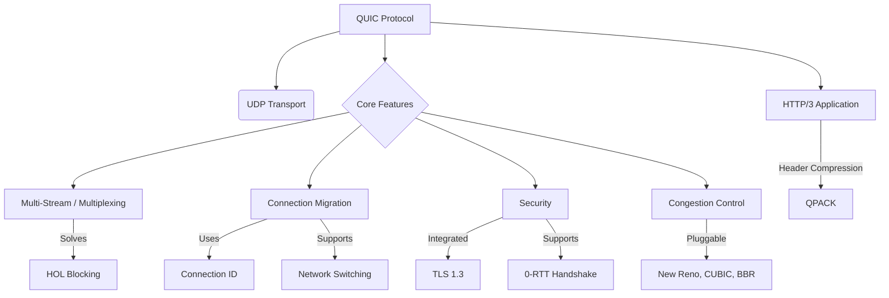

# AI 辅助深度学习与知识内化指南

## 一、 引言：知识 vs 智慧

| 维度 | 知识 (Knowledge) | 智慧 (Wisdom) |
| :--- | :--- | :--- |
| **来源** | 学习、记忆、书本、网络 | 反思、实践、错误、时间、人性观察 |
| **表达方式** | 可以用语言、数据表达 | 通常难以直接表达，需要情境和判断 |
| **AI 是否具备** | 是（尤其是大模型） | 否（只能“模拟”某种智慧） |
| **是否可复制** | 容易（复制粘贴、索引） | 困难（因人、因时、因境而异） |
| **举例** | 知道“如何演讲” | 知道“何时该说话、何时该闭嘴” |

*核心观点：知识是地图，智慧是带你走出丛林的能力。*

---

## 二、 核心学习法框架：构建知识体系

为了将信息转化为能力，推荐采用以下 8 种深度学习方法，并结合 AI 工具（如 ChatGPT, Claude 等）进行辅助：

### 1. 苏格拉底式提问法 (Socratic Questioning)
**目的**：理解技术出现的根本原因 (Root Cause)、设计哲学和权衡取舍 (Trade-offs)。
**应用场景**：第一次接触新技术，想理解其“天命”所在。
**示例 Prompt**：
> "你好，我想深入学习 QUIC 和 HTTP/3。请你扮演一位网络协议专家，使用苏格拉底式提问法来引导我，帮助我从根本上理解它。"

<details>
<summary>💡 AI 回答示例</summary>

**Network Protocol Expert**: 很高兴和你一起探索。我不会直接告诉你答案，而是希望你和我一起“重新发明”QUIC。

让我们从 **TCP** 开始。在 HTTP/2 中，我们已经实现了多路复用（Multiplexing），即在一个 TCP 连接上并发发送多个请求。

**问题 1**：想象一下，你发出了 10 个请求，它们都在同一个 TCP 连接这“一根管子”里传输。如果这时候，网络中仅仅丢失了一个数据包（比如第 3 个请求的某个包），TCP 协议为了保证数据的“按序交付”，会如何处理后面那 7 个已经顺利到达的请求的数据包？它们能被立刻交给应用层吗？
</details>


**深入探究的三个层次**：
1.  **动机 (The 'Why')**：例如，在已有 TCP/HTTP2 的情况下，什么问题迫使工程师创造 QUIC？
2.  **设计选择 (The 'How')**：例如，为什么选择构建在 UDP 之上？带来了哪些好处和难题？
3.  **权衡 (The 'Trade-offs')**：例如，用户态实现给中间设备 (Middlebox) 带来了什么挑战？

### 2. 类比与比较学习法
**目的**：快速找到新旧知识的联系与区别，利用现有知识作为脚手架。
**应用场景**：熟悉旧技术 (如 TCP)，学习新技术 (如 QUIC) 时。
**示例 Prompt**：
> **非技术类比**："请用一个生动的、非技术的比喻来解释 QUIC 和 TCP 的核心区别（例如比作货物运输系统）。"
> **技术类比**："请以表格形式详细对比 QUIC/HTTP3 与 TCP/HTTP2 在连接建立、流控等方面的异同。"
> **概念继承与发展**："HTTP/2 的 `Stream` (流) 和 QUIC 的 `Stream` 在概念上有什么继承关系？QUIC 的 `Stream` 又是如何解决 HTTP/2 中那个基于 TCP 的 `Stream` 所面临的限制的？"

<details>
<summary>💡 AI 回答示例</summary>

**非技术类比**：
*   **TCP (HTTP/2)**：就像一列**火车**。虽然有很多车厢（Stream）可以装不同的货物，但它们必须首尾相连。如果车头（第一个数据包）出轨或停下了，后面所有的车厢都得停下来等待（队头阻塞），哪怕后面的车厢是完好无损的。
*   **QUIC (HTTP/3)**：就像一这支**摩托车队**。每辆摩托车（Stream）都是独立的。如果其中一辆（Stream A）爆胎了，它自己停下来修，但后面的一群摩托车（Stream B, C...）可以绕过它继续全速前进，互不影响。
</details>

### 3. 第一性原理 / 费曼学习法
**目的**：构建坚实、无歧义的基础知识，确保没有“知其然而不知其所以然”。
**应用场景**：学习核心概念 (如“拥塞控制”、“0-RTT”、“Virtualization”)。
**示例 Prompt**：
> **全局拆解**："假设我是一个聪明的计算机专业大一新生，只了解网络分层的基本概念。请从第一性原理出发，向我解释为什么我们需要 HTTP/3。请逐步构建你的解释，每引入一个新概念（如 UDP, Stream, HOL Blocking），都先用简单的语言解释它。"
> **局部拆解**："我们来聚焦于 QUIC 的拥塞控制。请不要直接抛出 BBR 这样的算法名称。请先解释：
> 1. 在网络世界里，'拥塞'到底是什么？
> 2. 为什么一个协议必须要有拥塞控制机制？没有会发生什么？
> 3. 为了感知和应对拥塞，一个协议最少需要哪些信息？（比如 RTT，丢包信号）
> 4. QUIC 在这方面比 TCP 有哪些潜在的优势？"

<details>
<summary>💡 AI 回答示例</summary>

**局部拆解 - 拥塞控制**：
1.  **什么是拥塞？**
    想象高速公路。当车流量超过了道路的容量，车辆就开始排队、减速，最终导致堵死。在网络中，就是路由器缓冲区满了，数据包开始被丢弃。
2.  **为什么需要控制？**
    如果没有控制，大家发现丢包了就拼命重发，结果网络更堵，最后谁的数据都发不出去（拥塞崩溃）。
3.  **需要什么信息？**
    *   **RTT (往返时间)**：数据去回一趟要多久？变慢了说明路堵了。
    *   **丢包**：数据没到，说明路上可能“车祸”了或“堵满了”。
    *   **配送率**：实际单位时间能到多少数据。
4.  **QUIC 的优势**：
    *   **更精准的 RTT**：QUIC 的 Packet Number 是单调递增的，重传包和原始包序号不同，所以计算 RTT 不会歧义。
    *   **更丰富的信息**：QUIC 的 ACK 帧携带了接收延迟（ACK Delay），可以算出更真实的物理链路时延。
</details>

### 4. 构建心智模型法
**目的**：系统性地构建知识地图，确保细节知识能被安放在正确的“抽屉”里。
**应用场景**：适用于学习任何一个复杂的系统。
**具体提问示例**：
> **第一层 (宏观视图)**：“请用一张 ASCII 字符图，描绘出 QUIC/HTTP3 在现代网络协议栈中的位置，并清晰地展示它与 TCP、UDP、TLS、HTTP/2 之间的替代和依赖关系。并附上简要说明。”

> **第二层 (核心组件)**：“现在，我们来展开 QUIC 的内部结构。请解释 QUIC 的三个核心概念：连接 (Connection)、流 (Stream) 和帧 (Frame)。它们三者之间是什么关系？数据是如何被打包成帧，放入流，再通过连接发送的？”

> **第三层 (深入特定机制)**：“我们已经了解了‘流’是独立的。现在请深入解释一下 QUIC 的流量控制机制。它是如何作用于单个‘流’和整个‘连接’两个层面的？请描述其工作流程。”

<details>
<summary>💡 AI 回答示例</summary>

**第二层 (核心组件) - ASCII 图解**：

```
       [ HTTP/3 Application ] <--- Request/Response, Headers (QPACK)
                 |
       [ QUIC Transport ]
       +-------------------------------------------------------------+
       |  Connection ID: 0x1a2b... (Identify Connection)             |
       |  Encryption: TLS 1.3 (Built-in)                             |
       |                                                             |
       |  +--- Stream 1 (Indep) ---+   +--- Stream 2 (Indep) ---+    |
       |  | Frame: HEADERS         |   | Frame: DATA            |    |
       |  | Frame: DATA            |   | Frame: DATA            |    |
       |  +------------------------+   +------------------------+    |
       +-------------------------------------------------------------+
                 | Encrypted UDP Packets
       [ UDP Protocol ] <--- Port 443
                 |
       [ IP Layer ]
```
**解释**：
QUIC 就像一个**容器**，包裹在 UDP 内部。
1.  **Connection**：是容器的外壳，有 ID，不再依赖 IP:Port 四元组（所以切换网络不断连）。
2.  **TLS**：是内嵌在 QUIC 里的防弹玻璃，天生加密。
3.  **Stream**：是容器里平行的管道，互相不干扰。
4.  **Frame**：是管道里流动的数据块。
</details>

### 5. 实践导向与代码生成
**目的**：将理论知识转化为实际代码能力，通过动手加深理解。
**应用场景**：理解基本概念后，希望快速编写原型或进行实验。
**示例 Prompt**：
> **环境与工具**："我想在我的本地机器上体验 QUIC/HTTP3。有哪些常用的开源实现或工具？比如，如何使用 Nginx 或 Caddy 快速搭建一个支持 HTTP/3 的服务器？请给出具体的配置文件和命令。"
> **代码示例生成**："请使用 Python 的 `aioquic` 库，给我一个最简单的 QUIC 客户端和服务器的 'Hello, World' 示例代码，并对关键部分（如创建连接、发送数据流）进行注释解释。"

> **调试**："我正在用 Wireshark 抓取 QUIC 流量，但我看到的都是无法解析的 UDP 包。这可能是什么原因？我需要安装什么插件或如何配置 Wireshark 才能正确解析出 QUIC 的帧 (Frame) 和 HTTP/3 的头部信息？"

> **代码解释**："在这段 Go 语言的 `quic-go` 库的代码中，`stream, err := connection.OpenStreamSync(context.Background())` 这一行具体做了什么？它和底层的 QUIC 握手和帧交换是如何对应的？"

<details>
<summary>💡 AI 回答示例</summary>

**代码示例生成 (Python aioquic)**：

```python
import asyncio
from aioquic.asyncio import connect
from aioquic.quic.configuration import QuicConfiguration

async def main():
    config = QuicConfiguration(is_client=True)
    # CAUTION: For demo only, disable strict verify
    config.verify_mode = False 
    
    # 1. 建立 QUIC 连接 (UDP + TLS 1.3 Handshake in 1-RTT)
    async with connect("quic.ai", 443, configuration=config) as connection:
        
        # 2. 创建一个新的 Stream (双向流)
        # 对应 QUIC 协议：分配一个新的 Stream ID (如 0, 4, 8...)
        stream_id = connection.get_next_available_stream_id()
        
        # 3. 发送 HTTP/3 请求 (封装在 HEADERS Frame 和 DATA Frame 中)
        # 这里简化演示，直接发送原始数据
        connection.send_stream_data(stream_id, b"GET / HTTP/3.0\r\n")
        
        # 4. 等待并读取服务器响应
        # 实际库会处理 Frame 的重组和解密
        print("Connected and request sent!")

asyncio.run(main())
```
</details>

### 6. 情景式互动学习法
**目的**：检验在真实世界问题中应用知识的能力，理解技术的价值和局限。

**应用场景**：掌握概念后，想要理解其在业务中的实际意义。

**示例 Prompt**：
> **情景模拟**：你可以设置一个角色扮演场景：
> "我们来做一个情景模拟。你是一位资深的网络架构师，而我是一位负责优化我们公司 App 性能的工程师。我们的 App 是一个短视频应用，用户在通勤路上（如地铁、公交）使用时，网络切换频繁，视频加载慢和卡顿的投诉很多。请问：
> 1. 引入 QUIC/HTTP3 能解决我们的核心痛点吗？如何解决？
> 2. 我需要向团队展示哪些关键收益和潜在风险？
> 3. 假设我们决定迁移，在应用层代码层面，我需要注意哪些适配工作？"

<details>
<summary>💡 AI 回答示例</summary>

**角色扮演 (架构师回复)**：

工程师你好，针对你描述的**短视频 + 弱网通勤**场景，QUIC 简直是“对症下药”：

**1. 解决核心痛点：连接迁移 (Connection Migration)**
*   **痛点**：用户进出地铁站，手机从 WiFi 切到 4G，IP 变了。TCP 连接必须断开重连（3次握手+TLS），视频必卡。
*   **QUIC 方案**：QUIC 使用 **Connection ID** 标识连接，而不是 IP 地址。当用户 IP 变了，只要 Connection ID 没变，连接继续保持！服务器接着发视频数据，用户**无感**切换。

**2. 收益与风险**
*   **收益**：
    *   **0-RTT**：用户点开视频也是“秒开”（之前访问过的话）。
    *   **抗丢包**：无队头阻塞。丢包率 20% 时，TCP 基本瘫痪，QUIC 还能跑出不错的速度。
*   **风险**：
    *   **UDP 封杀**：部分企业防火墙或运营商对 UDP 限速或丢弃。必须做 **TCP Fallback** (回退机制)。
    *   **CPU 消耗**：UDP 在用户态处理，加上加解密，CPU 占用通常比 TCP 高 20%-30%。
</details>

### 7. 知识图谱
**目的**：系统化、结构化地组织知识，看见全局，理解概念间的相互关系。
**示例 Prompt**：
> **生成可视化图谱**："请为 QUIC/HTTP3 创建一个知识图谱或概念图。我希望它能覆盖从底层依赖 (UDP) 到上层应用 (HTTP/3) 的关键概念。请使用 Mermaid.js 的 `graph TD` 语法来生成这个图，这样我就可以直接复制粘贴来渲染。图谱中应至少包含以下节点：UDP, QUIC, Connection, Stream, Frame, 0-RTT, Connection Migration, TLS 1.3, HTTP/3, QPACK。"

> **交互式构建图谱**：
> 1. 你："我们来一起构建 QUIC 的知识图谱。先从最核心的 'QUIC Connection' 开始，它有哪些关键的属性和关联的子概念？"
> 2. AI（可能回答）："好的。'QUIC Connection' 关联着：1. 基于 UDP 传输；2. 包含多个独立的 Stream；3. 使用 Connection ID 标识；4. 内置 TLS 1.3 加密；5. 实现拥塞控制。"
> 3. 你："很好，现在我们展开 'Stream' 这个节点。它和 HTTP 的请求/响应又是如何对应的？"

> **结构化文本输出**：请用JSON 或 YAML格式，为我生成一个 QUIC 协议关键特性的结构化大纲，清晰地展示出特性之间的层级关系。

<details>
<summary>💡 AI 回答示例</summary>

**生成可视化图谱 (Mermaid)**：


</details>

### 8. 反向测试 (Quiz)
**目的**：巩固记忆，发现知识盲点，模拟面试场景。
**示例 Prompt**：
> **反向测试**：请扮演面试官，对我进行一次 QUIC 知识的全面测验，一次一问。

<details>
<summary>💡 AI 回答示例</summary>

**面试官**：你好，欢迎参加面试。我们来聊聊 QUIC。
**第一题 (基础)**：
大家都知道 QUIC 是基于 UDP 的。但是，UDP 本身是不可靠的（不保证顺序，不保证送达）。
**请问：QUIC 是如何在不可靠的 UDP 之上，实现可靠传输的？它借用了 TCP 的哪些机制？又做了哪些改进？**

*(请回答，回答后我会进行点评和追问)*
</details>

---

## 三、 学习闭环：建议流程

1.  **启动 (15分钟)**：使用 *类比法 + 心智模型法*。获得宏观印象和核心价值。
2.  **深入 (1-2小时)**：使用 *苏格拉底提问 + 第一性原理*。深挖设计动机和核心组件。
3.  **实践 (1-2小时)**：使用 *实践导向 + 代码生成*。将抽象知识具象化。
4.  **应用 (1小时)**：使用 *情景式互动学习*。思考如何解决真实业务问题。
5.  **巩固 (长期)**：使用 *反向测试 + 知识图谱*。构建知识体系，检验掌握程度。

---

## 四、 技术案例详解：QUIC/HTTP3

### 协议对比：QUIC/HTTP3 vs TCP/HTTP2

| 维度 | QUIC/HTTP3 | TCP/HTTP2 |
| :--- | :--- | :--- |
| **连接建立** | **1 RTT 甚至 0-RTT** (支持快速恢复、重连) | 3次握手 + TLS握手 (通常至少 1 RTT) |
| **协议层次** | 基于 **UDP** 实现的传输层协议 | 基于 **TCP** 实现的应用层协议 |
| **头部压缩** | 使用 **QPACK** | 使用 **HPACK** |
| **连接迁移** | **支持** (基于 Connection ID，IP/端口变化无需重连) | 不支持 (IP/端口变化需重建连接) |
| **多路复用** | **真正的多路复用** (无队头阻塞问题) | 虽然支持，但 TCP 层仍存在**队头阻塞** |
| **流控机制** | 独立的流级和连接级流控 (QUIC层实现) | 基于 TCP 拥塞控制 + HTTP/2 流级流控 |
| **拥塞控制** | 位于 QUIC 协议内独立实现 (可插拔) | 使用 TCP 内置算法 (如 CUBIC, BBR) |
| **加密安全性**| 默认内置 **TLS 1.3** | 需额外 TLS 层 |
| **差错恢复** | QUIC 自身处理丢包和重传 | TCP 自动处理 |

### 核心架构图解 (Mental Model)
QUIC 作为一个统一传输解决方案，包含以下关键节点：
*   **Network Layer**: UDP 协议 (用户数据报协议)。
*   **Transport Layer (QUIC Core)**:
    *   **Connection (连接管理)**: 拥有 Connection ID (连接标识)，支持 Connection Migration (连接迁移)。
    *   **Built-in Security (内置安全)**: TLS 1.3 加密握手，支持 0-RTT/1-RTT 快速握手。
    *   **Data Transmission (数据传输)**:
        *   Multiplexed Streams (多路复用流) 解决队头阻塞。
        *   Frames (数据帧) 承载数据。
        *   Flow Control (流量控制)。
*   **Application Layer**: HTTP/3, QPACK (头部压缩)。

---

## 五、 教育与学习的核心观点 (AI 时代)

1.  **终身学习 (Lifelong Learning)**
    *   学习贯穿人的一生，不局限于学校。
    *   AI 时代职业更新速度前所未有，每个人都需具备自主探索新知的能力。

2.  **个性化学习 (Personalized Learning)**
    *   尊重每个人的独特学习风格和节奏。
    *   技术能帮助突破传统教室局限，实现个性化与普及性兼顾。

3.  **主动学习 (Active Learning)**
    *   学习者要主动探索，而非被动接受灌输。
    *   鼓励通过实践、体验、项目制方式学习。

4.  **学习者角色的根本转变**
    *   从 **"知识消费者"** 转变为 **"AI 协作者"**。
    *   重点从 **"知识记忆"** 转向 **"思考质疑"**，重视创造力和批判性思维。

5.  **加速学习工具的"超进化"**
    *   构建"最优学习场"。
    *   利用 AI 作为脚手架，让初学者也能快速上手复杂技术。

# Reference
1. [软件工程师如何利用 AI 更高效地进行知识探索和深度学习？](https://www.bilibili.com/video/BV1YB3xzkEXy/?share_source=copy_web&vd_source=1f3f9168a398ca8f53c220d196533a4c)
