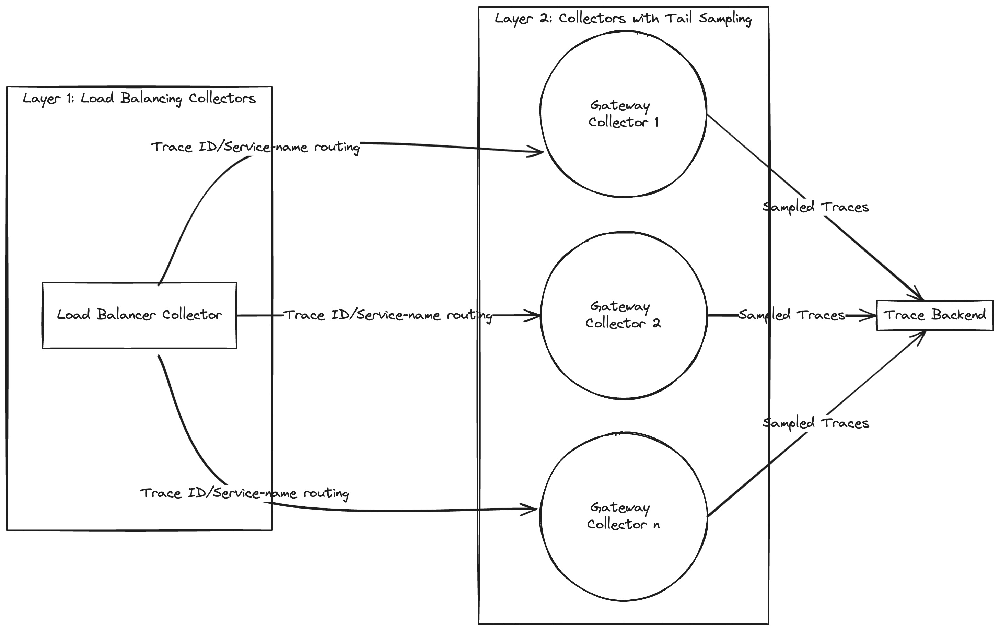

# OTLP

- [MeterProvider](https://github.com/open-telemetry/opentelemetry-specification/blob/main/specification/metrics/api.md#meterprovider) is the entry point of the API. It provides access to Meters
    - API MeterProvider only provides ability to create a Meter
    - SDK MeterProvider accepts configuration for Resource association, metric processing, and exporters
- [Meter](https://github.com/open-telemetry/opentelemetry-specification/blob/main/specification/metrics/api.md#meter) is responsible for creating Instruments

[Instrument](https://github.com/open-telemetry/opentelemetry-specification/blob/main/specification/metrics/api.md#instrument) is responsible for reporting [Measurements](https://github.com/open-telemetry/opentelemetry-specification/blob/main/specification/metrics/api.md#measurement)

# EU 2023

使用的基础设施

```yaml
observability-backend           grafana-65888b98d-lvdv8                                      1/1     Running     0               25d
observability-backend           loki-0                                                       1/1     Running     0               25d
observability-backend           mimir-0                                                      1/1     Running     0               25d
observability-backend           otel-collector-9d57bfcfc-ngrkd                               1/1     Running     0               19m
observability-backend           otel-prom-cr-collector-0                                     1/1     Running     3 (3m44s ago)   4m2s
observability-backend           otel-prom-cr-collector-1                                     1/1     Running     0               4m2s
observability-backend           otel-prom-cr-collector-2                                     1/1     Running     2 (3m45s ago)   4m2s
observability-backend           otel-prom-cr-targetallocator-668cbf96bc-26dhc                1/1     Running     0               4m2s
observability-backend           otel-prom-cr-targetallocator-668cbf96bc-vc4rn                1/1     Running     0               4m2s
observability-backend           tempo-694776547f-99rr8                                       1/1     Running     0               25d
```

使用 opentelemetry-operator.yaml 0.74 版本

安装完出现两个crd

It manages two `CustomResourceDefinition`s (CRDs):

- `opentelemetrycollectors.opentelemetry.io`, short name `otelcol`
- `instrumentations.opentelemetry.io`, short name `otelinst`

```bash
❯ k get crd | grep opentelemetry
instrumentations.opentelemetry.io                     2025-01-17T07:45:30Z
opentelemetrycollectors.opentelemetry.io              2025-01-17T07:45:31Z
```

## otelcol

部署下面的yaml

```yaml
apiVersion: opentelemetry.io/v1alpha1
kind: OpenTelemetryCollector
metadata:
  name: otel
spec:
  image: ghcr.io/open-telemetry/opentelemetry-collector-releases/opentelemetry-collector-contrib:0.74.0
  mode: deployment # statefulset, daemonset, sidecar
  autoscaler:
    targetCPUUtilization: 90
    minReplicas: 1
    maxReplicas: 5
  ingress:
    hostname: ...
  config: | # contains OpenTelemetry collector configuration
    receivers:
      otlp:
        protocols:
          grpc:
          http:
    processors:
      batch:

    exporters:
      logging:

    service:
      pipelines:
        traces:
          receivers: [otlp]
          processors: [batch]
          exporters: [logging]
```

会出现一个svc

```yaml
❯ kubectl get svc otel-collector -n observability-backend
NAME             TYPE        CLUSTER-IP     EXTERNAL-IP   PORT(S)                       AGE
otel-collector   ClusterIP   10.233.2.244   <none>        4317/TCP,4318/TCP,55681/TCP   8m20s
```

增加如下内容

```yaml
    receivers:
      jaeger:
        protocols:
          grpc:
          thrift_binary:
          thrift_compact:
          thrift_http:
        
    service:
      pipelines:
        traces:
          receivers: [otlp, jaeger]
          processors: [memory_limiter, batch]
```

会出现两个svc

```yaml
❯ kubectl get svc |grep otel-collector
otel-collector              ClusterIP   10.233.2.244    <none>        14250/TCP,6832/UDP,6831/UDP,14268/TCP,4317/TCP,4318/TCP,55681/TCP   10m
otel-collector-headless     ClusterIP   None            <none>        14250/TCP,6832/UDP,6831/UDP,14268/TCP,4317/TCP,4318/TCP,55681/TCP   10m
otel-collector-monitoring   ClusterIP   10.233.31.250   <none>        8888/TCP                                                            10m
```

## otelinst

The operator use pod mutating webhook to inject auto-instrumentation libraries into starting pods. The webhook adds an init container that copies auto-instrumentation libraries into a volume that is mounted as well to the application container and it configures runtime (e.g. in JVM via `JAVA_TOOL_OPTIONS`) to load the libraries.

```yaml
apiVersion: opentelemetry.io/v1alpha1
kind: Instrumentation
metadata:
  name: my-instrumentation
  namespace: tutorial-application
spec:
  exporter:
    endpoint: http://otel-collector.observability-backend.svc.cluster.local:4317
  propagators:
    - tracecontext
    - baggage
    - b3
  sampler:
    type: parentbased_traceidratio
    argument: "1"
  resource:
    addK8sUIDAttributes: false
  python:
    env:
      # Required if endpoint is set to 4317.
      # Python autoinstrumentation uses http/proto by default
      # so data must be sent to 4318 instead of 4317.
      - name: OTEL_EXPORTER_OTLP_ENDPOINT
        value: http://otel-collector.observability-backend.svc.cluster.local:4318
  java:
    env:
      - name: OTEL_LOGS_EXPORTER
        value: otlp
```

增加注解

```bash
# js
kubectl patch deployment frontend-deployment -n tutorial-application -p '{"spec": {"template":{"metadata":{"annotations":{"instrumentation.opentelemetry.io/inject-sdk":"true"}}}} }'
# python
kubectl patch deployment backend1-deployment -n tutorial-application -p '{"spec": {"template":{"metadata":{"annotations":{"instrumentation.opentelemetry.io/inject-python":"true"}}}} }'
# java
kubectl patch deployment backend2-deployment -n tutorial-application -p '{"spec": {"template":{"metadata":{"annotations":{"instrumentation.opentelemetry.io/inject-java":"true"}}}} }'
```

完整的调用关系


前端触发一下，能在grafana里看到，


同时我们也看看注入的内容

```yaml
  containers:
  - env:
    - name: OTEL_EXPORTER_OTLP_ENDPOINT
      value: http://otel-collector.observability-backend.svc.cluster.local:4318
    - name: PYTHONPATH
      value: /otel-auto-instrumentation/opentelemetry/instrumentation/auto_instrumentation:/otel-auto-instrumentation
    - name: OTEL_TRACES_EXPORTER
      value: otlp
    - name: OTEL_EXPORTER_OTLP_TRACES_PROTOCOL
      value: http/protobuf
    - name: OTEL_METRICS_EXPORTER
      value: otlp
    - name: OTEL_EXPORTER_OTLP_METRICS_PROTOCOL
      value: http/protobuf
    - name: OTEL_SERVICE_NAME
      value: backend1-deployment
    - name: OTEL_RESOURCE_ATTRIBUTES_POD_NAME
      valueFrom:
        fieldRef:
          apiVersion: v1
          fieldPath: metadata.name
    - name: OTEL_RESOURCE_ATTRIBUTES_NODE_NAME
      valueFrom:
        fieldRef:
          apiVersion: v1
          fieldPath: spec.nodeName
    - name: OTEL_PROPAGATORS
      value: tracecontext,baggage,b3
    - name: OTEL_TRACES_SAMPLER
      value: parentbased_traceidratio
    - name: OTEL_TRACES_SAMPLER_ARG
      value: "1"
    - name: OTEL_RESOURCE_ATTRIBUTES
      value: k8s.container.name=backend1,k8s.deployment.name=backend1-deployment,k8s.namespace.name=tutorial-application,k8s.node.name=$(OTEL_RESOURCE_ATTRIBUTES_NODE_NAME),k8s.pod.name=$(OTEL_RESOURCE_ATTRIBUTES_POD_NAME),k8s.replicaset.name=backend1-deployment-759d95c666
```

### **Resource attributes**

资源属性

There are several ways how essential Kubernetes resource attributes (`Namespace`, `Deployment`, `ReplicaSet`, `Pod` name and UIDs) can be collected:

- The `Instrumentation` CR - operator injects the attributes to the application container via `OTEL_RESOURCE_ATTRIBUTES` env var. The OpenTelemetry SDK used in the auto-instrumentation reads the variable.
- The `OpenTelemetryCollector` CR - the [k8sattributesprocessor](https://github.com/open-telemetry/opentelemetry-collector-contrib/tree/main/processor/k8sattributesprocessor) enriches spans with attributes in the collector
- The `OpenTelemetryCollector` CR - in the `sidecar` mode use [resourcedetectionprocessor](https://github.com/open-telemetry/opentelemetry-collector-contrib/tree/main/processor/resourcedetectionprocessor). The operator sets `OTEL_RESOURCE_ATTRIBUTES` with Kubernetes resource attributes and the variable can be consumed by `env` detector see [the blog post](https://opentelemetry.io/blog/2022/k8s-metadata/#using-resource-detector-processor) for more details.

修改otelinst，然后重启服务。

Let's enable collection of Kubernetes UID attributes. Update the `Instrumentation` CR:

```
kubectl edit instrumentations.opentelemetry.io my-instrumentation -n tutorial-application
spec:
  resource:
    addK8sUIDAttributes: true
```

The resource attributes are injected to the application container, to apply the change on already running applications a restart is required:

`kubectl rollout restart deployment -n tutorial-application -l app=backend1
kubectl rollout restart deployment -n tutorial-application -l app=backend2
kubectl rollout restart deployment -n tutorial-application -l app=frontend`


### **Sampling**

采样控制

Sampling in OpenTelemetry SDK and auto-instrumentations is configured via `OTEL_TRACES_SAMPLER` and `OTEL_TRACES_SAMPLER_ARG` environment variables. In our demo these environment variables are configured in the `Instrumentation` CR.

Let's change the sampling rate (argument) to sample 25% of requests:

```
kubectl edit instrumentations.opentelemetry.io my-instrumentation -n tutorial-application
# add
spec:
  sampler:
    type: parentbased_traceidratio
    argument: "0.25"
```

### **PII and data manipulation**

The collector can add, change and/or remove data that is flowing through it (spans, attributes etc.). This is useful to extract new attributes that can be later used for querying. Second use-case for data manipulation is to handle personally identifiable information (PII).

The following collector processors can be used for data manipulation:

- [attributesprocessor](https://github.com/open-telemetry/opentelemetry-collector-contrib/tree/main/processor/attributesprocessor) removes attributes.
- [filterprocessor](https://github.com/open-telemetry/opentelemetry-collector-contrib/tree/main/processor/filterprocessor) removes spans and attributes. It supports regex.
- [redactionprocessor](https://github.com/open-telemetry/opentelemetry-collector-contrib/tree/main/processor/redactionprocessor) deletes span attributes that don't match a list of allowed span attributes.
- [transformprocessor](https://github.com/open-telemetry/opentelemetry-collector-contrib/tree/main/processor/transformprocessor) modifies telemetry based on configuration using the [OpenTelemetry Transformation Language](https://github.com/open-telemetry/opentelemetry-collector-contrib/tree/main/pkg/ottl).

```
kubectl edit opentelemetrycollectors.opentelemetry.io otel -n observability-backend
# add
  processors:
    attributes:
      actions:
      - key: "http.target"pattern: ^.*\?player=(?P<player>.*)
        action: extract
          
    service:
      pipelines:
        traces:
          processors: [memory_limiter, attributes, batch]
```


## **Metrics**

**Prometheus Target Discovery**

**Service and Pod Monitors**

If you have services already generating metrics for prometheus, the collector can collect those using the prometheus receiver, which scrapes metric endpoints provided in a scrape_config like the one below:

```
  - job_name: 'otel-collector'scrape_interval: 10s
    static_configs:
      - targets: [ '0.0.0.0:8888' ]
```

This solution works but requires writing out all known targets. When services being deployed are added or changed, it will require updating this configuration. An alternative to this is to set up Prometheus [Service and Pod Monitors](https://github.com/prometheus-operator/prometheus-operator/blob/main/Documentation/design.md#servicemonitor). This allows for discovering metric endpoint dynamically and without needing to modify the collector configuration and restart all collectors.

In order to apply a pod or service monitor, the CRDs need to be installed:

```bash
kubectl apply -f https://raw.githubusercontent.com/prometheus-operator/prometheus-operator/main/example/prometheus-operator-crd/monitoring.coreos.com_servicemonitors.yaml

kubectl apply -f https://raw.githubusercontent.com/prometheus-operator/prometheus-operator/main/example/prometheus-operator-crd/monitoring.coreos.com_podmonitors.yaml
``
```

**Target Allocator**

A service called the [Target Allocator](https://github.com/open-telemetry/opentelemetry-operator/blob/main/cmd/otel-allocator/README.md) can use the prometheus service and pod monitor to discover targets. The target allocator discovers the targets and then distributes both discovered and configured targets among available collectors. It must be deployed alongside a Statefulset of collectors.

部署 target allocator

backend/03-collector-prom-cr.yaml


给服务增加service monitor
backend/04-servicemonitors.yaml


## **Logs**

**FileLog receiver**

[Filelog](https://github.com/open-telemetry/opentelemetry-collector-contrib/tree/main/receiver/filelogreceiver) receiver is one of the various Receivers available on [OpenTelemetry Collector Contrib](https://github.com/open-telemetry/opentelemetry-collector-contrib).

In order to demonstrate the logs instrumentation, we have to get the OpenTelemetry Instance running as a Daemonset:

```yaml
  filelog:
    include:
      - /var/log/pods/*/*/*.log
    #Each operator fulfills a single responsibility, 
    #such as reading lines from a file, or parsing JSON 
    #from a field. Operators are then chained together
    #in a pipeline to achieve a desired result.
    operators:
      # Parse CRI-O format
      - type: regex_parser
        id: parser-crio
        regex: '^(?P<time>[^ Z]+) (?P<stream>stdout|stderr) (?P<logtag>[^ ]*) ?(?P<log>.*)$'output: extract_metadata_from_filepath
        timestamp:
          parse_from: attributes.time
          layout_type: gotime
          layout: '2006-01-02T15:04:05.999999999Z07:00'
```

In order to demonstrate the logs instrumentation, we have to get the OpenTelemetry Instance running as a Daemonset:


**OpenTelemetry Collector running as DaemonSet**

```bash
kubectl apply -f https://raw.githubusercontent.com/pavolloffay/kubecon-eu-2023-opentelemetry-kubernetes-tutorial/main/backend/05-collector-daemonset.yaml
```


页面上可以看到日志了


## Roadmap

**OpenTelemetry Operator Roadmap**

**Golang auto-instrumentation.**

- Adding OpenTelemetry instrumentation to Go applications without having to modify their source code.

**OpAMP Bridge.**

- Open Agent Management Protocol (OpAMP) is a network protocol for remote management of large fleets of data collection Agents. The complete specification can be found [here](https://github.com/open-telemetry/opamp-spec/blob/main/specification.md).

**Simplifying the Operator CRDs.**

- In order to get the OpenTelemetryCollector easier to be deployed, we are experimenting an opinionated CRDs, which will have the cofig file declared as parameters.

**Configuration reload when collector running as Sidecar.**

- When the OpenTelemetryCollector instance is running a sidecar will get reloaded if the config parameter changes

# NA 2023

基础设施


使用的是v0.88.0版本的opentelemetry-operator，0.74版本不支持go

## **Auto-instrumentation**

By today the OpenTelemetry Operator offers two `CustomResouceDefinitions`.

1. The `v1alpha1.Instrumentation` can be used to configure applications that are configured with the OpenTelemetry-SDK and injection of auto-instrumentation libraries. Currently Apache HTTPD, DotNet, Go, Java, Nginx, NodeJS and Python are supported. [Readme](https://github.com/open-telemetry/opentelemetry-operator/blob/v0.88.0/README.md#opentelemetry-auto-instrumentation-injection)
2. The `v1alpha1.OpenTelemetryCollector` simplifies the operation of the OpenTelemetry Collector on Kubernetes. There are different deployment modes available, breaking config changes are migrated automatically, provides integration with Prometheus (including operating on Prometheus Operator CRs) and simplifies sidecar injection.

apply 这个yaml，

```yaml
---
apiVersion: opentelemetry.io/v1alpha1
kind: Instrumentation
metadata:
  name: demo-instrumentation
  namespace: tutorial-application
spec:
  exporter:
    endpoint: http://jaeger-collector.observability-backend.svc.cluster.local:4317
  env:
    - name: OTEL_EXPORTER_OTLP_METRICS_PROTOCOL
      value: http/protobuf
    - name: OTEL_EXPORTER_OTLP_METRICS_ENDPOINT
      value: http://prometheus.observability-backend.svc.cluster.local:80/api/v1/otlp/v1/metrics
    - name: OTEL_METRICS_EXPORTER
      value: otlp
    - name: OTEL_LOGS_EXPORTER
      value: none
  propagators:
    - tracecontext
    - baggage
    - b3
  sampler:
    type: parentbased_traceidratio
    argument: "1"
```

patch一下deployment

kubectl patch deployment backend2-deployment -n tutorial-application -p '{"spec": {"template":{"metadata":{"annotations":{"[instrumentation.opentelemetry.io/inject-java":"true](http://instrumentation.opentelemetry.io/inject-java%22:%22true)"}}}} }'

本地转发

kubectl port-forward -n observability-backend svc/prometheus 8080:80


kubectl port-forward -n observability-backend svc/jaeger-query 16686:16686


可以在granfa、jaeger分别看到metric、traces

## **Collector Overview**


The OpenTelemetry Collector can be divided into a few major components.

- **Receivers**: Collect data from a specific source, like an application or infrastructure, and convert it into [pData (pipeline data)](https://pkg.go.dev/go.opentelemetry.io/collector/consumer/pdata#section-documentation). This component can be active (e.g. Prometheus) or passive (OTLP).
- **Processors**: Manipulates the data collected by receivers in some way. For example, a processor might filter out irrelevant data, or add metadata to help with analysis. Examples include the batch or metric renaming processor.
- **Exporters**: Send data to an external system for storage or analysis. Examples of exporters are Prometheus, Loki or the OTLP exporter.
- **Extensions**: Add additional functionality to OpenTelemetry collector that is not strictly related to the telemetry data, like configuring a bearer token or offering a Jaeger remote sampling endpoint.
- **Connectors**: Is both an exporter and receiver. It consumes data as an exporter in one pipeline and emits data as a receiver in another pipeline.

The components are composed into **pipelines**, that are separated by signal type (metrics, traces, logs). Each datapoint is then goes through the chain consisting receiver(s) -> processor(s) -> exporter(s). For more details, check the [offical documentation](https://opentelemetry.io/docs/collector/).

apply yaml

```yaml
apiVersion: opentelemetry.io/v1alpha1
kind: OpenTelemetryCollector
metadata:
  name: otel-basic
  namespace: observability-backend
spec:
  image: ghcr.io/open-telemetry/opentelemetry-collector-releases/opentelemetry-collector-contrib:0.88.0
  mode: deployment
  replicas: 1
  ports:
    - port: 8888
      protocol: TCP
      name: metrics
  config: |
    receivers:
      otlp:
        protocols:
          grpc:
            endpoint: 0.0.0.0:4317
    processors:
      batch:

    exporters:
      debug:
        verbosity: detailed

    service:
      pipelines:
        metrics:
          receivers: [otlp]
          processors: [batch]
          exporters: [debug]
```

## **Collecting Prometheus Metrics**

介绍了两种方法。

### **1. Configure Prometheus Target Discovery**

使用传统的**Prometheus Configuration**的方式。


otelcol配置

```yaml
kind: OpenTelemetryCollector
metadata:
  name: otel-prom-collector
spec:
  mode: statefulset
  replicas: 1
  config: |
    receivers:
      prometheus:
        config:
          scrape_configs:
          - job_name: 'otel-collector'
            scrape_interval: 10s
            static_configs:
            - targets: [ '0.0.0.0:8888' ]
            metric_relabel_configs:
            - action: labeldrop
              regex: (id|name)
            - action: labelmap
              regex: label_(.+)
              replacement: $$1
      exporters:
        logging:
          loglevel: debug
        prometheus:
          endpoint: 0.0.0.0:8989
          metric_expiration: 10m
        prometheusremotewrite:
          endpoint: http://prometheus.observability-backend.svc.cluster.local:80/api/v1/write
    service:
      pipelines:
        metrics:
          exporters:
          - prometheusremotewrite
          - logging
          processors: []
          receivers:
          - prometheus
```

### **2. Scaling metrics pipeline with the target allocator**


target allocator需要搭配service monitor/pod monitor使用


部署有target allocator的otelcol

- otelcol yaml
    
    ```yaml
    apiVersion: opentelemetry.io/v1alpha1
    kind: OpenTelemetryCollector
    metadata:
      name: otel-prom-app-metrics
      namespace: observability-backend
    spec:
      image: ghcr.io/open-telemetry/opentelemetry-collector-releases/opentelemetry-collector-contrib:0.88.0
      mode: statefulset
      replicas: 3
      targetAllocator:
        enabled: true
        allocationStrategy: "consistent-hashing"
        replicas: 2
        image: ghcr.io/open-telemetry/opentelemetry-operator/target-allocator:0.88.0
        prometheusCR:
          enabled: true
      ports:
        - port: 8888
          protocol: TCP
          name: metrics
      config: |
        receivers:
          prometheus:
            config:
              scrape_configs:
              - job_name: 'otel-collector'
                scrape_interval: 20s
                static_configs:
                - targets: [ '0.0.0.0:8888' ]
            target_allocator:
              endpoint: http://otel-prom-app-metrics-targetallocator:80
              interval: 30s
              collector_id: ${POD_NAME}
              http_sd_config:
                refresh_interval: 60s
    
        processors:
          batch:
          memory_limiter:
            check_interval: 1s
            limit_percentage: 50
            spike_limit_percentage: 10
    
        exporters:
          logging:
            loglevel: debug
          prometheusremotewrite:
            endpoint: "http://prometheus.observability-backend.svc.cluster.local:80/api/v1/write"
            resource_to_telemetry_conversion:
              enabled: true
        service:
          telemetry:
            logs:
              level: debug
          pipelines:
            metrics:
              receivers: [prometheus]
              processors: [memory_limiter, batch]
              exporters: [logging, prometheusremotewrite]
    ---
    apiVersion: rbac.authorization.k8s.io/v1
    kind: ClusterRole
    metadata:
      name: otel-prom-app-metrics-collector
    rules:
      - apiGroups: [""]
        resources:
          - nodes
          - nodes/proxy
          - nodes/metrics
          - services
          - endpoints
          - pods
        verbs: ["get", "list", "watch"]
      - apiGroups: ["monitoring.coreos.com"]
        resources:
          - servicemonitors
          - podmonitors
        verbs: ["get", "list", "watch"]
      - apiGroups:
          - extensions
        resources:
          - ingresses
        verbs: ["get", "list", "watch"]
      - apiGroups:
          - networking.k8s.io
        resources:
          - ingresses
        verbs: ["get", "list", "watch"]
      - apiGroups: ["discovery.k8s.io"]
        resources:
        - endpointslices
        verbs: ["get", "list", "watch"]
      - nonResourceURLs: ["/metrics", "/metrics/cadvisor"]
        verbs: ["get"]
    ---
    apiVersion: rbac.authorization.k8s.io/v1
    kind: ClusterRoleBinding
    metadata:
      name: otel-prom-app-metrics-collector
    roleRef:
      apiGroup: rbac.authorization.k8s.io
      kind: ClusterRole
      name: otel-prom-app-metrics-collector
    subjects:
      - kind: ServiceAccount
        # quirk of the Operator
        name: otel-prom-app-metrics-collector
        namespace: observability-backend
      - kind: ServiceAccount
        name: otel-prom-app-metrics-targetallocator
        namespace: observability-backend
      - kind: ServiceAccount
        name: backend1
        namespace: tutorial-application
    ```
    

部署service monitor

- service_monitor.yaml
    
    ```yaml
    ---
    apiVersion: monitoring.coreos.com/v1
    kind: ServiceMonitor
    metadata:
      name: backend1-service
      namespace: tutorial-application
    spec:
      selector:
        matchLabels:
          app: backend1
      namespaceSelector:
        matchNames:
          - tutorial-application
      endpoints:
        - path: /metrics/
          port: http
          interval: 20s
          scrapeTimeout: 10s
    ---
    apiVersion: monitoring.coreos.com/v1
    kind: ServiceMonitor
    metadata:
      name: otel-prom-cr-targetallocator
      namespace: observability-backend
    spec:
      endpoints:
        - path: /metrics
          port: targetallocation
          interval: 20s
          scrapeTimeout: 10s
      namespaceSelector:
        matchNames:
          - observability-backend
      selector:
        matchLabels:
          app.kubernetes.io/name: otel-prom-app-metrics-targetallocator
    ```
    

部署完成可以看到，如下pod


可以在granafa里看到


## **Collecting Kubernetes infrastracture metrics**

使用了kubeletstats和hostmetrics的receivers，收集k8s的指标。

- otle yaml
    
    ```yaml
    apiVersion: opentelemetry.io/v1alpha1
    kind: OpenTelemetryCollector
    metadata:
      name: otel-k8s-cluster-metrics-agent
      namespace: observability-backend
    spec:
      image: ghcr.io/open-telemetry/opentelemetry-collector-releases/opentelemetry-collector-contrib:0.88.0
      mode: daemonset
      serviceAccount: otel-k8s-cluster-metrics-collector
      env:
      - name: K8S_NODE_NAME
        valueFrom:
          fieldRef:
            fieldPath: spec.nodeName
      - name: OTEL_RESOURCE_ATTRIBUTES
        value: k8s.node.name=$(K8S_NODE_NAME)
      volumeMounts:
      - name: hostfs
        mountPath: /hostfs
        readOnly: true
        mountPropagation: HostToContainer
      volumes:
      - name: hostfs
        hostPath:
          path: /
      ports:
        - port: 8888
          protocol: TCP
          name: metrics
      config: |
        receivers:
          kubeletstats:
            collection_interval: 20s
            auth_type: "serviceAccount"
            endpoint: "${env:K8S_NODE_NAME}:10250"
            extra_metadata_labels:
            - k8s.volume.type
            insecure_skip_verify: true
            metric_groups:
            - container
            - pod
            - volume
            - node
          hostmetrics:
            collection_interval: 10s
            root_path: /hostfs
            scrapers:
              cpu:
                metrics:
                  system.cpu.utilization:
                    enabled: true
              disk: null
              filesystem:
                exclude_fs_types:
                  fs_types:
                  - autofs
                  - binfmt_misc
                  - bpf
                  - cgroup2
                  - configfs
                  - debugfs
                  - devpts
                  - devtmpfs
                  - fusectl
                  - hugetlbfs
                  - iso9660
                  - mqueue
                  - nsfs
                  - overlay
                  - proc
                  - procfs
                  - pstore
                  - rpc_pipefs
                  - securityfs
                  - selinuxfs
                  - squashfs
                  - sysfs
                  - tracefs
                  match_type: strict
                exclude_mount_points:
                  match_type: regexp
                  mount_points:
                  - /dev/*
                  - /proc/*
                  - /sys/*
                  - /run/k3s/containerd/*
                  - /run/containerd/runc/*
                  - /var/lib/docker/*
                  - /var/lib/kubelet/*
                  - /snap/*
              load: null
              memory:
                metrics:
                  system.memory.utilization:
                    enabled: true
              network: null
        
        processors:
          batch:
          memory_limiter:
            check_interval: 1s
            limit_percentage: 50
            spike_limit_percentage: 10
          k8sattributes:
            auth_type: 'serviceAccount'
            extract:
              metadata:
                - k8s.namespace.name
                - k8s.pod.name
                - k8s.pod.start_time
                - k8s.pod.uid
                - k8s.deployment.name
                - k8s.node.name
          resourcedetection/env:
            detectors:
            - env
    
        exporters:
          logging:
            loglevel: debug
          prometheusremotewrite:
            endpoint: "http://prometheus.observability-backend.svc.cluster.local:80/api/v1/write"
            resource_to_telemetry_conversion:
              enabled: true
        service:
          pipelines:
            metrics:
              receivers: [kubeletstats, hostmetrics]
              processors: [k8sattributes, resourcedetection/env, memory_limiter, batch]
              exporters: [logging, prometheusremotewrite]
    
    ---
    apiVersion: opentelemetry.io/v1alpha1
    kind: OpenTelemetryCollector
    metadata:
      name: otel-k8s-cluster-metrics
      namespace: observability-backend
    spec:
      image: ghcr.io/open-telemetry/opentelemetry-collector-releases/opentelemetry-collector-contrib:0.88.0
      mode: statefulset
      replicas: 3
      serviceAccount: otel-k8s-cluster-metrics-collector
      targetAllocator:
        enabled: true
        serviceAccount: otel-k8s-cluster-metrics-targetallocator
        allocationStrategy: "consistent-hashing"
        replicas: 2
        image: ghcr.io/open-telemetry/opentelemetry-operator/target-allocator:0.88.0
        prometheusCR:
          enabled: false
      env:
      - name: K8S_NODE_NAME
        valueFrom:
          fieldRef:
            fieldPath: spec.nodeName
      - name: OTEL_RESOURCE_ATTRIBUTES
        value: k8s.node.name=$(K8S_NODE_NAME)
      volumeMounts:
      - name: hostfs
        mountPath: /hostfs
        readOnly: true
        mountPropagation: HostToContainer
      volumes:
      - name: hostfs
        hostPath:
          path: /
      ports:
        - port: 8888
          protocol: TCP
          name: metrics
      config: |
        receivers:
          k8s_cluster:
            auth_type: serviceAccount
            node_conditions_to_report:
              - Ready
              - MemoryPressure
            allocatable_types_to_report:
              - cpu
              - memory
          prometheus:
            config:
              scrape_configs:
              - job_name: apiserver
                authorization:
                  credentials_file: "/var/run/secrets/kubernetes.io/serviceaccount/token"
                  type: Bearer
                honor_labels: true
                honor_timestamps: true
                kubernetes_sd_configs:
                - follow_redirects: true
                  kubeconfig_file: ''
                  role: endpoints
                metrics_path: "/metrics"
                follow_redirects: true
                relabel_configs:
                - source_labels: [__meta_kubernetes_namespace, __meta_kubernetes_service_name, __meta_kubernetes_endpoint_port_name]
                  separator: ;
                  regex: default;kubernetes;https
                  replacement: $$1
                  action: keep
                scheme: https
                scrape_interval: 20s
                scrape_timeout: 10s
                tls_config:
                  ca_file: "/var/run/secrets/kubernetes.io/serviceaccount/ca.crt"
                  insecure_skip_verify: true
              - job_name: kubernetes-nodes
                honor_timestamps: true
                scrape_interval: 20s
                scrape_timeout: 10s
                metrics_path: /metrics
                scheme: https
                authorization:
                  type: Bearer
                  credentials_file: /var/run/secrets/kubernetes.io/serviceaccount/token
                tls_config:
                  ca_file: /var/run/secrets/kubernetes.io/serviceaccount/ca.crt
                  insecure_skip_verify: true
                follow_redirects: true
                relabel_configs:
                - separator: ;
                  regex: __meta_kubernetes_node_label_(.+)
                  replacement: $$1
                  action: labelmap
                - separator: ;
                  regex: (.*)
                  target_label: __address__
                  replacement: kubernetes.default.svc:443
                  action: replace
                kubernetes_sd_configs:
                - role: node
                  kubeconfig_file: ""
                  follow_redirects: true
              - job_name: kubernetes-nodes-cadvisor
                honor_timestamps: true
                scrape_interval: 20s
                scrape_timeout: 10s
                metrics_path: /metrics
                scheme: https
                authorization:
                  type: Bearer
                  credentials_file: /var/run/secrets/kubernetes.io/serviceaccount/token
                tls_config:
                  ca_file: /var/run/secrets/kubernetes.io/serviceaccount/ca.crt
                  insecure_skip_verify: true
                follow_redirects: true
                relabel_configs:
                - separator: ;
                  regex: __meta_kubernetes_node_label_(.+)
                  replacement: $$1
                  action: labelmap
                - separator: ;
                  regex: (.*)
                  target_label: __address__
                  replacement: kubernetes.default.svc:443
                  action: replace
                kubernetes_sd_configs:
                - role: node
                  kubeconfig_file: ""
                  follow_redirects: true
              - job_name: kubernetes-service-endpoints
                honor_labels: true
                honor_timestamps: true
                scrape_interval: 20s
                scrape_timeout: 10s
                metrics_path: /metrics
                scheme: http
                follow_redirects: true
                relabel_configs:
                    - action: labelmap
                      regex: __meta_kubernetes_service_label_(.+)
                    - source_labels: [__meta_kubernetes_namespace]
                      action: replace
                      target_label: namespace
                    - source_labels: [__meta_kubernetes_service_name]
                      action: replace
                      target_label: service
                kubernetes_sd_configs:
                - role: pod
                  kubeconfig_file: ""
                  follow_redirects: true
              - job_name: kubernetes-pods
                honor_labels: true
                honor_timestamps: true
                scrape_interval: 1m
                scrape_timeout: 20s
                metrics_path: /metrics
                scheme: http
                tls_config:
                  ca_file: /var/run/secrets/kubernetes.io/serviceaccount/ca.crt
                  insecure_skip_verify: true
                follow_redirects: true
                relabel_configs:
                  - action: labelmap
                    regex: __meta_kubernetes_pod_label_(.+)
                  - source_labels: [__meta_kubernetes_namespace]
                    action: replace
                    target_label: namespace
                  - source_labels: [__meta_kubernetes_pod_name]
                    action: replace
                    target_label: pod
                kubernetes_sd_configs:
                - role: pod
                  kubeconfig_file: ""
                  follow_redirects: true
            target_allocator:
              endpoint: http://otel-k8s-cluster-metrics-targetallocator:80
              interval: 30s
              collector_id: ${POD_NAME}
              http_sd_config:
                refresh_interval: 60s
        
        processors:
          batch:
          memory_limiter:
            check_interval: 1s
            limit_percentage: 50
            spike_limit_percentage: 10
          resourcedetection/env:
            detectors:
            - env
    
        exporters:
          logging:
            loglevel: debug
          prometheusremotewrite:
            endpoint: "http://prometheus.observability-backend.svc.cluster.local:80/api/v1/write"
            resource_to_telemetry_conversion:
              enabled: true
        service:
          pipelines:
            metrics:
              receivers: [prometheus, k8s_cluster]
              processors: [resourcedetection/env, memory_limiter, batch]
              exporters: [logging, prometheusremotewrite]
    ---
    apiVersion: rbac.authorization.k8s.io/v1
    kind: ClusterRole
    metadata:
      name: otel-k8s-cluster-metrics-collector
    rules:
      - apiGroups:
          - ''
        resources:
          - events
          - namespaces
          - namespaces/status
          - nodes
          - nodes/proxy
          - nodes/spec
          - nodes/stats
          - nodes/metrics
          - services
          - endpoints
          - replicationcontrollers
          - replicationcontrollers/status
          - resourcequotas
          - pods
          - pods/status
        verbs: ["get", "list", "watch"]
      - apiGroups:
          - apps
        resources:
          - daemonsets
          - deployments
          - replicasets
          - statefulsets
        verbs:
          - get
          - list
          - watch
      - apiGroups: 
          - "monitoring.coreos.com"
        resources:
          - servicemonitors
          - podmonitors
        verbs: ["get", "list", "watch"]
      - apiGroups:
          - extensions
        resources:
          - ingresses
          - daemonsets
          - deployments
          - replicasets
        verbs: ["get", "list", "watch"]
      - apiGroups:
          - networking.k8s.io
        resources:
          - ingresses
        verbs: ["get", "list", "watch"]
      - apiGroups: 
          - "discovery.k8s.io"
        resources:
          - endpointslices
        verbs: ["get", "list", "watch"]
      - apiGroups:
          - batch
        resources:
          - jobs
          - cronjobs
        verbs:
          - get
          - list
          - watch
      - apiGroups:
          - autoscaling
        resources:
          - horizontalpodautoscalers
        verbs:
          - get
          - list
          - watch
      - nonResourceURLs: ["/metrics", "/metrics/cadvisor"]
        verbs: ["get"]
    ---
    apiVersion: rbac.authorization.k8s.io/v1
    kind: ClusterRoleBinding
    metadata:
      name: otel-k8s-cluster-metrics-collector
    roleRef:
      apiGroup: rbac.authorization.k8s.io
      kind: ClusterRole
      name: otel-k8s-cluster-metrics-collector
    subjects:
      - kind: ServiceAccount
        # quirk of the Operator
        name: otel-k8s-cluster-metrics-collector
        namespace: observability-backend
      - kind: ServiceAccount
        name: otel-k8s-cluster-metrics-targetallocator
        namespace: observability-backend
    ---
    apiVersion: v1
    kind: ServiceAccount
    metadata:
      name: otel-k8s-cluster-metrics-collector
      namespace: observability-backend
    ---
    apiVersion: v1
    kind: ServiceAccount
    metadata:
      name: otel-k8s-cluster-metrics-targetallocator
      namespace: observability-backend
    
    ```
    


### **Kubelet Stats Receiver**

see [Kubeletstats Receiver](https://github.com/open-telemetry/opentelemetry-collector-contrib/blob/main/receiver/kubeletstatsreceiver).


### **Kubernetes Cluster Receiver**

see [Kubernetes Cluster Receiver](https://github.com/open-telemetry/opentelemetry-collector-contrib/tree/main/receiver/k8sclusterreceiver).

```yaml
   k8s_cluster: 
     auth_type: serviceAccount 
     node_conditions_to_report: 
       - Ready 
       - MemoryPressure 
     allocatable_types_to_report: 
       - cpu 
       - memory 
```

### **Host Metrics Receiver**

| Scraper | Supported OSs | Description |
| --- | --- | --- |
| cpu | All except Mac | CPU utilization metrics |
| disk | All except Mac | Disk I/O metrics |
| load | All | CPU load metrics |
| filesystem | All | File System utilization metrics |
| memory | All | Memory utilization metrics |
| network | All | Network interface I/O metrics & TCP connection metrics |
| paging | All | Paging/Swap space utilization and I/O metrics |
| processes | Linux, Mac | Process count metrics |
| process | Linux, Windows, Mac | Per process CPU, Memory, and Disk I/O metrics |

There is some overlap with the [Kubeletstats Receiver](https://github.com/pavolloffay/kubecon-na-2023-opentelemetry-kubernetes-metrics-tutorial/blob/main/06-collecting-k8s-infra-metrics.md#kubeletstats-receiver) so if you decide to use both, it may be worth it to disable these duplicate metrics.

In order to correctly scrape node metrics, make sure to mount the `hostfs` volume if you want to collect the actual node's metrics. You can inspect the [configuration](https://github.com/pavolloffay/kubecon-na-2023-opentelemetry-kubernetes-metrics-tutorial/blob/main/(backend/06-collector-k8s-cluster-metrics.yaml)) to see how the `hostfs` volume is mounted. Configuration for `hostmetrics`, in simplest form, looks as follows:

```yaml
receivers:
  hostmetrics:
    root_path: /hostfs
    collection_interval: 10s
    scrapers:
      cpu:
      load:
      memory:
      disk:
      filesystem:
      network:
```


### **Prometheus Receiver**

Kubernetes components emit metrics in Prometheus format and it has built-in support for hundreds of useful metrics that help understand the health of containers, pods, nodes, services, and internal system components, such as `kube-controller-manager`, `kube-proxy`, `kube-apiserver`, `kube-scheduler`, and `kubelet`. Most of the metrics for the key components come embedded with the Kubelet. For specific metrics related to these components, deployments of exporters like `kube-state-metrics`, `node-exporter`, and `Blackbox Exporter` are required.

set up the OpenTelemetry collector to scrape these embedded metrics. The Prometheus upstream repository provides a helpful reference for configuring scraping, which you can find [here](https://raw.githubusercontent.com/prometheus/prometheus/main/documentation/examples/prometheus-kubernetes.yml). It contains the necessary configurations for discovering pods and services in your Kubernetes cluster. Our Prometheus receiver scrape configuration includes the following defined scrape jobs:

1. **kubernetes-apiservers:** This job pulls in metrics from the API servers.
2. **kubernetes-nodes:** It collects metrics specific to Kubernetes nodes.
3. **kubernetes-pods:** All pods with annotations for scraping and port specifications are scraped.
4. **kubernetes-service-endpoints:** All service endpoints with annotations for scraping and port specifications are scraped.
5. **kubernetes-cadvisor:** This job captures metrics from cAdvisor, providing container metrics.


## **Correlation**

相关信息，比如k8s信息，主机信息。

### **Collecting Kubernetes resource attributes**

The Kubernetes resource attributes can be added to metrics in a couple of different ways:

1. in OpenTelemetry SDK / `OTEL_RESOURCE_ATTRIBUTES` environment variable
2. in collector [k8sattributesprocessor](https://github.com/open-telemetry/opentelemetry-collector-contrib/tree/main/processor/k8sattributesprocessor)

The [Kubernetes resource attributes](https://github.com/open-telemetry/semantic-conventions/blob/main/docs/resource/k8s.md) are prefixed with `k8s`: `k8s.pod.name`, `k8s.pod.uid` etc.

The Kubernetes resource attributes can be added to metrics in a couple of different ways:

1. in OpenTelemetry SDK / `OTEL_RESOURCE_ATTRIBUTES` environment variable
2. in collector [k8sattributesprocessor](https://github.com/open-telemetry/opentelemetry-collector-contrib/tree/main/processor/k8sattributesprocessor)(need rbac)

```jsx
processors:
    k8sattributes:
      passthrough: false # when true only pod IP addresses are added, that can be used later for attributes association
      extract:
        annotations:
          - tag_name: tutorial # extracts value of annotation from pods with key `annotation-one` and inserts it as a tag with key `a1`
            key: kubecon-tutorial
            from: namespace
```

- yaml详情
    
    ```yaml
    ---
    apiVersion: rbac.authorization.k8s.io/v1
    kind: ClusterRole
    metadata:
      name: otel-collector
    rules:
      - apiGroups: [""]
        resources: ["pods", "namespaces"]
        verbs: ["get", "watch", "list"]
      - apiGroups: ["apps"]
        resources: ["replicasets"]
        verbs: ["get", "list", "watch"]
      - apiGroups: ["extensions"]
        resources: ["replicasets"]
        verbs: ["get", "list", "watch"]
    ---
    apiVersion: rbac.authorization.k8s.io/v1
    kind: ClusterRoleBinding
    metadata:
      name: otel-collector
    subjects:
      - kind: ServiceAccount
        name: otel-collector
        namespace: observability-backend
    roleRef:
      kind: ClusterRole
      name: otel-collector
      apiGroup: rbac.authorization.k8s.io
    ---
    apiVersion: opentelemetry.io/v1alpha1
    kind: OpenTelemetryCollector
    metadata:
      name: otel
      namespace: observability-backend
    spec:
      image: ghcr.io/open-telemetry/opentelemetry-collector-releases/opentelemetry-collector-contrib:0.87.0
      mode: deployment
      replicas: 1
      ports:
        - port: 8888
          protocol: TCP
          name: metrics
      config: |
        receivers:
          otlp:
            protocols:
              grpc:
              http:
    
        connectors:
          spanmetrics:
            exemplars:
              enabled: true
    
        processors:
          batch:
          memory_limiter:
            check_interval: 1s
            limit_percentage: 50
            spike_limit_percentage: 10
          k8sattributes:
            passthrough: false
            extract:
              annotations:
              - tag_name: tutorial # extracts value of annotation from pods with key `annotation-one` and inserts it as a tag with key `a1`
                key: kubecon-tutorial
                from: namespace
    
        exporters:
          debug:
            verbosity: detailed
          otlphttp/metrics:
            endpoint: http://prometheus.observability-backend.svc.cluster.local:80/api/v1/otlp/
            tls:
              insecure: true
          otlp/traces:
            endpoint: jaeger-collector.observability-backend.svc.cluster.local:4317
            tls:
              insecure: true
        service:
          pipelines:
            metrics:
              receivers: [otlp, spanmetrics]
              processors: [memory_limiter, k8sattributes, batch]
              exporters: [debug, otlphttp/metrics]
            traces:
              receivers: [otlp]
              processors: [memory_limiter, k8sattributes, batch]
              exporters: [otlp/traces, spanmetrics]
    ```
    

apply yaml之后可以看到


### **Resource Detection Processor**

The [resourcedetectionprocessor](https://github.com/open-telemetry/opentelemetry-collector-contrib/tree/main/processor/resourcedetectionprocessor) can be used to detect the resource information from the host. Several detectors are supported:

- `env`: read attributes from `OTEL_RESOURCE_ATTRIBUTES`
- `system`: `host.name`, `host.arch`, `host.id`, `host.cpu.model.name`, `host.cpu.vendor.id`
- `docker`: `host.name`, `os.type`
- `heroku`: `heroku.app.id`, `heroku.release.commit`, `service.name`
- `gcp`: `cloud.provider` (`gcp`), `cloud.platform` (`gcp_app_engine`), `cloud.region` (`us-central1`), `cloud.availability_zone` (`us-central1-c`), `gcp.gce.instance.hostname`
- `openshift`: `cloud.provider`, `cloud.platform`, `cloud.region`, `k8s.cluster.name`

### **Exemplars**

[Exemplars](https://opentelemetry.io/docs/specs/otel/metrics/sdk/#exemplar) allow correlation between aggregated metric data and the original API calls where measurements are recorded. Exemplars work for trace-metric correlation across any metric, not just those that can also be derived from Spans.

### **Collector: Spanmetrics Connector**

The [spanmetrics](https://github.com/open-telemetry/opentelemetry-collector-contrib/tree/main/connector/spanmetricsconnector) connector aggregates Request, Error and Duration (R.E.D) OpenTelemetry metrics from span data. It supports exemplars.

```yaml
connectors:
  spanmetrics:
    exemplars:
      enabled: true
service:
  pipelines:
    traces:
      receivers: [otlp]
      exporters: [spanmetrics]
    metrics:
      receivers: [spanmetrics]
      exporters: [otlp]
```


### **Baggage**

[Baggage](https://opentelemetry.io/docs/concepts/signals/baggage/) is contextual information that is passed between spans. It is a key-value store that resides alongside span context in a trace, making values available to any span created within that trace.

The baggage is propagated via W3C `baggage` [header](https://w3c.github.io/baggage/).

Example of setting baggage with `sessionId` key.

`const baggage =
    otelapi.propagation.getBaggage(otelApi.context.active()) ||
    otelapi.propagation.createBaggage()

  baggage.setEntry("sessionId", { value: "session-id-value" })
  otelapi.propagation.setBaggage(otelapi.context.active(), baggage)`

# EU-2024

还是熟悉的配方，apply cert-manager和opentelemetry-operator

```bash
kubectl apply -f https://github.com/cert-manager/cert-manager/releases/download/v1.11.0/cert-manager.yaml

kubectl apply -f https://github.com/open-telemetry/opentelemetry-operator/releases/download/v0.94.0/opentelemetry-operator.yaml
```

使用jaeger、prometheus，部署在observability-backend 

```bash
observability-backend           jaeger-cb9c786c6-rl9hz
observability-backend           prometheus-79d4df4bd9-nfgjq
```

使用的测试应用还是之前的frontend、backend1、backend2、loadgen(自动测试的)


## Auto-instrumentation

- 部署`03-collector.yaml`
    
    ```yaml
    apiVersion: opentelemetry.io/v1alpha1
    kind: OpenTelemetryCollector
    metadata:
      name: otel
      namespace: observability-backend
    spec:
      image: ghcr.io/open-telemetry/opentelemetry-collector-releases/opentelemetry-collector-contrib:0.94.0
      mode: deployment
      replicas: 1
      ports:
        - port: 8888
          protocol: TCP
          name: metrics
      config: |
        receivers:
          otlp:
            protocols:
              grpc:
                endpoint: 0.0.0.0:4317
              http:
                endpoint: 0.0.0.0:4318
    
        processors:
          batch:
    
        exporters:
          otlp/traces:
            endpoint: jaeger-collector:4317
            tls:
              insecure: true
    
          otlphttp/metrics:
            endpoint: http://prometheus.observability-backend.svc.cluster.local:80/api/v1/otlp/
            tls:
              insecure: true
    
          debug:
            verbosity: detailed
    
        service:
          pipelines:
            traces:
              receivers: [otlp]
              processors: [batch]
              exporters: [otlp/traces]
            metrics:
              receivers: [otlp]
              exporters: [otlphttp/metrics]
            logs:
              receivers: [otlp]
              exporters: [debug]
    ```
    
- 部署`instrumentation.yaml`
    
    ```yaml
    apiVersion: opentelemetry.io/v1alpha1
    kind: Instrumentation
    metadata:
      name: my-instrumentation
      namespace: tutorial-application
    spec:
      exporter:
        endpoint: http://otel-collector.observability-backend.svc.cluster.local:4317
      propagators:
        - tracecontext
        - baggage
        - b3
      sampler:
        type: parentbased_traceidratio
        argument: "1"
      resource:
        addK8sUIDAttributes: true
      python:
        env:
          # Required if endpoint is set to 4317.
          # Python autoinstrumentation uses http/proto by default
          # so data must be sent to 4318 instead of 4317.
          - name: OTEL_EXPORTER_OTLP_ENDPOINT
            value: http://otel-collector.observability-backend.svc.cluster.local:4318
      java:
        env:
          - name: OTEL_LOGS_EXPORTER
            value: otlp
    
    ```
    

需要patch annotations

```bash
kubectl patch deployment frontend-deployment -n tutorial-application -p '{"spec": {"template":{"metadata":{"annotations":{"instrumentation.opentelemetry.io/inject-sdk":"true"}}}} }'
kubectl patch deployment backend1-deployment -n tutorial-application -p '{"spec": {"template":{"metadata":{"annotations":{"instrumentation.opentelemetry.io/inject-python":"true"}}}} }'
kubectl patch deployment backend2-deployment -n tutorial-application -p '{"spec": {"template":{"metadata":{"annotations":{"instrumentation.opentelemetry.io/inject-java":"true"}}}} }'
```


In addition to traces in the Java auto-instrumentation also emits **logs** and **metrics**. The logs in our case are printed into the collector stdout via `debug` exporter and metrics are sent via OTLP HTTP into Prometheus. The OpenTelemetry spec defines that the following metrics should be collected: [HTTP metrics](https://opentelemetry.io/docs/specs/semconv/http/http-metrics/).


### **Customize Java auto-instrumentation with config (capture more data)**

configure the Java auto-instrumentation by modifying `Instrumentation` CR to:

- create custom spans - for the main method of the application
- capture server response HTTP headers

See the [Java agent docs](https://opentelemetry.io/docs/languages/java/automatic/configuration/) with all the configuration options.

- 部署 `instrumentation-java-custom-config.yaml`
    
    ```yaml
    apiVersion: opentelemetry.io/v1alpha1
    kind: Instrumentation
    metadata:
      name: my-instrumentation
      namespace: tutorial-application
    spec:
      exporter:
        endpoint: http://otel-collector.observability-backend.svc.cluster.local:4317
      propagators:
        - tracecontext
        - baggage
        - b3
      sampler:
        type: parentbased_traceidratio
        argument: "1"
      resource:
        addK8sUIDAttributes: false
      python:
        env:
          # Required if endpoint is set to 4317.
          # Python autoinstrumentation uses http/proto by default
          # so data must be sent to 4318 instead of 4317.
          - name: OTEL_EXPORTER_OTLP_ENDPOINT
            value: http://otel-collector.observability-backend.svc.cluster.local:4318
      java:
        env:
          - name: OTEL_INSTRUMENTATION_METHODS_INCLUDE
            value: io.opentelemetry.dice.DiceApplication[main];
          - name: OTEL_INSTRUMENTATION_HTTP_SERVER_CAPTURE_RESPONSE_HEADERS
            value: Content-Type,Date
    #      - name: OTEL_INSTRUMENTATION_TOMCAT_ENABLED
    #        value: "false"
    #      - name: OTEL_INSTRUMENTATION_SERVLET_ENABLED
    #        value: "false"
    ```
    

```bash
kubectl apply -f instrumentation-java-custom-config.yaml
kubectl rollout restart deployment.apps/backend2-deployment -n tutorial-application
kubectl get pods -w -n tutorial-application
```


### **Customize Java auto-instrumentation with code (capture more data)**

提供了一个代码。

Open the [RollController.java](https://github.com/pavolloffay/kubecon-eu-2024-opentelemetry-kubernetes-tracing-tutorial/blob/main/app/backend2/src/main/java/io/opentelemetry/dice/RollController.java) and use the annotations:

```java
# app/backend2/build.gradle
#   implementation 'io.opentelemetry.instrumentation:opentelemetry-instrumentation-annotations:2.1.0'
#   implementation 'io.opentelemetry:opentelemetry-api:1.35.0'
 
    import io.opentelemetry.api.trace.Span;
    import io.opentelemetry.instrumentation.annotations.WithSpan;
    import io.opentelemetry.instrumentation.annotations.SpanAttribute;
    import io.opentelemetry.instrumentation.annotations.AddingSpanAttributes;

    @AddingSpanAttributes
	@GetMapping("/rolldice")
	public String index(@SpanAttribute("player") @RequestParam("player") Optional<String> player) {
    
    @WithSpan
    public int getRandomNumber(@SpanAttribute("min") int min, @SpanAttribute("max") int max) {
        int result = (int) ((Math.random() * (max - min)) + min);
        Span span = Span.current();
        span.setAttribute("result", result);
        return result;
    }
```

Compile it and deploy:

```bash
cd app/backend2

# Use minikube's docker registry
# eval $(minikube -p minikube docker-env)
docker build -t ghcr.io/pavolloffay/kubecon-eu-2024-opentelemetry-kubernetes-tracing-tutorial-backend2:withspan . 
# docker push ghcr.io/pavolloffay/kubecon-eu-2024-opentelemetry-kubernetes-tracing-tutorial-backend2:withspan

kubectl set image deployment.apps/backend2-deployment backend2=ghcr.io/pavolloffay/kubecon-eu-2024-opentelemetry-kubernetes-tracing-tutorial-backend2:withspan -n tutorial-application
kubectl get pods -w -n tutorial-application
```


## **Manual instrumentation using the OpenTelemetry SDK**

- golang code
    
    ```go
    package main
    
    import (
            "context"
            "crypto/sha256"
            "fmt"
            "math/rand"
            "net/http"
            "os"
            "strconv"
            "strings"
            "time"
    
            "github.com/prometheus/client_golang/prometheus"
            "github.com/prometheus/client_golang/prometheus/promhttp"
            "go.opentelemetry.io/contrib/instrumentation/net/http/otelhttp"
            "go.opentelemetry.io/otel"
            "go.opentelemetry.io/otel/attribute"
            "go.opentelemetry.io/otel/codes"
            "go.opentelemetry.io/otel/exporters/otlp/otlptrace/otlptracegrpc"
            sdktrace "go.opentelemetry.io/otel/sdk/trace"
            "go.opentelemetry.io/otel/trace"
    )
    
    var tracer = otel.GetTracerProvider().Tracer("github.com/kubecon-eu-2024/backend")
    
    var (
            rollCounter = prometheus.NewCounter(
                    prometheus.CounterOpts{
                            Name: "dice_roll_count",
                            Help: "How often the dice was rolled",
                    },
            )
    
            numbersCounter = prometheus.NewCounterVec(
                    prometheus.CounterOpts{
                            Name: "dice_numbers_count",
                            Help: "How often each number of the dice was rolled",
                    },
                    []string{"number"},
            )
    )
    
    func init() {
            prometheus.MustRegister(rollCounter)
            prometheus.MustRegister(numbersCounter)
    }
    
    func main() {
            otelExporter, err := otlptracegrpc.New(context.Background())
            if err != nil {
                    fmt.Printf("failed to create trace exporter: %s\n", err)
                    os.Exit(1)
            }
            tp := sdktrace.NewTracerProvider(sdktrace.WithBatcher(otelExporter))
            otel.SetTracerProvider(tp)
    
            v, ok := os.LookupEnv("RATE_ERROR")
            if !ok {
                    v = "0"
            }
            rateError, err := strconv.Atoi(v)
            if err != nil {
                    panic(err)
            }
    
            v, ok = os.LookupEnv("RATE_HIGH_DELAY")
            if !ok {
                    v = "0"
            }
            rateDelay, err := strconv.Atoi(v)
            if err != nil {
                    panic(err)
            }
    
            mux := http.NewServeMux()
    
            registerHandleFunc := func(pattern string, h http.HandlerFunc) {
                    route := strings.Split(pattern, " ")
                    mux.Handle(pattern, otelhttp.NewHandler(otelhttp.WithRouteTag(route[len(route)-1], h), pattern))
            }
    
            registerHandleFunc("GET /rolldice", func(w http.ResponseWriter, r *http.Request) {
                    player := "Anonymous player"
                    if p := r.URL.Query().Get("player"); p != "" {
                            player = p
                    }
    
                    trace.SpanFromContext(r.Context()).AddEvent("determine player", trace.WithAttributes(attribute.String("player.name", player)))
                    max := 8
                    if fmt.Sprintf("%x", sha256.Sum256([]byte(player))) == "f4b7c19317c929d2a34297d6229defe5262fa556ef654b600fc98f02c6d87fdc" {
                            max = 8
                    } else {
                            max = 6
                    }
                    result := doRoll(r.Context(), max)
                    causeDelay(r.Context(), rateDelay)
                    if err := causeError(r.Context(), rateError); err != nil {
                            w.WriteHeader(http.StatusInternalServerError)
                            return
                    }
                    resStr := strconv.Itoa(result)
                    rollCounter.Inc()
                    numbersCounter.WithLabelValues(resStr).Inc()
                    if _, err := w.Write([]byte(resStr)); err != nil {
                            w.WriteHeader(http.StatusInternalServerError)
                    }
    
            })
    
            registerHandleFunc("GET /metrics", promhttp.Handler().ServeHTTP)
            srv := &http.Server{
                    Addr:    "0.0.0.0:5165",
                    Handler: mux,
            }
    
            if err := srv.ListenAndServe(); err != nil {
                    panic(err)
            }
    }
    
    func causeError(ctx context.Context, rate int) error {
            _, span := tracer.Start(ctx, "causeError")
            defer span.End()
    
            randomNumber := rand.Intn(100)
            span.AddEvent("roll", trace.WithAttributes(attribute.Int("number", randomNumber)))
            if randomNumber < rate {
                    err := fmt.Errorf("number(%d)) < rate(%d)", randomNumber, rate)
                    span.RecordError(err)
                    span.SetStatus(codes.Error, "some error occured")
                    return err
            }
            return nil
    }
    
    func causeDelay(ctx context.Context, rate int) {
            _, span := tracer.Start(ctx, "causeDelay")
            defer span.End()
            randomNumber := rand.Intn(100)
            span.AddEvent("roll", trace.WithAttributes(attribute.Int("number", randomNumber)))
            if randomNumber < rate {
                    time.Sleep(time.Duration(2+rand.Intn(3)) * time.Second)
            }
    }
    
    func doRoll(_ context.Context, max int) int {
            return rand.Intn(max) + 1
    }
    ```
    
- yaml
    
    ```yaml
    apiVersion: apps/v1
    kind: Deployment
    metadata:
      name: backend2-deployment
      namespace: tutorial-application
      labels:
        app: backend2
    spec:
      replicas: 1
      selector:
        matchLabels:
          app: backend2
      template:
        metadata:
          labels:
            app: backend2
          annotations:
            prometheus.io/scrape: "true"
            instrumentation.opentelemetry.io/inject-sdk: "true"
        spec:
          containers:
          - name: backend2
            image: ghcr.io/pavolloffay/kubecon-eu-2024-opentelemetry-kubernetes-tracing-tutorial-backend4:latest
            ports:
            - containerPort: 5165
            env:
            - name: RATE_ERROR
              value: "20"
            - name: RATE_HIGH_DELAY
              value: "20"
            # NOTE: alternative to instrumentation annotation
            - name: OTEL_EXPORTER_OTLP_ENDPOINT
              value: "http://otel-collector.observability-backend.svc.cluster.local:4317"
            - name: OTEL_SERVICE_NAME
              value: "go-backend"
    ```
    

### **Add a custom Event**

AddEvent adds an event with the provided name and optionsAddEvent adds an event with the provided name and options.

```go
func causeDelay(ctx context.Context, rate int) {
+	_, span := tracer.Start(ctx, "causeDelay")
+	defer span.End()
	randomNumber := rand.Intn(100)
+	span.AddEvent("roll", trace.WithAttributes(attribute.Int("number", randomNumber)))
	if randomNumber < rate {
		time.Sleep(time.Duration(2+rand.Intn(3)) * time.Second)
	}
}
```


### **RecordError and set span status**

RecordError will record err as an exception span event for this span. An additional call to SetStatus is required if the Status of the Span should be set to Error, as this method does not change the Span status. If this span is not being recorded or err is nil then this method does nothing.

```go
func causeError(ctx context.Context, rate int) error {
+	_, span := tracer.Start(ctx, "causeError")
+	defer span.End()

	randomNumber := rand.Intn(100)
+	span.AddEvent("roll", trace.WithAttributes(attribute.Int("number", randomNumber)))
	if randomNumber < rate {
		err := fmt.Errorf("number(%d)) < rate(%d)", randomNumber, rate)
+		span.RecordError(err)
+		span.SetStatus(codes.Error, "some error occured")
		return err
	}
	return nil
}
```


## **Sampling**

The following diagram illustrates how the telemetry data collected there is exported and stored. [excalidraw](https://excalidraw.com/#json=15BrdSOMEkc9RA5cxeqwz,urTmfk01mbx7V-PpQI7KgA)


### head-sampling

For the list of all available samplers, check the [offical documentation](https://opentelemetry.io/docs/languages/sdk-configuration/general/#otel_traces_sampler)

**Auto Instrumentation**

Update the sampling % in the Auto Instrumentation CR and restart the deployment for the configurations to take effect.

```yaml
 sampler: 
   type: parentbased_traceidratio 
   argument: "0.5" 
```

**Manual Instrumentation**

You can also configure the ParentBasedTraceIdRatioSampler in code.A [`Sampler`](https://pkg.go.dev/go.opentelemetry.io/otel/sdk/trace#Sampler) can be set on the tracer provider using the [`WithSampler`](https://pkg.go.dev/go.opentelemetry.io/otel/sdk/trace#WithSampler) option, as follows:

```go
provider := trace.NewTracerProvider(
    trace.WithSampler(trace.NewParentBasedTraceIdRatioSampler(0.5)),
)
```

### tail-sampling

1. Sample 100% of traces with ERROR-ing spans

2. Sample 100% of trace which have a duration longer than 500ms

3. Randomized sampling of 10% of traces without errors and latencies.

- yaml
    
    ```yaml
    apiVersion: opentelemetry.io/v1alpha1
    kind: OpenTelemetryCollector
    metadata:
      name: otel
      namespace: observability-backend
    spec:
      image: ghcr.io/open-telemetry/opentelemetry-collector-releases/opentelemetry-collector-contrib:0.94.0
      mode: deployment
      replicas: 1
      ports:
        - port: 8888
          protocol: TCP
          name: metrics
      config: |
        receivers:
          otlp:
            protocols:
              grpc:
                endpoint: 0.0.0.0:4317
              http:
                endpoint: 0.0.0.0:4318
    
        processors:
          tail_sampling:
            decision_wait: 10s # time to wait before making a sampling decision
            num_traces: 100 # number of traces to be kept in memory
            expected_new_traces_per_sec: 10 # expected rate of new traces per second
            policies:
              - name: keep-errors
                type: status_code
                status_code: {status_codes: [ERROR]}
              - name: keep-slow-traces
                type: latency
                latency: {threshold_ms: 500}
              - name: randomized-policy
                type: probabilistic
                probabilistic: {sampling_percentage: 10}
    
        exporters:
          otlp/traces:
            endpoint: jaeger-collector:4317
            tls:
              insecure: true
    
          otlphttp/metrics:
            endpoint: http://prometheus.observability-backend.svc.cluster.local:80/api/v1/otlp/
            tls:
              insecure: true
    
          debug:
            verbosity: detailed
    
        service:
          pipelines:
            traces:
              receivers: [otlp]
              processors: [tail_sampling]
              exporters: [otlp/traces]
            metrics:
              receivers: [otlp]
              exporters: [otlphttp/metrics]
            logs:
              receivers: [otlp]
              exporters: [debug]
    ```
    

You also have the flexibility to add other policies. For the list of all policies, check the [offical documentation](https://github.com/open-telemetry/opentelemetry-collector-contrib/blob/main/processor/tailsamplingprocessor/README.md)

### **Advanced Topic: Tail Sampling at scale with OpenTelemetry**

with the first layer routing all spans of a trace to the same collector in the downstream deployment (using a [load-balancing exporter](https://github.com/open-telemetry/opentelemetry-collector-contrib/blob/main/exporter/loadbalancingexporter/README.md)), and the second layer performing the tail sampling.



- yaml
    
    ```yaml
    apiVersion: opentelemetry.io/v1alpha1
    kind: OpenTelemetryCollector
    metadata:
      name: otel
      namespace: observability-backend
    spec:
      image: ghcr.io/open-telemetry/opentelemetry-collector-releases/opentelemetry-collector-contrib:0.94.0
      mode: deployment
      replicas: 1
      ports:
        - port: 8888
          protocol: TCP
          name: metrics
      config: |
        receivers:
          otlp:
            protocols:
              grpc:
                endpoint: 0.0.0.0:4317
              http:
                endpoint: 0.0.0.0:4318
    
        processors:
          batch:
    
        exporters:
          debug:
            verbosity: detailed
          loadbalancing:
            routing_key: "traceID"
            protocol:
              otlp:
                timeout: 1s
                tls:
                  insecure: true
            resolver:
              k8s:
                service: otel-gateway.observability-backend
                ports:
                  - 4317
    
          otlphttp/metrics:
            endpoint: http://prometheus.observability-backend.svc.cluster.local:80/api/v1/otlp/
            tls:
              insecure: true
    
          debug:
            verbosity: detailed
    
        service:
          pipelines:
            traces:
              receivers: [otlp]
              processors: [batch]
              exporters: [loadbalancing]
            metrics:
              receivers: [otlp]
              exporters: [otlphttp/metrics]
            logs:
              receivers: [otlp]
              exporters: [debug]
    ---
    apiVersion: opentelemetry.io/v1alpha1
    kind: OpenTelemetryCollector
    metadata:
      name: otel-gateway
      namespace: observability-backend
    spec:
      image: ghcr.io/open-telemetry/opentelemetry-collector-releases/opentelemetry-collector-contrib:0.94.0
      mode: statefulset
      replicas: 2
      ports:
        - port: 8888
          protocol: TCP
          name: metrics
      config: |
        receivers:
          otlp:
            protocols:
              grpc:
                endpoint: 0.0.0.0:4317
              http:
                endpoint: 0.0.0.0:4318
    
        processors:
          tail_sampling:
            decision_wait: 10s # time to wait before making a sampling decision is made
            num_traces: 100 # number of traces to be kept in memory
            expected_new_traces_per_sec: 10 # expected rate of new traces per second
            policies:
              - name: keep-errors
                type: status_code
                status_code: {status_codes: [ERROR]}
              - name: keep-slow-traces
                type: latency
                latency: {threshold_ms: 500}
              - name: randomized-policy
                type: probabilistic
                probabilistic: {sampling_percentage: 10}
    
        exporters:
          otlp/traces:
            endpoint: jaeger-collector:4317
            tls:
              insecure: true
    
          otlphttp/metrics:
            endpoint: http://prometheus.observability-backend.svc.cluster.local:80/api/v1/otlp/
            tls:
              insecure: true
    
          debug:
            verbosity: detailed
    
        service:
          pipelines:
            traces:
              receivers: [otlp]
              processors: [tail_sampling]
              exporters: [otlp/traces]
            metrics:
              receivers: [otlp]
              exporters: [otlphttp/metrics]
            logs:
              receivers: [otlp]
              exporters: [debug]
    ```
    
- 


### **Advanced Topic: Jaeger's Remote Sampling extension**

This extension allows serving sampling strategies following the Jaeger's remote sampling API. This extension can be configured to proxy requests to a backing remote sampling server, which could potentially be a Jaeger Collector down the pipeline, or a static JSON file from the local file system.

**Example Configuration**

```yaml
extensions:
  jaegerremotesampling:
    source:
      reload_interval: 30s
      remote:
        endpoint: jaeger-collector:14250
  jaegerremotesampling/1:
    source:
      reload_interval: 1s
      file: /etc/otelcol/sampling_strategies.json
  jaegerremotesampling/2:
    source:
      reload_interval: 1s
      file: http://jaeger.example.com/sampling_strategies.json
```

For more details, check the [offical documentation](https://github.com/open-telemetry/opentelemetry-collector-contrib/blob/main/extension/jaegerremotesampling/README.md)

## **RED Metrics**

the [`spanmetrics` connector](https://github.com/open-telemetry/opentelemetry-collector-contrib/tree/main/connector/spanmetricsconnector) in a separate collector pipeline. This connector will derive Rate, Error, and Duration (RED) metrics from the spans it processes.

- yaml
    
    ```yaml
    apiVersion: opentelemetry.io/v1alpha1
    kind: OpenTelemetryCollector
    metadata:
      name: otel
      namespace: observability-backend
    spec:
      image: ghcr.io/open-telemetry/opentelemetry-collector-releases/opentelemetry-collector-contrib:0.94.0
      mode: deployment
      replicas: 1
      ports:
        - port: 8888
          protocol: TCP
          name: metrics
      config: |
        receivers:
          otlp:
            protocols:
              grpc:
                endpoint: 0.0.0.0:4317
              http:
                endpoint: 0.0.0.0:4318
    
        processors:
          tail_sampling:
            decision_wait: 10s # time to wait before making a sampling decision
            num_traces: 100 # number of traces to be kept in memory
            expected_new_traces_per_sec: 10 # expected rate of new traces per second
            policies:
              - name: keep-errors
                type: status_code
                status_code: {status_codes: [ERROR]}
              - name: keep-slow-traces
                type: latency
                latency: {threshold_ms: 500}
              - name: randomized-policy
                type: probabilistic
                probabilistic: {sampling_percentage: 10}
    
        exporters:
          otlp/traces:
            endpoint: jaeger-collector:4317
            tls:
              insecure: true
    
          otlphttp/metrics:
            endpoint: http://prometheus.observability-backend.svc.cluster.local:80/api/v1/otlp/
            tls:
              insecure: true
    
          debug:
            verbosity: detailed
    
        connectors:
          spanmetrics:
    
        service:
          pipelines:
            traces:
              receivers: [otlp]
              processors: [tail_sampling]
              exporters: [otlp/traces]
            traces/spanmetrics:
              receivers: [otlp]
              exporters: [spanmetrics]
            metrics:
              receivers: [otlp,spanmetrics]
              exporters: [otlphttp/metrics]
            logs:
              receivers: [otlp]
              exporters: [debug]
    ```
    


### **Jaeger Configuration**

To tie together our new RED metrics with our trace data we can configure Jaeger to display service performance metrics from Prometheus. We can do this by adding environment variables that tell Jaeger where to find metrics and how to interpret them.

```yaml
- name: METRICS_STORAGE_TYPE 
  value: "prometheus"
- name: PROMETHEUS_SERVER_URL 
  value: "http://prometheus.observability-backend"
- name: PROMETHEUS_QUERY_SUPPORT_SPANMETRICS_CONNECTOR 
  value: "true"
- name: PROMETHEUS_QUERY_NORMALIZE_CALLS 
  value: "true"
- name: PROMETHEUS_QUERY_NORMALIZE_DURATION 
  value: "true"
```


## **OpenTelemetry Transformation Language and Spans (OTTL)**

The OpenTelemetry Transformation Language (OTTL) is a powerful language that allows you to transform telemetry data flowing through the Collector. The transformation of data is executed based on OTTL statements, which define how the telemetry should be transformed. It is a stand-alone part of the Collector codebase that is (re)used in several components, such as `filterprocessor`, `transformprocessor` or `routingprocessor`.

### **Contexts**

Context determines which part of telemetry data should the statement be applied to. This can be universal for all signals, such as `Resource` and `Instrumentation Scope`, or they differ depending on the type of the signal such `Span`, `Datapoint` or `Log`. In the statement, a particular part of the context can be accessed via [paths](https://github.com/open-telemetry/opentelemetry-collector-contrib/blob/main/pkg/ottl/LANGUAGE.md#paths), which support the familiar `.` notation and accessing particular keys with `[]` (see the example above - `attributes["client_error"]` - accessing a particular attribute). Full list of all contexts can be found [here](https://github.com/open-telemetry/opentelemetry-collector-contrib/tree/main/pkg/ottl#getting-started).

### **Functions**

OTTL provides a list of predefined functions that come in two flavors - **editors** and **converters**. Editors work directly on and transform telemetry itself. Editors functions include functions such as a `set`, `delete_key`, `replace_match` or `limit`. Conversely, converters are used to transform input within a statement and they do **not** modify the telemetry themselves. These can be used e.g. to get input length (`Len`), manipulate strings (`Concat`) or assert types (`IsInt`, `IsMap`, `IsString`...). Full list of both types of functions can be found [here](https://github.com/open-telemetry/opentelemetry-collector-contrib/tree/main/pkg/ottl/ottlfuncs#ottl-functions)

inspect the configuration for our `transformprocessor` below:

```yaml
processors:
    transform:
        error_mode: ignore
        trace_statements:
            - context: span
            statements:
                - set(attributes["app.player1"], Substring(attributes["app.player1"], 0, 1)) where attributes["app.player1"] != ""
                - set(attributes["app.player2"], Substring(attributes["app.player2"], 0, 1)) where attributes["app.player2"] != ""
```

```yaml
processors:
    transform:
        error_mode: ignore
        trace_statements:
            - context: span
            statements:
                - set(attributes["app.player1"], Substring(attributes["app.player1"], 0, 1)) where attributes["app.player1"] != ""
                - set(attributes["app.player2"], Substring(attributes["app.player2"], 0, 1)) where attributes["app.player2"] != ""
                - replace_all_patterns(attributes, "value", "player1=[a-zA-Z]*", "player1={playerName}")
                - replace_all_patterns(attributes, "value", "player2=[a-zA-Z]*", "player2={playerName}")

```

- yaml
    
    ```yaml
    apiVersion: opentelemetry.io/v1alpha1
    kind: OpenTelemetryCollector
    metadata:
      name: otel
      namespace: observability-backend
    spec:
      image: ghcr.io/open-telemetry/opentelemetry-collector-releases/opentelemetry-collector-contrib:0.94.0
      mode: deployment
      replicas: 1
      ports:
        - port: 8888
          protocol: TCP
          name: metrics
      config: |
        receivers:
          otlp:
            protocols:
              grpc:
                endpoint: 0.0.0.0:4317
              http:
                endpoint: 0.0.0.0:4318
    
        processors:
          batch:
          transform:
            error_mode: ignore
            trace_statements:
              - context: span
                statements:
                    - set(attributes["app.player1"], Substring(attributes["app.player1"], 0, 1)) where attributes["app.player1"] != ""
                    - set(attributes["app.player2"], Substring(attributes["app.player2"], 0, 1)) where attributes["app.player2"] != ""
                    - replace_all_patterns(attributes, "value", "player1=[a-zA-Z_]*", "player1={playerName}")
                    - replace_all_patterns(attributes, "value", "player2=[a-zA-Z_]*", "player2={playerName}")
    
        exporters:
          otlp/traces:
            endpoint: jaeger-collector:4317
            tls:
              insecure: true
    
          otlphttp/metrics:
            endpoint: http://prometheus.observability-backend.svc.cluster.local:80/api/v1/otlp/
            tls:
              insecure: true
    
          debug:
            verbosity: detailed
    
        service:
          pipelines:
            traces:
              receivers: [otlp]
              processors: [transform, batch]
              exporters: [otlp/traces]
            metrics:
              receivers: [otlp]
              exporters: [otlphttp/metrics]
            logs:
              receivers: [otlp]
              exporters: [debug]
    ```
    

### **Trace your k8s environment with OpenTelemetry**

Deploy OpenTelemetry Collector as Daemonset with hostnetowrk access:

- yaml
    
    ```yaml
    ---
    apiVersion: opentelemetry.io/v1alpha1
    kind: OpenTelemetryCollector
    metadata:
      name: system-tracing
      namespace: kube-system
    spec:
      mode: daemonset
      hostNetwork: true
      config: |
        receivers:
          otlp:
            protocols:
              grpc:
                endpoint: 0.0.0.0:4317
        processors:
    
        exporters:
          otlp:
            endpoint: "otel-collector.observability-backend.svc.cluster.local:4317"
            tls:
              insecure: true
        service:
          pipelines:
            traces:
              receivers: [otlp]
              processors: []
              exporters: [otlp]
    ```
    

### ETCD

```
spec:
  containers:
  - command:
    - etcd
    - --data-dir=/var/lib/etcd
+   - --experimental-distributed-tracing-address=127.0.0.1:4317
+   - --experimental-distributed-tracing-instance-id=caf201fd-8d5b-467b-a70f-09ad3beb5a21
+   - --experimental-distributed-tracing-sampling-rate=1000000
+   - --experimental-distributed-tracing-service-name=etcd
+   - --experimental-enable-distributed-tracing=true
    - --experimental-initial-corrupt-check=true
    image: quay.io/coreos/etcd:v3.5.11
  hostNetwork: true
```

### **API-Server**

```yaml
spec:
  containers:
  - command:
    - kube-apiserver
    - --authorization-mode=Node,RBAC
-   - --feature-gates=KubeletInUserNamespace=true
+   - --feature-gates=APIServerTracing=true,KubeletInUserNamespace=true
+   - --tracing-config-file=/api-server/tracing-config.yaml
    image: registry.k8s.io/kube-apiserver:v1.29.1
  hostNetwork: true
  nodeName: kind-control-plane
  priorityClassName: system-node-critical
```

Once the API-Server and ETCD are reporting telemetry data we can make some noise by creating and deleting an nginx instance:

```bash
$ kubectl create deployment nginx-project --image=nginx
deployment.apps/nginx-project created
---
$ kubectl get deployments.apps
NAME            READY   UP-TO-DATE   AVAILABLE   AGE
nginx-project   1/1     1            1           1m
---
$ kubectl delete deployments.apps nginx-project
deployment.apps "nginx-project" deleted
```


### **Kubelet**

This should be the effect:

```yaml
    apiVersion: kubelet.config.k8s.io/v1beta1
    featureGates:
      KubeletInUserNamespace: true
+     KubeletTracing: true
  ...
    syncFrequency: 0s
+   tracing:
+     endpoint: otel-collector.observability-backend.svc.cluster.local:4317
+     samplingRatePerMillion: 1000000
    volumeStatsAggPeriod: 0s
```


[kubecon-eu-2023-opentelemetry-kubernetes-tutorial](https://www.notion.so/kubecon-eu-2023-opentelemetry-kubernetes-tutorial-f1183194544b4f5388182d23596c068d?pvs=21)

[kubecon-na-2023-opentelemetry-kubernetes-metrics-tutorial](https://www.notion.so/kubecon-na-2023-opentelemetry-kubernetes-metrics-tutorial-e19707c8d8694ffaa9ce17e7ce9dc6f5?pvs=21)

[[kubecon-eu-2024-opentelemetry-kubernetes-tracing-tutorial](https://github.com/pavolloffay/kubecon-eu-2024-opentelemetry-kubernetes-tracing-tutorial)](https://www.notion.so/kubecon-eu-2024-opentelemetry-kubernetes-tracing-tutorial-73cc3f20c41b483cba868a4fb2cd5319?pvs=21)

[otlp使用指南](https://www.notion.so/otlp-06a83b387055416dbbadf700671da68e?pvs=21)